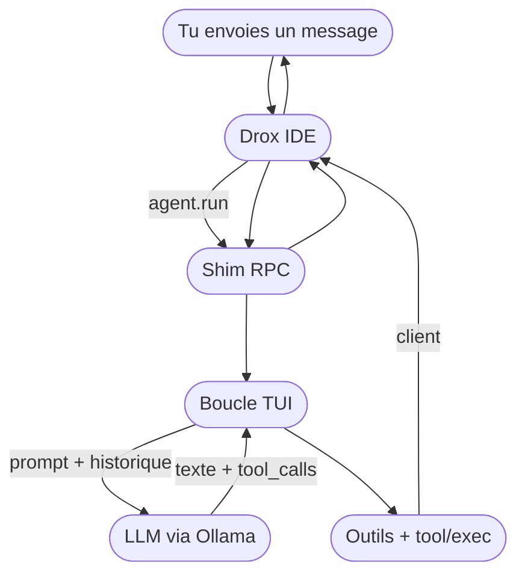
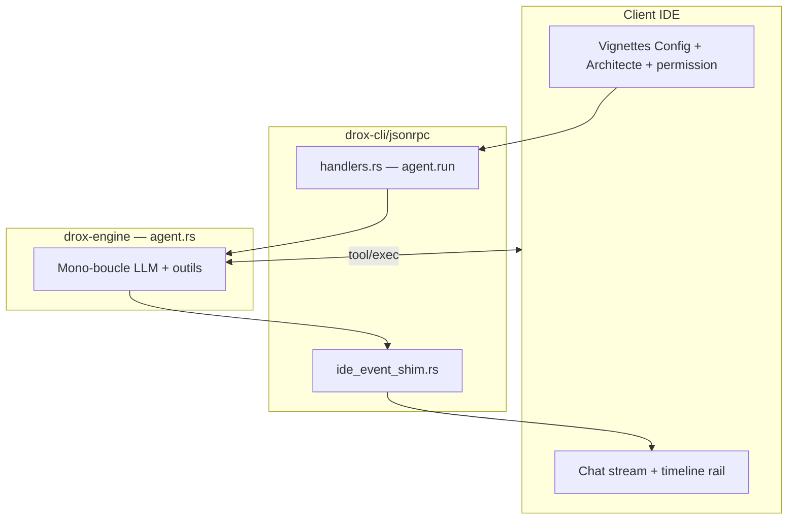
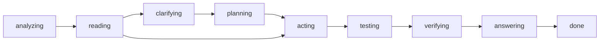
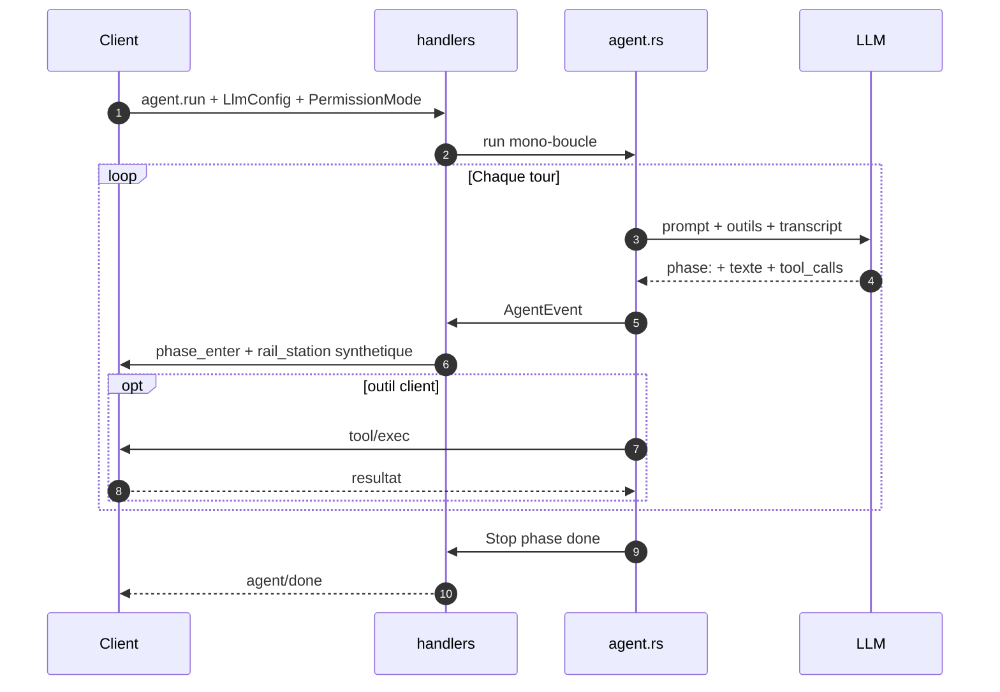

## But du projet — souveraineté et feuille de route

### Où en est Drox (1.5.x)

Je suis en phase de **construction et de stabilisation de la base moteur** : mono-boucle TUI (`tui_mono`), shim RPC IDE, chat aligné sur le fil agent, wizard de connexion LLM. Les releases **1.5.1+** consolident cette fondation avant que j’empile les couches produit ci-dessous. Toujours **expérimental** — pas un IDE agent de production — mais j’ai la stack 1.4.x **derrière moi**.

### Souveraineté

Je conçois Drox pour la **souveraineté numérique** : IDE, moteur agent, inférence (Ollama ou endpoint que **tu** configures), sessions et mémoire dans **`.drox/`** sur ton disque — pas de compte cloud KDDS imposé, pas de télémétrie Microsoft dans le package distribué.

**Seul trafic réseau prévu côté produit** : la **vérification de version** (lecture du manifeste release, ex. `stable/latest.json`) pour indiquer qu’une MAJ plus récente existe. Le reste du travail agent tourne en local.

### Vision produit

Je veux permettre de **maîtriser des projets volumineux** en s’aidant d’une **IA légère** (modèles locaux ou petits modèles distants) — donc **peu consommatrice** en RAM/VRAM et en tokens — plutôt qu’un unique gros modèle « tout-en-un ». Comprendre d’abord (carte du repo, parcours des fichiers), agir ensuite, avec **observabilité locale** pour rester maître du système.

### Mises à jour prévues (brainstorm)

Fiches d’intention non engagées — détail et statut dans [`drox-engine/docs/feature-brainstorm/README.md`](drox-engine/docs/feature-brainstorm/README.md) :

| Thème | Fiches | Objectif |
|-------|--------|----------|
| **Télémétrie locale** | [05](drox-engine/docs/feature-brainstorm/05-stats-perf-par-cycle.md) · [11](drox-engine/docs/feature-brainstorm/11-telemetry-ide-locale-apis.md) | KPI par run/cycle, dashboards **100 % locaux** (`.drox/`), APIs `telemetry.*` — aucun cloud |
| **Cartographie & parcours fichiers** | [02](drox-engine/docs/feature-brainstorm/02-onglet-parcours-modeles.md) · [09](drox-engine/docs/feature-brainstorm/09-roles-specialises-comprehension-code.md) | Vue graphe + diffs du parcours modèle ; rôles « compréhension » (cartographe, analyste…) avant mutation |
| **IA légère & perf** | [07](drox-engine/docs/feature-brainstorm/07-reponses-legere-sans-plan.md) · [08](drox-engine/docs/feature-brainstorm/08-performance-traitement-rapide.md) · [01](drox-engine/docs/feature-brainstorm/01-serveurs-inference-par-role.md) | Réponses rapides sans sur-planifier ; tuning ; backends distincts par rôle |
| **Sessions & long run** | [04](drox-engine/docs/feature-brainstorm/04-mode-long-run.md) · [06](drox-engine/docs/feature-brainstorm/06-chargement-sessions-segmente.md) | Gros chantiers multi-heures ; reprise historique progressive |
| **Réglages & confiance** | [10](drox-engine/docs/feature-brainstorm/10-parametrage-prompts-strictesse.md) · [12](drox-engine/docs/feature-brainstorm/12-presets-globaux-benchmark-hardware.md) · [14](drox-engine/docs/feature-brainstorm/14-persona-premiere-activation.md) | Strictesse prompts, benchmark matériel/modèle, persona onboarding |
| **IDE & transparence** | [03](drox-engine/docs/feature-brainstorm/03-preview-web-outils-navigateur.md) · [13](drox-engine/docs/feature-brainstorm/13-agents-window-kdds-drox.md) · [15](drox-engine/docs/feature-brainstorm/15-shell-live-view.md) | Preview web, chassis Agents Window Drox, sortie shell live |

Ces pistes **ne bloquent pas** les releases courantes (1.5.2, 1.5.3) ; elles nourrissent la ligne **1.5.x+** et au-delà.

___

# ⚠️ STATUT PRODUIT — LIRE EN PREMIER

> **Drox 1.5.0 remplace entièrement le moteur 1.4.x.**  
> Branche **`1.5.0`** · upstream VS Code **1.126.0** · mono-boucle TUI (`tui_mono`) + shim RPC IDE. Toujours **expérimental** — pas de prod — mais **nettement plus stable** qu’en 1.4.2.

| | |
|---|---|
| **Code sur `1.5.0`** | **1.5.0** — cœur TUI (`agent.rs`), `drox-cli` JSON-RPC, `ide_event_shim`, pipeline `tui_mono` |
| **Utilisable en prod ?** | **Non.** Phase expérimentale — dogfood / early adopters. |
| **Tester ?** | **Oui pour les curieux** : installeur OR, Ollama, bugs possibles mais stack refondue — **je l’ai validée** en dogfood. |
| **1.4.x** | **Obsolète** — rail observateur, `role_split`, orchestration IDE abandonnés · archivé `drox-engine/docs/1.4/` |

### Ce que la 1.5.0 change (gros morceaux)

| 1.4.2 (obsolète) | 1.5.0 |
|------------------|-------|
| Run rail observateur + 7 stations inférées | Protocole **phases TUI** `[phase: …]` — `done`-driven |
| Orchestration `role_split` / architecte solo 1.4 | **Mono-boucle** `tui_mono` — un seul agent |
| Conducteur `rail/infer.rs` + snapshot prescriptif | Shim **`ide_event_shim`** — stations rail **synthétiques** pour l’UI seulement |
| Workspace moteur 1.4 (`loop/drive/`, `rail/`) | Workspace **TUI** copié in-place dans `drox-engine/drox/` |
| Routage discuss / edit / intent probe | **Un run** par message ; vignettes Config + Architecte + permission conservées |

**En résumé** : toujours pas pour la prod ; OK pour **dogfood sérieux** sur la nouvelle base — ne plus partir du rail 1.4.

### Où lire la suite (dépôt)

- Clôture 1.5.0 : `drox-engine/docs/1.5/1.5.0/CLOSURE-1.5.0.md`
- Shim IDE : `drox-engine/docs/1.5/1.5.0/SHIM-MOTEUR-IDE.md`
- 1.4.x archivé : `drox-engine/docs/1.4/`

___

## Drox TUI — plus simple pour débuter

Tu découvres l’écosystème Drox ? Commence par le **terminal** : **[Drox TUI — releases officielles](https://github.com/DroxKiwi/Drox---TUI---OR)**.

| | **Drox TUI** | **Drox IDE** (ce dépôt) |
|---|--------------|-------------------------|
| **Interface** | Terminal (`drox-tui`) | Éditeur type VS Code + chat |
| **Prise en main** | **Plus légère** — pas d’installeur lourd, pas de webview | Plus riche (LSP, diff dans l’éditeur, wizard connexion) |
| **Moteur** | Même boucle **`tui_mono`** (`agent.rs`) | Même moteur via `drox.exe` + shim RPC |
| **Inférence** | Ollama, vLLM, LM Studio, cloud… | Idem — voir [guide IDE](#guide-debutant) |

Le TUI est le **cœur agent d’origine** : une session, un fil, des outils fichiers/bash, permissions explicites. L’IDE ajoute la couche éditeur autour du même moteur — utile quand tu veux coder **dans** l’UI, pas seulement piloter depuis le shell.

**Démarrage TUI** : installeur sur [Drox---TUI---OR/releases](https://github.com/DroxKiwi/Drox---TUI---OR/releases/latest) → terminal dans ton repo → `Ctrl+Shift+L` ou `/server` pour Ollama → envoie un message. Guide complet sur le README du dépôt TUI.

___

## Guide débutant — installer et s’en servir

> **Pas encore prêt pour l’IDE ?** Commence par **[Drox TUI](https://github.com/DroxKiwi/Drox---TUI---OR)** — même moteur, interface terminal plus simple ([détails](#drox-tui)).

**Drox IDE** reprend l’ergonomie de **[Visual Studio Code](https://code.visualstudio.com/)** (éditeur, terminal, extensions familières) avec un **chat agent** branché sur un **moteur d’inférence de ton choix** (Ollama par défaut pour débuter). Tu n’as **pas** besoin de compiler ce dépôt pour l’utiliser.

### Prérequis

- **Windows** (installeur ; Linux prévu en **1.5.3**)
- Un **serveur LLM** accessible — le plus simple en local : **[Ollama](https://ollama.com/)** + un modèle, ex. `ollama pull qwen2.5-coder`

### Moteurs d’inférence (local ou cloud)

Drox ne fournit pas le modèle : il se connecte à **ton** endpoint via le wizard **« Connect your AI »** (vignette **Général**). Tu choisis l’**hébergement**, puis le **fournisseur**.

| Hébergement | Moteurs (liens officiels) | Usage typique |
|-------------|---------------------------|---------------|
| **Local / perso** | [Ollama](https://ollama.com/) · [vLLM](https://docs.vllm.ai/) · [LM Studio](https://lmstudio.ai/) · [API OpenAI-compatible](https://platform.openai.com/docs/api-reference) | Modèle sur ton PC, ton NAS ou ton réseau — les prompts partent vers **ta** machine (ou celle que tu configures). Voir **[matériel recommandé](#materiel)** pour l’inférence locale. |
| **Cloud** | [Hugging Face Inference](https://huggingface.co/inference) · [Mistral AI](https://mistral.ai/) · Ollama distant · endpoint compatible | Inférence hébergée chez le prestataire — pratique sans gros GPU ; confidentialité **selon leurs engagements** (offres privées, entreprise, CGU — à lire côté fournisseur). |

**Démarrage rapide** : Ollama local → wizard → URL `http://127.0.0.1:11434` + nom du modèle ([matériel](#materiel)).  
**vLLM / LM Studio** : lance le serveur, puis indique son URL dans le wizard (ex. `http://127.0.0.1:8000` pour vLLM).  
**Cloud** : URL + clé API du fournisseur dans le wizard.

Drox n’impose aucun cloud KDDS : seul l’**endpoint que tu configures** reçoit les requêtes d’inférence (hors vérification de version de l’IDE).

### Matériel (inférence locale)

**Drox IDE** se comporte comme VS Code côté éditeur (RAM pour l’interface, le moteur `drox.exe`, le language service). Ce qui pèse vraiment, c’est le **modèle** que tu fais tourner en local : VRAM GPU (idéalement) + RAM système selon la taille du modèle et la fenêtre de contexte (`num_ctx`).

Je n’ai pas encore publié de grille minimale officielle — voici les machines sur lesquelles **j’ai testé** Drox 1.5.x :

| Machine | GPU | RAM | Remarque |
|---------|-----|-----|----------|
| **Station de travail** | NVIDIA **RTX 3090** · 24 Go VRAM | **96 Go** | Ma grosse config — confortable pour des modèles plus larges et des contextes élevés. |
| **Portable gaming** | Acer **Helios AI 16** · **RTX 5070 Ti** · 12 Go VRAM | *(mon laptop)* | Je l’**ai aussi testé** ici — je privilégie des modèles adaptés à 12 Go (quantization, contexte raisonnable). |

**En pratique** : sans GPU dédié ou avec peu de VRAM, préfère un **petit modèle** quantifié (Ollama) ou bascule sur l’**inférence cloud** (section ci-dessus). Plus de VRAM = modèles plus gros et réponses plus fluides ; plus de RAM aide l’IDE + le chargement des poids quand une partie tourne en CPU.

### Installation (utilisateur)

1. Télécharge le Setup sur les **[releases officielles](https://github.com/DroxKiwi/Drox---IDE---OR/releases/latest)** — dépôt public **[Drox---IDE---OR](https://github.com/DroxKiwi/Drox---IDE---OR)**.
2. Lance l’installeur. Si Windows affiche « Éditeur inconnu », c’est normal (non signé pour l’instant) : **Exécuter quand même**.
3. Ouvre **Drox IDE** depuis le menu Démarrer.

### Premiers pas

1. **Fichier → Ouvrir un dossier…** — ton projet (comme dans VS Code).
2. Ouvre **Drox Chat** ; au besoin, le wizard **« Connect your AI »** configure hébergement, fournisseur, URL du serveur et modèle.
3. Pose une question sur ton code ; l’agent lit des fichiers et peut proposer des modifications selon le **mode permission** (Analyser / Édition / Confiance).

### L’essentiel à retenir

| Élément | Rôle |
|---------|------|
| **Chat Drox** | Tu décris l’objectif ; le moteur `drox.exe` tourne en local et délègue à l’IDE ce qu’il ne peut pas faire seul (LSP, diff, écriture fichier). |
| **Vignettes** | **Général** (connexion, outils) · **Architecte** (modèle, contexte) · **Composer** (niveau de confiance sur les éditions). |
| **`.drox/`** | Sessions et mémoire du projet sur **ton disque** — pas de compte cloud obligatoire. |
| **Raccourcis éditeur** | Identiques ou proches de VS Code — **[documentation VS Code](https://code.visualstudio.com/docs)**. |

**Ce dépôt** (`Drox---IDE`) = **sources** pour contribuer ou builder. **Utilisation simple** → installeur OR ci-dessus. Détail moteur et architecture → sections suivantes.

___

Doc moteur brute — conventions : [RULES.md §5](RULES.md#5-readmemd-racine--doc-moteur)

## Sommaire

**[Souveraineté](#souverainete)** · **[⚠️ Statut produit 1.5.0](#statut-produit)** · **[Drox TUI](#drox-tui)** · **[Guide débutant IDE](#guide-debutant)** · [Matériel](#materiel) · [Product status EN](#en-product-status) · [Drox TUI EN](#en-drox-tui) · [Getting started EN](#en-getting-started) · [Hardware EN](#en-hardware) · [Sovereignty EN](#en-sovereignty)

[Vue globale](#vue-globale) · [Overview](#overview) · [Schéma 1.5 — tui_mono](#schema-tui-mono)

**FR**

[Moteur Drox](#fr) · [Invariants](#fr-invariants) · [Chronologie](#fr-chronologie)

[2025-12](#fr-2025-12) · [2026-02](#fr-2026-02) · [2026-02-fin](#fr-2026-02-fin) · [2026-03](#fr-2026-03) · [2026-04](#fr-2026-04) · [2026-05 v1_2](#fr-2026-05-v12) · [2026-05 v1_3](#fr-2026-05-v13) · [2026-06 v1_4](#fr-2026-06-v14) · [2026-06 v1_4_2](#fr-2026-06-v142) · [2026-06 v1_5](#fr-2026-06-v15)

**EN**

[Drox Engine](#en) · [Invariants](#en-invariants) · [Timeline](#en-timeline)

[2025-12](#en-2025-12) · [2026-02](#en-2026-02) · [2026-02-end](#en-2026-02-end) · [2026-03](#en-2026-03) · [2026-04](#en-2026-04) · [2026-05 v1_2](#en-2026-05-v12) · [2026-05 v1_3](#en-2026-05-v13) · [2026-06 v1_4](#en-2026-06-v14) · [2026-06 v1_4_2](#en-2026-06-v142) · [2026-06 v1_5](#en-2026-06-v15)

___

## Vue globale

Tu codes dans un repo. **Drox IDE** est l’éditeur. **Ollama** fait tourner le modèle en local (Qwen, Gemma, etc. — celui que tu choisis dans les réglages). Entre les deux : **`drox.exe`**, le moteur Rust : mono-boucle agent TUI, shim RPC vers l’IDE, outils locaux + délégation client (LSP, diff, écriture fichier).

**La pile (grossier)**

**Un message dans le chat (grossier)**

**Qui fait quoi**

| Brique | Rôle |
|--------|------|
| **Ollama** | Inférence : un modèle, ta machine, pas de compte cloud imposé |
| **drox.exe** | Boucle agent TUI, shim JSON-RPC, permissions, session, outils |
| **Drox IDE** | UI chat, exécution LSP/diff/bash côté workspace |
| **Toi** | Repo, modèle, vignettes Config / Architecte, mode permission |

Le détail (phases, shim, params) est dans [Schéma 1.5 — tui_mono](#schema-tui-mono).

___

## Overview

You work in a repo. **Drox IDE** is the editor. **Ollama** runs the model locally. In between: **`drox.exe`**, the Rust engine: TUI mono-loop, RPC shim to the IDE, local tools + client delegation (LSP, diff, file writes).

**The stack (coarse)** — same diagram as FR.

**One chat message (coarse)** — IDE → shim → TUI loop → LLM → tools / `tool/exec` → IDE.

**Who does what**

| Piece | Role |
|-------|------|
| **Ollama** | Inference: your machine, no mandated cloud |
| **drox.exe** | TUI agent loop, JSON-RPC shim, permissions, session, tools |
| **Drox IDE** | Chat UI, LSP/diff/bash in workspace |
| **You** | Repo, model, Config / Architect vignettes, permission mode |

Detail in [Schema 1.5 — tui_mono](#schema-tui-mono).

___

## Schéma — 1.5.0 (`tui_mono` + shim IDE)

Run `agent.run` · pipeline **`tui_mono`** (`initialize`) · **une** boucle `agent.rs` · shim `drox-cli/jsonrpc` traduit params vignettes et events · stations rail IDE = **synthèse** `ide_event_shim`, pas conducteur moteur.

**Trois couches**

**Phases TUI (moteur réel)**

Phases optionnelles · boucles `acting`/`verifying` possibles · seul **`done`** clôt le run.

**Tour LLM — séquence**

| Identifiant | Fonction |
|-------------|----------|
| `tui_mono` | Pipeline unique — plus de `role_split` |
| `agent.rs` | Cœur boucle LLM + outils + permissions |
| `ide_event_shim.rs` | Phase TUI → `rail_station_*` (UI seulement) |
| `handlers.rs` | `agent.run`, map vignettes → `LlmConfig` |
| `PermissionMode` | `plan` / `acceptEdits` / `default` (+ `bypass` si activé) |
| `Phase` | `analyzing` … `done` via marqueurs `[phase: …]` |
| `RemoteTool` | Outils client via `tool/exec` |

**Map phases → stations rail (shim, affichage IDE)**

| Phase TUI | Station rail synthétique |
|-----------|--------------------------|
| `analyzing`, `reading` | `read` |
| `clarifying` | `propose` |
| `planning` | `plan` |
| `acting` | `act` |
| `testing`, `verifying` | `verify` |
| `answering`, `done` | `answer` |
| `internal_reasoning` | *(aucune)* |

___

# Moteur Drox

Binaire Rust (`drox-engine/drox/`, crate `drox-cli`) : mono-boucle agent TUI + JSON-RPC stdio. Le client lance `drox --serve`, exécute LSP/diff/questions via `tool/exec` et `user/ask`. Inférence Ollama ou API compatible. Produit KDDS.

___

## Invariants

`moteur_seul` — orchestration, phases et injection contexte vivent dans `agent.rs` ; le client stream et exécute les outils client, il ne conduit pas le run.
`tui_mono` — une boucle, un agent ; plus de `role_split`, `delegate_executor`, rail 1.4.
`shim_rpc` — `drox-cli/jsonrpc` traduit le contrat IDE sans refondre la webview.
`phases_done_driven` — protocole `[phase: …]` ; seul `done` clôt ; `answering` = réponse chat visible.
`permission_modes` — `plan` / `acceptEdits` / `default` ; vignettes IDE mappées au boot du run.
`remote_tools` — mutations workspace et LSP via `tool/exec` côté IDE quand requis.
`rail_synthese` — `rail_station_*` émis par le shim pour la timeline ; **pas** un conducteur moteur.
`vignettes_llm` — Config + Architecte : `server`, `model`, `numCtx`, sampling → `LlmConfig`.
`obsolete_14x` — code rail 1.4 retiré du workspace ; archivé `docs/1.4/`.
`experimental_150` — 1.5.0 dogfoodable ; toujours pas prod.

___

## Chronologie

### 2025-12 — amorçage

`drox_cli` — binaire `drox`.
`serve_stdio` — mode `drox --serve`, JSON-RPC NDJSON.
`rpc_base` — `initialize`, `agent.run`, `agent.cancel`, `session.list`, `session.read`, `session.compact`, `shutdown`.
`rpc_client` — `tool/exec`, `user/ask` (serveur → client).
`agent_loop` — tours LLM, `tool_calls`, events `agent/event`, transcript JSONL.
`drox_llm` — client Ollama, stream, retry, tool calls, reprise sur `MaxTokens`.
`tools_fichiers` — `file_read`, `file_write`, `file_edit`, `grep`, `glob`, `bash`, `web_fetch`.
`plan_mode` — `plan_mode`, `exit_plan_mode`, `ask_user_question`.
`drox_permissions` — allow / ask / deny, modes permission.
`drox_session` — sessions, transcript, `MEMORY.md`, `DROX.md`.
`drox_context` — comptage tokens, snip `tool_result`.
`session_compact_rpc` — compaction manuelle `session.compact` / `summarize_run`.
`mcp_stubs` — `drox-mcp`, outils `mcp__*`.

___

### 2026-02

`multimodal` — images utilisateur → `Content::Image`, champ Ollama `images`.
`web_search` — recherche DuckDuckGo HTML, read-only.
`lsp_remote` — tool `lsp` ; exécution IDE.
`ollama_defaults` — `num_ctx`, `num_predict`, sampling, `keep_alive` top-level.

___

### 2026-02-fin

`todo_write` — liste `{ id, content, status }`.
`phase_protocol` — `[phase: …]`, `PhaseEnter`, inférence, alias.
`nudge_tour_vide` — relance si tour sans outil ni `done`.
`gate_todo_ouverte` — `done` bloqué si pending/in_progress.
`glob_dirs` — `glob` renvoie fichiers et répertoires.
`loop_detector` — deux tours identiques → `LoopDetected`.
`todo_recreation_block` — second plan interdit après plan 100 % completed.
`memory_sessions` — `.drox/memory/sessions/*.md`, `memory_read`, `memory_list`, `session_note`, `MemoryPersisted`.
`compaction_live_v1` — microcompact, tail bornée, `compact_until_budget`, events snip/compact.
`paste_inject` — bloc `[Smart paste]` dans le prompt (côté client).
`user_ask` — `ask_user_question` multi + RPC `user/ask`.
`msg_queue` — file messages pendant run (client).
`ctx_policy_num_ctx` — autocompact calé sur fenêtre Ollama réelle.

___

### 2026-03

`long_memory_v1` — index compaction, `session_search`, `/session_end` → `session_closure` (pas de tool `session_end` LLM).
`compaction_live_v2` — boucle jusqu’au budget.
`hooks_json` — `.drox/hooks.json`, Pre/Post tool shell.
`parallel_read_tools` — reads concurrency-safe, `max_parallel_tool_calls`.
`bash_classifier` — segments bash auto-allow / auto-deny.
`file_rules` — permissions chemins, `settings.local.json`.
`copy_path`, `delete_path` — outils dédiés.
`notebook_edit` — cellules ipynb replace/insert/delete.

___

### 2026-04

`skills` — `.drox/skills/`, `skill_read`, `skill_list`.
`git_worktree` — `git_worktree_enter`, `git_worktree_exit`.
`mcp_hub` — registre MCP, resources, `mcp_call` fallback.
`professor_mode` — `course_plan_write`, gates, `.drox/course-cycles/`.
`tools_toggle` — `drox.tools.disabled`, MCP on/off.
`phase_analyzing` — phase + nudge exploration.
`phase_testing` — gate `done` après mutation code.
`workspace_map` — `.drox/workspace-map.json`, read/note, miroir outils.
`droxignore` — chemins exclus agent.
`run_objective` — objectif verrouillé, `scope_defer`.
`subagent_task` — tool `task` Explore, off par défaut.
`image_paths_prompt` — chemins images dans le prompt.
`agent_split` — modules `agent/` (gates, phases, nudges, stream).
`run_policy` — couche `RunPolicy` (transitoire, avant abandon tiers).
`tiers_low_medium_abandon` — expérience avril, retirée au profit `v1_2`.

___

### 2026-05 — `v1_2`

`orchestration_v1_2` — `DROX_ORCHESTRATION=v1_2` remplace `legacy` mono-agent.
`run_spec` — rôle, limites, registre outils par `RunSpec`.
`role_architect` — `workspace_map_read`, `todo_write`, `delegate_executor`, verify, synthèse.
`role_executor` — mutations dans `scope` ; statut `completed` / `partial` / `failed`.
`delegate_executor` — sous-run sync ; sorties `.drox/agent-output/<plan>/<task>/`.
`architect_gates` — pas de compensation échec ; scope validé.
`architect_help` — tool rappel protocole.
`role_enter` — event `RoleEnter` ; `agent/done` fin cycle.

___

### 2026-05 — `v1_3`

`failure_absorption` — truth check post-délégation, `FailurePacket`.
`parallel_batch` — `parallel_with[]`, réponse `{ results: [...] }`.
`scope_disjoint_gate` — refus batch si chemins qui se chevauchent.
`retry_per_task` — re-délégation ciblée après échec partiel.
`architect_todo_guidance` — anti-boucle clôture plan.

___

### 2026-06 — `v1_4` (run rail) — *archivé*

`run_rail_solo` — refonte 1.4.0 : un conducteur edit, reliquats 1.3 retirés du chemin IDE.
`stations_rail` — INTENT → READ → [PROPOSE] → PLAN → ACT → VERIFY → ANSWER.
`rail_policy` — filtre outils par station (retiré en 1.4.2).
`discuss_path` — `ArchitectDiscussion`.
`agent_split_v2` — `loop/drive/`, `rail/`, `nudges/`.

___

### 2026-06 — `v1_4_2` (rail observateur) — *obsolète, remplacé par 1.5*

`rail_observateur` — fin ACL station, tool folders, intent probe.
`contexte_4_couches` — boot + hint rail · outils stables · snapshot · transcript.
`obsolete_142` — clôture 1.4.x ; **ne plus utiliser** — remplacé par swap TUI 1.5.0.

___

### 2026-06 — `v1_5` (TUI + shim IDE — **actuel**)

`tui_swap` — `drox-engine/drox/` entièrement remplacé par workspace TUI ; fin du code rail 1.4.
`jsonrpc_shim` — `handlers.rs`, `protocol.rs` : `agent.run`, sessions, `tool/exec`, `user/ask`.
`ide_event_shim` — projection `AgentEvent` → wire IDE + `rail_station_*` synthétique.
`orchestration_tui_mono` — `initialize.orchestrationPipeline` = `tui_mono`.
`vignettes_llm` — Config + Architecte : params RPC → `LlmConfig` (`numCtx`, sampling, …).
`permission_map_ide` — `analyze` / `trustEdit` / `imNotCrazy` → `plan` / `acceptEdits` / `default`.
`rpc_legacy_ignore` — `orchestrationMode`, `architectInteractionMode` ignorés côté moteur.
`remote_tool` — outils workspace délégués IDE via `tool/exec` (`file_write` dogfood validé).
`drox_tui_member` — crate `drox-tui` conservée pour dogfood terminal ; hors installeur.
`upstream_1126` — intégration VS Code 1.126.0 sur branche `1.5.0`.
`release_150` — `droxVersion` 1.5.0, installeur Windows, release OR.

___

## Project goal — sovereignty and roadmap

### Where Drox stands (1.5.x)

I'm in a **build and stabilization** phase on the **engine foundation**: TUI mono-loop (`tui_mono`), IDE RPC shim, chat stream aligned with the agent, LLM connection wizard. Releases **1.5.1+** consolidate this base before I stack the product layers below. Still **experimental** — not a production agent IDE — but I've left the 1.4.x stack **behind me**.

### Sovereignty

I design Drox for **digital sovereignty**: IDE, agent engine, inference (Ollama or an endpoint **you** configure), sessions and memory in **`.drox/`** on your disk — no mandatory KDDS cloud account, no Microsoft telemetry in the distributed package.

**Only expected product network traffic**: **version check** (reading the release manifest, e.g. `stable/latest.json`) to tell you a newer update exists. Everything else in the agent workflow runs locally.

### Product vision

I want to help you **master large codebases** with **lightweight AI** (local or small remote models) — **low** RAM/VRAM and token cost — instead of one huge all-in-one model. Understand first (repo map, file traversal), act second, with **local observability** so you stay in control.

### Planned updates (brainstorm)

Non-committed intent docs — details in [`drox-engine/docs/feature-brainstorm/README.md`](drox-engine/docs/feature-brainstorm/README.md):

| Theme | Docs | Goal |
|-------|------|------|
| **Local telemetry** | [05](drox-engine/docs/feature-brainstorm/05-stats-perf-par-cycle.md) · [11](drox-engine/docs/feature-brainstorm/11-telemetry-ide-locale-apis.md) | Per-run/cycle KPIs, **fully local** dashboards (`.drox/`), `telemetry.*` APIs — no cloud |
| **Mapping & file traversal** | [02](drox-engine/docs/feature-brainstorm/02-onglet-parcours-modeles.md) · [09](drox-engine/docs/feature-brainstorm/09-roles-specialises-comprehension-code.md) | Live graph + diff trail; comprehension roles (mapper, analyst…) before edits |
| **Lightweight AI & perf** | [07](drox-engine/docs/feature-brainstorm/07-reponses-legere-sans-plan.md) · [08](drox-engine/docs/feature-brainstorm/08-performance-traitement-rapide.md) · [01](drox-engine/docs/feature-brainstorm/01-serveurs-inference-par-role.md) | Quick replies without over-planning; tuning; per-role inference backends |
| **Sessions & long run** | [04](drox-engine/docs/feature-brainstorm/04-mode-long-run.md) · [06](drox-engine/docs/feature-brainstorm/06-chargement-sessions-segmente.md) | Multi-hour tasks; progressive session history load |
| **Tuning & trust** | [10](drox-engine/docs/feature-brainstorm/10-parametrage-prompts-strictesse.md) · [12](drox-engine/docs/feature-brainstorm/12-presets-globaux-benchmark-hardware.md) · [14](drox-engine/docs/feature-brainstorm/14-persona-premiere-activation.md) | Prompt strictness, hardware/model benchmark, onboarding persona |
| **IDE & transparency** | [03](drox-engine/docs/feature-brainstorm/03-preview-web-outils-navigateur.md) · [13](drox-engine/docs/feature-brainstorm/13-agents-window-kdds-drox.md) · [15](drox-engine/docs/feature-brainstorm/15-shell-live-view.md) | Web preview, Drox Agents Window, live shell output |

These tracks **do not block** current releases (1.5.2, 1.5.3); they feed **1.5.x+** and beyond.

___

# ⚠️ PRODUCT STATUS — READ FIRST

> **Drox 1.5.0 fully replaces the 1.4.x engine.**  
> Branch **`1.5.0`** · VS Code upstream **1.126.0** · TUI mono-loop (`tui_mono`) + IDE RPC shim. Still **experimental** — not production — but **much more stable** than 1.4.2.

| | |
|---|---|
| **Code on `1.5.0`** | **1.5.0** — TUI core (`agent.rs`), `drox-cli` JSON-RPC, `ide_event_shim`, `tui_mono` pipeline |
| **Production-ready?** | **No.** Experimental — dogfood / early adopters. |
| **Try it?** | **Yes for the curious**: OR installer, Ollama, bugs possible but rewritten stack — **I’ve dogfooded it**. |
| **1.4.x** | **Obsolete** — observer rail, `role_split`, IDE orchestration dropped · archived `drox-engine/docs/1.4/` |

___

## Drox TUI — easier way to start

New to Drox? Start in the **terminal**: **[Drox TUI — official releases](https://github.com/DroxKiwi/Drox---TUI---OR)**.

| | **Drox TUI** | **Drox IDE** (this repo) |
|---|--------------|--------------------------|
| **UI** | Terminal (`drox-tui`) | VS Code–like editor + chat |
| **Onboarding** | **Lighter** — no heavy installer, no webview | Richer (LSP, in-editor diffs, connection wizard) |
| **Engine** | Same **`tui_mono`** loop (`agent.rs`) | Same engine via `drox.exe` + RPC shim |
| **Inference** | Ollama, vLLM, LM Studio, cloud… | Same — see [IDE guide](#en-getting-started) |

The TUI is the **original agent core**: one session, one stream, file/bash tools, explicit permissions. The IDE wraps the same engine with an editor — when you want to work **inside** the UI, not only from the shell.

**TUI quick start**: installer from [Drox---TUI---OR/releases](https://github.com/DroxKiwi/Drox---TUI---OR/releases/latest) → terminal in your repo → `Ctrl+Shift+L` or `/server` for Ollama → send a message. Full guide on the TUI repo README.

___

## Getting started — install and use

> **Not ready for the IDE yet?** Try **[Drox TUI](https://github.com/DroxKiwi/Drox---TUI---OR)** first — same engine, simpler terminal UI ([details](#en-drox-tui)).

**Drox IDE** feels like **[Visual Studio Code](https://code.visualstudio.com/)** plus a **local agent chat** backed by an **inference engine you choose** (Ollama is the simplest local default). You do **not** need to build this repo to try the product.

### Requirements

- **Windows** installer (Linux planned in **1.5.3**)
- An **LLM server** — easiest locally: **[Ollama](https://ollama.com/)** with a model, e.g. `ollama pull qwen2.5-coder`

### Inference backends (local or cloud)

Drox does not ship a model: it connects to **your** endpoint via **« Connect your AI »** ( **General** vignette). Pick **hosting**, then **provider**.

| Hosting | Backends (official links) | Typical use |
|---------|---------------------------|-------------|
| **Local / personal** | [Ollama](https://ollama.com/) · [vLLM](https://docs.vllm.ai/) · [LM Studio](https://lmstudio.ai/) · [OpenAI-compatible API](https://platform.openai.com/docs/api-reference) | Model on your PC, NAS, or LAN — prompts go to **your** hardware (or the URL you set). See **[hardware notes](#en-hardware)** for local inference. |
| **Cloud** | [Hugging Face Inference](https://huggingface.co/inference) · [Mistral AI](https://mistral.ai/) · remote Ollama · compatible endpoint | Provider-hosted inference — handy without a big GPU; privacy **per the vendor’s terms** (private/enterprise tiers, ToS — read on their side). |

**Quick start**: local Ollama → wizard → `http://127.0.0.1:11434` + model name ([hardware](#en-hardware)).  
**vLLM / LM Studio**: start the server, paste its URL in the wizard (e.g. `http://127.0.0.1:8000` for vLLM).  
**Cloud**: provider URL + API key in the wizard.

No mandatory KDDS cloud: only the **endpoint you configure** receives inference traffic (aside from IDE version check).

### Hardware (local inference)

**Drox IDE** itself is VS Code–like (RAM for UI, `drox.exe`, language services). The heavy part is your **local model**: GPU VRAM (ideal) + system RAM depending on model size and context window (`num_ctx`).

I haven’t published an official minimum spec yet — machines **I’ve tested** Drox 1.5.x on:

| Machine | GPU | RAM | Notes |
|---------|-----|-----|-------|
| **Workstation** | NVIDIA **RTX 3090** · 24 GB VRAM | **96 GB** | My main rig — comfortable for larger models and wide context. |
| **Gaming laptop** | Acer **Helios AI 16** · **RTX 5070 Ti** · 12 GB VRAM | *(my laptop)* | **I’ve tested here too** — I stick to models that fit 12 GB (quantization, sensible context). |

**Rule of thumb**: little or no VRAM → smaller quantized models (Ollama) or **cloud inference** (above). More VRAM → bigger models; more RAM helps the IDE + CPU offload when needed.

### Install (end user)

1. Download the Setup from **[official releases](https://github.com/DroxKiwi/Drox---IDE---OR/releases/latest)** — public repo **[Drox---IDE---OR](https://github.com/DroxKiwi/Drox---IDE---OR)**.
2. Run the installer. Windows may warn about an unknown publisher (unsigned for now): choose **Run anyway**.
3. Launch **Drox IDE** from the Start menu.

### First steps

1. **File → Open Folder…** — your project (same as VS Code).
2. Open **Drox Chat**; the **« Connect your AI »** wizard sets hosting, provider, server URL, and model if needed.
3. Ask about your code; the agent reads files and may suggest edits depending on the **permission mode** (Analyze / Trust edit / I'm not crazy).

### Essentials

| Piece | Role |
|-------|------|
| **Drox Chat** | You state the goal; local `drox.exe` delegates IDE-side work (LSP, diffs, file writes). |
| **Vignettes** | **General** (connection, tools) · **Architect** (model, context) · **Composer** (edit trust level). |
| **`.drox/`** | Session data on **your disk** — no mandatory cloud account. |
| **Editor shortcuts** | Same family as VS Code — **[VS Code docs](https://code.visualstudio.com/docs)**. |

**This repo** (`Drox---IDE`) = **source** for contributors. **Easy install** → OR releases above. Engine detail → sections below.

___

# Drox Engine

Rust binary (`drox-engine/drox/`, `drox-cli` crate): TUI mono-loop agent + stdio JSON-RPC. Client runs `drox --serve`, executes LSP/diff/prompts via `tool/exec` and `user/ask`. Ollama or compatible API. KDDS product.

___

## Invariants

`moteur_seul` — orchestration, phases, context injection live in `agent.rs`; client streams and runs client tools, it does not drive the run.
`tui_mono` — one loop, one agent; no `role_split`, `delegate_executor`, 1.4 rail.
`shim_rpc` — `drox-cli/jsonrpc` translates IDE contract without webview rewrite.
`phases_done_driven` — `[phase: …]` protocol; only `done` closes; `answering` = visible chat reply.
`permission_modes` — `plan` / `acceptEdits` / `default`; IDE vignettes mapped at run start.
`remote_tools` — workspace mutations and LSP via IDE `tool/exec` when required.
`rail_synthese` — `rail_station_*` from shim for timeline; **not** an engine conductor.
`vignettes_llm` — Config + Architect: `server`, `model`, `numCtx`, sampling → `LlmConfig`.
`obsolete_14x` — 1.4 rail code removed from workspace; archived `docs/1.4/`.
`experimental_150` — 1.5.0 dogfoodable; still not prod.

___

## Timeline

### 2025-12 — bootstrap

`drox_cli` — `drox` binary.
`serve_stdio` — `drox --serve` mode, JSON-RPC NDJSON.
`rpc_base` — `initialize`, `agent.run`, `agent.cancel`, `session.list`, `session.read`, `session.compact`, `shutdown`.
`rpc_client` — `tool/exec`, `user/ask` (server → client).
`agent_loop` — LLM turns, `tool_calls`, `agent/event` stream, JSONL transcript.
`drox_llm` — Ollama client, stream, retry, tool calls, resume on `MaxTokens`.
`tools_fichiers` — `file_read`, `file_write`, `file_edit`, `grep`, `glob`, `bash`, `web_fetch`.
`plan_mode` — `plan_mode`, `exit_plan_mode`, `ask_user_question`.
`drox_permissions` — allow / ask / deny, permission modes.
`drox_session` — sessions, transcript, `MEMORY.md`, `DROX.md`.
`drox_context` — token counting, `tool_result` snip.
`session_compact_rpc` — manual compaction `session.compact` / `summarize_run`.
`mcp_stubs` — `drox-mcp`, `mcp__*` tools.

___

### 2026-02

`multimodal` — user images → `Content::Image`, Ollama `images` field.
`web_search` — DuckDuckGo HTML search, read-only.
`lsp_remote` — `lsp` tool; IDE-side execution.
`ollama_defaults` — `num_ctx`, `num_predict`, sampling, top-level `keep_alive`.

___

### 2026-02-end

`todo_write` — `{ id, content, status }` list.
`phase_protocol` — `[phase: …]`, `PhaseEnter`, inference, aliases.
`nudge_tour_vide` — nudge on turn with no tool and no `done`.
`gate_todo_ouverte` — `done` blocked while pending/in_progress.
`glob_dirs` — `glob` returns files and directories.
`loop_detector` — two identical turns → `LoopDetected`.
`todo_recreation_block` — second plan forbidden after 100 % completed plan.
`memory_sessions` — `.drox/memory/sessions/*.md`, `memory_read`, `memory_list`, `session_note`, `MemoryPersisted`.
`compaction_live_v1` — microcompact, bounded tail, `compact_until_budget`, snip/compact events.
`paste_inject` — `[Smart paste]` block in prompt (client-side).
`user_ask` — multi `ask_user_question` + RPC `user/ask`.
`msg_queue` — message queue during run (client).
`ctx_policy_num_ctx` — autocompact tied to real Ollama context window.

___

### 2026-03

`long_memory_v1` — compaction index, `session_search`, `/session_end` → `session_closure` (no LLM `session_end` tool).
`compaction_live_v2` — loop until context budget.
`hooks_json` — `.drox/hooks.json`, Pre/Post tool shell.
`parallel_read_tools` — concurrency-safe reads, `max_parallel_tool_calls`.
`bash_classifier` — bash segments auto-allow / auto-deny.
`file_rules` — path permissions, `settings.local.json`.
`copy_path`, `delete_path` — dedicated tools.
`notebook_edit` — ipynb cells replace/insert/delete.

___

### 2026-04

`skills` — `.drox/skills/`, `skill_read`, `skill_list`.
`git_worktree` — `git_worktree_enter`, `git_worktree_exit`.
`mcp_hub` — MCP registry, resources, `mcp_call` fallback.
`professor_mode` — `course_plan_write`, gates, `.drox/course-cycles/`.
`tools_toggle` — `drox.tools.disabled`, MCP on/off.
`phase_analyzing` — phase + exploration nudge.
`phase_testing` — `done` gate after code mutation.
`workspace_map` — `.drox/workspace-map.json`, read/note, post-tool mirror.
`droxignore` — paths excluded from agent.
`run_objective` — locked objective, `scope_defer`.
`subagent_task` — `task` Explore tool, off by default.
`image_paths_prompt` — image paths in prompt.
`agent_split` — `agent/` modules (gates, phases, nudges, stream).
`run_policy` — `RunPolicy` layer (transitional, before tier drop).
`tiers_low_medium_abandon` — April experiment, removed for `v1_2`.

___

### 2026-05 — `v1_2`

`orchestration_v1_2` — `DROX_ORCHESTRATION=v1_2` replaces `legacy` mono-agent.
`run_spec` — role, limits, tool registry per `RunSpec`.
`role_architect` — `workspace_map_read`, `todo_write`, `delegate_executor`, verify, synthesis.
`role_executor` — mutations within `scope`; status `completed` / `partial` / `failed`.
`delegate_executor` — sync sub-run; output under `.drox/agent-output/<plan>/<task>/`.
`architect_gates` — no failure compensation; validated scope.
`architect_help` — protocol reminder tool.
`role_enter` — `RoleEnter` event; `agent/done` end of cycle.

___

### 2026-05 — `v1_3`

`failure_absorption` — post-delegation truth check, `FailurePacket`.
`parallel_batch` — `parallel_with[]`, response `{ results: [...] }`.
`scope_disjoint_gate` — batch rejected if paths overlap.
`retry_per_task` — targeted re-delegation after partial failure.
`architect_todo_guidance` — anti-loop plan closure.

___

### 2026-06 — `v1_4` (run rail) — *archived*

`run_rail_solo` — 1.4.0 refactor: single edit conductor; 1.3 relics removed from IDE path.
`stations_rail` — INTENT → READ → [PROPOSE] → PLAN → ACT → VERIFY → ANSWER.
`rail_policy` — per-station tool filter (removed in 1.4.2).
`discuss_path` — `ArchitectDiscussion`.
`agent_split_v2` — `loop/drive/`, `rail/`, `nudges/`.

___

### 2026-06 — `v1_4_2` (observer rail) — *obsolete, replaced by 1.5*

`rail_observateur` — end of per-station ACL, tool folders, intent probe.
`contexte_4_couches` — boot + rail hint · stable tools · snapshot · transcript.
`obsolete_142` — 1.4.x closed; **do not use** — replaced by TUI swap 1.5.0.

___

### 2026-06 — `v1_5` (TUI + IDE shim — **current**)

`tui_swap` — `drox-engine/drox/` fully replaced by TUI workspace; 1.4 rail code gone.
`jsonrpc_shim` — `handlers.rs`, `protocol.rs`: `agent.run`, sessions, `tool/exec`, `user/ask`.
`ide_event_shim` — `AgentEvent` → IDE wire + synthetic `rail_station_*`.
`orchestration_tui_mono` — `initialize.orchestrationPipeline` = `tui_mono`.
`vignettes_llm` — Config + Architect: RPC params → `LlmConfig` (`numCtx`, sampling, …).
`permission_map_ide` — `analyze` / `trustEdit` / `imNotCrazy` → `plan` / `acceptEdits` / `default`.
`rpc_legacy_ignore` — `orchestrationMode`, `architectInteractionMode` ignored by engine.
`remote_tool` — workspace tools delegated to IDE via `tool/exec` (`file_write` dogfood validated).
`drox_tui_member` — `drox-tui` crate kept for terminal dogfood; not in installer.
`upstream_1126` — VS Code 1.126.0 integration on branch `1.5.0`.
`release_150` — `droxVersion` 1.5.0, Windows installer, OR release.
