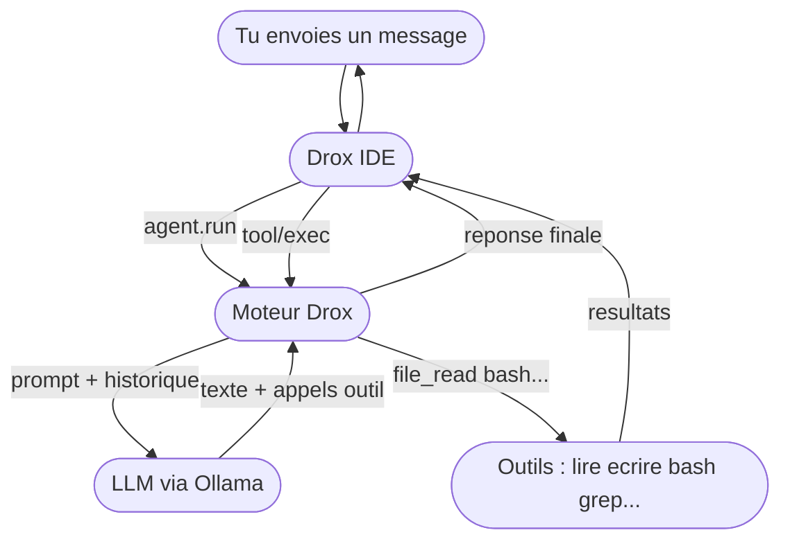
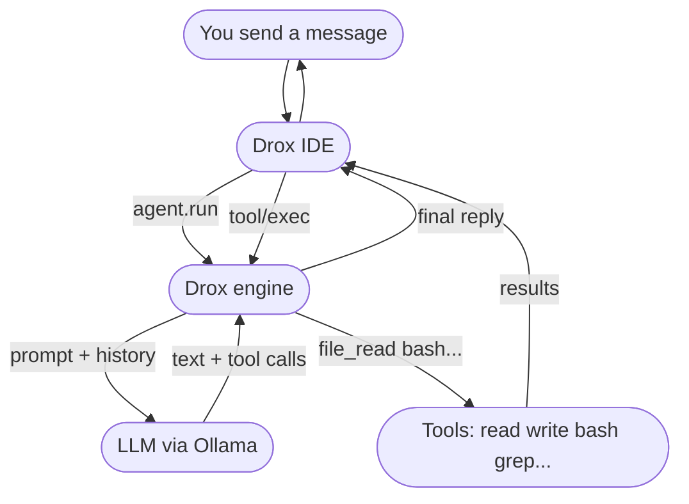
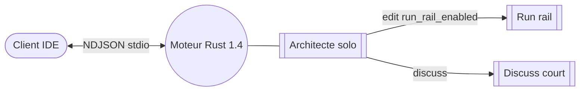
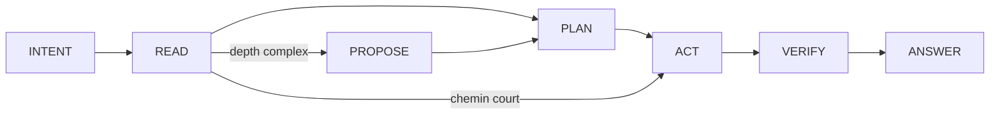
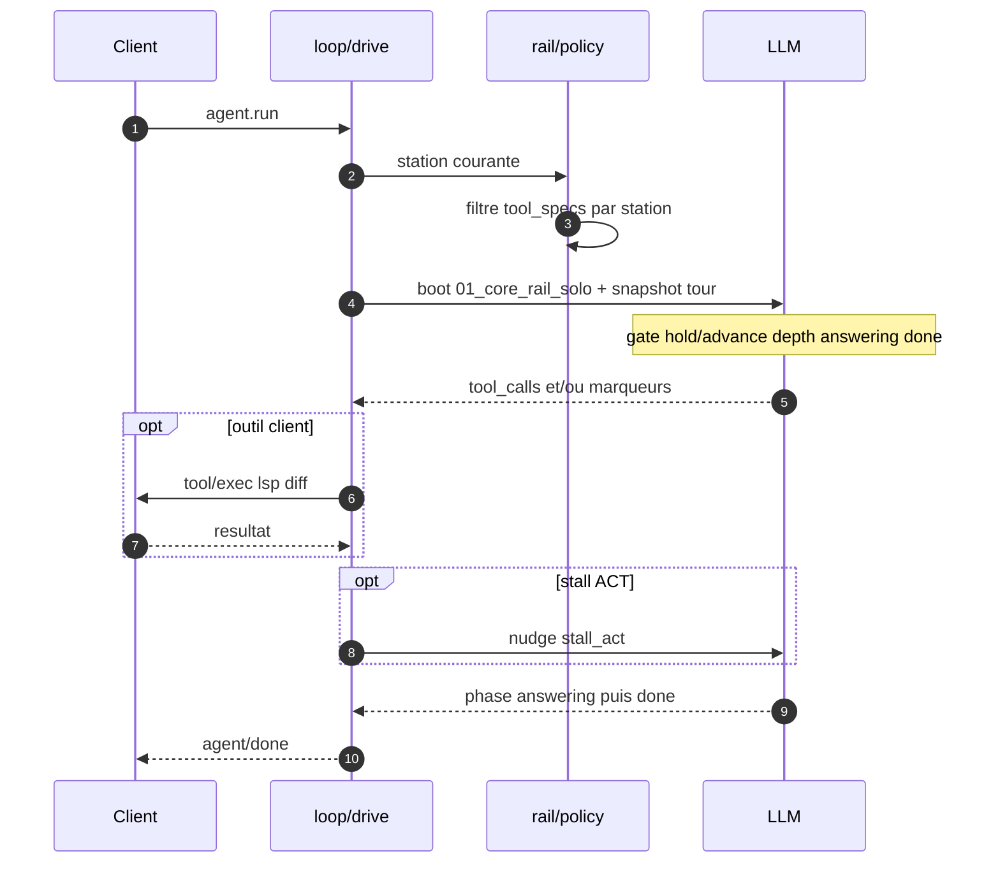

# ⚠️ STATUT PRODUIT — LIRE EN PREMIER

> **Le moteur Drox 1.4.x n’est pas utilisable en production aujourd’hui.**  
> Ne pas s’attendre à un IDE agent fiable tant que la **1.4.1** (stabilisation) n’est pas livrée.

| | |
|---|---|
| **Code livré** | Squelette **1.4.0** — refonte run rail, architecte solo, reliquats 1.3 retirés du chemin IDE |
| **Chantier actif** | **[1.4.1 — stabilisation dogfood](drox-engine/docs/1.4/1.4.1/PLAN-1.4.1.md)** — bugs session, UI busy, discuss, boucles, VERIFY Windows |
| **Après** | [1.4.2 UI chat](drox-engine/docs/1.4/1.4.2/README.md) · [1.4.3 index/graphe](drox-engine/docs/1.4/1.4.3/README.md) |
| **Clôture refonte** | [CLOSURE-1.4.0](drox-engine/docs/1.4/1.4.0/archive/finalisation/CLOSURE-1.4.0.md) |

### Ce que la 1.4.0 a changé (et pourquoi on la clôture quand même)

La refonte **1.4.0** remplace l’orchestration 1.3 (Executor, `delegate_executor`, segments ACT, Professor, Standard CLI, LoopDetector parallèle) par **un seul conducteur** : le **run rail** (stations intent → read → plan → act → verify → answer), un prompt edit (`01_core_rail_solo.md`), et une boucle agent découpée en modules courts.

**Dogfood juin 2026** (Qwen 27b, runs réels) : le rail tient la route — runs structurés, rapides, sans boucles 1.3 visibles, exploration ciblée. Le squelette moteur est **suffisant pour figer la branche** et enchaîner la stabilisation en 1.4.1.

### Pourquoi c’est globalement inutilisable en l’état

La refonte a corrigé l’**architecture** ; elle n’a **pas** rendu le produit prêt pour un usage quotidien :

- **UI chat** : journal bruyant (thinking, events rail), état `busy` parfois bloqué, replay session lent, export transcript incohérent — polish prévu en **1.4.2**, mais certains symptômes bloquent déjà l’usage (→ **1.4.1**).
- **Discuss** : routage « salut » parfois suivi d’outils interdits (M-DISC-01).
- **Runs longs** : préambules thinking répétés, double `answering`, clôtures sans mutation quand le code matche déjà le brief.
- **VERIFY** : commandes bash inadaptées à Windows (`head`, etc.).
- **Distribution** : pas de promesse de build installeur stable sur cette base ; `droxVersion` **1.4.0** = **code squelette**, pas release produit validée.

**En résumé** : utile pour **développer et dogfooder le moteur** sur branche dev ; **pas** pour confier un repo client ou remplacer un IDE agent en prod.

### Où lire la suite

- Plan stabilisation : [`drox-engine/docs/1.4/1.4.1/PLAN-1.4.1.md`](drox-engine/docs/1.4/1.4.1/PLAN-1.4.1.md)
- Référence refonte (archivée) : [`drox-engine/docs/1.4/1.4.0/FOI-REFONTE.md`](drox-engine/docs/1.4/1.4.0/FOI-REFONTE.md)
- Journal smoke : [`drox-engine/docs/1.4/1.4.0/archive/SMOKE-BACKLOG.md`](drox-engine/docs/1.4/1.4.0/archive/SMOKE-BACKLOG.md)

___

Doc moteur brute — conventions : [RULES.md §5](RULES.md#5-readmemd-racine--doc-moteur)

## Sommaire

**[⚠️ Statut produit 1.4.1](#statut-produit)** · [Statut EN](#en-product-status)

[Vue globale](#vue-globale) · [Overview](#overview) · [Schéma 1.4 — run rail](#schema-rail)

**FR**

[Moteur Drox](#fr) · [Invariants](#fr-invariants) · [Chronologie](#fr-chronologie)

[2025-12](#fr-2025-12) · [2026-02](#fr-2026-02) · [2026-02-fin](#fr-2026-02-fin) · [2026-03](#fr-2026-03) · [2026-04](#fr-2026-04) · [2026-05 v1_2](#fr-2026-05-v12) · [2026-05 v1_3](#fr-2026-05-v13) · [2026-06 v1_4](#fr-2026-06-v14)

**EN**

[Drox Engine](#en) · [Invariants](#en-invariants) · [Timeline](#en-timeline)

[2025-12](#en-2025-12) · [2026-02](#en-2026-02) · [2026-02-end](#en-2026-02-end) · [2026-03](#en-2026-03) · [2026-04](#en-2026-04) · [2026-05 v1_2](#en-2026-05-v12) · [2026-05 v1_3](#en-2026-05-v13) · [2026-06 v1_4](#en-2026-06-v14)

___

## Vue globale

Tu codes dans un repo. **Drox IDE** est l’éditeur. **Ollama** fait tourner le modèle en local (Qwen, Gemma, etc. — celui que tu choisis dans les réglages). Entre les deux : **`drox.exe`**, le moteur Rust : il enchaîne les tours LLM, décide quels outils appeler, et demande à l’IDE ce qu’il ne peut pas faire seul (LSP, diff, questions).

**La pile (grossier)**

**Un message dans le chat (grossier)**

**Qui fait quoi**

| Brique | Rôle |
|--------|------|
| **Ollama** | Inférence : un modèle, ta machine, pas de compte cloud imposé |
| **drox.exe** | Boucle agent, run rail, permissions, session, filtre des outils |
| **Drox IDE** | UI chat, éditeur, exécution LSP/diff/bash côté workspace |
| **Toi** | Repo, modèle choisi, mode permission (default / plan / acceptEdits…) |

Le détail du conducteur (stations, marqueurs, prompts) est dans [Schéma 1.4 — run rail](#schema-rail) plus bas.

___

## Overview

You work in a repo. **Drox IDE** is the editor. **Ollama** runs the model locally (Qwen, Gemma, etc. — whichever you pick in settings). In between: **`drox.exe`**, the Rust engine: it runs LLM turns, decides which tools to call, and asks the IDE for what it cannot do itself (LSP, diff, prompts).

**The stack (coarse)**

**One chat message (coarse)**

**Who does what**

| Piece | Role |
|-------|------|
| **Ollama** | Inference: one model, your machine, no mandated cloud account |
| **drox.exe** | Agent loop, run rail, permissions, session, tool filtering |
| **Drox IDE** | Chat UI, editor, LSP/diff/bash execution in the workspace |
| **You** | Repo, chosen model, permission mode (default / plan / acceptEdits…) |

Conductor detail (stations, markers, prompts) is in [Schema 1.4 — run rail](#schema-rail) below.

___

## Schéma — 1.4 (run rail)

Run `agent.run` · **deux chemins IDE** : **edit** (Architect + run rail) et **discuss** (ArchitectDiscussion, court) · lot **1.4** : un conducteur, stations, filtre outils par station, prompt boot unique `01_core_rail_solo.md` · `delegate_executor`, Executor, segments ACT, Professor, Standard CLI **retirés**.

**Vue d’ensemble**

**Stations edit (chemin long vs court)**

**Tour LLM sur le rail**

| Identifiant | Fonction |
|-------------|----------|
| `run_rail_enabled` | Active le rail sur le chemin edit (preset normal IDE) |
| `rail/policy.rs` | Allowlist outils **par station** avant envoi au LLM |
| `01_core_rail_solo.md` | Seul boot system edit ; marqueurs `[gate:]` `[depth:]` `[phase:]` |
| `pre_gate` | Orientation action ; rejet outil hors station |
| `[gate: hold]` / `[gate: advance]` | Stop → ANSWER ou acceptation station candidate |
| `[depth: short]` / `[depth: complex]` | Après READ ; PROPOSE si complex + hold user |
| `stall_act` | Nudge si ACT sans mutation après N tours |
| `final_answer_guard` | Une seule promotion `[phase: answering]` par run |
| `ArchitectDiscussion` | Réponse légère sans rail complet (intent discuss) |

___

# Moteur Drox

Binaire Rust (`drox-engine/drox/`) qui fait tourner une boucle LLM + outils en local. Le client (IDE) lance `drox --serve`, lit du NDJSON sur stdio, et exécute ce qui ne peut pas tourner dans le moteur (LSP, diff, questions UI). Inférence via Ollama ou API compatible. Produit KDDS — pas de cloud propriétaire imposé.

___

## Invariants

`moteur_seul` — stations, gates, filtre outils et orchestration vivent dans Rust ; le client stream et exécute LSP/diff, il ne conduit pas le run.
`rail_seul_guide` — chemin edit : le **run rail** est le seul conducteur ; pas de LoopDetector 1.3, `cycle_sanity`, ni second guide parallèle.
`architecte_solo` — un seul agent edit ; pas de `delegate_executor`, pas de `RoleId::Executor`, mutations **inline** en station ACT.
`deux_chemins` — **edit** (rail complet) vs **discuss** (`ArchitectDiscussion`, court) ; routage via `architectInteractionMode` / intent modèle, pas de heuristique message côté moteur.
`outils_par_station` — le moteur filtre `tool_specs` avant chaque tour LLM (READ ≠ ACT ≠ VERIFY).
`gate_hold_advance` — transitions de station via `[gate: hold]` (→ ANSWER) ou `[gate: advance]` ; pas de `[phase: reading|acting|planning|testing]` comme langage de conduite.
`depth_apres_read` — `[depth: short|complex]` après READ ; PROPOSE seulement si complex + hold utilisateur.
`done_obligatoire` — fin de run uniquement sur `[phase: done]` ; pas de « plus d’outil donc on arrête ».
`answering_avant_done` — `done` refusé ou nudgé si `[phase: answering]` n’a pas été vu ; seul le texte sous `answering` est la réponse utilisateur.
`nudges_minces` — post-refonte : `stall_act`, `schema_error`, `done_only` seulement.

___

## Chronologie

### 2025-12 — amorçage

`drox_cli` — binaire `drox`.
`serve_stdio` — mode `drox --serve`, JSON-RPC NDJSON.
`rpc_base` — `initialize`, `agent.run`, `agent.cancel`, `session.list`, `session.read`, `session.compact`, `shutdown`.
`rpc_client` — `tool/exec`, `user/ask` (serveur → client).
`agent_loop` — tours LLM, `tool_calls`, events `agent/event`, transcript JSONL.
`drox_llm` — client Ollama, stream, retry, tool calls, reprise sur `MaxTokens`.
`tools_fichiers` — `file_read`, `file_write`, `file_edit`, `grep`, `glob`, `bash`, `web_fetch`.
`plan_mode` — `plan_mode`, `exit_plan_mode`, `ask_user_question`.
`drox_permissions` — allow / ask / deny, modes permission.
`drox_session` — sessions, transcript, `MEMORY.md`, `DROX.md`.
`drox_context` — comptage tokens, snip `tool_result`.
`session_compact_rpc` — compaction manuelle `session.compact` / `summarize_run`.
`mcp_stubs` — `drox-mcp`, outils `mcp__*`.

___

### 2026-02

`multimodal` — images utilisateur → `Content::Image`, champ Ollama `images`.
`web_search` — recherche DuckDuckGo HTML, read-only.
`lsp_remote` — tool `lsp` ; exécution IDE.
`ollama_defaults` — `num_ctx`, `num_predict`, sampling, `keep_alive` top-level.

___

### 2026-02-fin

`todo_write` — liste `{ id, content, status }`.
`phase_protocol` — `[phase: …]`, `PhaseEnter`, inférence, alias.
`nudge_tour_vide` — relance si tour sans outil ni `done`.
`gate_todo_ouverte` — `done` bloqué si pending/in_progress.
`glob_dirs` — `glob` renvoie fichiers et répertoires.
`loop_detector` — deux tours identiques → `LoopDetected`.
`todo_recreation_block` — second plan interdit après plan 100 % completed.
`memory_sessions` — `.drox/memory/sessions/*.md`, `memory_read`, `memory_list`, `session_note`, `MemoryPersisted`.
`compaction_live_v1` — microcompact, tail bornée, `compact_until_budget`, events snip/compact.
`paste_inject` — bloc `[Smart paste]` dans le prompt (côté client).
`user_ask` — `ask_user_question` multi + RPC `user/ask`.
`msg_queue` — file messages pendant run (client).
`ctx_policy_num_ctx` — autocompact calé sur fenêtre Ollama réelle.

___

### 2026-03

`long_memory_v1` — index compaction, `session_search`, `/session_end` → `session_closure` (pas de tool `session_end` LLM).
`compaction_live_v2` — boucle jusqu’au budget.
`hooks_json` — `.drox/hooks.json`, Pre/Post tool shell.
`parallel_read_tools` — reads concurrency-safe, `max_parallel_tool_calls`.
`bash_classifier` — segments bash auto-allow / auto-deny.
`file_rules` — permissions chemins, `settings.local.json`.
`copy_path`, `delete_path` — outils dédiés.
`notebook_edit` — cellules ipynb replace/insert/delete.

___

### 2026-04

`skills` — `.drox/skills/`, `skill_read`, `skill_list`.
`git_worktree` — `git_worktree_enter`, `git_worktree_exit`.
`mcp_hub` — registre MCP, resources, `mcp_call` fallback.
`professor_mode` — `course_plan_write`, gates, `.drox/course-cycles/`.
`tools_toggle` — `drox.tools.disabled`, MCP on/off.
`phase_analyzing` — phase + nudge exploration.
`phase_testing` — gate `done` après mutation code.
`workspace_map` — `.drox/workspace-map.json`, read/note, miroir outils.
`droxignore` — chemins exclus agent.
`run_objective` — objectif verrouillé, `scope_defer`.
`subagent_task` — tool `task` Explore, off par défaut.
`image_paths_prompt` — chemins images dans le prompt.
`agent_split` — modules `agent/` (gates, phases, nudges, stream).
`run_policy` — couche `RunPolicy` (transitoire, avant abandon tiers).
`tiers_low_medium_abandon` — expérience avril, retirée au profit `v1_2`.

___

### 2026-05 — `v1_2`

`orchestration_v1_2` — `DROX_ORCHESTRATION=v1_2` remplace `legacy` mono-agent.
`run_spec` — rôle, limites, registre outils par `RunSpec`.
`role_architect` — `workspace_map_read`, `todo_write`, `delegate_executor`, verify, synthèse.
`role_executor` — mutations dans `scope` ; statut `completed` / `partial` / `failed`.
`delegate_executor` — sous-run sync ; sorties `.drox/agent-output/<plan>/<task>/`.
`architect_gates` — pas de compensation échec ; scope validé.
`architect_help` — tool rappel protocole.
`role_enter` — event `RoleEnter` ; `agent/done` fin cycle.

___

### 2026-05 — `v1_3`

`failure_absorption` — truth check post-délégation, `FailurePacket`.
`parallel_batch` — `parallel_with[]`, réponse `{ results: [...] }`.
`scope_disjoint_gate` — refus batch si chemins qui se chevauchent.
`retry_per_task` — re-délégation ciblée après échec partiel.
`architect_todo_guidance` — anti-boucle clôture plan.

___

### 2026-06 — `v1_4` (run rail)

`run_rail_solo` — refonte 1.4.0 : un conducteur edit, reliquats 1.3 retirés du chemin IDE.
`stations_rail` — INTENT → READ → [PROPOSE] → PLAN → ACT → VERIFY → ANSWER ; chemin court sans PLAN/PROPOSE.
`01_core_rail_solo` — seul prompt boot edit ; suppression `01_core.md`, `parallel_slots`, `delegate_executor` prompts.
`rail_policy` — filtre outils par station dans `rail/policy.rs` avant LLM.
`segment_act_del` — plus de shards Executor ; `file_edit` / `file_write` / `bash` en station ACT.
`delegate_executor_del` — Executor, `FailurePacket`, batch parallèle hors contrat runtime.
`professor_standard_del` — modes Professor et Standard CLI coupés du `drive`.
`discuss_path` — `ArchitectDiscussion` : réponse légère, pas rail complet.
`nudges_rail` — `stall_act`, `schema_error`, `done_only` ; fin nudges 1.3 (`cycle_sanity`, `step_by_step`, etc.).
`final_answer_guard` — une promotion `[phase: answering]` ; anti double réponse finale.
`agent_split_v2` — `loop/drive/`, `state/`, `gates/`, `rail/`, `nudges/` ; plafond ~500 L/fichier.
`ui_2d` — retrait UI multi-modèle / executor côté IDE (settings, webview) ; polish conducteur → 1.4.2.

___

# ⚠️ PRODUCT STATUS — READ FIRST

> **Drox engine 1.4.x is not production-ready.**  
> Do not expect a reliable agent IDE until **1.4.1** (stabilization) ships.

| | |
|---|---|
| **Shipped code** | **1.4.0** skeleton — run rail refactor, solo architect, 1.3 relics removed from IDE path |
| **Active work** | **[1.4.1 dogfood stabilization](drox-engine/docs/1.4/1.4.1/PLAN-1.4.1.md)** — session, busy UI, discuss routing, loops, Windows VERIFY |
| **Next** | [1.4.2 chat UI](drox-engine/docs/1.4/1.4.2/README.md) · [1.4.3 index/graph](drox-engine/docs/1.4/1.4.3/README.md) |
| **Refactor closure** | [CLOSURE-1.4.0](drox-engine/docs/1.4/1.4.0/archive/finalisation/CLOSURE-1.4.0.md) |

**1.4.0** fixed architecture (single run rail conductor). **Dogfood** shows the rail works for structured runs. The product is still **mostly unusable day-to-day** because of UI/session bugs, discuss edge cases, loop noise, and Windows verify — tracked in 1.4.1. Dev branch dogfood only; not a validated product release.

___

# Drox Engine

Rust binary (`drox-engine/drox/`) that runs a local LLM + tools loop. The client (IDE) starts `drox --serve`, reads NDJSON on stdio, and runs what cannot live in the engine (LSP, diff, UI prompts). Inference via Ollama or compatible API. KDDS product — no mandated proprietary cloud.

___

## Invariants

`moteur_seul` — stations, gates, tool filtering, and orchestration live in Rust; the client streams and runs LSP/diff, it does not drive the run.
`rail_seul_guide` — edit path: **run rail** is the only conductor; no 1.3 LoopDetector, `cycle_sanity`, or parallel guide.
`architecte_solo` — single edit agent; no `delegate_executor`, no `RoleId::Executor`; mutations **inline** in ACT station.
`deux_chemins` — **edit** (full rail) vs **discuss** (`ArchitectDiscussion`, short); routing via `architectInteractionMode` / model intent, no message heuristics in the engine.
`outils_par_station` — engine filters `tool_specs` before each LLM turn (READ ≠ ACT ≠ VERIFY).
`gate_hold_advance` — station transitions via `[gate: hold]` (→ ANSWER) or `[gate: advance]`; no `[phase: reading|acting|planning|testing]` as drive language.
`depth_apres_read` — `[depth: short|complex]` after READ; PROPOSE only if complex + user hold.
`done_obligatoire` — run ends only on `[phase: done]`; no “no more tools so we stop”.
`answering_avant_done` — `done` blocked or nudged if `[phase: answering]` was not seen; only text under `answering` is the user-facing reply.
`nudges_minces` — post-refactor: `stall_act`, `schema_error`, `done_only` only.

___

## Timeline

### 2025-12 — bootstrap

`drox_cli` — `drox` binary.
`serve_stdio` — `drox --serve` mode, JSON-RPC NDJSON.
`rpc_base` — `initialize`, `agent.run`, `agent.cancel`, `session.list`, `session.read`, `session.compact`, `shutdown`.
`rpc_client` — `tool/exec`, `user/ask` (server → client).
`agent_loop` — LLM turns, `tool_calls`, `agent/event` stream, JSONL transcript.
`drox_llm` — Ollama client, stream, retry, tool calls, resume on `MaxTokens`.
`tools_fichiers` — `file_read`, `file_write`, `file_edit`, `grep`, `glob`, `bash`, `web_fetch`.
`plan_mode` — `plan_mode`, `exit_plan_mode`, `ask_user_question`.
`drox_permissions` — allow / ask / deny, permission modes.
`drox_session` — sessions, transcript, `MEMORY.md`, `DROX.md`.
`drox_context` — token counting, `tool_result` snip.
`session_compact_rpc` — manual compaction `session.compact` / `summarize_run`.
`mcp_stubs` — `drox-mcp`, `mcp__*` tools.

___

### 2026-02

`multimodal` — user images → `Content::Image`, Ollama `images` field.
`web_search` — DuckDuckGo HTML search, read-only.
`lsp_remote` — `lsp` tool; IDE-side execution.
`ollama_defaults` — `num_ctx`, `num_predict`, sampling, top-level `keep_alive`.

___

### 2026-02-end

`todo_write` — `{ id, content, status }` list.
`phase_protocol` — `[phase: …]`, `PhaseEnter`, inference, aliases.
`nudge_tour_vide` — nudge on turn with no tool and no `done`.
`gate_todo_ouverte` — `done` blocked while pending/in_progress.
`glob_dirs` — `glob` returns files and directories.
`loop_detector` — two identical turns → `LoopDetected`.
`todo_recreation_block` — second plan forbidden after 100 % completed plan.
`memory_sessions` — `.drox/memory/sessions/*.md`, `memory_read`, `memory_list`, `session_note`, `MemoryPersisted`.
`compaction_live_v1` — microcompact, bounded tail, `compact_until_budget`, snip/compact events.
`paste_inject` — `[Smart paste]` block in prompt (client-side).
`user_ask` — multi `ask_user_question` + RPC `user/ask`.
`msg_queue` — message queue during run (client).
`ctx_policy_num_ctx` — autocompact tied to real Ollama context window.

___

### 2026-03

`long_memory_v1` — compaction index, `session_search`, `/session_end` → `session_closure` (no LLM `session_end` tool).
`compaction_live_v2` — loop until context budget.
`hooks_json` — `.drox/hooks.json`, Pre/Post tool shell.
`parallel_read_tools` — concurrency-safe reads, `max_parallel_tool_calls`.
`bash_classifier` — bash segments auto-allow / auto-deny.
`file_rules` — path permissions, `settings.local.json`.
`copy_path`, `delete_path` — dedicated tools.
`notebook_edit` — ipynb cells replace/insert/delete.

___

### 2026-04

`skills` — `.drox/skills/`, `skill_read`, `skill_list`.
`git_worktree` — `git_worktree_enter`, `git_worktree_exit`.
`mcp_hub` — MCP registry, resources, `mcp_call` fallback.
`professor_mode` — `course_plan_write`, gates, `.drox/course-cycles/`.
`tools_toggle` — `drox.tools.disabled`, MCP on/off.
`phase_analyzing` — phase + exploration nudge.
`phase_testing` — `done` gate after code mutation.
`workspace_map` — `.drox/workspace-map.json`, read/note, post-tool mirror.
`droxignore` — paths excluded from agent.
`run_objective` — locked objective, `scope_defer`.
`subagent_task` — `task` Explore tool, off by default.
`image_paths_prompt` — image paths in prompt.
`agent_split` — `agent/` modules (gates, phases, nudges, stream).
`run_policy` — `RunPolicy` layer (transitional, before tier drop).
`tiers_low_medium_abandon` — April experiment, removed for `v1_2`.

___

### 2026-05 — `v1_2`

`orchestration_v1_2` — `DROX_ORCHESTRATION=v1_2` replaces `legacy` mono-agent.
`run_spec` — role, limits, tool registry per `RunSpec`.
`role_architect` — `workspace_map_read`, `todo_write`, `delegate_executor`, verify, synthesis.
`role_executor` — mutations within `scope`; status `completed` / `partial` / `failed`.
`delegate_executor` — sync sub-run; output under `.drox/agent-output/<plan>/<task>/`.
`architect_gates` — no failure compensation; validated scope.
`architect_help` — protocol reminder tool.
`role_enter` — `RoleEnter` event; `agent/done` end of cycle.

___

### 2026-05 — `v1_3`

`failure_absorption` — post-delegation truth check, `FailurePacket`.
`parallel_batch` — `parallel_with[]`, response `{ results: [...] }`.
`scope_disjoint_gate` — batch rejected if paths overlap.
`retry_per_task` — targeted re-delegation after partial failure.
`architect_todo_guidance` — anti-loop plan closure.

___

### 2026-06 — `v1_4` (run rail)

`run_rail_solo` — 1.4.0 refactor: single edit conductor; 1.3 relics removed from IDE path.
`stations_rail` — INTENT → READ → [PROPOSE] → PLAN → ACT → VERIFY → ANSWER; short path skips PLAN/PROPOSE.
`01_core_rail_solo` — sole edit boot prompt; dropped `01_core.md`, `parallel_slots`, `delegate_executor` prompts.
`rail_policy` — per-station tool filter in `rail/policy.rs` before LLM.
`segment_act_del` — no Executor shards; `file_edit` / `file_write` / `bash` in ACT station.
`delegate_executor_del` — Executor, `FailurePacket`, parallel batch out of runtime contract.
`professor_standard_del` — Professor and Standard CLI modes cut from `drive`.
`discuss_path` — `ArchitectDiscussion`: light reply, no full rail.
`nudges_rail` — `stall_act`, `schema_error`, `done_only`; end of 1.3 nudges (`cycle_sanity`, `step_by_step`, etc.).
`final_answer_guard` — single `[phase: answering]` promotion; no double final reply.
`agent_split_v2` — `loop/drive/`, `state/`, `gates/`, `rail/`, `nudges/`; ~500 L/file cap.
`ui_2d` — multi-model / executor UI removed on IDE side (settings, webview); conductor polish → 1.4.2.
