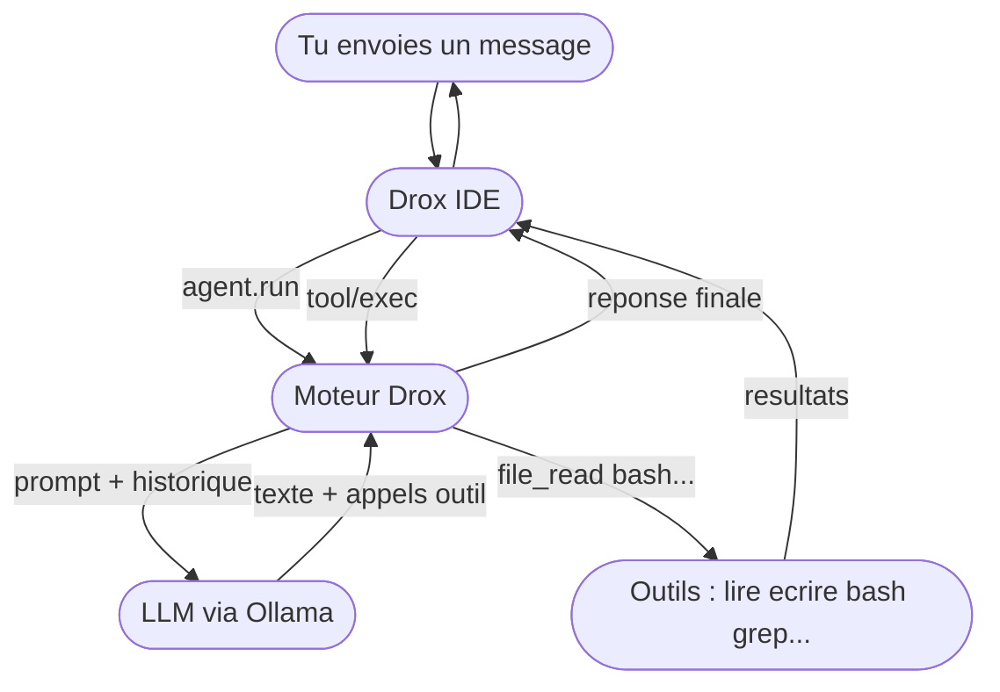
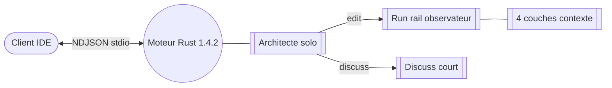
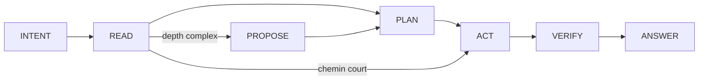
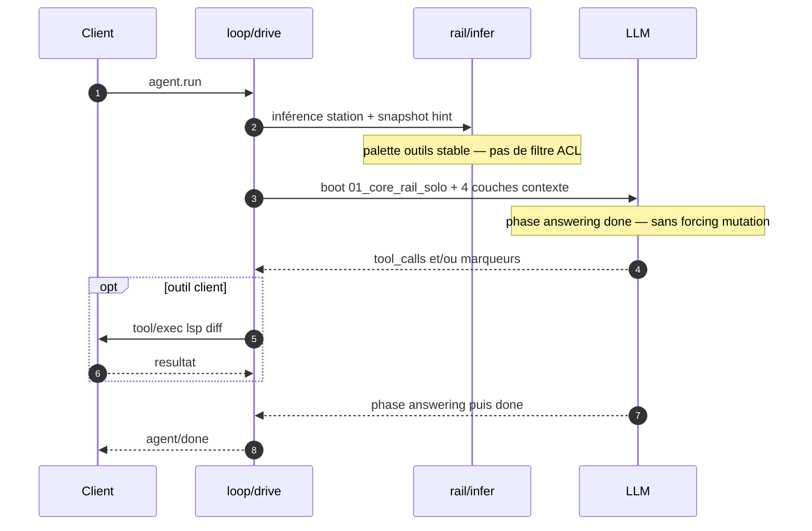

# ⚠️ STATUT PRODUIT — LIRE EN PREMIER

> **`main` = release Drox IDE 1.5.3** (juin 2026) — moteur **`tui_mono`** (socle **1.5.0**), base VS Code **1.126.0**.  
> La ligne **1.5.x** est la référence actuelle. **1.4.x** est **archivée** — ne plus bâtir dessus.

| | |
|---|---|
| **Code sur `main`** | **1.5.3** — shim RPC IDE, boucle TUI, chat aligné fil agent, config moteur depuis l’IDE (1.5.2+) |
| **Release Windows** | Publiée — [Drox---IDE---OR `v1.5.3`](https://github.com/DroxKiwi/Drox---IDE---OR/releases/tag/v1.5.3) |
| **Utilisable en prod ?** | **Non** — toujours **expérimental** / dogfood. |
| **Tester ?** | Installeur ou build local ; Ollama (ou API compatible) ; accepter bugs et MAJ fréquentes. |
| **Suite** | **1.5.4** — Linux `.deb`, signature Authenticode, marketplace extensions ([plan](drox-engine/docs/1.5/1.5.4/PLAN-1.5.4.md)). |

### Ce que la 1.5.3 apporte (IDE — pas le cœur Rust)

Principalement **UX chat** : diffs fichier inline + undo/redo, cartes shell, polish messages user, composer auto-grow, style fil VT323, historique sessions + rejeu, correctifs WORK. Le **moteur** reste la boucle **1.5.0** (`tui_mono`) avec le shim JSON-RPC.

### Lignée moteur (rappel)

| Version | Moteur |
|---------|--------|
| **1.4.x** | Rail observateur — **obsolète** |
| **1.5.0** | Retour **`tui_mono`** + shim IDE — **base actuelle** |
| **1.5.2** | Config / sampling moteur exposée dans l’IDE (contrat TUI) |
| **1.5.3** | Pas de rupture moteur — livrable IDE |

**En résumé** : la **1.5.x** est la ligne à suivre ; la **1.4.x** sert d’archive historique uniquement.

### Où lire la suite (dépôt)

- Release & upstream : [`drox-engine/docs/GUIDE-RELEASE-ET-UPSTREAM.md`](drox-engine/docs/GUIDE-RELEASE-ET-UPSTREAM.md)
- Clôture 1.5.3 : `drox-engine/docs/1.5/1.5.3/CLOSURE-1.5.3.md`
- Moteur 1.5.0 : `drox-engine/docs/1.5/1.5.0/CLOSURE-1.5.0.md`
- Archive 1.4.2 : `drox-engine/docs/1.4/1.4.2/PLAN-1.4.2.md`

___

Doc moteur brute — conventions : [RULES.md §5](RULES.md#5-readmemd-racine--doc-moteur)

## Sommaire

**[⚠️ Statut produit 1.4.2](#statut-produit)** · [Product status EN](#en-product-status)

[Vue globale](#vue-globale) · [Overview](#overview) · [Schéma 1.4 — run rail](#schema-rail)

**FR**

[Moteur Drox](#fr) · [Invariants](#fr-invariants) · [Chronologie](#fr-chronologie)

[2025-12](#fr-2025-12) · [2026-02](#fr-2026-02) · [2026-02-fin](#fr-2026-02-fin) · [2026-03](#fr-2026-03) · [2026-04](#fr-2026-04) · [2026-05 v1_2](#fr-2026-05-v12) · [2026-05 v1_3](#fr-2026-05-v13) · [2026-06 v1_4](#fr-2026-06-v14) · [2026-06 v1_4_2](#fr-2026-06-v142) · [2026-06 v1_5](#fr-2026-06-v15)

**EN**

[Drox Engine](#en) · [Invariants](#en-invariants) · [Timeline](#en-timeline)

[2025-12](#en-2025-12) · [2026-02](#en-2026-02) · [2026-02-end](#en-2026-02-end) · [2026-03](#en-2026-03) · [2026-04](#en-2026-04) · [2026-05 v1_2](#en-2026-05-v12) · [2026-05 v1_3](#en-2026-05-v13) · [2026-06 v1_4](#en-2026-06-v14) · [2026-06 v1_4_2](#en-2026-06-v142) · [2026-06 v1_5](#en-2026-06-v15)

___

## Vue globale

Tu codes dans un repo. **Drox IDE** est l’éditeur. **Ollama** fait tourner le modèle en local (Qwen, Gemma, etc. — celui que tu choisis dans les réglages). Entre les deux : **`drox.exe`**, le moteur Rust : il enchaîne les tours LLM, décide quels outils appeler, et demande à l’IDE ce qu’il ne peut pas faire seul (LSP, diff, questions).

**La pile (grossier)**

**Un message dans le chat (grossier)**

**Qui fait quoi**

| Brique | Rôle |
|--------|------|
| **Ollama** | Inférence : un modèle, ta machine, pas de compte cloud imposé |
| **drox.exe** | Boucle agent, run rail observateur, permissions, session, palette outils stable |
| **Drox IDE** | UI chat, éditeur, exécution LSP/diff/bash côté workspace |
| **Toi** | Repo, modèle choisi, mode permission (default / plan / acceptEdits…) |

Le détail du conducteur (stations, marqueurs, prompts) est dans [Schéma 1.4 — run rail](#schema-rail) plus bas.

___

## Overview

You work in a repo. **Drox IDE** is the editor. **Ollama** runs the model locally (Qwen, Gemma, etc. — whichever you pick in settings). In between: **`drox.exe`**, the Rust engine: it runs LLM turns, decides which tools to call, and asks the IDE for what it cannot do itself (LSP, diff, prompts).

**The stack (coarse)**

**One chat message (coarse)**

**Who does what**

| Piece | Role |
|-------|------|
| **Ollama** | Inference: one model, your machine, no mandated cloud account |
| **drox.exe** | Agent loop, observer run rail, permissions, session, stable tool palette |
| **Drox IDE** | Chat UI, editor, LSP/diff/bash execution in the workspace |
| **You** | Repo, chosen model, permission mode (default / plan / acceptEdits…) |

Conductor detail (stations, markers, prompts) is in [Schema 1.4 — run rail](#schema-rail) below.

___

## Schéma — 1.4.2 (rail observateur)

Run `agent.run` · **deux chemins IDE** : **edit** (Architect + run rail) et **discuss** (ArchitectDiscussion, court) · lot **1.4.2** : rail **observateur**, outils **stables** tout le run, contexte **4 couches**, plus d’ACL par station ni `tool_folders` · routage `discuss` / `analyze` / `edit` **statique** (plus d’intent probe LLM).

**Vue d’ensemble**

**Stations edit (inférées, pas bloquantes)**

**Tour LLM sur le rail**

| Identifiant | Fonction |
|-------------|----------|
| `run_rail_enabled` | Active le rail sur le chemin edit |
| `rail/infer.rs` | Inférence station depuis outils + marqueurs — **observation** |
| `rail_snapshot_block` | Hint informatif dans le snapshot — pas prescriptif |
| `01_core_rail_solo.md` | Boot edit observateur ; marqueurs `[phase:]` `[depth:]` |
| `routing.rs` | Routage statique discuss / analyze / edit |
| `internal_plan_write` | Plan interne moteur — remplace `todo_write` |
| `tool_supplements_architect_compact` | Protocole outil unique tout le run |
| `ArchitectDiscussion` | Réponse légère sans rail complet |

___

# Moteur Drox

Binaire Rust (`drox-engine/drox/`) qui fait tourner une boucle LLM + outils en local. Le client (IDE) lance `drox --serve`, lit du NDJSON sur stdio, et exécute ce qui ne peut pas tourner dans le moteur (LSP, diff, questions UI). Inférence via Ollama ou API compatible. Produit KDDS — pas de cloud propriétaire imposé.

___

## Invariants

`moteur_seul` — orchestration, gates souples et injection contexte vivent dans Rust ; le client stream et exécute LSP/diff, il ne conduit pas le run.
`rail_observateur` — chemin edit : le **run rail** infère et affiche la station ; **pas** d’ACL outils par station, **pas** de `tool_folders`, **pas** de nudges coercitifs (`stall_read`, `stall_act`, `force_act`).
`architecte_solo` — un seul agent edit ; pas de `delegate_executor`, pas de `RoleId::Executor` ; mutations **inline**.
`deux_chemins` — **edit** (rail complet) vs **discuss** (`ArchitectDiscussion`, court) ; routage **statique** (`routing.rs`), plus d’intent probe LLM au boot.
`outils_stables` — palette `tool_specs` **plate** tout le run EDIT ; protocole compact unique `tool_supplements_architect_compact`.
`contexte_4_couches` — cadre boot + hint rail · outils wire · snapshot run + `internal_plan_write` · transcript + compaction checkpoint.
`plan_interne` — `internal_plan_write` remplace `todo_write` ; pas de gate todo sur `done`.
`memoire_drox_seule` — `DROX.md` seul pour la mémoire projet ; boot sans listing skills/sessions.
`done_souple` — fin sur `[phase: done]` ; verify et mutation **non** forcés par défaut (preset strict optionnel).
`obsolete_142` — **1.4.2 clôturée** sur `main` mais le moteur **va changer entièrement** — ne pas bâtir dessus.

___

## Chronologie

### 2025-12 — amorçage

`drox_cli` — binaire `drox`.
`serve_stdio` — mode `drox --serve`, JSON-RPC NDJSON.
`rpc_base` — `initialize`, `agent.run`, `agent.cancel`, `session.list`, `session.read`, `session.compact`, `shutdown`.
`rpc_client` — `tool/exec`, `user/ask` (serveur → client).
`agent_loop` — tours LLM, `tool_calls`, events `agent/event`, transcript JSONL.
`drox_llm` — client Ollama, stream, retry, tool calls, reprise sur `MaxTokens`.
`tools_fichiers` — `file_read`, `file_write`, `file_edit`, `grep`, `glob`, `bash`, `web_fetch`.
`plan_mode` — `plan_mode`, `exit_plan_mode`, `ask_user_question`.
`drox_permissions` — allow / ask / deny, modes permission.
`drox_session` — sessions, transcript, `MEMORY.md`, `DROX.md`.
`drox_context` — comptage tokens, snip `tool_result`.
`session_compact_rpc` — compaction manuelle `session.compact` / `summarize_run`.
`mcp_stubs` — `drox-mcp`, outils `mcp__*`.

___

### 2026-02

`multimodal` — images utilisateur → `Content::Image`, champ Ollama `images`.
`web_search` — recherche DuckDuckGo HTML, read-only.
`lsp_remote` — tool `lsp` ; exécution IDE.
`ollama_defaults` — `num_ctx`, `num_predict`, sampling, `keep_alive` top-level.

___

### 2026-02-fin

`todo_write` — liste `{ id, content, status }`.
`phase_protocol` — `[phase: …]`, `PhaseEnter`, inférence, alias.
`nudge_tour_vide` — relance si tour sans outil ni `done`.
`gate_todo_ouverte` — `done` bloqué si pending/in_progress.
`glob_dirs` — `glob` renvoie fichiers et répertoires.
`loop_detector` — deux tours identiques → `LoopDetected`.
`todo_recreation_block` — second plan interdit après plan 100 % completed.
`memory_sessions` — `.drox/memory/sessions/*.md`, `memory_read`, `memory_list`, `session_note`, `MemoryPersisted`.
`compaction_live_v1` — microcompact, tail bornée, `compact_until_budget`, events snip/compact.
`paste_inject` — bloc `[Smart paste]` dans le prompt (côté client).
`user_ask` — `ask_user_question` multi + RPC `user/ask`.
`msg_queue` — file messages pendant run (client).
`ctx_policy_num_ctx` — autocompact calé sur fenêtre Ollama réelle.

___

### 2026-03

`long_memory_v1` — index compaction, `session_search`, `/session_end` → `session_closure` (pas de tool `session_end` LLM).
`compaction_live_v2` — boucle jusqu’au budget.
`hooks_json` — `.drox/hooks.json`, Pre/Post tool shell.
`parallel_read_tools` — reads concurrency-safe, `max_parallel_tool_calls`.
`bash_classifier` — segments bash auto-allow / auto-deny.
`file_rules` — permissions chemins, `settings.local.json`.
`copy_path`, `delete_path` — outils dédiés.
`notebook_edit` — cellules ipynb replace/insert/delete.

___

### 2026-04

`skills` — `.drox/skills/`, `skill_read`, `skill_list`.
`git_worktree` — `git_worktree_enter`, `git_worktree_exit`.
`mcp_hub` — registre MCP, resources, `mcp_call` fallback.
`professor_mode` — `course_plan_write`, gates, `.drox/course-cycles/`.
`tools_toggle` — `drox.tools.disabled`, MCP on/off.
`phase_analyzing` — phase + nudge exploration.
`phase_testing` — gate `done` après mutation code.
`workspace_map` — `.drox/workspace-map.json`, read/note, miroir outils.
`droxignore` — chemins exclus agent.
`run_objective` — objectif verrouillé, `scope_defer`.
`subagent_task` — tool `task` Explore, off par défaut.
`image_paths_prompt` — chemins images dans le prompt.
`agent_split` — modules `agent/` (gates, phases, nudges, stream).
`run_policy` — couche `RunPolicy` (transitoire, avant abandon tiers).
`tiers_low_medium_abandon` — expérience avril, retirée au profit `v1_2`.

___

### 2026-05 — `v1_2`

`orchestration_v1_2` — `DROX_ORCHESTRATION=v1_2` remplace `legacy` mono-agent.
`run_spec` — rôle, limites, registre outils par `RunSpec`.
`role_architect` — `workspace_map_read`, `todo_write`, `delegate_executor`, verify, synthèse.
`role_executor` — mutations dans `scope` ; statut `completed` / `partial` / `failed`.
`delegate_executor` — sous-run sync ; sorties `.drox/agent-output/<plan>/<task>/`.
`architect_gates` — pas de compensation échec ; scope validé.
`architect_help` — tool rappel protocole.
`role_enter` — event `RoleEnter` ; `agent/done` fin cycle.

___

### 2026-05 — `v1_3`

`failure_absorption` — truth check post-délégation, `FailurePacket`.
`parallel_batch` — `parallel_with[]`, réponse `{ results: [...] }`.
`scope_disjoint_gate` — refus batch si chemins qui se chevauchent.
`retry_per_task` — re-délégation ciblée après échec partiel.
`architect_todo_guidance` — anti-boucle clôture plan.

___

### 2026-06 — `v1_4` (run rail)

`run_rail_solo` — refonte 1.4.0 : un conducteur edit, reliquats 1.3 retirés du chemin IDE.
`stations_rail` — INTENT → READ → [PROPOSE] → PLAN → ACT → VERIFY → ANSWER ; chemin court sans PLAN/PROPOSE.
`01_core_rail_solo` — seul prompt boot edit ; suppression `01_core.md`, `parallel_slots`, `delegate_executor` prompts.
`rail_policy` — filtre outils par station dans `rail/policy.rs` avant LLM.
`segment_act_del` — plus de shards Executor ; `file_edit` / `file_write` / `bash` en station ACT.
`delegate_executor_del` — Executor, `FailurePacket`, batch parallèle hors contrat runtime.
`professor_standard_del` — modes Professor et Standard CLI coupés du `drive`.
`discuss_path` — `ArchitectDiscussion` : réponse légère, pas rail complet.
`nudges_rail` — `stall_act`, `schema_error`, `done_only` ; fin nudges 1.3 (`cycle_sanity`, `step_by_step`, etc.).
`final_answer_guard` — une promotion `[phase: answering]` ; anti double réponse finale.
`agent_split_v2` — `loop/drive/`, `state/`, `gates/`, `rail/`, `nudges/` ; plafond ~500 L/fichier.
`ui_2d` — retrait UI multi-modèle / executor côté IDE (settings, webview) ; polish conducteur → 1.4.2.

___

### 2026-06 — `v1_4_2` (rail observateur — **clôture, moteur obsolète**)

`v1_4_1_stable` — session, UI busy, discuss, VERIFY Windows ; base avant refonte contexte.
`rail_observateur` — fin ACL station, `pre_gate`, `read_stall`, `act_stall`, `force_act`, gates mutation sur `done`.
`tool_folders_del` — module `orchestration/tool_folders/` supprimé ; palette plate (`file_read`, `file_edit`, …).
`intent_probe_del` — plus de probe LLM au boot ; `routing.rs` statique discuss / analyze / edit.
`todo_write_del` — `internal_plan_write` seul ; gates todo retirées.
`memoire_unifiee` — `DROX.md` seul ; boot teaser ; checkpoint compaction → snapshot `## Run context (engine)`.
`contexte_4_couches` — boot + hint rail · outils stables · snapshot run · transcript + compaction.
`prompt_observateur` — `01_core_rail_solo.md` réécrit sans `[gate:]` prescriptif.
`obsolete_annonce` — branche **1.4.2** mergée sur `main` ; **refonte moteur complète** annoncée — phase expérimentale agressive, test optionnel pour curieux.

___

### 2026-06 — `v1_5` (TUI mono + ligne IDE **1.5.x** — **courant**)

`tui_mono` — abandon rail 1.4 ; boucle agent TUI d’origine (`agent.rs`), protocole `[phase: …]`.
`shim_rpc_ide` — `drox-cli/jsonrpc` : `agent.run`, `tool/exec`, events `agent/event` ; stations rail **synthétiques** (affichage).
`permission_modes` — vignettes IDE → `plan` / `acceptEdits` / `default` côté moteur.
`v1_5_0_ship` — moteur embarqué Windows, intégration upstream VS Code **1.126.0** (squash produit).
`v1_5_2_config` — paramètres sampling / `max_iterations` / `keep_alive` alignés contrat TUI depuis l’IDE.
`v1_5_3_ide` — pas de rupture moteur ; diffs fil, cartes shell, rejeu session (couche IDE).

___

# ⚠️ PRODUCT STATUS — READ FIRST

> **`main` = Drox IDE release 1.5.3** (June 2026) — **`tui_mono`** engine (since **1.5.0**), VS Code base **1.126.0**.  
> **1.5.x** is the current line. **1.4.x** is **archived** — do not build on it.

| | |
|---|---|
| **Code on `main`** | **1.5.3** — IDE RPC shim, TUI loop, agent-stream chat, engine config from IDE (1.5.2+) |
| **Windows release** | Published — [Drox---IDE---OR `v1.5.3`](https://github.com/DroxKiwi/Drox---IDE---OR/releases/tag/v1.5.3) |
| **Production-ready?** | **No** — still **experimental** / dogfood. |
| **Want to try?** | Installer or local build; Ollama (or compatible API); expect bugs and frequent updates. |
| **Next** | **1.5.4** — Linux `.deb`, Authenticode signing, extension marketplace ([plan](drox-engine/docs/1.5/1.5.4/PLAN-1.5.4.md)). |

**1.5.3** is mostly **chat UX** (inline diffs, shell cards, session replay, VT323 thread styling). The **engine** stays the **1.5.0** `tui_mono` loop with the JSON-RPC shim.

| Version | Engine |
|---------|--------|
| **1.4.x** | Observer rail — **obsolete** |
| **1.5.0** | **`tui_mono`** + IDE shim — **current base** |
| **1.5.2** | Engine / sampling config exposed in IDE |
| **1.5.3** | No engine break — IDE deliverable |

**In short**: follow **1.5.x**; **1.4.x** is historical archive only.

___

# Drox Engine

Rust binary (`drox-engine/drox/`) that runs a local LLM + tools loop. The client (IDE) starts `drox --serve`, reads NDJSON on stdio, and runs what cannot live in the engine (LSP, diff, UI prompts). Inference via Ollama or compatible API. KDDS product — no mandated proprietary cloud.

___

## Invariants

`moteur_seul` — orchestration, soft gates, and context injection live in Rust; the client streams and runs LSP/diff, it does not drive the run.
`rail_observateur` — edit path: **run rail** infers and surfaces station; **no** per-station tool ACL, **no** `tool_folders`, **no** coercive nudges (`stall_read`, `stall_act`, `force_act`).
`architecte_solo` — single edit agent; no `delegate_executor`, no `RoleId::Executor`; mutations **inline**.
`deux_chemins` — **edit** (full rail) vs **discuss** (`ArchitectDiscussion`, short); **static** routing (`routing.rs`), no LLM intent probe at boot.
`outils_stables` — flat `tool_specs` palette for the whole EDIT run; single compact protocol `tool_supplements_architect_compact`.
`contexte_4_couches` — boot frame + rail hint · wire tools · run snapshot + `internal_plan_write` · transcript + compaction checkpoint.
`plan_interne` — `internal_plan_write` replaces `todo_write`; no todo gate on `done`.
`memoire_drox_seule` — `DROX.md` only for project memory; boot without skills/sessions listing.
`done_souple` — ends on `[phase: done]`; verify and mutation **not** forced by default (strict preset optional).
`obsolete_142` — **1.4.2 closed** on `main` but engine **will change entirely** — do not build on this stack.

___

## Timeline

### 2025-12 — bootstrap

`drox_cli` — `drox` binary.
`serve_stdio` — `drox --serve` mode, JSON-RPC NDJSON.
`rpc_base` — `initialize`, `agent.run`, `agent.cancel`, `session.list`, `session.read`, `session.compact`, `shutdown`.
`rpc_client` — `tool/exec`, `user/ask` (server → client).
`agent_loop` — LLM turns, `tool_calls`, `agent/event` stream, JSONL transcript.
`drox_llm` — Ollama client, stream, retry, tool calls, resume on `MaxTokens`.
`tools_fichiers` — `file_read`, `file_write`, `file_edit`, `grep`, `glob`, `bash`, `web_fetch`.
`plan_mode` — `plan_mode`, `exit_plan_mode`, `ask_user_question`.
`drox_permissions` — allow / ask / deny, permission modes.
`drox_session` — sessions, transcript, `MEMORY.md`, `DROX.md`.
`drox_context` — token counting, `tool_result` snip.
`session_compact_rpc` — manual compaction `session.compact` / `summarize_run`.
`mcp_stubs` — `drox-mcp`, `mcp__*` tools.

___

### 2026-02

`multimodal` — user images → `Content::Image`, Ollama `images` field.
`web_search` — DuckDuckGo HTML search, read-only.
`lsp_remote` — `lsp` tool; IDE-side execution.
`ollama_defaults` — `num_ctx`, `num_predict`, sampling, top-level `keep_alive`.

___

### 2026-02-end

`todo_write` — `{ id, content, status }` list.
`phase_protocol` — `[phase: …]`, `PhaseEnter`, inference, aliases.
`nudge_tour_vide` — nudge on turn with no tool and no `done`.
`gate_todo_ouverte` — `done` blocked while pending/in_progress.
`glob_dirs` — `glob` returns files and directories.
`loop_detector` — two identical turns → `LoopDetected`.
`todo_recreation_block` — second plan forbidden after 100 % completed plan.
`memory_sessions` — `.drox/memory/sessions/*.md`, `memory_read`, `memory_list`, `session_note`, `MemoryPersisted`.
`compaction_live_v1` — microcompact, bounded tail, `compact_until_budget`, snip/compact events.
`paste_inject` — `[Smart paste]` block in prompt (client-side).
`user_ask` — multi `ask_user_question` + RPC `user/ask`.
`msg_queue` — message queue during run (client).
`ctx_policy_num_ctx` — autocompact tied to real Ollama context window.

___

### 2026-03

`long_memory_v1` — compaction index, `session_search`, `/session_end` → `session_closure` (no LLM `session_end` tool).
`compaction_live_v2` — loop until context budget.
`hooks_json` — `.drox/hooks.json`, Pre/Post tool shell.
`parallel_read_tools` — concurrency-safe reads, `max_parallel_tool_calls`.
`bash_classifier` — bash segments auto-allow / auto-deny.
`file_rules` — path permissions, `settings.local.json`.
`copy_path`, `delete_path` — dedicated tools.
`notebook_edit` — ipynb cells replace/insert/delete.

___

### 2026-04

`skills` — `.drox/skills/`, `skill_read`, `skill_list`.
`git_worktree` — `git_worktree_enter`, `git_worktree_exit`.
`mcp_hub` — MCP registry, resources, `mcp_call` fallback.
`professor_mode` — `course_plan_write`, gates, `.drox/course-cycles/`.
`tools_toggle` — `drox.tools.disabled`, MCP on/off.
`phase_analyzing` — phase + exploration nudge.
`phase_testing` — `done` gate after code mutation.
`workspace_map` — `.drox/workspace-map.json`, read/note, post-tool mirror.
`droxignore` — paths excluded from agent.
`run_objective` — locked objective, `scope_defer`.
`subagent_task` — `task` Explore tool, off by default.
`image_paths_prompt` — image paths in prompt.
`agent_split` — `agent/` modules (gates, phases, nudges, stream).
`run_policy` — `RunPolicy` layer (transitional, before tier drop).
`tiers_low_medium_abandon` — April experiment, removed for `v1_2`.

___

### 2026-05 — `v1_2`

`orchestration_v1_2` — `DROX_ORCHESTRATION=v1_2` replaces `legacy` mono-agent.
`run_spec` — role, limits, tool registry per `RunSpec`.
`role_architect` — `workspace_map_read`, `todo_write`, `delegate_executor`, verify, synthesis.
`role_executor` — mutations within `scope`; status `completed` / `partial` / `failed`.
`delegate_executor` — sync sub-run; output under `.drox/agent-output/<plan>/<task>/`.
`architect_gates` — no failure compensation; validated scope.
`architect_help` — protocol reminder tool.
`role_enter` — `RoleEnter` event; `agent/done` end of cycle.

___

### 2026-05 — `v1_3`

`failure_absorption` — post-delegation truth check, `FailurePacket`.
`parallel_batch` — `parallel_with[]`, response `{ results: [...] }`.
`scope_disjoint_gate` — batch rejected if paths overlap.
`retry_per_task` — targeted re-delegation after partial failure.
`architect_todo_guidance` — anti-loop plan closure.

___

### 2026-06 — `v1_4` (run rail)

`run_rail_solo` — 1.4.0 refactor: single edit conductor; 1.3 relics removed from IDE path.
`stations_rail` — INTENT → READ → [PROPOSE] → PLAN → ACT → VERIFY → ANSWER; short path skips PLAN/PROPOSE.
`01_core_rail_solo` — sole edit boot prompt; dropped `01_core.md`, `parallel_slots`, `delegate_executor` prompts.
`rail_policy` — per-station tool filter in `rail/policy.rs` before LLM.
`segment_act_del` — no Executor shards; `file_edit` / `file_write` / `bash` in ACT station.
`delegate_executor_del` — Executor, `FailurePacket`, parallel batch out of runtime contract.
`professor_standard_del` — Professor and Standard CLI modes cut from `drive`.
`discuss_path` — `ArchitectDiscussion`: light reply, no full rail.
`nudges_rail` — `stall_act`, `schema_error`, `done_only`; end of 1.3 nudges (`cycle_sanity`, `step_by_step`, etc.).
`final_answer_guard` — single `[phase: answering]` promotion; no double final reply.
`agent_split_v2` — `loop/drive/`, `state/`, `gates/`, `rail/`, `nudges/`; ~500 L/file cap.
`ui_2d` — multi-model / executor UI removed on IDE side (settings, webview); conductor polish → 1.4.2.

___

### 2026-06 — `v1_4_2` (observer rail — **closed, engine obsolete**)

`v1_4_1_stable` — session, busy UI, discuss, Windows VERIFY; base before context refactor.
`rail_observateur` — end of per-station ACL, `pre_gate`, `read_stall`, `act_stall`, `force_act`, mutation gates on `done`.
`tool_folders_del` — `orchestration/tool_folders/` removed; flat palette (`file_read`, `file_edit`, …).
`intent_probe_del` — no LLM probe at boot; static `routing.rs` discuss / analyze / edit.
`todo_write_del` — `internal_plan_write` only; todo gates removed.
`memoire_unifiee` — `DROX.md` only; boot teaser; compaction checkpoint → `## Run context (engine)` snapshot.
`contexte_4_couches` — boot + rail hint · stable tools · run snapshot · transcript + compaction.
`prompt_observateur` — `01_core_rail_solo.md` rewritten without prescriptive `[gate:]`.
`obsolete_annonce` — branch **1.4.2** merged to `main`; **full engine rewrite** announced — aggressive experimental phase, testing optional for the curious.

___

### 2026-06 — `v1_5` (TUI mono + IDE line **1.5.x** — **current**)

`tui_mono` — 1.4 rail dropped; original TUI agent loop (`agent.rs`), `[phase: …]` protocol.
`shim_rpc_ide` — `drox-cli/jsonrpc`: `agent.run`, `tool/exec`, `agent/event`; **synthetic** rail stations (display only).
`permission_modes` — IDE vignettes → engine `plan` / `acceptEdits` / `default`.
`v1_5_0_ship` — bundled engine on Windows, VS Code **1.126.0** upstream (product squash).
`v1_5_2_config` — sampling / `max_iterations` / `keep_alive` aligned with TUI contract from IDE.
`v1_5_3_ide` — no engine break; thread diffs, shell cards, session replay (IDE layer).
