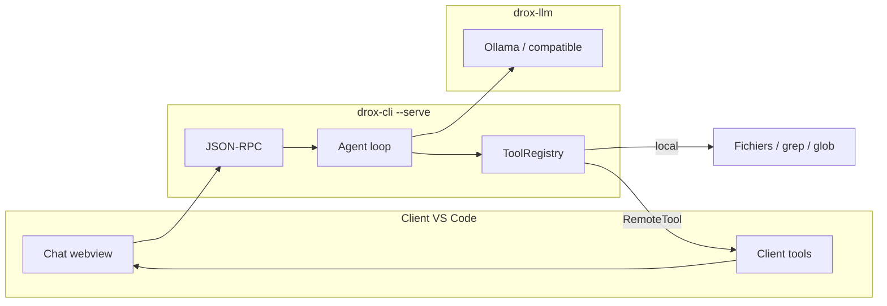

# Guide de référence — moteur Drox

**Date** : 2026-05-19  
**Statut** : document de synthèse (Phase 2 — moteur Rust + extension VS Code)  
**Public** : équipe, reprise sur fork VS Code, onboarding technique  

Ce document regroupe **toutes les mécaniques** du moteur agent Drox : architecture, protocole de phases, gates, catalogue d’outils, permissions, mémoire, JSON-RPC et intégration client. Il complète (sans les remplacer) :

| Document | Rôle |
|----------|------|
| [`PLAN-MOTEUR-RUST.md`](../plans/PLAN-MOTEUR-RUST.md) | Roadmap rewrite Rust |
| [`INVENTAIRE-NOYAU-MOTEUR.md`](../architecture/INVENTAIRE-NOYAU-MOTEUR.md) | Cartographie TS → Rust (historique) |
| [`PROTOCOLE-JSONRPC.md`](../architecture/PROTOCOLE-JSONRPC.md) | Contrat wire NDJSON |
| [`BACKLOG-SPRINTS-POST-PHASE2.md`](../suivi/BACKLOG-SPRINTS-POST-PHASE2.md) | Backlog fonctionnel |
| [`../../../DROX.md`](../../../DROX.md) | Onboarding fork (< 15 min) |
| [`PLAN-INTEGRATION.md`](../plans/PLAN-INTEGRATION.md) | Portage extension → workbench |
| [`README.md`](../README.md) | Index documentation centralisée |

---

## 1. Vue d’ensemble

Drox est un **moteur agent autonome** écrit en Rust (`drox/`), piloté par un **client UI** (extension VS Code `extension-vscode/`). Le modèle LLM (Ollama-first) tourne une boucle :

1. Construire le contexte (system prompt + historique + specs d’outils).
2. Appeler le LLM en streaming.
3. Parser texte + `tool_calls`.
4. Exécuter les outils (Rust et/ou client).
5. Réinjecter les `tool_result` et recommencer jusqu’à `[phase: done]` ou limite d’itérations.



**Important** : il n’existe **pas** d’outil nommé `analyze`. L’analyse de dépôt repose sur la **phase `analyzing`**, les outils read-only (`glob`, `grep`, `file_read`, `lsp`, `workspace_map_read`) et optionnellement `task` (sous-agent Explore).

---

## 2. Crates Rust (workspace `drox/`)

Dépendances **unidirectionnelles** :

```
drox-cli  →  drox-engine
              ├── drox-tools (+ drox-bash, drox-mcp, drox-permissions)
              ├── drox-llm
              ├── drox-context
              ├── drox-session
              └── drox-hooks

drox-types  ← consommé par toutes les crates
```

| Crate | Rôle |
|-------|------|
| `drox-types` | Messages, IDs, schémas serde, erreurs partagées |
| `drox-llm` | Client LLM, streaming, retry |
| `drox-tools` | Implémentations des tools + `ToolRegistry` |
| `drox-mcp` | Hub MCP (`rmcp`), découverte stubs `mcp__*` |
| `drox-bash` | Classification commandes shell (bash / PowerShell) |
| `drox-permissions` | Moteur allow / ask / deny + règles fichier |
| `drox-context` | Estimation tokens, snip, **microcompact** |
| `drox-session` | Transcripts JSONL, mémoire `.drox/memory/`, **workspace map**, **`.droxignore`** |
| `drox-hooks` | Hooks pre/post tool (commandes shell) |
| `drox-engine` | Boucle agent, phases, compaction, sous-agents |
| `drox-cli` | Binaire `drox`, CLI texte, serveur JSON-RPC |

**Build** : `cd drox && cargo build -p drox-cli` → `drox/target/debug/drox(.exe)`.

---

## 3. Boucle agent (`drox-engine::Agent`)

### 3.1 Configuration (`AgentConfig`)

Éléments notables (non exhaustif) :

| Champ | Effet |
|-------|--------|
| `system_prompt` | Prompt système (défaut : `CORE_SYSTEM_PROMPT` dans `drox-cli/src/prompts.rs`) |
| `max_iterations` | Plafond de tours modèle (défaut configurable JSON-RPC) |
| `max_parallel_tool_calls` | Parallélisation des tools « concurrency safe » (défaut 4) |
| `permissions` | `PermissionPolicy` + mode (`default`, `plan`, `acceptEdits`, …) |
| `memory` | Active compaction live + persistance mémoire |
| `transcript` | Sink JSONL pour reprise de session |
| `tool_hooks` | `ToolHooksConfig` (`.drox/hooks.json`) |
| `run_objective` | Objectif verrouillé (§2.25) injecté au prompt |

### 3.2 Événements (`AgentEvent`)

Émis vers le client via `agent/event` :

| `kind` | Description |
|--------|-------------|
| `phase_enter` | Entrée dans une phase (`[phase: …]` parsé) |
| `phase_close` | Fermeture bloc phase (ex. fin du canal `thinking` natif) |
| `text_delta` | Token(s) texte assistant |
| `tool_start` / `tool_finish` | Début / fin d’exécution outil |
| `stop` | Fin de run (`StopReason` + `usage`) |
| `context_snip` | Snip synchrone d’anciens `tool_result` |
| `context_compacted` | Compaction LLM live (préfixe historique → checkpoint system) |
| `memory_persisted` | Résumé écrit sous `.drox/memory/sessions/` |
| `run_objective` | Objectif verrouillé détecté côté client |
| `scope_parking_update` | Mise à jour parking `scope_defer` |

### 3.3 Fin de run : **done-driven**

- **Seul** le marqueur texte `[phase: done]` clôt la boucle (plus « pas d’outil = fin »).
- Sans `done`, le moteur injecte des **nudges** (`NUDGE_PROMPT`, `DONE_ONLY_NUDGE_PROMPT`, etc.) et relance.
- `[phase: answering]` est **obligatoire** avant `done` (sinon nudge « rédige pour l’utilisateur »).

### 3.4 Détection de boucle (`LoopDetector`)

- Empreinte par tour : hash(texte) + hash(tool_calls).
- 1re répétition stricte → nudge anti-boucle.
- 2e répétition → `EngineError::LoopDetected` (run avorté).
- Les nudges structurels (`unfinished_todos`, etc.) **reset** le compteur.

### 3.5 Parallélisation (`tool_orchestration`)

- Les tools avec `is_concurrency_safe() == true` (par défaut = `is_read_only`) peuvent s’exécuter en parallèle dans un même tour, jusqu’à `max_parallel_tool_calls`.
- `task` est read-only mais **non** concurrency-safe (sous-agent lourd).

### 3.6 Raisonnement natif Ollama

- Canal `thinking` séparé → événement `Phase::InternalReasoning` (pas un marqueur `[phase: reasoning]`).
- Les marqueurs `[phase: reasoning]` et `[phase: next-move]` sont **ignorés** (compatibilité anciens prompts).

---

## 4. Protocole de phases

### 4.1 Liste des phases (`drox-engine::event::Phase`)

| Phase | Marqueur(s) acceptés | Usage |
|-------|----------------------|--------|
| `internal_reasoning` | *(moteur uniquement)* | Flux `thinking` Ollama |
| `analyzing` | `analyzing`, `analysis`, `survey` | Cartographie **large** du dépôt (read-only) |
| `reading` | `reading`, `read` | Lecture **ciblée** (fichier / module connu) |
| `clarifying` | `clarifying`, `clarify`, `clarification` | Doute bloquant → `ask_user_question` |
| `planning` | `planning`, `plan` | Plan narratif ; liste exécutable = `todo_write` |
| `acting` | `acting`, `act`, `action` | Mutations + `bash` |
| `testing` | `testing`, `test`, `tests` | Vérification **après** mutation de code |
| `verifying` | `verifying`, `verify`, `verification` | Contrôle léger hors build/test post-mutation |
| `answering` | `answering`, `answer`, `respond`, `reply`, `response` | **Seule** phase rendue en clair dans la bulle utilisateur |
| `done` | `done`, `finish`, `finished`, `complete`, `completed` | **Signal d’arrêt** unique |

**Règle d’or** : phases internes = notes télégraphiques ; la réponse utilisateur = **`answering` uniquement**.

### 4.2 Inférence automatique de phase

Si le modèle appelle un outil **sans** marqueur explicite, le moteur infère :

| Outils du tour | Phase inférée (défaut) |
|----------------|-------------------------|
| `glob`, `grep`, `file_read`, `lsp`, `web_*`, `memory_*`, `workspace_map_*` | `reading`, ou `analyzing` si phase active = analyzing |
| `file_edit`, `file_write`, `notebook_edit`, `delete_path`, `bash`, `copy_path` | `acting` |
| Marqueur `[phase: testing]` vu | `testing` |

### 4.3 Playbook `analyzing` (résumé)

1. `workspace_map_read` si carte **fresh**
2. Sinon `glob *` puis `glob` ciblé (pivots `src/`, `crates/*`, `package.json`, …)
3. Si `directory_fanout_caps` / `truncated` → affiner le motif, ne pas relister tout
4. `grep` + `file_read` avec `start_line` / `end_line`
5. `lsp` pour points d’entrée
6. Sortie vers `planning` / `todo_write` — **aucune mutation**

**Nudge** : si le message utilisateur ressemble à une demande d’analyse et que ≥2 outils d’exploration sont appelés sans marqueur `analyzing`, un rappel unique est injecté.

### 4.4 Chaînes typiques

| Scénario | Enchaînement indicatif |
|----------|------------------------|
| Conversation triviale | `answering` → `done` |
| Analyse de dépôt | `analyzing` → `todo_write` → `reading` → … → `answering` → `done` |
| Tâche ciblée | `reading` → `acting` → … |
| Modification code | `reading` → `todo_write` → micro-cycle édition → **`testing`** → `answering` → `done` |

---

## 5. Gates moteur (contraintes automatiques)

Le prompt (`CORE_SYSTEM_PROMPT`) et le code (`drox-engine/src/agent/`, voir `gates.rs` / `loop.rs`) appliquent :

| Gate | Condition | Action |
|------|-----------|--------|
| **Done obligatoire** | Pas de `[phase: done]` | Relance avec nudge |
| **Answering avant done** | `done` sans `answering` préalable | Nudge `DONE_ONLY` |
| **Todo avant mutateurs** | `file_edit` / `file_write` / `notebook_edit` / `delete_path` / `bash` sans `todo_write` réussi | Blocage `MUTATING_TOOL_BEFORE_TODO_WRITE_BLOCKED` |
| **Read-only avant todo** | `glob`, `grep`, `file_read`, … | **Autorisés** sans todo (exploration libre) |
| **Todo non clôturée** | Items `pending` / `in_progress` à la clôture | Nudge `unfinished_todos` |
| **Testing après code** | Mutation code sans phase/outil testing | Refus `done` + nudge (sauf `plan_mode`, mode professeur, ou fichiers `.md`/images seuls) |
| **Rappel todo intermédiaire** | >2 mutateurs sans `todo_write` entre eux | Nudge mise à jour plan |
| **Boucle stricte** | 2 tours identiques | Warn puis abort |
| **Plan mode** | `plan_mode: true` | Tous les writes → erreur |
| **Professor** | Mode professeur | `todo_write` masqué au LLM ; `course_plan_write` à la place ; gate testing désactivée |

**Extensions sans gate testing** : `.md`, `.txt`, images, etc. (liste `CODE_MUTATION_TESTING_EXEMPT_EXTENSIONS` dans `agent/gates.rs`).

---

## 6. Catalogue des outils

### 6.1 Légende

| Colonne | Signification |
|---------|----------------|
| **Exec** | `rust` = moteur ; `client` = extension via `tool/exec` ; `hybride` = stub Rust + exécution client si déclaré |
| **RO** | Read-only (hint permissions + concurrency par défaut) |
| **LLM** | Visible dans les `ToolSpec` envoyés au modèle |

### 6.2 Outils fichiers & recherche

#### `glob`

| | |
|---|---|
| **Exec** | rust |
| **RO** | oui |
| **Rôle** | Liste fichiers et/ou dossiers selon motif glob |
| **Entrée** | `{ "pattern": "**/*.rs" }` (relatif workspace) |
| **Sortie** | `files[]`, `directories[]`, `truncated`, `directory_fanout_caps[]` |
| **Limites** | 10 000 entrées max ; 20 enfants max par dossier parent (sinon affiner le chemin) |
| **Filtres** | `.gitignore`, `.droxignore` |

#### `grep`

| | |
|---|---|
| **Exec** | rust |
| **RO** | oui |
| **Entrée** | `pattern` (regex Rust), `path?`, `glob?` (ex. `**/*.ts`) |
| **Limites** | 300 matches ; fichiers > 512 KiB ignorés |
| **Filtres** | `.gitignore`, `.droxignore` |

#### `file_read`

| | |
|---|---|
| **Exec** | rust |
| **RO** | oui |
| **Entrée** | `path`, `start_line?`, `end_line?` (1-based inclusif) |
| **Limites** | Fichier entier ≤ 512 KiB ; plage ≤ 400 lignes, sortie ~128 KiB |
| **Filtres** | `.droxignore` → refus explicite |

#### `lsp`

| | |
|---|---|
| **Exec** | **hybride** (souvent `RemoteTool` → client VS Code) |
| **RO** | oui |
| **Entrée** | `path`, `line`, `character`, `operation` (`definition`, `references`, `hover`, `diagnostics`, …) |
| **Note** | Sans client LSP, erreur explicite côté stub |

### 6.3 Outils d’édition

#### `file_edit`

| | |
|---|---|
| **Exec** | **hybride** (diff + confirmation UI si `applyEdits: false`) |
| **Entrée** | `path`, `old_string`, `new_string` (remplacement unique) |
| **Permissions** | Règles `file_edit` / chemins (`.drox/settings*.json`) |

#### `file_write`

| | |
|---|---|
| **Exec** | **hybride** |
| **Entrée** | `path`, `content` |
| **Note** | Préférer à `bash` + redirection pour l’UI diff |

#### `notebook_edit`

| | |
|---|---|
| **Exec** | **hybride** |
| **Entrée** | `target_notebook`, `cell_idx`, `is_new_cell`, `cell_language`, `old_string`, `new_string` |
| **Rôle** | Édition cellules `.ipynb` |

#### `delete_path`

| | |
|---|---|
| **Exec** | rust (peut être désactivé côté settings extension) |
| **Entrée** | `path` (fichier ou dossier récursif) |
| **Note** | Préférer à `bash rm` (Windows / quoting) |

#### `copy_path`

| | |
|---|---|
| **Exec** | rust |
| **Entrée** | `source`, `destination` |
| **Permissions** | Traitées comme `file_edit` |

### 6.4 Exécution

#### `bash`

| | |
|---|---|
| **Exec** | **hybride** (`child_process` côté VS Code) |
| **Entrée** | `command`, `description?`, `block_until_ms?` |
| **Classification** | `drox-bash` parse et classe (lecture seule vs mutation) |
| **Permissions** | Règles `Bash(pattern)` ; plan mode = deny writes |
| **Interdit** | Modifier/supprimer fichiers projet (utiliser `file_*` / `delete_path`) |

### 6.5 Web

#### `web_search`

| | |
|---|---|
| **Exec** | rust |
| **RO** | oui |
| **Rôle** | Recherche web (provider configuré côté moteur) |

#### `web_fetch`

| | |
|---|---|
| **Exec** | rust |
| **RO** | oui |
| **Entrée** | `url` |
| **Rôle** | Récupère contenu URL (markdown / texte) |

### 6.6 Plan & interaction

#### `todo_write`

| | |
|---|---|
| **Exec** | rust |
| **LLM** | **toujours actif** (non désactivable dans VS Code) |
| **Entrée** | `{ "todos": [{ "id", "content", "status": "pending\|in_progress\|completed\|cancelled" }] }` |
| **Mode** | Replace complet de la liste à chaque appel |
| **Masqué** | En mode **professor** (remplacé par `course_plan_write`) |

#### `course_plan_write`

| | |
|---|---|
| **Exec** | rust |
| **LLM** | Uniquement en mode **professor** |
| **Rôle** | Plan pédagogique (exercices, checkpoints, `workArea`) |

#### `exit_plan_mode`

| | |
|---|---|
| **Exec** | rust |
| **Entrée** | `{ "plan": "…" }` |
| **Rôle** | Présente le plan à l’humain via `UserAsker` ; client désactive `plan_mode` si accepté |

#### `ask_user_question`

| | |
|---|---|
| **Exec** | rust |
| **LLM** | **toujours actif** |
| **Entrée** | `title?`, `questions[]` (`id`, `prompt`, `options[]`, `allowMultiple`, `allowFreeText`) |
| **Wire** | Requête JSON-RPC `user/ask` (bloquant jusqu’à réponse) |
| **Prérequis** | `clientCapabilities.interactiveAsk: true` |

### 6.7 Carte workspace (§2.23)

#### `workspace_map_read`

| | |
|---|---|
| **Exec** | rust |
| **RO** | oui |
| **Entrée** | `path_prefix?` |
| **Source** | `<workspace>/.drox/workspace-map.json` |
| **Sortie** | `version`, `stale`, `nodes[]` |

#### `workspace_map_note`

| | |
|---|---|
| **Exec** | rust |
| **Rôle** | Ajoute/ met à jour un nœud (zone, rôle, pivot) dans la carte persistante |
| **Alimentation auto** | Ingestion depuis `glob`, `file_read`, `lsp` pendant le run |

### 6.8 Mémoire & session

#### `session_note`

| | |
|---|---|
| **Exec** | rust |
| **Entrée** | `content` (≤ 500 car.) |
| **Rôle** | Note épinglée intégrée au résumé de compaction |

#### `memory_read`

| | |
|---|---|
| **Exec** | rust |
| **RO** | oui |
| **Entrée** | `slug` |
| **Source** | `.drox/memory/sessions/*.md` |

#### `memory_list`

| | |
|---|---|
| **Exec** | rust |
| **RO** | oui |
| **Entrée** | `limit?` |

#### `session_compact`

| | |
|---|---|
| **Exec** | **client** |
| **Entrée** | `reason?` |
| **Rôle** | Compaction LLM du transcript JSONL (`session.compact` / `/compact`) |

#### `session_search`

| | |
|---|---|
| **Exec** | **client** |
| **Entrée** | `query`, `limit?` |
| **Rôle** | Recherche dans la mémoire longue indexée (segments compaction + fins de session) |

#### `session_end`

| | |
|---|---|
| **Exec** | **client** |
| **LLM** | **masqué** (réservé commande utilisateur `/session_end`) |
| **Rôle** | Clôture fil + archivage côté IDE |

### 6.9 Skills locaux (§2.31)

#### `skill_list` / `skill_read`

| | |
|---|---|
| **Exec** | rust |
| **Source** | `.drox/skills/<name>/SKILL.md` |
| **Note** | Skills avec `disable-model-invocation: true` = réservés slash utilisateur |

### 6.10 Git worktrees

#### `git_worktree_enter`

| | |
|---|---|
| **Entrée** | `name?` |
| **Effet** | Crée/reprend `.drox/worktrees/<name>/` ; bascule `ToolContext` workspace |

#### `git_worktree_exit`

| | |
|---|---|
| **Entrée** | `action`: `keep` \| `remove`, `discard_changes?` |
| **Persistance** | `.drox/worktree-session.json` |

### 6.11 Fidélité objectif (§2.25)

#### `scope_defer`

| | |
|---|---|
| **Exec** | rust |
| **Entrée** | `finding`, `reason` |
| **Rôle** | Parking hors scope ; événement `scope_parking_update` |
| **Limites** | 400 / 240 caractères |

### 6.12 Sous-agents (§2.10) — **désactivés par défaut**

#### `task`

| | |
|---|---|
| **Exec** | rust (spawn sous-agent interne) |
| **Activation** | `drox.subagents.enabled=true` + `subagentsEnabled` JSON-RPC |
| **Entrée** | `description`, `subagent_type` (`explore` seul en V1), `thoroughness?` (`quick` \| `medium` \| `very thorough`) |
| **Registre Explore** | `glob`, `grep`, `file_read`, `lsp`, `web_fetch`, `web_search`, `workspace_map_read` |
| **Plafonds** | `maxIterations` (déf. 15), `maxConcurrent` (déf. 1) |
| **Sortie** | `{ "subagent_type", "report" }` |

### 6.13 MCP (§2.28)

Config : `.mcp.json` ou `mcp.json` à la racine workspace.

| Outil | Rôle |
|-------|------|
| `mcp__<server>__<tool>` | Stubs dynamiques (un par tool MCP distant) |
| `list_mcp_resources` | Liste ressources MCP |
| `read_mcp_resource` | Lit une ressource |
| `mcp_call` | Fallback si **aucun** stub découvert |

**Settings VS Code** : `drox.tools.mcp.enabled` (défaut true).

Quand des stubs `mcp__*` existent, `mcp_call` est **masqué** au LLM.

### 6.14 Outils absents du registre par défaut

| Nom | Note |
|-----|------|
| `phase`, `set_phase`, … | **N’existent pas** — uniquement marqueurs texte `[phase: …]` |
| `analyze` | **N’existe pas** — utiliser phase `analyzing` |

---

## 7. Exécution hybride moteur / client

### 7.1 `RemoteTool`

Quand le client déclare `clientCapabilities.executableTools` à `initialize`, le serveur **enveloppe** les tools locaux correspondants :

| Tool typique | Côté exécution réelle |
|--------------|------------------------|
| `file_write`, `file_edit`, `notebook_edit` | VS Code (diff, modales) |
| `bash` | VS Code (terminal / sortie « Drox (bash) ») |
| `lsp` | VS Code (Language Server du workspace) |
| `session_compact`, `session_end`, `session_search` | VS Code (transcript + mémoire longue) |

Flux : moteur reçoit `tool_call` → `tool/exec` JSON-RPC vers client → `tool_result` renvoyé.

### 7.2 Paramètres `agent.run` (extraits)

| Paramètre | Effet |
|-----------|--------|
| `workspace` | Racine résolution chemins |
| `applyEdits` | `false` = proposition seule côté client |
| `mode` | `PermissionMode` |
| `allow` / `ask` / `deny` | Règles ponctuelles |
| `planMode` | Lecture seule forcée |
| `subagentsEnabled` | Enregistre `task` |
| `noSettings` | Ignore fichiers settings |

### 7.3 Désactivation d’outils (extension §2.17)

Setting `drox.tools.disabled` : liste d’outils **retirés des ToolSpec** (le modèle ne les voit plus).

**Toujours actifs** : `ask_user_question`, `todo_write`.

Groupes documentés dans `extension-vscode/src/toolSettings.ts` (`DROX_TOOL_GROUPS`).

---

## 8. Permissions (`drox-permissions`)

### 8.1 Modes (`PermissionMode`)

| Mode | Écritures fichier | Bash / autre |
|------|-------------------|--------------|
| `default` | allow / ask / deny selon règles | idem |
| `plan` | **bloquées** | lecture OK |
| `acceptEdits` | auto-allow fichiers workspace | ask sauf règle allow |
| `bypassPermissions` | auto-allow (yolo) | sauf deny explicite |
| `professor` | via gates pédagogiques | idem |

### 8.2 Sources de règles (ordre de fusion)

1. Flags CLI / JSON-RPC (`allow`, `ask`, `deny`)
2. `<workspace>/.drox/settings.json`
3. `<workspace>/.drox/settings.local.json`
4. `~/.drox/settings.json`

Syntaxe inspirée du leak : `Bash(npm:*)`, `file_edit`, chemins avec globs (`path_matcher`).

Pipeline : **Deny > Ask > Allow**, modulé par le mode.

### 8.3 Cibles spéciales

- `PermissionTarget::tool(name)` + contenu (ex. commande bash)
- Règles fichier pour `file_read`, `file_edit`, `copy_path`, etc.
- Détection règles **shadowed** (`detect_unreachable_rules`)

---

## 9. Hooks outils (`drox-hooks`)

Fichiers :

- `<workspace>/.drox/hooks.json`
- `~/.drox/hooks.json` (fusionné)

Événements : `PreToolUse`, `PostToolUse`  
Matchers : nom d’outil (ex. `bash`)  
Sémantique exit code :

| Code | Effet |
|------|--------|
| `0` | OK |
| `2` | **Bloquant** (stderr renvoyé au modèle) |
| autre | Avertissement utilisateur |

---

## 10. Gestion du contexte long

### 10.1 Snip (`ContextPolicy`)

Réécrit les anciens `tool_result` volumineux **sans** appel LLM. Événement `context_snip`.

### 10.2 Microcompact (`drox-context::microcompact`)

Remplace le contenu des anciens `tool_result` par `[Old tool result content cleared]`.  
Outils concernés : `file_read`, `bash`, `grep`, `glob`, `web_*`, `file_edit`, `file_write`, `notebook_edit`, `lsp`.  
Garde les **3** derniers résultats compactables intacts (défaut).

### 10.3 Compaction LLM (`drox-engine::compaction`)

| Usage | Déclencheur | Destination |
|-------|-------------|-------------|
| **Persist** | `[phase: done]` + run non trivial | `.drox/memory/sessions/YYYY-MM-DD-HHMMSS-<slug>.md` |
| **Live** | Budget contexte dépassé en cours de run | Message `system` checkpoint dans l’historique |

Prompt dédié : `COMPACTION_PROMPT` (anglais, sections H2 fixes pour parsing `objective` / `files_touched`).

Archivage aussi déclenché quand la todo passe **entièrement** au vert (jalon intermédiaire).

---

## 11. Artefacts `.drox/` (workspace)

| Chemin | Rôle |
|--------|------|
| `.drox/workspace-map.json` | Carte structure (zones, pivots, `stale`) |
| `.drox/memory/sessions/*.md` | Archives résumées de runs |
| `.drox/skills/<name>/SKILL.md` | Skills locaux |
| `.drox/hooks.json` | Hooks pre/post tool |
| `.drox/settings.json` | Permissions projet |
| `.drox/settings.local.json` | Overrides locaux (gitignored conseillé) |
| `.drox/.env` / `drox/.drox/env` | Config LLM (voir `env.example`) |
| `.drox/worktrees/<name>/` | Worktrees isolés |
| `.drox/worktree-session.json` | Session worktree active |
| `.drox/learn/` | Brouillons mode professeur |
| `.drox/attachments/` | Pièces jointes UI (gitignored) |
| `.droxignore` (racine workspace) | Exclusions type gitignore (`node_modules/`, secrets, …) |

**Transcripts** (historique JSONL chat) : par défaut `~/.drox/sessions/` (configurable `sessionDir`).

---

## 12. JSON-RPC (`drox --serve`)

Transport : **NDJSON** stdin/stdout ; logs sur **stderr**.

### Méthodes client → serveur

| Méthode | Rôle |
|---------|------|
| `initialize` | Handshake + capabilities |
| `agent.run` | Démarre un run → `runId` + stream |
| `agent.cancel` | Annule un run |
| `session.list` | Liste transcripts |
| `session.read` | Lit messages d’une session |
| `session.compact` | Compaction transcript (souvent aussi via tool client) |
| `shutdown` | Arrêt propre |

### Requêtes serveur → client

| Méthode | Rôle |
|---------|------|
| `tool/exec` | Exécute un tool délégué |
| `user/ask` | Questions interactives |

### Notifications

| Méthode | Rôle |
|---------|------|
| `agent/event` | Stream `AgentEvent` |
| `agent/done` | Fin de run (`completed` \| `cancelled` \| `error`) |

Détail complet : [`PROTOCOLE-JSONRPC.md`](../architecture/PROTOCOLE-JSONRPC.md).

---

## 13. Extension VS Code

### 13.1 Lancement debug

1. Ouvrir `extension-vscode/`
2. F5 → Extension Development Host
3. Ouvrir le **repo racine** (pour `drox/target/debug/drox.exe`)
4. Commande **« Drox: Ouvrir le chat »**

### 13.2 Réglages principaux (`package.json`)

| Setting | Rôle |
|---------|------|
| `drox.executablePath` | Chemin binaire `drox` |
| `drox.server` / `drox.model` / clés API | LLM (surcharge `.env`) |
| `drox.tools.disabled` | Outils masqués au modèle |
| `drox.tools.mcp.enabled` | Tools MCP dynamiques |
| `drox.subagents.enabled` | Tool `task` |
| `drox.subagents.maxIterations` | Plafond sous-agent |
| `drox.subagents.maxConcurrent` | Parallélisme sous-agents |
| `drox.nativeThinking` | Canal `thinking` Ollama |

### 13.3 UI chat

- Phases → blocs repliables (`PHASE_META` dans `chat.js`)
- Tools → `▸ tool: nom (id)` / `◂ résultat`
- `answering` → bulle principale Markdown
- Sorties : **Drox (moteur)** stderr, **Drox (bash)** commandes

---

## 14. CLI texte (`drox` sans `--serve`)

Flags notables (`drox-cli/src/main.rs`) :

| Flag | Rôle |
|------|------|
| `--serve` | Mode serveur JSON-RPC |
| `--workspace` | Racine |
| `--plan` | Plan mode |
| `--allow` / `--ask` / `--deny` | Permissions |
| `--no-settings` | Ignore settings fichiers |
| `--list-sessions` | Liste transcripts |

Auto-charge : `<workspace>/.drox/env`, `~/.drox/env`, settings JSON.

---

## 15. Variables d’environnement LLM

Voir `DROX-ENV-SETUP.txt` et `drox/.drox/env.example` :

| Variable | Rôle |
|----------|------|
| `DROX_SERVER` / `OLLAMA_HOST` | URL API |
| `DROX_MODEL` / `OLLAMA_MODEL` | Modèle |
| `DROX_API_KEY` / `OLLAMA_API_KEY` | Auth |
| `DROX_OLLAMA_EXTRA_HEADERS_JSON` | Headers HTTP custom |

Priorité : **flags CLI > env shell > `.drox/env` > `~/.drox/env`**.

---

## 16. Index rapide des fichiers sources

| Sujet | Fichier principal |
|-------|-------------------|
| Boucle agent | `drox/crates/drox-engine/src/agent/` (`mod.rs`, `loop.rs`, `agent_stream.rs`, …) |
| Run profile | `drox/crates/drox-engine/src/run_profile/` |
| Phases / événements | `drox/crates/drox-engine/src/event.rs` |
| Registre tools | `drox/crates/drox-tools/src/registry.rs` |
| Prompt système | `drox/crates/drox-cli/src/prompts.rs` + `system_prompt/assemble.rs` |
| JSON-RPC handlers | `drox/crates/drox-cli/src/jsonrpc/handlers/` + `system_prompt/` |
| Remote tools | `drox/crates/drox-cli/src/jsonrpc/remote_tool.rs` |
| Sous-agents | `drox/crates/drox-engine/src/subagent.rs` |
| Compaction | `drox/crates/drox-engine/src/compaction.rs` |
| Workspace map | `drox/crates/drox-session/src/workspace_map.rs` |
| `.droxignore` | `drox/crates/drox-session/src/drox_ignore.rs` |
| Client tools VS Code | `extension-vscode/src/chatView.ts`, `clientTools.ts` |
| Catalogue settings outils | `extension-vscode/src/toolSettings.ts` |

---

## 17. Glossaire

| Terme | Définition |
|-------|------------|
| **Phase** | Étape protocolaire `[phase: nom]` (texte), pas un tool |
| **Gate** | Contrainte moteur (todo, testing, done, …) |
| **Nudge** | Message `system` injecté pour corriger le modèle |
| **ToolSpec** | Schéma JSON envoyé au LLM pour un tool |
| **RemoteTool** | Wrapper qui délègue l’exécution au client |
| **Fresh map** | `workspace-map.json` non marqué `stale` |
| **Done-driven** | Fin de run uniquement sur `[phase: done]` |

---

## 18. Intégration fork KDDS Nexus (workbench natif)

**Date** : 2026-05-19 · **Sprint** : I-40  
**Public** : développeurs du fork `Nexus-IDE---VsCode` — **pas** les utilisateurs de l’extension marketplace seule.

### 18.1 Décision produit

| Sujet | Choix |
|-------|--------|
| UI | `src/vs/workbench/contrib/drox/` (ViewPane + webview), **pas** `extension-vscode/` en prod |
| Processus | `drox --serve` spawné depuis le **main** Electron (`droxRpcClientMain`) |
| Contrat | JSON-RPC NDJSON inchangé — voir [PROTOCOLE-JSONRPC.md](../architecture/PROTOCOLE-JSONRPC.md) |
| Config IDE | Préfixe **`nexus.drox.*`** (+ `.drox/env` lu par le moteur) |
| Extension `extension-vscode/` | **Référence** pour parité ; ne pas modifier sauf doc/scripts |

Onboarding pas à pas : **[`DROX.md`](../../../DROX.md)** à la racine du fork. Plan de sprints : **[`PLAN-INTEGRATION.md`](../plans/PLAN-INTEGRATION.md)**.

### 18.2 Arborescence contrib (fork)

```
src/vs/workbench/contrib/drox/
  browser/           # ViewPane, webview, actions, diagnostic → chat
  browser/chat/      # Onglets, send/run, router webview, fichiers, agent host (post-REFACTO)
  electron-browser/  # Engine, client tools, permissions, sessions
  electron-main/     # Spawn drox, JSON-RPC
  common/            # Config, executable, protocole partagé
  common/chat/       # Types chat (runProfile, sticky, explore…) + réexports
  test/common/       # Tests unitaires (npm run test-drox)
```

| Fichier / service | Rôle |
|-------------------|------|
| `droxChatViewPane.ts` | Panneau chat |
| `droxChatController.ts` | Façade orchestration (délègue à `browser/chat/*`) |
| `browser/chat/droxChatTabsManager.ts` | Onglets, layout, replay session |
| `browser/chat/droxChatSendRun.ts` | `agent.run` / cancel depuis le composer |
| `common/chat/droxRunProfile.ts` | `DroxRunProfileId` → JSON-RPC `modelTier` |
| Composer webview | Vignettes **Fast** / **Standard** + `nexus.drox.modelTier` (M3) |
| `droxEngineService.ts` | Lifecycle moteur + `agent.run` |
| `droxClientToolsService.ts` | `tool/exec` (file_*, bash, lsp, …) |
| `droxExecutable.ts` | Résolution binaire (dev + `resources/drox/<platform>/`) |
| `droxConfiguration.ts` | Registre `nexus.drox.*` |

Commandes palette : `workbench.action.openDroxChat`, `workbench.action.openDroxSettings`.

### 18.3 Parcours dev & release

| Étape | Commande / chemin |
|-------|-------------------|
| Build moteur | `cd drox-engine/drox && cargo build -p drox-cli` |
| IDE dev | `npm run watch` + `scripts/code.bat` (ou `.sh`) |
| Tests fork | `npm run test-drox` |
| Warm start | `nexus.drox.warmStart` — `droxEngineWarmStartContribution` (idle post-restore) |
| Binaire release | `npm run package-drox` → `resources/drox/win32-x64/` etc. |
| Package installateur | gulp `vscode-*` (inclut `resources/drox/**`) |

### 18.4 Cartographie extension → fork

La table complète est dans **`PLAN-INTEGRATION.md` §4**. Exemples :

| Extension (réf.) | Fork |
|------------------|------|
| `executablePath.ts` | `common/droxExecutable.ts` |
| `chatView.ts` | `browser/droxChatController.ts` + `browser/chat/*` + `media/droxChat/*.js` |
| `clientTools.ts` | `electron-browser/droxClientToolsService.ts` |
| `toolSettings.ts` | `common/droxToolGroups.ts` + settings |

### 18.5 Extension VS Code (référence uniquement)

Pour comparer un comportement ou tester le moteur **sans** compiler tout le fork :

1. Ouvrir `drox-engine/extension-vscode/` seul.
2. F5 → Extension Development Host.
3. Ouvrir le **repo racine** dans l’host pour `drox/target/debug/`.

Voir [extension-vscode/README.md](./extension-vscode/README.md). En production Nexus, utiliser le panneau **Drox** natif.

---

*Ce guide est maintenu manuellement ; en cas d’écart avec le code, le dépôt Rust fait foi.*
