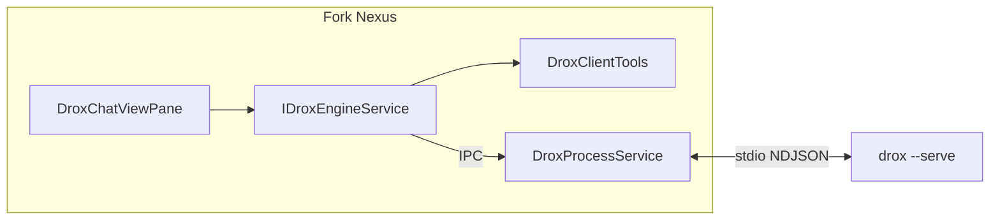

# Plan d'intégration — Moteur Drox dans le fork Nexus (VS Code)

**Date** : 2026-05-19  
**Statut** : plan de travail actif — **Phase A ✅** · **Phase B ✅** · **I-26–I-30 ✅** · prochaine **Phase D** ou polish  
**Objectif** : intégration **native workbench** (`src/vs/workbench/contrib/drox/`), **complète** (parité fonctionnelle avec `extension-vscode/`) et **performante** (processus moteur isolé, lifecycle robuste, UI réactive).

**Documents liés** :

| Document | Rôle |
|----------|------|
| [GUIDE-MOTEUR-DROX.md](../guides/GUIDE-MOTEUR-DROX.md) | Mécaniques moteur, tools, phases, JSON-RPC (§18 = fork) |
| [../../../DROX.md](../../../DROX.md) | Onboarding dev fork (< 15 min) |
| [../README.md](../README.md) | Index documentation centralisée |
| [../architecture/PROTOCOLE-JSONRPC.md](../architecture/PROTOCOLE-JSONRPC.md) | Contrat wire |
| [../suivi/BACKLOG-SPRINTS-POST-PHASE2.md](../suivi/BACKLOG-SPRINTS-POST-PHASE2.md) | Fonctionnalités déjà livrées côté moteur + extension |
| [PLAN-MOTEUR-RUST.md](./PLAN-MOTEUR-RUST.md) | Historique Phase 1–2 Rust |

---

## 1. Décisions d'architecture (figées pour ce plan)

| Sujet | Décision |
|-------|----------|
| **Cible** | Contrib workbench native — **pas** extension marketplace séparée |
| **Contrat moteur** | JSON-RPC NDJSON sur `drox --serve` — **inchangé** |
| **Chat UI** | Webview / ViewPane dédiée (phases, tools, answering) — **pas** branchement direct dans le chat Copilot |
| **Exécution tools** | Hybride : Rust local + `tool/exec` IDE pour write/bash/lsp/session client |
| **Processus** | **Main process** ou **utility process** Electron (spawn hors renderer) ; **un** moteur par fenêtre workbench |
| **Binaire** | Dev : `drox-engine/drox/target/debug/drox` ; Release : `resources/drox/<platform>/drox` |
| **Config** | Préfixe `nexus.drox.*` (ou `drox.*` aligné produit) + chargement `.drox/env` côté moteur |
| **Cohabitation** | Copilot / chat natif **conservés** ; Drox = panneau agent local Ollama |
| **Copyright** | Voir §1.1 — en-tête MIT Microsoft obligatoire sous `src/vs/` (hygiene) + mention **KDDS** sur le code Drox |

### 1.1 Conventions de copyright (KDDS)

| Emplacement | En-tête à utiliser |
|-------------|-------------------|
| `src/vs/workbench/contrib/drox/**` (nouveaux `.ts`) | Bloc standard Microsoft (requis par `build/hygiene.ts`) **puis** une ligne : `// Copyright (c) 2026 KDDS. Drox integration for KDDS Nexus.` |
| `drox-engine/**` (Rust, docs, extension de référence) | `Copyright (c) 2026 KDDS` (ou en-tête du crate si déjà défini) — pas d’obligation d’en-tête Microsoft |
| Fichiers **existants** Microsoft modifiés ponctuellement | Conserver l’en-tête d’origine ; pas de re-branding massif |

Les fichiers Drox sous `src/vs/` restent sous **MIT** (comme le reste du fork) ; la ligne KDDS indique la **paternité des ajouts**, pas une licence différente.



---

## 2. Tableau maître des sprints d'intégration

Légende **Priorité** : P0 bloquant MVP · P1 parité utilisateur · P2 confort · P3 polish / perf avancée.

Légende **Statut** : ✅ livré (critère d'acceptation atteint ou équivalent MVP) · 🟡 partiel · ⬜ à faire · — reporté.

| ID | Statut | Sprint | Priorité | Dépend de | Livrable principal | Parité extension | Critère d'acceptation (résumé) |
|----|--------|--------|----------|-----------|-------------------|------------------|-------------------------------|
| **I-01** | ✅ | Fondations build & chemins binaire | P0 | — | Task `cargo build -p drox-cli`, résolution exe, doc dev | `executablePath.ts` | ✅ Task `.vscode/tasks.json` ; `IDroxExecutableService` + probes `drox-engine/drox/target/` |
| **I-02** | ✅ | CI Rust alignée | P0 | I-01 | `.github/workflows/drox-rust.yml` sur `drox-engine/drox` | — | ✅ `fmt` / `clippy` / `test` verts sur 3 OS |
| **I-03** | ✅ | Coquille contrib + configuration | P0 | I-01 | `contrib/drox/`, `workbench.common.main.ts`, schéma settings | `package.json` contributes | ✅ Activity bar « Drox », vue Chat, `nexus.drox.executablePath` |
| **I-04** | ✅ | Service processus (spawn isolé) | P0 | I-03 | `DroxEngineMainService` + canal IPC `droxEngine` | `droxRpcClient` spawn | ✅ Spawn main ; stderr → Output « Drox (moteur) » |
| **I-05** | ✅ | Client JSON-RPC workbench | P0 | I-04 | `DroxRpcClientMain` + `DroxEngineService` | `droxRpcClient.ts` | ✅ NDJSON, pending, `initialize` / `shutdown` |
| **I-06** | ✅ | Lifecycle moteur par fenêtre | P0 | I-05 | 1 instance / `windowId` ; `onWillShutdown` ; `cwd` workspace | `chatView` ctor | ✅ Dispose à la fermeture ; warm start I-37 |
| **I-07** | ✅ | ViewPane + webview shell | P0 | I-03 | Container activité, vue chat, CSP, assets | `extension.ts`, media | ✅ Commande « Ouvrir Drox » ; webview MVP (`droxChatMvp.*`) — port complet `chat.js` plus tard |
| **I-08** | ✅ | Pont événements RPC → webview | P0 | I-05, I-07 | `agent/event`, `agent/done` → `postMessage` | `chatView` handlers | ✅ Stream `text_delta` ; `agent/done` → fin de run |
| **I-09** | ✅ | Composer : envoi + `agent.run` | P0 | I-08 | Prompt, workspace, params LLM de base | `handleSend` | ✅ Message user + réponse assistant ; `agent.cancel` |
| **I-10** | ✅ | UI phases (style Cursor) | P0 | I-08 | `phase_enter`, `PHASE_META`, blocs repliables | `chat.js` phases | ✅ Blocs phase repliables ; `answering` / `done` → bulle assistant (MVP, sans markdown) |
| **I-11** | ✅ | UI tools (start / finish) | P0 | I-08 | Blocs `▸ tool` / `◂ résultat` | `chat.js`, `toolEventPreview` | ✅ Tool calls visibles ; aperçu JSON tronqué |
| **I-12** | ✅ | Framework `tool/exec` | P0 | I-05, I-09 | `DroxClientToolRegistry`, registration `initialize` | `clientTools.ts` | ✅ `tool/exec` ; outils déclarés à `initialize` |
| **I-13** | ✅ | Tools IDE : `file_write`, `file_edit` | P0 | I-12 | Diff, modal Apply/Abandon, `IFileService` | `tools/fileWrite.ts`, `fileEdit.ts` | ✅ `file_write` + `file_edit` ; diff + confirm via `nexus.drox.confirmFileWrites` |
| **I-14** | ✅ | Tool IDE : `notebook_edit` | P1 | I-12 | `droxNotebookEdit.ts` + `droxNotebookEditTool.ts` | `tools/notebookEdit.ts` | Cellules `.ipynb` replace/insert/delete + diff + confirm |
| **I-15** | ✅ | Tool IDE : `bash` | P0 | I-12 | Terminal + canal Output | `tools/bash.ts` | ✅ Commande exécutée ; sortie dans « Drox (bash) » |
| **I-16** | ✅ | Tool IDE : `lsp` | P1 | I-12 | `droxLspTool.ts` — diagnostics, symbols, definition, references, hover | `tools/lsp.ts` | Au moins definition + diagnostics |
| **I-17** | ✅ | `user/ask` (Questions bloquantes) | P1 | I-07, I-08 | Carte modale, `interactiveAsk: true` | `chatView` PendingUserAsk | ✅ `DroxUserAskService` + carte `#user-ask` ; `interactiveAsk: true` |
| **I-18** | ✅ | Permissions UI (ask / deny) | P1 | I-12 | `droxPermissionAsk.ts` + dialogue `IDialogService` ; sélecteur mode composer | `user/ask` via `RpcUserAsker` | Mode `default` + Ask → dialogue Allow/Deny ; questions bloquantes → carte webview |
| **I-19** | ✅ | Settings complets | P1 | I-03 | Toutes clés §13 GUIDE → `nexus.drox.*` | `package.json` configuration | ✅ LLM + Ollama + tools.disabled + subagents + env spawn |
| **I-20** | ✅ | Panneau références + drag-drop | P1 | I-07 | Vue `workbench.view.drox.refs`, `IDroxRefsBridgeService`, chips `#refs` | `refsDropTreeView.ts` | Fichier droppé → chip référence dans composer |
| **I-21** | ✅ | Smart paste | P1 | I-07, I-09 | `DroxPasteCandidateService`, chips paste, `formatPastesForPrompt` | `pasteCandidates.ts` | Collage éditeur → chip + contexte dans prompt |
| **I-22** | ✅ | Complétion `@chemin` | P2 | I-07 | `droxPromptCompletion.ts` + webview | `promptCompletion.ts` | `@src/` propose chemins workspace |
| **I-23** | ✅ | Pièces jointes images | P1 | I-09 | Base64 → `agent.run.images` | `chatView` attachments | ✅ Persist `.drox/attachments/` + `agent.run.images` multimodal |
| **I-24** | ✅ | Sticky user + objectif de run | P1 | I-08 | `#user-prompt-sticky`, `#run-objective-sticky` | `runObjective.ts`, §2.24 backlog | ✅ Sticky prompt + objectif ; `run_objective` event ; scroll ↗ |
| **I-25** | ✅ | File d'attente messages pendant run | P1 | I-08 | FIFO composer, dépile sur `agent/done` | §2.14 backlog | ✅ File webview + badge `+N` ; dépile sur fin de run |
| **I-26** | ✅ | Sessions : list / read / reprise UI | P1 | I-05, I-07 | `session.list`, `session.read`, charger transcript | `chatView` session | ✅ Panneau ☰, `IDroxSessionService`, replay transcript |
| **I-27** | ✅ | `/compact` + `session.compact` | P1 | I-05, I-26 | Slash + RPC ; barre progression | `tools/sessionCompact.ts` | ✅ `IDroxSessionCompactService`, outil `session_compact`, barre UI |
| **I-28** | ✅ | Mémoire longue + `session_search` | P1 | I-12 | `LongMemoryStore`, tool client | `longMemoryStore.ts`, `embeddings.ts` | ✅ `.drox/long-memory/db.json`, ingest `context_compacted`, recherche lexicale |
| **I-29** | ✅ | `/session_end` + `session_end` tool | P1 | I-12, I-28 | Clôture cycle, nouveau chat | `tools/sessionEnd.ts` | ✅ Slash + outil ; reset apres `agent/done` si outil |
| **I-30** | ✅ | Chip `memory_persisted` | P2 | I-08 | Ouvrir `.drox/memory/sessions/*.md` | `chat.js` memory chip | ✅ Chip + lien `openFile` → editeur |
| **I-31** | ✅ | Slash commands webview | P1 | I-07, I-26 | `/help`, `/new`, `/model`, `/init`, `/memory`, … | `chat.js` slash | ✅ MVP : help, new, model, init, memory, compact ; `/session_end` stub |
| **I-32** | ✅ | Diagnostics → chat | P2 | I-07 | `droxDiagnosticContribution.ts` — code action + hover | `diagnosticToChat.ts` | Erreur linter préremplit composer |
| **I-33** | ✅ | Réglages outils (disabled / MCP) | P1 | I-19, I-09 | `droxToolGroups.ts`, description groupée settings, `workbench.action.openDroxSettings`, bouton ⚙ chat | `toolSettings.ts` | Outil retiré du registre moteur au run ; accès paramètres depuis chat + palette |
| **I-34** | ✅ | Barre statut ctx / usage | P1 | I-08 | Footer ↑ ↓ ctx, cumul session, reprise `uiStats` | `chat.js` usage | `ctx` reflète `usage.inputTokens` / compaction |
| **I-35** | — | ~~Mode Professeur + cycles cours~~ | **Reporté** | — | *Hors périmètre intégration fork* — voir §8 | `courseCycleStore.ts` | Conservé tel quel dans le moteur ; UI fork plus tard |
| **I-36** | ✅ | UX édition : open modified, logs UI | P2 | I-13 | `openModifiedFiles`, canaux `droxEngine` / `droxUi` / `droxBash` | `extension.ts`, `uiLog.ts` | Fichier modifié s'ouvre ; logs séparés moteur/UI |
| **I-37** | ✅ | Warm start & perf processus | P3 | I-06 | `droxEngineWarmStartContribution`, `nexus.drox.warmStart` | — | Spawn + `initialize` en idle post-restore |
| **I-38** | ✅ | Tests intégration & smoke E2E | P1 | I-09+ | `test/common/droxCommon.test.ts`, `npm run test-drox` | — | CI : unit fork ; E2E LLM manuel / doc [`operations/SMOKE-RPC.md`](../operations/SMOKE-RPC.md) |
| **I-39** | ✅ | Packaging binaire multi-OS | P1 | I-01, I-02 | `resources/drox/<platform>/`, `npm run package-drox`, gulp | — | Install Nexus lance Drox sans Rust installé |
| **I-40** | ✅ | Documentation & onboarding fork | P2 | I-39 | `DROX.md`, §18 GUIDE, README racine | README extension | Nouveau dev : build + chat en < 15 min |

---

## 3. Phases et jalons

| Phase | Sprints | Jalon produit | Avancement |
|-------|---------|---------------|------------|
| **A — MVP agent local** | I-01 → I-11, I-12, I-13, I-15 | Chat Drox utilisable : prompt, phases, tools affichés, écriture fichier + bash | **✅** (2026-05-19) |
| **B — Parité interaction** | I-17, I-19, I-23, I-24, I-25, I-31 | Questions, settings, images, queue, slash de base | **✅** |
| **C — Sessions & mémoire** | I-26 → I-30, I-27, I-28, I-29 | Reprise session, compaction, mémoire longue, fin de cycle |
| **D — Parité extension complète** | I-14, I-16, I-20 → I-22, I-32, I-34, I-36 | Références, smart paste, LSP, diagnostics, polish (sans Professeur) |
| **E — Industrialisation** | I-37 → I-40 | Perf, binaire embarqué, tests CI, doc |

**Critère « implémentation finale »** (Definition of Done globale) :

- [ ] Aucune dépendance runtime à `extension-vscode/` (code porté ou supérieur).
- [ ] Parité fonctionnelle avec la checklist §2.0 GUIDE + items §1 BACKLOG marqués ✅ côté client.
- [x] Un seul processus `drox` par fenêtre, logs stderr séparés, pas de fuite process. *(I-04–I-06)*
- [x] Ollama local configurable via `nexus.drox.*` ; workspace = dossier ouvert. *(I-19)*
- [x] Binaire livré pour Windows (+ macOS / Linux si cible produit). *(I-39 — script + layout `resources/drox/<platform>/`)*

---

## 4. Cartographie fichiers extension → contrib fork

| Fichier extension | Sprint(s) | Cible fork (indicatif) | Statut portage |
|-------------------|-----------|-------------------------|----------------|
| `droxRpcClient.ts` | I-05 | `electron-main/droxRpcClientMain.ts` + `electron-browser/droxEngineService.ts` | ✅ |
| `executablePath.ts` | I-01 | `common/droxExecutable.ts` + `electron-browser/droxExecutableService.ts` | ✅ |
| `clientTools.ts` + `tools/*` | I-12–I-16, I-28–I-29 | `common/droxClientTools.ts`, `electron-browser/droxClientToolsService.ts`, `electron-browser/tools/` | 🟡 (`bash`, `file_*`, `lsp`, session tools ✅) |
| `chatView.ts` | I-07–I-11, I-17, I-23–I-31 | `browser/droxChatViewPane.ts`, `browser/droxChatController.ts` | 🟡 MVP |
| `media/chat.js`, `chat.css` | I-07–I-11 | `browser/media/droxChatMvp.js`, `droxChatMvp.css` | 🟡 MVP (pas port 1:1) |
| `extension.ts` | I-03, I-07 | `browser/drox.contribution.ts`, `electron-browser/drox.contribution.ts` | ✅ |
| `toolEventPreview.ts` | I-11 | `common/droxToolPreview.ts` | ✅ |
| `toolSettings.ts` | I-33 | `droxToolSettings.ts` |
| `pasteCandidates.ts` | I-21 | `droxPasteCandidates.ts` |
| `promptCompletion.ts` | I-22 | `droxPromptCompletion.ts` | ✅ |
| `refsDropTreeView.ts` | I-20 | `droxRefsView.ts` |
| `runObjective.ts` | I-24 | `droxRunObjective.ts` |
| `longMemoryStore.ts`, `embeddings.ts` | I-28 | `droxLongMemory.ts` |
| `diagnosticToChat.ts` | I-32 | `droxDiagnosticToChat.ts` + `droxDiagnosticContribution.ts` | ✅ |
| `courseCycle*.ts` | *reporté §10* | — (plus tard) |

**Stratégie de portage** : copier/adaptation initiale depuis `extension-vscode/`, puis remplacer les imports `vscode.*` par services workbench (`IFileService`, `ITerminalService`, `IEditorService`, etc.).

---

## 5. Structure cible `src/vs/workbench/contrib/drox/`

```
contrib/drox/
├── common/
│   ├── drox.ts                       # ✅
│   ├── droxConfiguration.ts            # ✅ I-03, I-19
│   ├── droxRunSettings.ts              # ✅ I-19
│   ├── droxRunSettingsService.ts       # ✅ I-19 (interface)
│   ├── droxToolCatalog.ts              # ✅ I-19
│   ├── droxToolGroups.ts               # ✅ I-33
│   ├── droxActions.ts                  # ✅ I-33 (openDroxSettings)
│   ├── droxRpc.ts                    # ✅ I-05
│   ├── droxIpc.ts                    # ✅ I-04
│   ├── droxExecutable.ts             # ✅ I-01
│   ├── droxClientTools.ts            # ✅ I-12
│   ├── droxClientToolsService.ts     # ✅ I-12 (interface)
│   └── droxToolPreview.ts            # ✅ I-11
├── browser/
│   ├── drox.contribution.ts          # ✅ I-03
│   ├── droxChatViewPane.ts           # ✅ I-07
│   ├── droxChatController.ts         # ✅ I-08–I-11
│   ├── droxChatBridge.ts             # ✅ I-08
│   ├── droxChatWebview.ts            # ✅ I-07
│   └── media/
│       ├── droxChatMvp.js            # 🟡 MVP (remplacera chat.js)
│       └── droxChatMvp.css
├── electron-main/
│   ├── droxRpcClientMain.ts          # ✅ I-05
│   ├── droxEngineMainService.ts      # ✅ I-04
│   └── droxEngineChannel.ts          # ✅ I-04
└── electron-browser/
    ├── drox.contribution.ts            # ✅
    ├── droxEngineService.ts            # ✅ I-05–I-06
    ├── droxEngineChannelClient.ts      # ✅ I-05
    ├── droxEngineWorkbenchContribution.ts  # ✅ canaux Output
    ├── droxExecutableService.ts        # ✅ I-01
    ├── droxRunSettingsService.ts       # ✅ I-19
    ├── droxEngineConfigContribution.ts # ✅ I-19 respawn
    ├── droxClientToolsService.ts       # ✅ I-12
    └── tools/
        ├── droxBashTool.ts             # ✅ I-15
        ├── droxFileWriteTool.ts        # ✅ I-13
        ├── droxFileEditTool.ts         # ✅ I-13
        ├── droxFileToolHost.ts         # ✅ I-13
        └── droxPathUtils.ts            # ✅ I-13
```

Enregistrement : `src/vs/workbench/workbench.common.main.ts` → `import './contrib/drox/browser/drox.contribution.js'`.

---

## 6. Performance — exigences techniques

| Thème | Exigence | Sprint |
|-------|----------|--------|
| **Isolation process** | Spawn hors renderer ; jamais bloquer l'UI sur I/O RPC | I-04 |
| **Instance unique** | Réutiliser le même `drox` pour tous les runs d'une fenêtre | I-06 |
| **Streaming** | Relayer `text_delta` / `phase_enter` sans bufferiser tout le tour | I-08 |
| **Tools parallèles** | Laisser le moteur gérer `max_parallel_tool_calls` ; client async `tool/exec` | I-12 |
| **Warm start** | `nexus.drox.warmStart` (défaut true) — idle post-restore | I-37 ✅ |
| **Webview** | `retainContextWhenHidden: false` sauf mesure perf contraire | I-07 |
| **Binaire release** | Pas de `cargo build` côté utilisateur final | I-39 |

---

## 7. Hors scope de ce plan (déjà livré côté moteur)

Ne **pas** replanifier — vérifier seulement la compatibilité JSON-RPC :

- Boucle agent, phases, gates, compaction, permissions, MCP, skills, worktrees, `.droxignore`, workspace map, sous-agents `task`, etc. (cf. §2.0 GUIDE et BACKLOG).

**Backlog moteur restant** (traité hors intégration fork ou en parallèle) :

- Mémoire longue « strict » SQLite/ONNX si dépassement embed actuel (§2.16).
- Sprint C objectifs multi-run `.drox/memory/objectives/` (§5 n°15 BACKLOG).

---

## 8. Reporté — mode Professeur (hors plan intégration fork)

Le mode Professeur reste **dans le moteur Rust** (`professor`, `course_plan_write`, cycles `.drox/course-cycles/`) et dans **`extension-vscode/`** pour les tests. **Aucun sprint fork** tant que l’intégration agent de base (phases I-01 → I-34) n’est stable.

| Élément | Statut |
|---------|--------|
| Moteur + extension actuelle | Conservés — pas de suppression |
| Sprint **I-35** (UI fork) | **Reporté** — réévaluer après Phase E |
| Enforcement E2E (§2.22 BACKLOG) | Backlog moteur, pas bloquant fork |

Quand on y reviendra : portage optionnel de `courseCycleStore.ts` / bannière webview — **après** MVP Drox dans le fork.

---

## 9. Ordre d'exécution recommandé (chemin critique)

```
I-01 → I-03 → I-04 → I-05 → I-06
              ↓
I-07 → I-08 → I-09 → I-10 → I-11
              ↓
         I-12 → I-13 → I-15  (MVP écriture + shell)
              ↓
    I-17, I-19, I-23 (interaction)
              ↓
    I-26 → I-27 → I-28 → I-29 (sessions)
              ↓
    I-20, I-21, I-14, I-16, I-31… (parité)
              ↓
    I-38, I-39, I-40 (industrialisation)
```

**Parallélisable** : I-02 (CI) avec I-01 ; I-20–I-22 après I-07.

---

## 10. Suivi d'avancement

> **Dernière mise à jour** : 2026-05-19 — aligné sur `src/vs/workbench/contrib/drox/`.

| ID | Statut | Date | Notes |
|----|--------|------|-------|
| I-01 | ✅ | 2026-05-19 | Task « Drox - Build CLI » ; `IDroxExecutableService` + probes `target/debug|release` |
| I-02 | ✅ | 2026-05-19 | Workflow `drox-rust.yml` sur `drox-engine/drox` |
| I-03 | ✅ | 2026-05-19 | Activity bar Drox, vue Chat, `nexus.drox.executablePath`, `workbench.common.main.ts` |
| I-04 | ✅ | 2026-05-19 | `DroxEngineMainService`, canal `droxEngine`, stderr → « Drox (moteur) » |
| I-05 | ✅ | 2026-05-19 | `droxRpcClientMain`, `DroxEngineService`, NDJSON + pending |
| I-06 | ✅ | 2026-05-19 | 1 moteur / `windowId`, `onWillShutdown` → dispose |
| I-07 | ✅ | 2026-05-19 | `DroxChatViewPane` + webview MVP (`droxChatMvp.*`) |
| I-08 | ✅ | 2026-05-19 | `DroxChatController` : `agent/event`, `agent/done` → `postMessage` |
| I-09 | ✅ | 2026-05-19 | Composer + `agent.run` / `agent.cancel` |
| I-10 | ✅ | 2026-05-19 | Phases repliables dans MVP (texte brut, pas markdown) |
| I-11 | ✅ | 2026-05-19 | Blocs tool start/finish + `droxToolPreview.ts` |
| I-12 | ✅ | 2026-05-19 | `DroxClientToolRegistry`, handler `tool/exec`, déclaration à `initialize` |
| I-13 | ✅ | 2026-05-19 | `file_write` + `file_edit` ; `DroxFileToolHost` (diff + `IDialogService`) ; `nexus.drox.confirmFileWrites` |
| I-14 | ✅ | 2026-05-19 | `notebook_edit` : cellules Jupyter via JSON + IFileService |
| I-15 | ✅ | 2026-05-19 | `droxBashTool.ts` + canal « Drox (bash) » |
| I-16 | ✅ | 2026-05-19 | `lsp` : diagnostics, workspace_symbol, definition, references, hover |
| I-17 | ✅ | `droxUserAskService`, carte webview MVP | 2026-05-19 |
| I-25 | ✅ | File `#pending-prompts`, badge `+N`, flush sur `state` busy=false | 2026-05-19 |
| I-23 | ✅ | `DroxAttachmentsService`, UI vignettes, paste/drop | 2026-05-19 |
| I-24 | ✅ | `droxRunObjective`, stickies webview, `runObjective` RPC | 2026-05-19 |
| I-31 | ✅ | `DroxSlashCommandService`, parseur webview, `/compact` RPC | 2026-05-19 |
| I-18 | ✅ | 2026-05-19 | Permission Ask → dialogue natif ; mode default/plan/acceptEdits/bypass |
| I-19 | ✅ | 2026-05-19 | `droxConfiguration.ts` + `DroxRunSettingsService` ; env au spawn ; `agent.run` params ; respawn auto |
| I-20 | ✅ | 2026-05-19 | Tree Références + drag-drop + commande AddReferences |
| I-21 | ✅ | 2026-05-19 | Tracker sélection éditeur/terminal + paste FNV-1a |
| I-22 | ✅ | 2026-05-19 | Complétion `@` : `IFileService.readdir` + liste webview |
| I-23 | ⬜ | | |
| I-24 | ⬜ | | |
| I-25 | ⬜ | | |
| I-26 | ✅ | 2026-05-19 | Panneau historique + `session.list` / `session.read` + replay |
| I-27 | ✅ | 2026-05-19 | `/compact` + outil `session_compact` + progression fenetre + barre webview |
| I-28 | ✅ | 2026-05-19 | `IDroxLongMemoryService`, `session_search`, ingest compact / context_compacted |
| I-29 | ✅ | 2026-05-19 | `/session_end` + outil `session_end` + reset pending |
| I-30 | ✅ | 2026-05-19 | Event `memory_persisted` → chip webview + `openFile` |
| I-32 | ✅ | 2026-05-19 | « Passer au modèle » : code action + `prefillPrompt` + hover optionnel |
| I-33 | ✅ | 2026-05-19 | `droxToolGroups`, `openDroxSettings`, bouton ⚙ |
| I-34 | ✅ | 2026-05-19 | Footer ↑ ↓ ctx ; `session.uiStats` ; event `context` |
| I-35 | — | | Reporté §8 |
| I-36 | ✅ | 2026-05-19 | `openModifiedFiles` + canal Drox (UI) ; auto-open après mutation fichier |
| I-37 | ⬜ | | |
| I-38 | ✅ | 2026-05-19 | `droxCommon.test.ts` + `test-drox` ; smoke RPC documenté |
| I-39 | ✅ | 2026-05-19 | `package-drox`, gulp `resources/drox/**` |
| I-40 | ✅ | 2026-05-19 | `DROX.md`, GUIDE §18, README |

**Prochaine étape recommandée** : polish Phase E / parité résiduelle (voir §2.0 GUIDE) ou features hors plan (I-35 Professeur reporté).

Mettre à jour cette table à chaque sprint clos.

---

*Ce plan vise l'intégration la plus complète : contrib native, parité extension, processus performant. Le moteur Rust reste la source de vérité agentique ; le fork n'ajoute que client + UI + outils IDE.*
