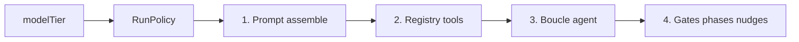

# Plan de suivi — profils modèle Low / Medium (`modelTier`)

**Date** : 2026-05-20  
**Statut** : plan actif — **M0–M3 ✅** (smoke manuel §6.2 recommandé avant M4)  
**Modèle de test cible** : `qwen3.5:9b` (ou équivalent 7b–9b) — réglages Low activés **levier par levier** après M0.

**Documents liés** : [MODELES-PAR-TAILLE](../architecture/MODELES-PAR-TAILLE.md) (vision produit) · [PLAN-PROFIL-LOW-ACCOMPAGNEMENT](./PLAN-PROFIL-LOW-ACCOMPAGNEMENT.md) (**M4+** exosquelette Low) · [REFACTO-STRUCTURE-CODE](./REFACTO-STRUCTURE-CODE.md) (socle `RunPolicy` ✅) · [MEMOIRE-LONG-TERME](../architecture/MEMOIRE-LONG-TERME.md) · [GUIDE-MOTEUR-DROX](../guides/GUIDE-MOTEUR-DROX.md) · [SMOKE-MANUEL-REFACTO](../operations/SMOKE-MANUEL-REFACTO.md)

---

## ⚠️ Règle absolue — gel du profil Medium (comportement actuel)

Le profil **Medium** correspond au moteur **tel qu’il fonctionne aujourd’hui** : extrêmement stable, validé en usage réel. **Aucun travail sur les tiers ne doit le déséquilibrer.**

| Interdit sur Medium | Autorisé |
|---------------------|----------|
| Modifier `CORE_SYSTEM_PROMPT`, gates effectifs, limites d’itérations, registre tools par défaut | Ajouter des branches `if profile_id == Low { … }` **sans toucher** la branche Medium |
| « Profiter » du chantier pour simplifier la boucle, les nudges ou les phases pour tout le monde | Copier le code Medium existant dans `RunPolicy::medium()` et **ne plus le réécrire** |
| Changer le défaut implicite du produit (tier, modèle, mode) sans validation explicite | Défaut explicite `modelTier: "medium"` = chemin code **identique** à aujourd’hui |
| Refactor opportuniste dans `agent/`, `assemble`, `handlers` en même temps que Low | PR séparées ; test **`medium_policy_matches_legacy`** / parité à chaque merge |

**Critère de merge** : avec `modelTier` absent ou `"medium"`, le run doit être **bit-à-bit fonctionnellement équivalent** au moteur pré-chantier tiers (prompt fusionné, tools exposés, gates, phases, nudges, permissions).

**Low** est un **ajout opt-in** (`modelTier: "low"`). Après **M0**, la tuyauterie est en place ; depuis **M1**, `RunPolicy::low()` applique allowlist + 1 tool/tour (Medium inchangé).

---

## 0. Objectifs produit (pourquoi ce chantier)

**Vision alignée 2026-05-20** : adapter une **perf équivalente** au setup utilisateur (12–24 Go VRAM → Low), pas « battre » un gros modèle avec un petit. Le moteur **accompagne** (objectif, plan, checkpoints) — surtout en Low ; Medium reste **autonome**.

| # | Objectif | Traduction mécanique (M0–M3 livré) | Suite M4+ ([PLAN-PROFIL-LOW-ACCOMPAGNEMENT](./PLAN-PROFIL-LOW-ACCOMPAGNEMENT.md)) |
|---|----------|-----------------------------------|-------------------------------------------------------------------------------------|
| 1 | **Fiabiliser les outils en Low** | Allowlist, 1 tool/tour, anti phase-tool halluciné | Checkpoint après chaque outil |
| 2 | **Tenir le fil sur tâches longues** | `todo_write` ≤5, `run_objective`, nudges courts | `RunContext` + plan forcé si multi-étapes |
| 3 | **Exosquelette Low, pas plafond** | Playbook supplement ; **pas** workflow « 1 tool puis stop » | Checkpoints, réflexion finale cadrée, UI masque méta |

**Medium** reste la **référence** : tout run `modelTier: "medium"` (ou défaut) doit se comporter comme aujourd’hui.

**Low** n’est pas « un modèle Ollama » : c’est un **profil d’exécution** (prompt + registry + boucle + gates), indépendant de `nexus.drox.model` / `OLLAMA_MODEL`.

---

## 1. Règles non négociables

0. **Medium gelé** — voir section ci-dessus ; priorité absolue sur toute autre considération.
1. **Une seule autorité** : `RunProfileId` + `RunPolicy` dans `drox-engine/src/run_profile/`. Pas de second module `ModelProfile` parallèle.
2. **Scaffold d’abord** : M0 câble `modelTier` de bout en bout ; `RunPolicy::low()` = **parité stricte** avec `medium()` (aucune différence visible).
3. **Activation progressive** : chaque levier Low s’ouvre dans une PR dédiée + test de parité Medium + test manuel sur petit modèle — **jamais** en modifiant le chemin Medium.
4. **Pas de routing auto** en V1 : l’utilisateur choisit le tier (vignette / setting). Pas de classifier tâche → tier.
5. **Orthogonal au mode permission** : `modelTier` (low/medium) ≠ `permissionMode` (default, plan, acceptEdits, …).

---

## 2. Architecture mécanique — 4 couches

Chaque run applique la même pipeline ; seuls les paramètres de `RunPolicy` changent.

```text
modelTier (UI / JSON-RPC)
    → RunProfileId::{Low, Medium}
    → RunPolicy::for_profile(id)
    → couche 1 → 2 → 3 → 4
```



| Couche | Fichiers | Rôle |
|--------|----------|------|
| **1. Prompt** | `drox-cli/.../system_prompt/assemble.rs`, `prompts.rs` | Core, suppléments, listing mémoire, skills, `LOW_MODEL_SUPPLEMENT` |
| **2. Registry** | `system_prompt/registry.rs` | `registry_for_policy`, allowlist, MCP, sous-agents, `disabled_tools` |
| **3. Boucle** | `agent/mod.rs`, `loop.rs`, `agent_stream.rs` | `build_tool_specs` + `tool_visible`, `max_tools_per_turn`, itérations |
| **4. Gates** | `agent/gates.rs`, `phases.rs`, `nudges.rs` | `gate_enabled`, protocole phases, nudges |

**Branché (REFACTO + M0–M2)** : `run_policy`, `tool_visible`, `gate_enabled`, `build_tool_specs`, `assemble_low` / `registry`, `modelTier`, `enforce_max_tools_per_turn`, `LOW_MODEL_SUPPLEMENT`, nudges courts Low, `max_todo_items` (5).

---

## 3. Catalogue des leviers (référence)

État par levier : ⬜ non câblé · 🔧 câblé scaffold (sans effet Low) · ✅ actif en Low.

### 3.1 Outils (objectif #1)

| Id | Levier | Medium | Low (cible) | Fichiers | Statut |
|----|--------|--------|-------------|----------|--------|
| T1 | Allowlist tools (schéma LLM) | Tous (sauf masqués internes) | Sous-ensemble fixe | `policy.rs`, `registry.rs` | ✅ M1 |
| T2 | `max_tools_per_turn` | `None` (= illimité pratique) | `Some(1)` | `agent_stream.rs`, `loop.rs` | ✅ M1 |
| T3 | Masquer `task`, web, MCP, notebook… | — | allowlist + prune registre | `registry.rs` | ✅ M1 |
| T4 | Bash classifier plus strict | Permissions | Idem ou plus strict | `drox-bash`, permissions | ⬜ |
| T5 | Gate tool halluciné | Actif | Actif + message court | `gates.rs` | ✅ M1 |
| T6 | Notice outils désactivés workspace | Actif | Actif | `assemble`, params run | ⬜ (déjà actif les deux) |

### 3.2 Libre arbitre (objectif #2)

| Id | Levier | Medium | Low (cible) | Fichiers |
|----|--------|--------|-------------|----------|
| L1 | Listing mémoire sessions dans prompt | Complet | Omis (M2) | `assemble.rs` | ✅ M2 |
| L2 | Skills / blocs lourds | Inclus si présents | Omis (M2) | `assemble.rs` | ✅ M2 |
| L3 | `LOW_MODEL_SUPPLEMENT` | — | ~40 lignes + playbook | `prompts.rs`, `assemble.rs` | ✅ M2 |
| L4 | `max_todo_items` | `None` | `Some(5)` | `policy.rs`, `gates.rs` | ✅ M2 |
| L5 | Gates : done sans answering | Actif | Actif | `gates.rs` | ⬜ (identique) |
| L6 | Gates : mutation sans todo | Soft nudge | Hard block (option) | `gates.rs` | ⬜ reporté |
| L7 | Nudges | Longueur actuelle | Plus courts | `nudges.rs`, `loop.rs` | ✅ M2 |
| L8 | `nativeThinking` défaut | Setting user | `false` suggéré en Low | IDE settings, `assemble` |
| L9 | `max_iterations` | Setting user | Plafond plus bas (optionnel) | `AgentRunParams` |

### 3.3 Guidage situationnel (objectif #3)

| Id | Levier | Medium | Low (cible) | Fichiers |
|----|--------|--------|-------------|----------|
| G1 | Playbook statique dans supplement | — | Arbre « si X → Y » | `LOW_MODEL_SUPPLEMENT` | ✅ M2 |
| G2 | Encourager `ask_user_question` tôt | Neutre | Explicite en Low | supplement |
| G3 | Bloc dynamique selon prompt user | — | V2 (heuristiques `phases.rs`) | `assemble` + heuristiques |

### 3.4 Allowlist Low V1 (activée M1 — `LOW_TOOL_ALLOWLIST`)

| Autorisé | Masqué en Low (V1) |
|----------|-------------------|
| `file_read`, `glob`, `grep` | `task`, `web_fetch`, `web_search` |
| `file_edit`, `file_write` | `notebook_edit` (V2 optionnel) |
| `bash` | `lsp` (optionnel : garder) |
| `todo_write` | `session_compact`, `course_plan_write` |
| `ask_user_question` | sous-agents, outils MCP dynamiques |

---

## 4. Contrat wire & IDE

### 4.1 JSON-RPC `agent.run`

```json
{
  "modelTier": "low" | "medium",
  "model": "qwen3.5:9b",
  "mode": "acceptEdits",
  "workspace": "...",
  "prompt": "..."
}
```

| Champ | Défaut | Résolution |
|-------|--------|------------|
| `modelTier` | `"medium"` | `RunProfileId::resolve_tier_opt` → `RunPolicy::for_profile` |
| `model` | env / settings | Inchangé — nom Ollama |
| `mode` | settings | Inchangé — permission mode |

### 4.2 Workbench

| Élément | Chemin / clé | Statut |
|---------|----------------|--------|
| Type TS | `common/chat/droxRunProfile.ts` — `'low' \| 'medium'` | ✅ M0 |
| Payload run | `buildAgentRunParams` → champ `modelTier` (défaut `medium`) | ✅ M0 |
| Service | `electron-browser/droxRunSettingsService.ts` — `runProfile: medium` en dur | ✅ M0 |
| UI vignettes | Fast / Standard (`model-tier-vignettes`) | ✅ M3 |
| Setting | `nexus.drox.modelTier` + `localStorage` `drox.modelTier` | ✅ M3 |
| Badge Low | `#model-tier-badge` dans le composer | ✅ M3 |

### 4.3 Résolution côté CLI

```text
AgentRunParams.modelTier
  → RunProfileId
  → RunPolicy::for_profile(id)
  → AssembleInput { profile_id, ... }
  → RegistryBuildInput { policy, ... }
  → AgentConfig { run_policy, ... }
```

---

## 5. Plan en phases

Chaque phase se termine par validation ; **Medium inchangé** à chaque merge.

---

### Phase M0 — Scaffold (aucune différence Low vs Medium)

**But** : tuyauterie complète ; `low` = `medium` fonctionnellement.

**Travail**

- [x] `RunProfileId::Low` + `RunPolicy::low()` = copie des valeurs `medium()`.
- [x] `RunPolicy::for_profile(id)` + parse `from_tier_str` / `resolve_tier_opt`.
- [x] Tests `low_policy_matches_medium_*` (parité stricte limites, tools, gates).
- [x] `AgentRunParams.modelTier` (protocol + handler) — défaut `medium`.
- [x] `agent_run.rs` : `RunPolicy::for_profile(...)` au lieu de `RunPolicy::medium()` hardcodé.
- [x] `assemble` / `registry` : branches sur `profile_id` avec **branche Low = même code que Medium**.
- [x] TS : `modelTier` dans `buildAgentRunParams` (défaut `medium` ; vignettes UI reportées M2).
- [x] Doc [PROTOCOLE-JSONRPC](../architecture/PROTOCOLE-JSONRPC.md) — champ `modelTier`.

**Validation M0**

- [x] `cargo test -p drox-cli -p drox-engine` vert
- [x] `npm run test-drox` vert (37 tests, +3 M0)
- [x] Tests parité Low/Medium (Rust + TS `buildAgentRunParams`)
- [ ] Run CLI `modelTier: "low"` vs absent / `"medium"` — smoke manuel optionnel
- [x] **Aucun** changement texte `CORE_SYSTEM_PROMPT`, gates effectifs, registry Medium
- [x] Revue : diff Medium = câblage uniquement (`assemble_medium_equivalent`, match registry)

---

### Phase M1 — Leviers outils (priorité objectif #1)

**But** : réduire erreurs tools sur petit modèle ; Medium inchangé.

**Ordre d’activation recommandé**

1. [x] **T1** — Allowlist + `tool_visible` + tests liste tools Low
2. [x] **T2** — `max_tools_per_turn = 1` + test boucle
3. [x] **T3** — Retrait effectif outils masqués du registre (+ pas de MCP / `task` en Low)
4. [x] **T5** — Messages gate hallucination raccourcis en Low

**Validation M1**

- [x] Tests unitaires allowlist + 1 tool/tour (Rust)
- [ ] Run manuel `qwen3.5:9b` + `modelTier: low` : pas de JSON tool dans le texte assistant
- [ ] Run `modelTier: medium` : parité avec baseline M0

---

### Phase M2 — Prompt & gates (objectifs #2 et début #3)

**Travail**

1. [x] **L3** — `LOW_MODEL_SUPPLEMENT` + `assemble_low`
2. [x] **L1** — Pas de listing mémoire sessions en Low
3. [x] **L2** — Pas de catalogue skills en Low
4. [x] **G1** — Playbook statique dans supplement
5. [x] **L4** — `max_todo_items = 5` + gate `tool_pre_gate_block`
6. [ ] **L5–L6** — Gates renforcées (reporté — smoke 9b d’abord)
7. [x] **L7** — Nudges courts (`nudge_prompt`, `done_only_nudge_prompt`, `loop_detected_nudge_prompt`)

**Validation M2**

- [x] Tests `assemble` Low vs Medium + `low_profile_blocks_todo_write_over_max_items`
- [ ] Tokens system prompt Low < Medium (mesure indicative, smoke)
- [ ] Scénarios manuels : lecture seule, édition simple, Q&A sans fichier

---

### Phase M3 — UX vignettes & settings

**Travail**

- [x] Radiogroup « Fast / Standard » (low / medium) — gauche du composer
- [x] `nexus.drox.modelTier` + `localStorage` + sync host `setModelTier`
- [x] Badge discret « Low profile » dans le composer
- [ ] (Optionnel) Warning mismatch gros modèle + tier low

**Validation M3**

- [ ] Smoke manuel onglets + send avec tier low/medium (§6.2)
- [x] Setting workspace synchronisé avec webview (`webviewReady` → `modelTier`)

---

### Phase M4 — Affinage post-tests & mémoire V2

**Travail**

- [ ] **M4a** — Ajustements après campagne `qwen3.5:9b` (ordre leviers, texte playbook)
- [x] **M4b-min** — `memory_budget_tokens` Low (120 tok memdir) + `memory_read` / `memory_list` allowlist
- [ ] **Mem-A…D** — SQLite + FTS + migration `.md` ([MEMOIRE-LONG-TERME](../architecture/MEMOIRE-LONG-TERME.md))
- [ ] **G3** — Playbook dynamique (heuristique prompt) si statique insuffisant
- [ ] Tests mock LLM / transcript figés tier low

---

## 6. Stratégie de test (petit modèle)

### 6.1 Prérequis

- Ollama : `qwen3.5:9b` (ou modèle 7b–9b choisi)
- `nexus.drox.model` pointant vers ce modèle
- Workspace de test avec README.md

### 6.2 Matrice minimale

| # | `modelTier` | Prompt type | Critère succès |
|---|-------------|-------------|----------------|
| 1 | medium | Lecture README | Baseline (référence) |
| 2 | low | Lecture README | ≤ 1 tool/tour, pas de JSON inline, phases cohérentes |
| 3 | low | Édition 1 fichier | `todo_write` court, puis mutateur, puis done |
| 4 | low | Question simple | Peu ou pas d’outils, answering puis done |
| 5 | medium | Même que 3 | Parité comportement actuel |

### 6.3 Critères d’échec (stop & ajuster levier)

- Tool arguments en texte libre (pas `tool_calls` natifs)
- Boucle sans `[phase: done]`
- > 1 tool dans le même tour assistant
- Saturation contexte (prompt system trop long) — ajuster L1/L3

---

## 7. Garanties & non-objectifs

| Garantie | Comment |
|----------|---------|
| **Medium gelé** | Chemin `RunProfileId::Medium` = code legacy ; tests parité obligatoires avant merge |
| Medium stable | Smoke [SMOKE-MANUEL-REFACTO](../operations/SMOKE-MANUEL-REFACTO.md) sur tier medium après chaque PR touchant agent/cli |
| Pas de feature sneak | Un levier Low = une PR ; **aucun** « profit » sur Medium |
| Réversibilité | Tier = paramètre run ; défaut et usage courant = medium |

| Non-objectif V1 | |
|-----------------|--|
| Tier **High** | Rester sur medium |
| Routing automatique low/medium | Manuel utilisateur |
| Remplacer `CORE_SYSTEM_PROMPT` par deux monolithes | Core + supplements |
| Cloud APIs propriétaires | Ollama-first inchangé |

---

## 8. Suivi d’avancement

> **Dernière mise à jour** : 2026-05-20 — M0–M3 code + `test-drox` 37 ; smoke §6.2 avant M4.

### 8.1 Phases

| Phase | Statut | Date | Notes |
|-------|--------|------|-------|
| **M0** — Scaffold sans diff Low/Medium | ✅ Terminé | 2026-05-20 | `modelTier` wire Rust + TS ; parité Low = Medium |
| **M1** — Leviers outils (T1–T3, T5) | ✅ Terminé | 2026-05-20 | Allowlist, 1 tool/tour, prune registre, gate court Low |
| **M2** — Prompt & gates (L*, G*) | ✅ Terminé | 2026-05-20 | Supplement Low, omit memory/skills, todo≤5, nudges courts |
| **M3** — UX vignettes & settings | ✅ Terminé | 2026-05-20 | Vignettes + setting + badge Low |
| **M4** — Accompagnement Low (`RunContext`, checkpoints) | 🔧 Planifié | 2026-05-20 | Voir [PLAN-PROFIL-LOW-ACCOMPAGNEMENT](./PLAN-PROFIL-LOW-ACCOMPAGNEMENT.md) ; Medium gelé |
| **M4-mem** — Mémoire V2 budget | 🔧 En cours | 2026-05-20 | M4b-min ✅ ; Mem-A / smoke restants |

### 8.2 Leviers (catalogue §3)

| Levier | Statut | Implémenté | Tests auto |
|--------|--------|------------|------------|
| **T1** Allowlist `tool_visible` | ✅ M1 | `LOW_TOOL_ALLOWLIST` dans `policy.rs` | `low_allowlist_*`, `low_registry_only_contains_allowlist_tools` |
| **T2** `max_tools_per_turn = 1` | ✅ M1 | `RunPolicy::low()`, `enforce_max_tools_per_turn` | `enforce_max_tools_per_turn_*`, `low_m1_has_one_tool_per_turn` |
| **T3** Prune registre + no MCP/task | ✅ M1 | `registry.rs` `prune_registry_to_policy` | `low_registry_*`, `medium_registry_includes_web_search` |
| **T4** Bash plus strict | ⬜ | — | — |
| **T5** Gate phase hallucinée courte | ✅ M1 | `LOW_PHASE_MARKER_MUST_BE_TEXT_NOT_TOOL` | (gates existants Medium inchangés) |
| **T6** Notice disabled tools | ⬜ | Déjà identique Medium/Low | — |
| **L1** Budget mémoire prompt | ✅ | M4b | Low 120 tok memdir ; Medium `None` (gelé) |
| **L2** Skills omis Low | ⬜ | — | — |
| **L1** Omit memory listing | ✅ M2 | `assemble_low` | `low_assemble_omits_memory_*` |
| **L2** Omit skills block | ✅ M2 | `assemble_low` | idem |
| **L3** `LOW_MODEL_SUPPLEMENT` | ✅ M2 | `prompts.rs` | `low_assemble_*` |
| **L4** `max_todo_items` | ✅ M2 | `policy.rs`, `gates.rs` | `low_m2_caps_*`, `low_profile_blocks_todo_*` |
| **L7** Nudges courts | ✅ M2 | `nudges.rs`, `loop.rs` | — |
| **G1** Playbook statique | ✅ M2 | dans `LOW_MODEL_SUPPLEMENT` | idem |
| **L5–L6** Gates renforcées | ⬜ | — | reporté post-smoke |
| **G3** Playbook dynamique | ⬜ | M4 | — |

### 8.3 Validation restante

| Item | Statut |
|------|--------|
| Smoke CLI `modelTier: "low"` vs absent / `"medium"` | ⬜ |
| Campagne manuelle `qwen3.5:9b` + tier low (matrice §6.2) | ⬜ |
| Parité medium post-M1 (run #5 matrice) | ⬜ |
| Doc [PROTOCOLE-JSONRPC](../architecture/PROTOCOLE-JSONRPC.md) | ✅ |

### 8.4 Journal (implémentation)

| Date | Changement |
|------|------------|
| 2026-05-20 | **M0** : `RunProfileId::Low`, `modelTier` protocol/handler/TS, branches assemble/registry, tests parité |
| 2026-05-20 | **M1** : allowlist Low, `max_tools_per_turn`, prune registre, skip MCP/task, message gate court |
| 2026-05-20 | **M2** : `LOW_MODEL_SUPPLEMENT`, `assemble_low`, omit memory/skills, `max_todo_items=5`, nudges courts ; doc PROTOCOLE |
| 2026-05-20 | Tests : 87 drox-cli + 126 drox-engine ; `npm run test-drox` 37 |
| 2026-05-20 | **M3** : vignettes Fast/Standard, `nexus.drox.modelTier`, badge Low, wire send |
| 2026-05-20 | Doc [PLAN-PROFIL-LOW-ACCOMPAGNEMENT](./PLAN-PROFIL-LOW-ACCOMPAGNEMENT.md) — vision exosquelette, backlog M4a–M5 |

---

## 9. Liens code (référence rapide)

```text
drox-engine/.../run_profile/policy.rs       RunProfileId, RunPolicy, LOW_TOOL_ALLOWLIST
drox-engine/.../agent/agent_stream.rs       enforce_max_tools_per_turn
drox-engine/.../agent/loop.rs               appel enforce après consume_stream
drox-engine/.../agent/gates.rs              LOW_PHASE_MARKER_MUST_BE_TEXT_NOT_TOOL
drox-cli/.../system_prompt/assemble.rs      assemble_medium_equivalent + assemble_low (M2)
drox-cli/.../prompts.rs                     LOW_MODEL_SUPPLEMENT
drox-cli/.../system_prompt/registry.rs      prune_registry_to_policy (M1)
drox-cli/.../jsonrpc/protocol.rs            AgentRunParams.model_tier
drox-cli/.../jsonrpc/handlers/agent_run.rs  resolve_tier_opt → run_policy
src/.../contrib/drox/common/chat/droxRunProfile.ts
src/.../contrib/drox/common/droxRunSettings.ts   buildAgentRunParams → modelTier
```

---

*KDDS Nexus — tier = profil d’exécution ; modèle Ollama = réglage séparé. **M0–M3 ✅** — smoke §6.2 puis **M4** accompagnement Low ([PLAN-PROFIL-LOW-ACCOMPAGNEMENT](./PLAN-PROFIL-LOW-ACCOMPAGNEMENT.md)) + mémoire V2.*
