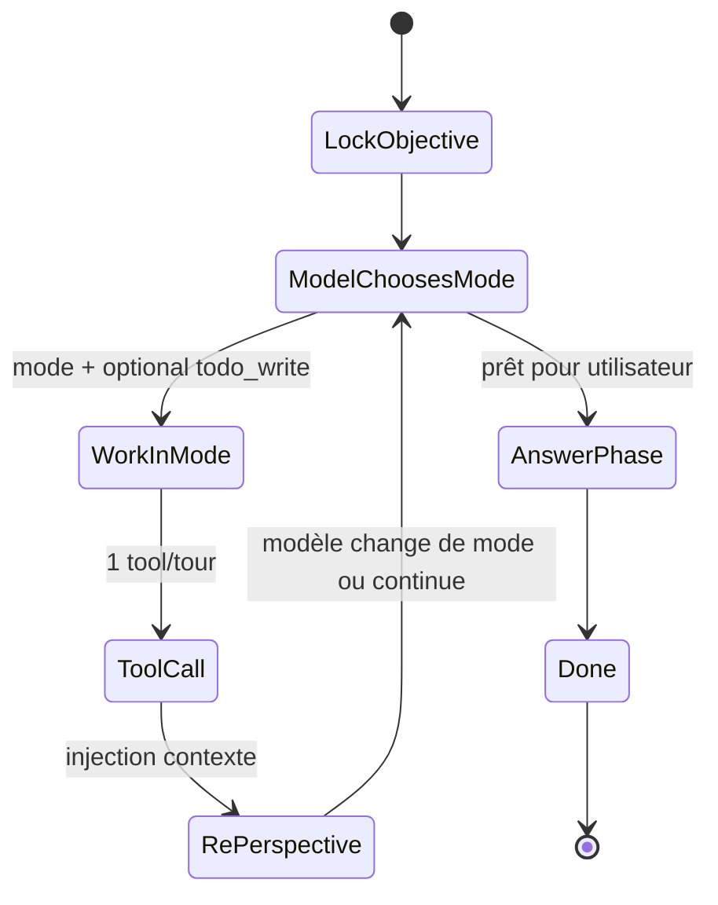

# Plan de suivi — profil Low : accompagnement moteur (exosquelette)

**Date** : 2026-05-20  
**Statut** : plan actif — **M0–M4 ✅** · **M5a ✅** · **M6 ✅** (revert dernier run) · **M5c** ([PLAN-M5c-SOUS-AGENTS-ASYNC](./PLAN-M5c-SOUS-AGENTS-ASYNC.md)) · **M5b** / smoke M3b = suite  
**Cible produit** : Nexus IDE, configs **12–24 Go VRAM** (petits modèles Ollama, contexte large possible).

**Documents liés** : [MODELES-PAR-TAILLE](../architecture/MODELES-PAR-TAILLE.md) (vision) · [PLAN-MODELES-TIER](./PLAN-MODELES-TIER.md) (suivi tiers M0–M3, gel Medium) · [REFACTO-STRUCTURE-CODE](./REFACTO-STRUCTURE-CODE.md) (découpe IDE/moteur — **stabiliser avant M4**) · [MEMOIRE-LONG-TERME](../architecture/MEMOIRE-LONG-TERME.md) · [GUIDE-MOTEUR-DROX](../guides/GUIDE-MOTEUR-DROX.md) (§2.10 sous-agents)

---

## ⚠️ Règle absolue — ne pas altérer le profil Medium

Le profil **Medium** = moteur **tel qu’il est aujourd’hui** : autonomie forte, peu d’injections système entre les tours, modèle type `qwen3.6:27b` capable de se remettre en question sur la durée.

| Interdit | Autorisé |
|----------|----------|
| Ajouter modes / re-perspective / `RunContext` sur **tous** les runs | Branches **`if profile_id == Low`** uniquement |
| Raccourcir ou réécrire `CORE_SYSTEM_PROMPT` pour Medium | Medium continue `assemble_medium_equivalent` inchangé |
| Réduire `max_iterations` ou le registre tools Medium | Low = **couche supplémentaire** d’accompagnement |

**Critère de merge** : `modelTier: "medium"` (ou absent) = comportement **identique** au moteur pré-chantier.

---

## 1. Vision — ce qu’on construit (accord produit)

### 1.1 Différence petit / gros modèle

Ce n’est **pas** « le petit est moins bon ». C’est :

| Dimension | Gros modèle (Medium) | Petit modèle (Low) |
|-----------|----------------------|---------------------|
| **Cohérence long terme** | Tient le fil seul, se recadre | Oublie objectif / étape courante sans aide |
| **Temps / VRAM** | Plus lent, plus de VRAM | Plus rapide, **VRAM moindre** |
| **Autonomie** | Élevée — décisions peu guidées | Faible sur la durée — **besoin d’exosquelette** |
| **Rôle du moteur** | Léger (outils + protocole + gates) | **Fort** : plus d’aller-retours moteur ↔ modèle |

### 1.2 Utilité du moteur (au-delà des outils)

Le moteur Drox sert à **accompagner** le modèle pour lui simplifier la vie :

- ancrer un **objectif verrouillé** ;
- **décomposer** les tâches longues (plan `todo_write`) ;
- **re-contextualiser** après chaque pas (outil ou changement de mode) — le modèle **choisit** la suite ;
- **réduire le bruit décisionnel** : à un instant T, seulement les outils pertinents pour le *mode* qu’il vient de déclarer ;
- permettre des **tâches complexes** (refacto complet, multi-fichiers) **sans** plafonner l’ambition.

**Petit et gros** ont besoin du même type d’aide — **pas au même dosage**.

### 1.2bis Principe clé — le modèle reste maître (oeillères dynamiques)

On **ne force pas** le modèle vers un chemin unique (pas « tu dois planifier » puis « tu dois muter » imposé par le moteur).

| Ce que fait le moteur | Ce que fait le modèle |
|----------------------|----------------------|
| Porte objectif + plan + mode courant dans `RunContext` | **Décide** de la marche à suivre |
| Après chaque outil : **re-perspective** (rappel du cap, du plan, du dernier résultat) | Choisit le **prochain mode** ou la prochaine action |
| Selon le **mode déclaré** : expose un **sous-ensemble d’outils** (oeillères) | Évite la paralysie face à 15 tools en même temps |
| Propose des **phases / modes plus riches** (découvrir, muter, **vérifier**, concilier, répondre) | Ex. en refacto : « je dois vérifier ce que j’ai fait » → mode **verify** → lecture, grep, bash check, lsp… |

**Exemple** (refacto) :

1. Le modèle est en mode **Execute** → `file_edit` / `file_write` disponibles.
2. Il passe en `[phase: verifying]` → le moteur mappe en **Verify** → registre filtré (lecture + checks).
3. Il appelle `file_read` ou `bash` (test) → **re-perspective** : objectif, étape plan, résumé outil, menu de choix.
4. Il répond par ex. `continue` ou `execute` → le moteur applique le mode et les oeillères au tour suivant.

Les « étapes » sont **découpées pour lui** ; les choix restent **les siens**.

### 1.3 Objectif Nexus (perf équivalente adaptée au setup)

- **Pas** : faire gagner un 7B contre un 27B en bench.
- **Oui** : offrir une **expérience comparable** selon le matériel :
  - **Medium** : lâcher le modèle, moins de tours moteur, plus d’autonomie ;
  - **Low** : **plus de structure côté moteur**, plus de tours, **même type de chantiers** possibles.
- **VRAM économisée** → marge pour **contexte plus large** ; **sous-agents `task`** : voir §2.9 (M5, après M4 + stabilisation refacto).

### 1.4 Ce qu’on ne fait pas (non-objectifs)

| Non-objectif | À la place |
|--------------|------------|
| Workflow « reading → 1 tool → answering → done » comme plafond | Autant de tours que nécessaire, **cadrés par mode** |
| Interdire audit repo / refacto en Low | Plan + modes + re-perspective |
| **Forcer** le modèle dans un sens (plan obligatoire, prochaine action imposée) | **Contextualiser** selon *ses* choix (mode, phase, plan) |
| Remplacer le jugement du modèle | Moteur = **mémoire externe** + **filtre d’outils**, pas pilote automatique |

---

## 2. Architecture cible — modes de travail & re-perspective

Le **code** porte le contexte et **réduit les choix** à l’instant T ; le modèle **choisit** le mode et l’action suivante.

### 2.1 État moteur `RunContext` (à introduire)

```text
RunContext {
  locked_objective: String
  work_mode: WorkMode              // choisi / mis à jour par le modèle (voir §2.2)
  plan: TodoSnapshot | None
  current_step_id: Option<String>
  last_tool: Option<ToolSummary>
  perspective_count: u32
}
```

Persisté dans `agent/loop.rs`, réinjecté en messages **système** (repliés UI « Reflect » / non bulle utilisateur).

### 2.2 Trois axes — Cap, Plan, Mode (ne pas confondre)

| Axe | Question | Porté par | Exemple |
|-----|----------|------------|---------|
| **Cap** | *Pourquoi* ? | `locked_objective` / `[run_objective: …]` | « Refactorer le module auth » |
| **Plan** | *Quoi* en morceaux ? | `todo_write` (≤5 items Low), item `in_progress` | « 1. Extraire X  2. Migrer imports  3. Tests » |
| **Mode** | *Comment* maintenant ? | `WorkMode` → **filtre outils** (oeillères) | « Je dois vérifier » → Verify |

**Étape métier** = une ligne du plan (`todo`). **Pas opérationnel** = 1 tour Low (≤1 outil) + ack re-perspective (≤2 lignes EN).

Les **`[phase: …]`** restent le vocabulaire **UI / protocole** existant. En Low, le moteur les **mappe** vers un `WorkMode` — **pas** de `[mode: …]` parallèle en **V1** (évite de doubler le vocabulaire pour un petit modèle).

### 2.3 Modèle conceptuel V1 — **4 modes** (figé)

Quatre modes suffisent pour les chantiers longs ; le moteur **n’impose pas** le prochain.

| `WorkMode` | Phases mappées (`Phase` / `[phase: …]`) | Outils Low (oeillères) |
|------------|----------------------------------------|------------------------|
| **Explore** | `analyzing`, `reading`, `planning`, `clarifying` | `glob`, `grep`, `file_read`, `memory_*`, `ask_user_question` |
| **Execute** | `acting` | `file_edit`, `file_write`, `bash` (mutations / commandes) |
| **Verify** | `testing`, `verifying` | `file_read`, `grep`, `bash` (test/lint/check), `lsp` si réactivé |
| **Respond** | `answering` | aucun outil (sauf `ask_user_question` si déjà en clarifying) |

**`todo_write`** = **action** autorisée depuis **Explore** (ou via choix `plan` dans le menu re-perspective), **pas** un 5ᵉ mode — le modèle ne reste pas bloqué dans un mode « plan ».

**Changement de mode** : le modèle utilise les **phases existantes** (`[phase: verifying]`, `[phase: acting]`, …) ou un mot-clé du menu re-perspective (`execute`, `verify`, …). Le moteur met à jour `RunContext.work_mode` et le schéma tool au tour suivant.

**Alignement soft** (nudge, pas gate) : si l’étape todo courante implique de la mutation et le mode reste Explore depuis plusieurs tours → suggestion *« consider Execute for this plan step »*.

### 2.4 Re-perspective post-outil (cœur M4)

Après **chaque** `tool_result` en Low : **préfixe système** au **début du prochain** tour modèle (évite un appel LLM dédié vide — coût maîtrisé).

```text
RE-PERSPECTIVE (engine — choose one keyword + ≤2 telegraphic EN lines: learned + choice):

Cap: « … »
Plan step (if any): « 2/5 — Migrate imports » (in_progress)
Current mode: Verify
Last tool: file_read → <summary ≤500 chars>

You may reply with ONE keyword:
  continue   — same mode, one more allowed tool
  explore    — switch to Explore
  execute    — switch to Execute
  verify     — switch to Verify
  plan       — todo_write (adjust plan)
  respond    — toward [phase: answering] when the cap is met
```

| Choix | Effet moteur |
|-------|----------------|
| `continue` / `explore` / `execute` / `verify` | Met à jour `work_mode`, filtre tools |
| `plan` | Autorise `todo_write` au tour suivant (depuis Explore ou menu) |
| `respond` | Prépare transition vers Respond / answering |

**V2 optionnel** : `[perspective: drift]` → nudge `scope_defer` (soft). **Hors V1** pour rester minimal.

**UI** : ack re-perspective dans Exploring / Reflect, pas dans la bulle réponse utilisateur.

### 2.5 Plan multi-étapes — recommandé, pas imposé

Pour les chantiers longs, le moteur **recommande fortement** `todo_write` (nudge, bandeau UI) quand le modèle annonce un refacto / multi-fichiers — **sans gate bloquante** en V1 accompagnement.

| Approche | Statut |
|----------|--------|
| Heuristique « gros chantier » → nudge `LOW_PLAN_RECOMMENDED` | ✅ Cible M4b |
| Gate hard « pas de mutate sans plan » | ⬜ **Reporté** — trop contraignant vs « modèle maître » |
| Le modèle peut ignorer le plan et rester en mode `discover` tant qu’il assume la re-perspective | Oui |

### 2.6 Boucle Low (schéma)



### 2.7 Poupées russes (chantiers longs)

| Niveau | Contenu | Porté par |
|--------|---------|-----------|
| 0 | Objectif global | `locked_objective` + `[run_objective: …]` |
| 1 | Épiques | `todo_write` (≤ 5 items Low) |
| 2 | Modes par épique | `work_mode` + re-perspective à chaque outil |

### 2.8 Synthèse avant `answering` (optionnel)

Tour sans outil **proposé** (nudge soft) : « Compare plan + objective ; gaps ≤5 bullets ; then answering. » Le modèle peut s’en passer s’il est déjà aligné.

### 2.9 Sous-agents `task` — délégation synthétisable (M5, après M4)

**Rôle** : cellule de travail **isolée** — le parent ne paie que l’appel `task` + le **rapport synthétisé**, pas les N `tool_result` intermédiaires du fils (économie de **tokens de contexte global**). Le coût GPU/temps reste local (second `Agent`).

| Décision | Détail |
|----------|--------|
| **Aujourd’hui (M1)** | `task` masqué de l’allowlist Low ; V1 moteur = type **`explore`** seul (`subagent.rs`, `task.rs`) |
| **Activation** | `nexus.drox.subagents.enabled` + `subagentsEnabled` JSON-RPC — **désactivé par défaut** |
| **Cible Low (M5)** | `task` **réintroduit** si setting activé : **optionnel**, **recommandé** (nudge) pour cartographie / audit large |
| **Cible Medium (M5)** | Inchangé si activé — le modèle décide seul ; pas de nudge fort |
| **Ordre** | **M4** (exosquelette) → **M3b** (stabilisation refacto IDE) → **M5** (sous-agents) |

**Contrat cible (entrée / sortie)** :

| Sens | Contenu |
|------|---------|
| **Entrée `task`** | `description`, `subagent_type`, `thoroughness?`, `scope?` (paths), `objective_fragment?` (lien cap / étape `todo`) |
| **Sortie parent** | JSON structuré : `summary`, `findings[]`, `open_questions[]`, `report_markdown?` (tronqué), `truncated`, `iterations_used` — pas seulement du Markdown libre |
| **Enfant** | `transcript` / `memory` **absents** ; registre read-only (`explore_tool_registry`) ; **pas** de `task` imbriqué |

**Profils parent → enfant** :

| Parent | Sous-agent interne (cible M5) |
|--------|-------------------------------|
| **Medium** | `RunPolicy::medium()` (actuel), `max_iterations` 15, `max_concurrent` jusqu’à 8 |
| **Low** | **`RunPolicy::low()`** (à câbler — aujourd’hui Medium en dur), `max_iterations` ~8–10, `max_concurrent` 1 |

**Types roadmap** (après `explore` V1) : `verify` (read + bash check), `plan` (todo seul), `patch` périmètre étroit (futur, risqué).

**Lien M4** : après un `task`, la **re-perspective** parent cite le **résumé du report** + cap + étape plan — pas les traces outils du fils.

Ne pas concevoir Low comme « sans sous-agents pour toujours » — seulement **après** exosquelette + refacto stable.

### 2.10 Brique déjà en place (à brancher sur M4)

| Brique | Fichier / mécanisme | Renforcement M4 |
|--------|---------------------|-----------------|
| `[run_objective: …]` | `phases.rs`, `nudges.rs` | Dans chaque re-perspective |
| `todo_write` | gates `max_todo_items` | Nudge **recommandé** (pas gate hard) |
| `scope_defer` | `drox-tools` | Sur `perspective: drift` (soft) |
| 1 tool/tour | `enforce_max_tools_per_turn` | 1 action / re-perspective |
| Phases existantes | `reading`, `verifying`, `acting`… | Map → 4 `WorkMode` (§2.3) |

### 2.11 Cohérence plan ↔ vision (checklist)

| Vision produit | Inscrit dans ce plan |
|----------------|----------------------|
| Exosquelette, pas plafond de tâches | §1, §2.5, pas de workflow court imposé |
| Modèle maître, moteur contextualise | §1.2bis, menu re-perspective §2.4 |
| Medium inchangé | § règle absolue + branche Low only |
| 4 modes + phases UI existantes | §2.3 |
| Plan = étapes métier, pas mode séparé | §2.2, `todo_write` comme action |
| Re-perspective = rappel cap + plan + choix | §2.4 |
| `task` après M4 + refacto stable, optionnel recommandé | §2.9, sprint **M5** |
| Sous-agents = contexte isolé + synthèse | §2.9, **M5a–M5b** |
| Coût aller-retours maîtrisé | Préfixe système tour suivant, pas LLM vide systématique |
| Stabiliser refacto IDE avant M4 | **M3b** |

---

## 3. Low vs Medium — tableau d’accompagnement (cible)

| Mécanisme | Medium | Low (M4 livré) |
|-----------|--------|----------------|
| `RunContext` + `work_mode` | ⬜ Non | ✅ Oui |
| Re-perspective post-outil | ⬜ Non | ✅ Oui (informatif, modèle choisit la suite) |
| Outils visibles | Tous (policy Medium) | **Sous-ensemble selon mode** (oeillères) |
| Plan multi-étapes | Soft nudge | **Recommandé** (nudge), pas gate hard |
| `max_tools_per_turn` | Illimité pratique | 1 (déjà M1) |
| Prompt système | Core FR complet | `LOW_CORE` + **injections** contexte |
| Sous-agents `task` | Si activé | Masqué M1 → **optionnel + recommandé** M5+ |
| Qui décide la suite | Modèle | Modèle — moteur **contextualise** seulement |

---

## 4. Phases de livraison (sans toucher Medium)

> Les phases **M0–M3** sont dans [PLAN-MODELES-TIER](./PLAN-MODELES-TIER.md) (outils, supplement, UX).  
> Ce document porte **M3b** (stabilisation refacto), **M4 — accompagnement**, **M5 — sous-agents**.

### M3b — Stabilisation post-refacto (**prérequis M4** — sprint en cours)

Issues remontées après découpe `browser/chat/*`, services LLM, outils distants `tool/exec`. **Ne pas démarrer M4** tant que cette ligne n’est pas verte en smoke manuel.

| # | Tâche | Fichiers / zone | Statut |
|---|--------|-----------------|--------|
| S1 | Chemins Windows `file_edit` / `file_read` : retrait préfixes `\\?\` / `?\` corrompus après `realpath` | `droxPathUtil.ts`, `droxPathUtils.ts` | ✅ |
| S2 | Compile TypeScript Drox (tests `IDroxLlmSettings`, `getValue` overrides, tabs) | `droxCommon.test.ts`, `droxLlmCatalog.ts`, `droxChatTabsManager.ts` | ✅ |
| S3 | Smoke `file_edit` + `file_write` sur workspace réel (chemins relatifs + absolus) | manuel IDE | ⬜ |
| S4 | Smoke liste modèles LLM + sync chat / settings (`DroxLlmModelsService`) | manuel IDE | ⬜ |
| S5 | Parité agent run Medium après refacto chat (send, replay, onglets) | `droxChatController`, `browser/chat/*` | ⬜ |
| S6 | Régression `tool/exec` (bash, lsp, session_*) | `droxClientToolsService` | ⬜ |

Référence structure : [REFACTO-STRUCTURE-CODE](./REFACTO-STRUCTURE-CODE.md) · procédure : [SMOKE-MANUEL-REFACTO](../operations/SMOKE-MANUEL-REFACTO.md).

### M4a — Fondations `RunContext` + re-perspective

| # | Tâche | Fichiers | Statut |
|---|--------|----------|--------|
| A1 | Struct `RunContext` + `WorkMode` | `agent/run_context.rs`, `loop.rs` | ✅ |
| A2 | Map `Phase` → `WorkMode` (4 modes) + parse mots-clés menu (`continue`, `execute`, …) | `run_context.rs`, `loop.rs` | ✅ |
| A3 | `re_perspective_system_message(ctx)` après chaque tool OK | `loop.rs`, `nudges.rs` | ✅ |
| A4 | Branches **Low only** — Medium inchangé | `loop.rs` | ✅ |
| A5 | Tests parser modes + re-perspective | `drox-engine` tests | ✅ |
| A6 | Event UI mode / perspective (bandeau + Reflect replié) | `event.rs`, IDE | ✅ |

### M4b — Modes de travail + filtre outils (oeillères)

| # | Tâche | Fichiers | Statut |
|---|--------|----------|--------|
| B1 | `tool_visible_for_work_mode(mode, tool)` | `run_context.rs` | ✅ |
| B2 | `build_tool_specs` Low filtré par `RunContext.work_mode` | `agent/mod.rs` | ✅ |
| B3 | Table 4 modes → outils (Explore / Execute / Verify / Respond) + tests | `run_context.rs` | ✅ |
| B4 | Prompt Low : phases existantes + menu re-perspective (pas `[mode: …]` V1) | `prompts.rs` | ✅ |

### M4c — Objectif + plan recommandé (pas forcé)

| # | Tâche | Fichiers | Statut |
|---|--------|----------|--------|
| C1 | Verrouiller objectif (`run_objective` + `RunContext`) | `loop.rs` | ✅ |
| C2 | Nudge `LOW_PLAN_RECOMMENDED` (chantier large) — sans gate bloquante | `nudges.rs` | ✅ |
| C3 | ~~Gate mutate sans plan~~ | — | ❌ Hors scope |

### M4d — Prompt Low + injections (pas monolithe FR)

| # | Tâche | Fichiers | Statut |
|---|--------|----------|--------|
| D1 | `LOW_CORE_SYSTEM_PROMPT` — modes, choix du modèle, pas de workflow imposé | `prompts.rs` | ✅ |
| D2 | `assemble_low` sans core Medium | `assemble.rs` | ✅ |
| D3 | Anti-méta hors `answering` (UI + prompt) | supplement, `07-log.js` | ✅ (re-perspective → Reflect) |

### M4e — UI & bandeau contexte

| # | Tâche | Fichiers | Statut |
|---|--------|----------|--------|
| E1 | Bandeau : objectif + mode courant + étape plan | `droxChatWebview`, `08-tabs.js` | ✅ |
| E2 | `07-log.js` : re-perspective / méta hors bulle user | `07-log.js` | ✅ |
| E3 | Nudge soft synthèse avant `answering` (optionnel) | `nudges.rs`, `loop.rs` | ✅ (Low, answering >350 chars sans done) |

### M5a — Sous-agents V1 : réactivation Low + synthèse (**après M4**)

| # | Tâche | Fichiers | Statut |
|---|--------|----------|--------|
| F1 | Réintégrer `task` dans allowlist Low si `subagents.enabled` | `run_profile/policy.rs`, `registry.rs` | ✅ |
| F2 | Propager `RunPolicy` du **parent** vers sous-agent (`low` → `low`, medium → medium) | `subagent.rs` | ✅ |
| F3 | Plafonds Low enfant : `max_iterations` ≤ 10, `max_parallel` 1 | `SubagentSettings`, `agent_run` | ✅ |
| F4 | Sortie structurée `task` : `summary`, `findings`, `open_questions`, troncature report | `task.rs`, `subagent_report.rs` | ✅ |
| F5 | Nudge Low : périmètre large → préférer `task` ; 1 fichier connu → `file_read` | `nudges.rs`, `prompts.rs`, `loop.rs` | ✅ |
| F6 | Lien `objective_fragment` + `scope` dans prompt sous-agent | `task.rs`, `subagent.rs` | ✅ |
| F7 | Events `subagent_start` / `subagent_done` (moteur) + carte UI repliée | `event.rs`, `07-log.js` | ✅ |
| F8 | Tests : allowlist, rapport tronqué, pas de `task` imbriqué | `drox-engine`, `drox-tools` tests | ✅ |

### M5b — Sous-agents V2 : types + Medium enrichi (**après M5a**)

| # | Tâche | Fichiers | Statut |
|---|--------|----------|--------|
| G1 | Type `verify` (read + bash check, pas d’écriture) | `SubagentExecutor`, `task.rs` | ⬜ |
| G2 | Type `plan` (propose mini-plan / `todo_write`, pas mutate) | idem | ⬜ |
| G3 | Setting optionnel `nexus.drox.subagents.model` (vide = modèle parent) | `droxConfiguration.ts`, JSON-RPC | ✅ |
| G4 | Compression post-run si report > seuil (règles, pas 2ᵉ LLM obligatoire) | `subagent.rs` | ⬜ |
| G5 | Doc dédiée `PLAN-SOUS-AGENTS.md` (vision + contrats + matrice tiers) | `docs/plans/` | ⬜ |
| G6 | Smoke : audit module entier via `task` explore + re-perspective parent | manuel | ⬜ |

**Hors M5a V1** : `patch` (mutation périmètre), `task` imbriqué, parallèle multi-`task` Low sans cadre VRAM.

### M5c — Sous-agents asynchrones + jauge contexte parent (**après M5a**)

Plan détaillé : **[PLAN-M5c-SOUS-AGENTS-ASYNC](./PLAN-M5c-SOUS-AGENTS-ASYNC.md)**.

| # | Tâche | Fichiers | Statut |
|---|--------|----------|--------|
| C1–C5 | Jauge `parent_ctx_tokens` (ingestion réelle parent, pas explore interne) | `loop.rs`, `agent_run.rs`, `09-host.js` | ✅ |
| C6–C11 | `SubagentJobRegistry` + `task(background)` sync/async | `subagent_jobs.rs`, `task.rs`, `loop.rs` | ✅ |
| C12–C16 | Gate Low mutations si job running ; UI Sync/Async | `gates.rs`, `07-log.js`, `droxChatAgentEvents.ts` | ✅ |
| C17 | `maxConcurrent` défaut 1 + description setting IDE | `droxConfiguration.ts` | ✅ |
| C18–C20 | Smoke VRAM doc + smoke **6b** manuel | [PLAN-M5c](./PLAN-M5c-SOUS-AGENTS-ASYNC.md) §5.2 | ⬜ |

**Décisions produit M5c** : `background` explicite (modèle choisit) ; gate Low **dur** ; jauge = tokens **ingérés** par le parent ; pas d’incitation multi-explore sans gain perf.

### M6 — Revert dernier run (V1) — annuler les mutations fichier

**Objectif** : après un cycle agent (`agent/run`), permettre d’**annuler toutes les écritures fichier** de ce run en un clic — équivalent simplifié du « undo » Cursor ; **V1 = uniquement le dernier run terminé** (pas d’historique multi-runs).

| # | Tâche | Fichiers | Statut |
|---|--------|----------|--------|
| H1 | Accumulateur par run : snapshot **avant première écriture** par chemin (`hadFile` + `beforeContent`) | `droxRunRevertService.ts` | ✅ |
| H2 | Hook écritures : `file_edit`, `file_write`, `notebook_edit` via `DroxFileToolHost.writeTextFile` | `droxFileToolHost.ts`, tools `*Edit*`, `*Write*` | ✅ |
| H3 | `beginRun` au send · `finalizeRun` sur `agent/done` · `discardActiveRun` au cancel | `droxChatSendRun.ts`, `droxChatAgentEvents.ts` | ✅ |
| H4 | `revertLastRun` : restaurer contenu ou supprimer fichier créé ; invalider snapshot | `droxRunRevertService.ts` | ✅ |
| H5 | UI chat : bouton footer « Undo last run » (visible si fichiers > 0, run idle) | `droxChatWebview.ts`, `02-chrome.js`, `10-bootstrap.js` | ✅ |
| H6 | Commande palette `workbench.action.droxRevertLastRun` | `droxActions.ts`, `drox.ts` | ✅ |
| H7 | Tests unitaires normalisation outils (complément robustesse Low) | `droxToolInputNormalize.ts`, `droxCommon.test.ts` | ✅ |

**Contrat V1** :

| Règle | Détail |
|-------|--------|
| Périmètre | Fichiers texte/notebook touchés par outils client Drox dans le workspace du run |
| Granularité | **1 snapshot** = dernier `runId` finalisé avec ≥1 mutation |
| Après revert | Bouton masqué ; un nouveau run peut recréer un snapshot |
| Hors scope V1 | Git commit, diff UI, revert run N−1, revert partiel par fichier |

**Hors M6 V2** : pile multi-runs, intégration SCM, preview diff avant revert.

---

## 5. Validation

### 5.1 Tests automatiques

- [x] Parité Medium inchangée (`medium_policy_matches_legacy`, `build_tool_specs(..., None)`).
- [x] Low : après tool, re-perspective présente ; mots-clés menu (`execute`, `plan`, …).
- [x] Low mode `verify` : schéma tools sans `file_edit` (`run_context` tests).
- [ ] Low : `perspective: drift` → nudge soft (V2, hors M4 V1).
- [x] Pas de régression : aucun gate hard plan-before-mutate en Low V1 accompagnement.
- [x] M5a : parent Low + `subagents.enabled` → `task` visible ; enfant `RunPolicy` parent ; report structuré.
- [x] M5a : pas de `task` imbriqué dans registre explore enfant.
- [x] M5c C1–C17 : `ContextUsage` → `#ctx` parent ; `task(background)` async + drain ; gates Low ; UI Sync/Async + cartes `job_id` ; tests gates/registry/orchestration.
- [ ] M5c C18–C19 + smoke **6b** (audit async, gate mutation, jauge parent seule).
- [ ] M5b : types `verify` / `plan`, setting modèle dédié (V2).
- [x] M6 : revert dernier run restaure fichiers modifiés ; pas de snapshot après cancel.
- [x] M6 : normalisation `file_edit` (edits à la racine) et `file_write` (alias path/content).

### 5.2 Smoke manuel (petit modèle, 12–24 Go)

| # | Scénario | Succès |
|---|----------|--------|
| 1 | Question simple | Mode discover → answer ; pas de plan imposé |
| 2 | Refacto avec « je dois vérifier » | Bascule mode verify ; outils read/check seulement ; re-perspective ; modèle choisit la suite |
| 3 | Chantier multi-fichiers | Plan recommandé (todo) ; modèle peut travailler par modes ; objectif visible |
| 4 | Medium même scénario | Aucune régression ; pas de modes forcés |
| 5 | M3b — `file_edit` Windows | Édition réussie sans `ENOENT` préfixe `?` |
| 6 | M5a — audit large sync | `task` `background: false` → report ; parent attend (M5a) |
| 6b | M5c — audit async | `task` `background: true` → parent lit/planifie pendant explore ; gate mutation Low ; jauge parent seule |
| 7 | M6 — revert | Run avec `file_edit` / `file_write` → « Undo last run » restaure l’état initial |

Référence procédure : [SMOKE-MANUEL-REFACTO](../operations/SMOKE-MANUEL-REFACTO.md).

---

## 6. Journal

| Date | Entrée |
|------|--------|
| 2026-05-20 | Création du plan — vision accompagnement (exosquelette), distinct de « limiter le petit modèle » ; Medium gelé |
| 2026-05-20 | M0–M3 déjà livrés via [PLAN-MODELES-TIER](./PLAN-MODELES-TIER.md) (allowlist, 1 tool/tour, supplement, UX) |
| 2026-05-20 | Précision produit : modèle **maître** ; **modes** + oeillères selon choix ; re-perspective (pas forçage) ; `task` optionnel recommandé **après M4** |
| 2026-05-20 | **V1 figé** : 3 axes Cap/Plan/Mode ; **4 WorkModes** ; map phases sans `[mode: …]` ; menu re-perspective 6 mots-clés ; §2.11 checklist cohérence |
| 2026-05-21 | Sprint **M3b** (stabilisation refacto) : S1/S2 ✅ (`normalizeWindowsFsPath`, compile TS) ; M5 détaillé **M5a/M5b** ; §2.9 vision sous-agents (synthèse, profils parent/enfant) |
| 2026-05-21 | **M4 livré** : `run_context.rs`, oeillères `build_tool_specs`, re-perspective post-outil, `LOW_CORE` + `assemble_low`, events `work_mode_update` / `re_perspective`, bandeau mode+plan IDE ; E3 synthèse avant answering reporté V2 |
| 2026-05-21 | **M5a livré** : `task` Low si `subagents.enabled`, enfant hérite `RunPolicy` parent, sortie structurée `subagent_report`, events `subagent_start`/`done` + cartes UI, nudges `LOW_TASK_RECOMMENDED` |
| 2026-05-21 | **M5c planifié** : [PLAN-M5c-SOUS-AGENTS-ASYNC](./PLAN-M5c-SOUS-AGENTS-ASYNC.md) — `background` sync/async, jobs, jauge parent, gate Low, `maxConcurrent` conservateur |
| 2026-05-20 | **M5c C1–C17 livré** (détail [PLAN-M5c](./PLAN-M5c-SOUS-AGENTS-ASYNC.md)) ; reste smoke VRAM **C18–C19** + scénario **6b** |
| 2026-05-21 | **M6 livré** : revert dernier run (snapshot avant écriture, bouton + commande palette) ; normalisation `file_edit`/`file_write` côté client pour petits modèles |

---

## 7. Liens code (référence)

```text
drox-engine/.../run_profile/policy.rs     RunPolicy::low() — max_tools_per_turn, allowlist
drox-engine/.../agent/run_context.rs     RunContext, WorkMode, oeillères, tests M4
drox-engine/.../agent/loop.rs            boucle — RunContext Low, re-perspective, rebuild tool_specs
drox-engine/.../agent/nudges.rs          re_perspective_*, LOW_PLAN_RECOMMENDED
drox-engine/.../agent/gates.rs             gates Low (todo max, phase tool)
drox-cli/.../system_prompt/assemble.rs   assemble_low vs assemble_medium_equivalent
drox-cli/.../prompts.rs                  LOW_MODEL_SUPPLEMENT, CORE_SYSTEM_PROMPT (Medium)
drox-engine/.../subagent.rs              EngineSubagentExecutor, explore_tool_registry
drox-tools/.../simple/task.rs            tool `task` (délégation explore V1)
src/.../contrib/drox/electron-browser/tools/droxPathUtils.ts   resolveExistingFileUnderWorkspace
src/.../contrib/drox/browser/media/droxChat/07-log.js   Exploring, split réponse
src/.../contrib/drox/common/droxToolInputNormalize.ts   alias file_edit / file_write (Low)
src/.../contrib/drox/electron-browser/droxRunRevertService.ts   snapshot + revertLastRun
src/.../contrib/drox/electron-browser/tools/droxFileToolHost.ts   captureBeforeWrite
```

---

*KDDS Nexus — ordre : **M3b** refacto stable → **M4** exosquelette → **M5** sous-agents synthétisables ; Medium inchangé.*
