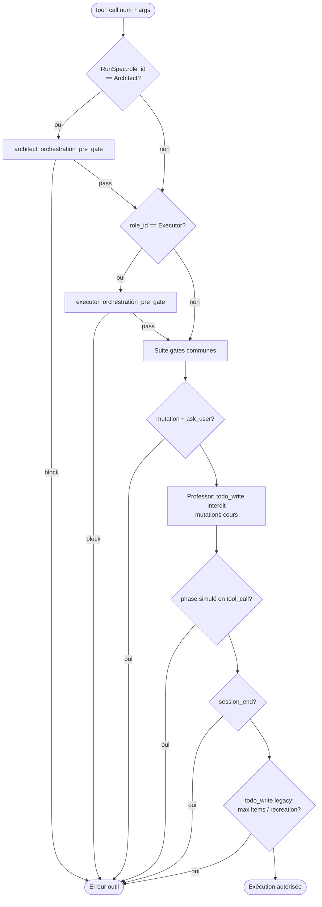
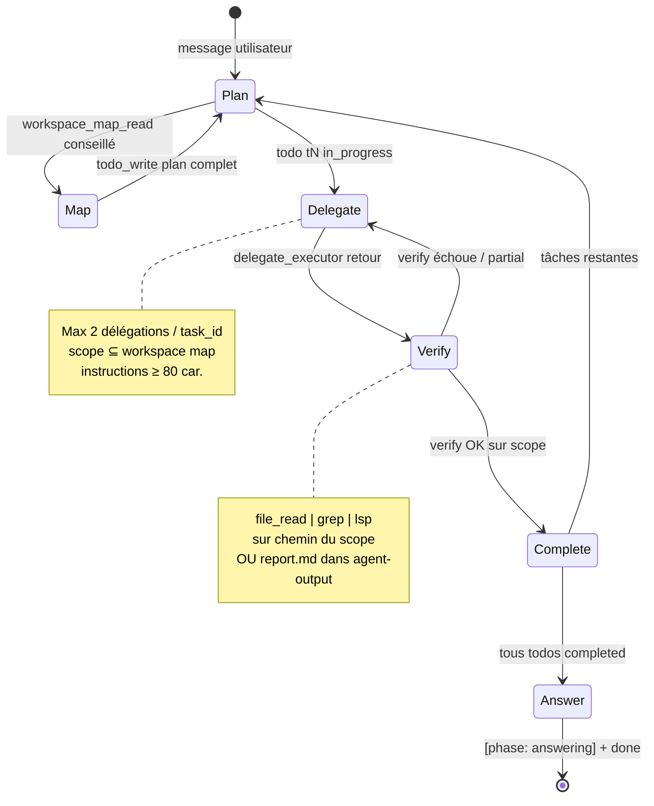
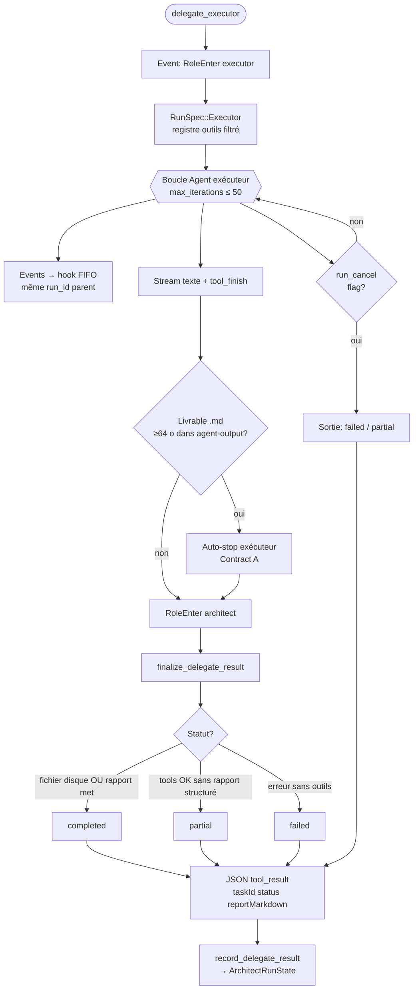
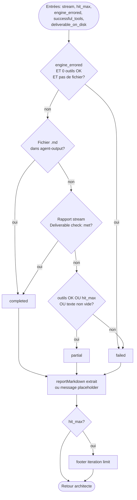
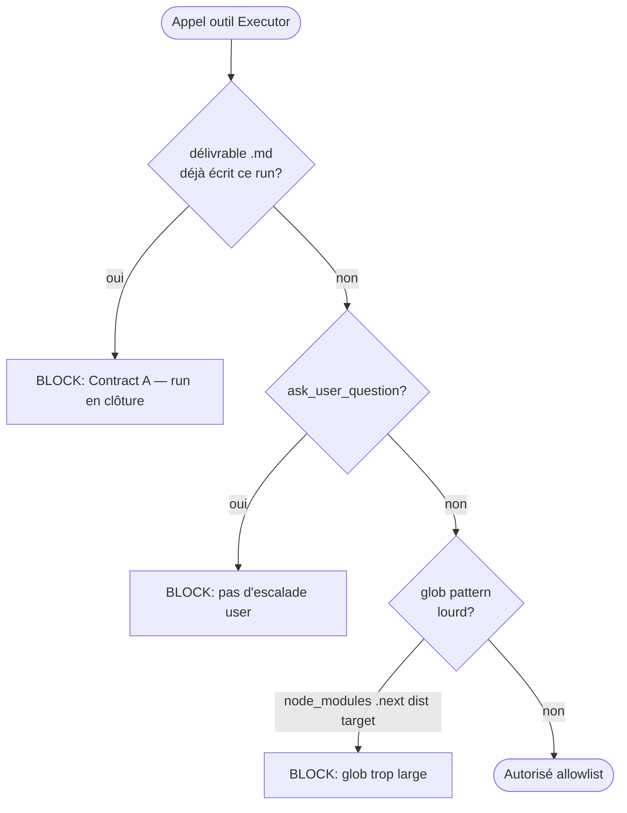
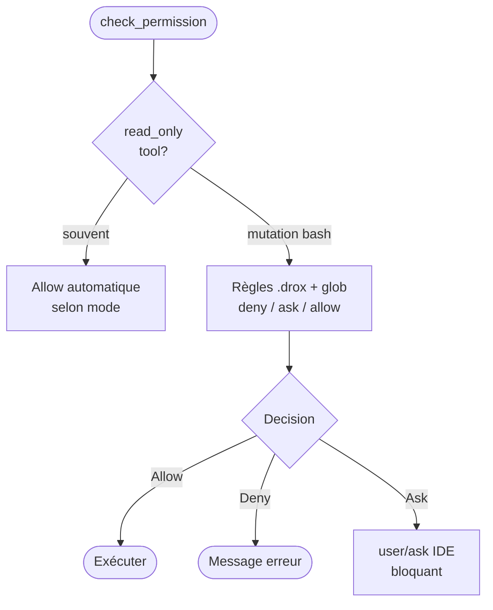
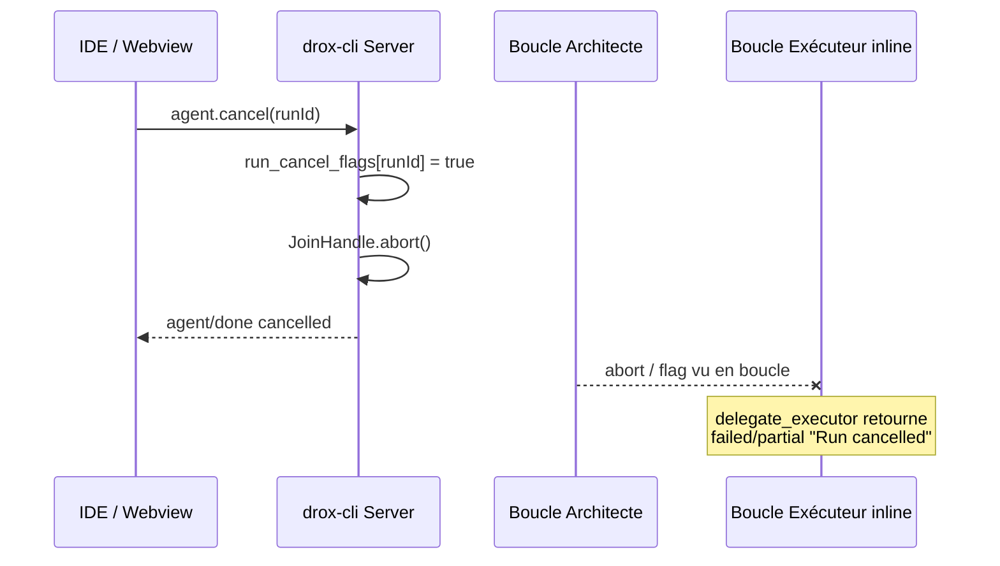
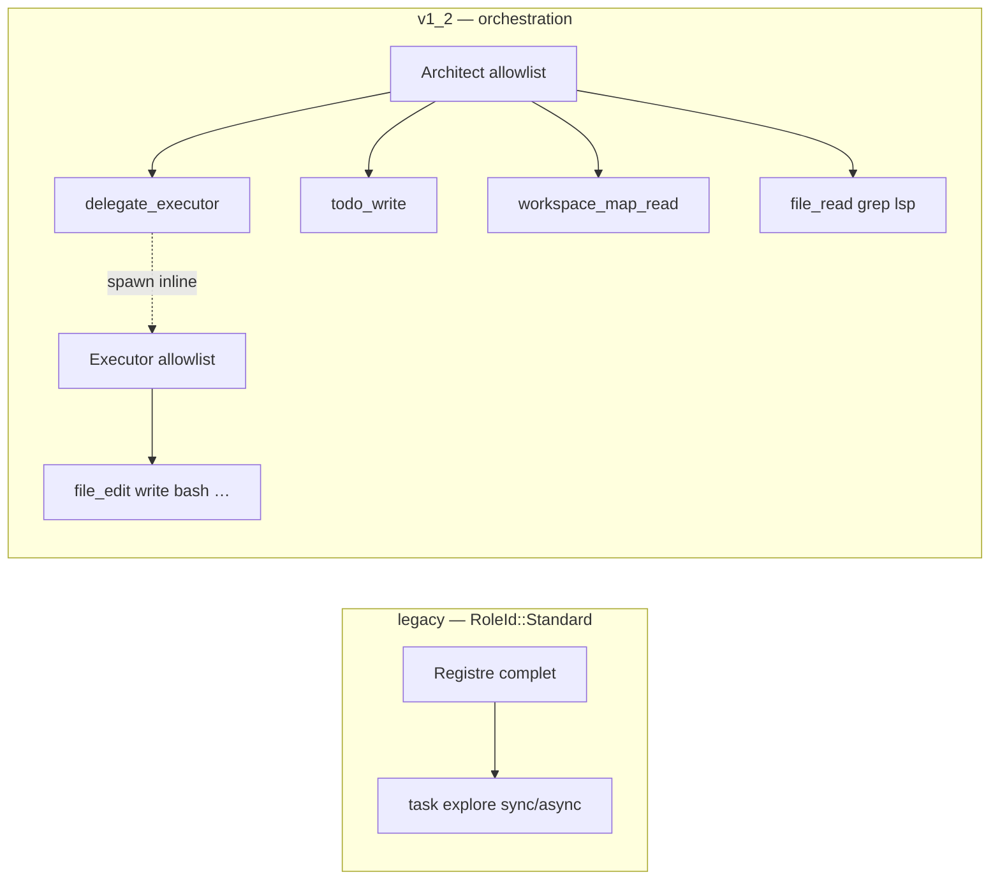

# Cartographie — branches de décision du moteur Drox

**Version** : 1.2.0  
**Statut** : document de référence (cartographie)  
**Dernière mise à jour** : 2026-05-26  

Ce document retrace **visuellement** les principaux embranchements du moteur (`drox-engine` + `drox-cli` JSON-RPC). Il complète :

- [VISION-CONSOLIDEE-1.2.0.md](../steps/01-vision/VISION-CONSOLIDEE-1.2.0.md)
- [ARCHITECT-STATE-MACHINE.md](../steps/08-architect-state/ARCHITECT-STATE-MACHINE.md)
- [ORCHESTRATION-ROLES-TOOLS.md](../steps/07-roles-tools/ORCHESTRATION-ROLES-TOOLS.md)

**Sources code** (points d’entrée) :

| Zone | Fichiers |
|------|----------|
| Entrée RPC | `drox-cli/src/jsonrpc/handlers/agent_run.rs`, `orchestration_run.rs` |
| Boucle agent | `drox-engine/src/agent/loop.rs` |
| Gates | `drox-engine/src/agent/gates.rs`, `architect_gates.rs`, `executor_gates.rs` |
| État architecte | `drox-engine/src/agent/architect_state.rs` |
| Délégation | `drox-engine/src/orchestration_delegate.rs`, `orchestration/delegate_report.rs` |
| Contrat run | `drox-engine/src/run_spec/mod.rs` |
| Permissions | `drox-permissions`, `drox-engine/src/permissions.rs` |

---

## 1. Entrée d’un run (`agent.run`)

```mermaid
flowchart TD
    A[Client IDE: agent.run] --> B{orchestrationMode<br/>param ou DROX_ORCHESTRATION}
    B -->|legacy / défaut| C[RunSpec::Standard<br/>subagents optionnels]
    B -->|v1_2| D[RunSpec::Architect<br/>delegate_executor câblé]
    C --> E[build_agent_setup + drive_run]
    D --> F[build_agent_setup Architect<br/>+ EngineOrchestrationDelegate]
    F --> G[drive_role_run Architect]
    E --> H[Agent::run_with_history]
    G --> H
    H --> I{{Boucle agent<br/>loop.rs}}
    I --> J[agent/done<br/>completed | error | cancelled]
    K[agent.cancel] --> L[cancel_run: flag + abort JoinHandle]
    L --> J
```

**Décisions clés**

- `OrchestrationMode::resolve` : param RPC > variable d’env `DROX_ORCHESTRATION` > `legacy`.
- En `v1_2`, un seul run ID parent ; l’exécuteur tourne **inline** dans l’outil `delegate_executor` (pas de second `agent.run` enregistré).
- `agent.cancel` pose un drapeau d’annulation consulté dans la boucle exécuteur et les relais d’événements.

---

## 2. Boucle agent — un tour LLM

Chaque itération du run passe par cette cascade (simplifiée).

```mermaid
flowchart TD
    START([Début tour]) --> LLM[Appel LLM + stream]
    LLM --> PARSE[Parser texte + tool_calls]
    PARSE --> PHASE_TXT{Marqueurs<br/>[phase: …] dans le texte?}
    PHASE_TXT -->|done sans answering| NUDGE_A[Nudge: answering avant done]
    PHASE_TXT -->|OK| EMPTY{tool_calls<br/>vides?}
    EMPTY -->|oui + pas done| NUDGE_B[Nudge: continuer ou clôturer]
    EMPTY -->|non| BATCH[partition_tool_calls<br/>sériel / parallèle]
    BATCH --> FOR_EACH[Pour chaque tool_call]
    FOR_EACH --> PRE[tool_pre_gate_block]
    PRE -->|Some msg| ERR[tool_result is_error<br/>+ nudge modèle]
    PRE -->|None| PERM[check_permission]
    PERM -->|Denied / Ask| ERR2[Résultat bloqué ou user/ask]
    PERM -->|Allow| EXEC[Exécuter outil]
    EXEC --> REC[Enregistrer succès<br/>architect_state / compteurs]
    REC --> FOR_EACH
    FOR_EACH --> NEXT{Encore des tours?<br/>max_iterations}
    NEXT -->|oui| START
    NEXT -->|non| STOP([Stop / MaxIterations])
```

**Branches parallèles** (`tool_orchestration`) : outils read-only consécutifs peuvent être groupés ; `task` background = file d’attente séparée (legacy).

---

## 3. Pipeline pré-exécution d’un outil (`tool_pre_gate_block`)

Ordre d’évaluation **fixe** (premier blocage gagne).



---

## 4. Orchestration v1_2 — machine à états Architecte

Contrat produit (gates + prompts). Les transitions **bloquées** renvoient un message dans le résultat d’outil.



---

## 5. Gates Architecte — arbre de décision

```mermaid
flowchart TD
    CALL([Appel outil Architecte]) --> NOM{Nom outil?}

    NOM -->|delegate_executor| D1{todo_write réussi<br/>dans le run?}
    D1 -->|non| B1[BLOCK: plan requis]
    D1 -->|oui| D2{workspace_map_read<br/>déjà fait?}
    D2 -->|non| B2[BLOCK: carte workspace]
    D2 -->|oui| D3{scope ⊆ paths<br/>de la carte?}
    D3 -->|non| B3[BLOCK: chemins + suggestions]
    D3 -->|oui| D4{instructions<br/>≥ 80 chars?}
    D4 -->|non| B4[BLOCK: brief trop court]
    D4 -->|oui| D5{délégations task_id<br/>≥ 2?}
    D5 -->|oui| B5[BLOCK: cap re-delegate]
    D5 -->|non| OK1([Autorisé])

    NOM -->|todo_write| T0{marque completed<br/>pour task_id?}
    T0 -->|jamais delegate_executor| B0[BLOCK: déléguer d'abord]
    T0 -->|délégué + pas verified| B6[BLOCK: verify sur scope]
    T0 -->|délégué + verified| OK1

    NOM -->|lecture / mutation| C1{last_delegate<br/>partial | failed?}
    C1 -->|oui| C2{outil verify<br/>sur scope?}
    C2 -->|oui| OK1
    C2 -->|non| B7[BLOCK: compensation]
    C1 -->|non| C3{reads_since_delegate<br/>≥ 4?}
    C3 -->|oui + read tool| B8[BLOCK: déléguer]
    C3 -->|non| OK1

    NOM -->|autre allowlist| OK1
```

**Auto-verify** (après `delegate_executor`) : si `.drox/agent-output/<task_id>/` contient un `.md`, la tâche peut être marquée vérifiée sans `file_read` architecte ([`architect_state.rs`](../../../drox/crates/drox-engine/src/agent/architect_state.rs)).

---

## 6. Sous-flux `delegate_executor`

L’architecte reste bloqué sur l’outil jusqu’à la fin du run exécuteur inline.



### 6.1 Décision `finalize_delegate_result`



---

## 7. Gates Exécuteur



Après `file_write` / `file_edit` réussi vers `.drox/agent-output/<task_id>/*.md` (≥64 o) : **auto-stop** sans attendre `[phase: done]` ([`executor_deliverable.rs`](../../../drox/crates/drox-engine/src/orchestration/executor_deliverable.rs)).

---

## 8. Permissions (couche B — tous rôles)

Après les gates métier, chaque outil passe par `PermissionPolicy` (mode IDE : `default`, `acceptEdits`, `plan`, Professor, …).



Les gates **moteur** (§3–7) s’appliquent **avant** les permissions : un outil peut être refusé sans même interroger la politique fichier.

---

## 9. Clôture `[phase: done]` (agent Standard / legacy)

En orchestration **Architecte**, la fin utilisateur repose surtout sur la synthèse ; les gates `done` ci-dessous ciblent surtout `RoleId::Standard` et le mode Professor.

```mermaid
flowchart TD
    DONE([Texte contient [phase: done]]) --> G1{RunSpec gate<br/>DoneRequiresAnswering?}
    G1 -->|oui + jamais answering| N1[Nudge / refuse done]
    G1 --> G2{mutation code<br/>sans phase testing?}
    G2 -->|oui| N2[Nudge testing requis]
    G2 --> G3{Professor sans<br/>course_plan_write?}
    G3 -->|oui| N3[Refuse done]
    G3 --> G4{todo encore<br/>pending/in_progress?}
    G4 -->|oui| N4[Refuse done]
    G4 --> OK([Run peut se terminer])
```

---

## 10. Annulation (`agent.cancel`)



---

## 11. Carte des rôles et outils (`RunSpec`)



| Rôle | Mutations repo | Plan visible | Délégation |
|------|----------------|--------------|------------|
| Standard | Oui (selon permissions) | `todo_write` optionnel | `task` subagent |
| Architect | Non (gates) | `todo_write` obligatoire avant delegate | `delegate_executor` |
| Executor | Oui (scope brief) | Mini-plan interne | Aucune |

---

## 12. Légende et maintenance

| Symbole | Signification |
|---------|----------------|
| Rectangle | Action / traitement |
| Losange | Branche conditionnelle |
| `BLOCK` | Résultat outil `is_error: true` + message gate |
| Hook FIFO | `orchestration_delegate_hook` — événements exécuteur sur `run_id` parent |

**Quand mettre à jour ce doc**

- Nouveau gate dans `architect_gates.rs` / `executor_gates.rs` / `gates.rs`
- Changement de statuts `DelegateStatus` ou de `finalize_delegate_result`
- Nouveau mode `OrchestrationMode` ou rôle `RoleId`
- P4+ (chefs, parallèle) : ajouter §13 avec graphe `depends_on`

**Retours terrain** : [retour_discussion/chat1](../retour_discussion/chat1) (smoke site-kdds, 2026-05-26).

---

## 13. Index des diagrammes

| § | Sujet |
|---|--------|
| 1 | Entrée `agent.run` |
| 2 | Boucle agent (tour LLM) |
| 3 | Pipeline `tool_pre_gate_block` |
| 4 | Machine à états Architecte |
| 5 | Arbre gates Architecte |
| 6 | `delegate_executor` + finalize statut |
| 7 | Gates Exécuteur |
| 8 | Permissions |
| 9 | `[phase: done]` legacy |
| 10 | Annulation |
| 11 | Rôles / allowlists |
