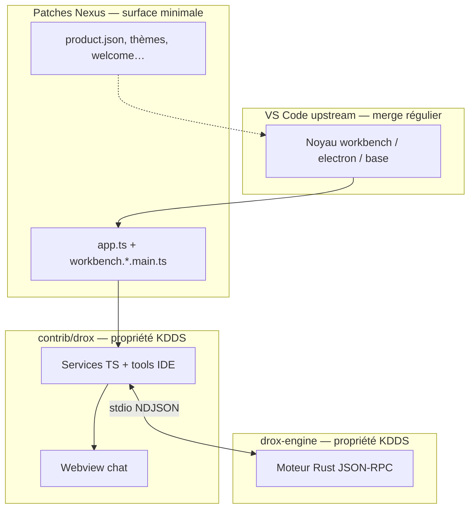

# Architecture — découplage moteur / UI / VS Code et mises à jour upstream

**Version** : 1.2.0  
**Date** : 2026-05-25  
**Statut** : règles structurantes (à respecter avant tout chantier 1.2.0)  
**Lié à** : [VISION-ORCHESTRATION-MULTI-ROLES.md](../01-vision/VISION-ORCHESTRATION-MULTI-ROLES.md) · archive [PLAN-INTEGRATION](../../../0.0.0/plans/PLAN-INTEGRATION.md)

---

## 1. Objectif

Garantir que **Microsoft VS Code** (upstream) peut être **intégré régulièrement** dans le fork **KDDS Nexus** sans :

- perdre le **moteur Drox** (`drox-engine/`) ;
- perdre l’**UI chat** travaillée (webview + workbench `contrib/drox`) ;
- mélanger la logique agentique 1.2.0 dans le noyau VS Code (coût de merge explosif).

Ce document fixe **où vit quoi**, **ce qui est protégé**, et **comment merger upstream**.

---

## 2. Les trois actifs à protéger

| Actif | Emplacement canonique | Mis à jour comment |
|-------|----------------------|-------------------|
| **Moteur Drox** | `drox-engine/drox/` (Rust, `drox --serve`) | `cargo build`, CI `drox-rust.yml`, semver contrat RPC |
| **UI Drox** | `src/vs/workbench/contrib/drox/browser/media/droxChat/` + `droxChatMvp.{js,css}` + façade TS `browser/chat/` | Évolution produit ; **pas** dans `src/vs/base/` ni `contrib/chat/` |
| **Adaptateur IDE** | `src/vs/workbench/contrib/drox/` (hors `media/`) | Services workbench, `tool/exec`, IPC, settings `nexus.drox.*` |

**Hors produit runtime** : `drox-engine/extension-vscode/` — référence / F5 uniquement, **pas** chargée par Nexus en prod (cf. PLAN-INTEGRATION I-39).

---

## 3. Diagramme de dépendances (sens autorisés)



**Règle d’or** : les flèches vont **du fork vers Drox**, jamais l’inverse dans le noyau Microsoft.

| Interdit | Pourquoi |
|----------|----------|
| Logique agent (rôles, séquences, orchestration) dans `src/vs/workbench/contrib/chat/` | Merge upstream quasi impossible |
| Appels Ollama / boucle agent dans le renderer | Perf + couplage UI/moteur |
| Dépendance runtime à `extension-vscode/` | Double pile, divergence |
| Modifier massivement `src/vs/base/` pour Drox | Chaque release VS Code = conflits |

---

## 4. Contrat stable entre les couches

### 4.1 Moteur ↔ IDE : JSON-RPC NDJSON

- **Transport** : processus enfant `drox --serve`, une ligne JSON par message.
- **Spécification** : `docs/0.0.0/architecture/PROTOCOLE-JSONRPC.md` (évoluera en `1.2.0/` avec versionnage si besoin).
- **Événements UI** : `agent/event`, `agent/done`, hooks sous-agents — le webview **ne parse pas** le protocole Ollama.

Tant que ce contrat est respecté ou versionné (`initialize.capabilities`), le moteur 1.2.0 (architecte, séquences, multi-rôles) peut évoluer **sans recompiler** tout le workbench.

### 4.2 IDE ↔ UI : `postMessage` + services

- **Webview** : modules `droxChat/*.js` — présentation, phases, cartes sous-agents, composer.
- **Façade TS** : `droxChatController`, `droxChatWebviewRouter`, `droxChatAgentEvents` — traduction RPC → messages webview.
- **Aucune** logique métier agent dans le JS (pas de second moteur dans le navigateur).

### 4.3 Tools IDE : `tool/exec`

Mutations et intégration workspace (`file_edit`, `bash`, `lsp`, …) restent côté **adaptateur** ; le moteur émet des demandes, l’IDE exécute. Upstream VS Code peut changer `IFileService` / terminal : on adapte **uniquement** `contrib/drox/electron-browser/tools/`.

---

## 5. Registre des modifications **hors** `contrib/drox`

Fichiers à traiter **à la main** à chaque merge upstream. Objectif long terme : **réduire** cette liste.

| Fichier | Rôle | Priorité repli upstream | Action cible 1.2.0 |
|---------|------|-------------------------|-------------------|
| `src/vs/code/electron-main/app.ts` | Enregistrement canal IPC `DroxEngineChannel` | **Haute** | Garder minimal (bloc ~5 lignes) ; documenter marqueur `// DROX-NEXUS-START` |
| `src/vs/workbench/workbench.common.main.ts` | Import `contrib/drox/browser/drox.contribution.js` | Faible | 1 ligne — conflit rare |
| `src/vs/workbench/workbench.desktop.main.ts` | Import `contrib/drox/electron-browser/drox.contribution.js` | Faible | 1 ligne |
| `src/vs/workbench/contrib/welcomeGettingStarted/*` | Page d’accueil Nexus / Drox | Moyenne | À terme : contribution séparée ou override via API stable |
| `src/vs/base/browser/ui/sash/sash.css` | Style sash « Nexus beam » | Faible | Variables déjà dans `vscode-known-variables.json` |
| `src/vs/workbench/services/extensions/electron-browser/localProcessExtensionHost.ts` | `nexus.llm.*` → env Copilot extensions | Moyenne | Évaluer déplacement vers service Nexus dédié |
| `product.json` | Branding KDDS Nexus | Faible | Merge trivial si séparé en patch |
| `extensions/theme-defaults/themes/nexus-*.json` | Thèmes | Faible | Propriété fork, pas upstream |
| `build/lib/stylelint/vscode-known-variables.json` | Vars CSS `--drox-*`, `--nexus-*` | Faible | Ajouts en fin de liste |
| `resources/drox/<platform>/drox` | Binaire embarqué release | — | Hors merge VS Code (build produit) |

**Tout le reste de Drox** doit vivre sous `contrib/drox/` ou `drox-engine/`.

---

## 6. Ce qui survit à un merge upstream (garanties)

| Composant | Survit si… |
|-----------|------------|
| **Moteur Rust** | `drox-engine/` n’est **pas** écrasé par upstream (dossier **propre au fork**) — merge Git ne le touche pas tant qu’il n’y a pas de conflit de renommage racine |
| **UI webview** | Fichiers sous `contrib/drox/browser/media/` préservés ; résoudre conflits **dans ce dossier** uniquement |
| **Adaptateur TS** | Idem `contrib/drox/**` ; tests `droxCommon.test.ts` verts après merge |
| **Binaire packagé** | `npm run package-drox` rejoué après bump VS Code (script indépendant) |

Un merge upstream **ne supprime pas** `drox-engine/` ni `contrib/drox/` sauf erreur humaine — Git les garde comme ajouts fork.

---

## 7. Processus recommandé — suivre VS Code

### 7.1 Remotes Git

```bash
git remote add upstream https://github.com/microsoft/vscode.git
git fetch upstream
```

Branche de travail suggérée : `integrate/vscode-<version>` (ex. `integrate/vscode-1.116`).

### 7.2 Cycle de merge (checklist)

1. **Taguer** l’état actuel du fork (`nexus-pre-upstream-YYYYMMDD`).
2. **Merge** `upstream/main` (ou release tag Microsoft) dans la branche d’intégration.
3. **Résoudre conflits** dans l’ordre :
   - `product.json`, thèmes (Nexus)
   - Registre §5 (hooks noyau)
   - `contrib/drox/` (UI + adaptateur)
   - **Ne pas** toucher `drox-engine/` sauf conflit accidentel
4. **Build** : `npm run compile` (racine fork).
5. **Moteur** : `cd drox-engine/drox && cargo test --workspace`.
6. **Tests fork** : tests unitaires `contrib/drox/test/`.
7. **Smoke manuel** : `.\scripts\code.bat` → chat Drox, un run agent, un `file_read` + un tool IDE.
8. **Merge** branche d’intégration → `main` Nexus.

### 7.3 Critères « merge réussi »

- [ ] Chat Drox s’ouvre (`workbench.action.openDroxChat`).
- [ ] Moteur spawn (`Drox (moteur)` dans Output).
- [ ] `agent.run` stream + phases visibles.
- [ ] Au moins un tool IDE (`file_read` ou `bash`) OK.
- [ ] Aucune régression sur webview (composer, onglets, sous-agents UI).

---

## 8. Règles de développement 1.2.0 (multi-rôles)

Pour ne pas compromettre les mises à jour VS Code :

| Règle | Application |
|-------|-------------|
| **R1** | Nouveaux rôles (architecte, chef, exécutant) → **moteur Rust** + extensions RPC |
| **R2** | Nouveaux statuts / cartes UI → **webview** + mapping dans `droxChatAgentEvents.ts` |
| **R3** | Nouveaux tools workspace → `drox-tools` (Rust) si read-only moteur ; sinon `electron-browser/tools/` |
| **R4** | Pas de fork de `contrib/chat` pour l’agent Drox |
| **R5** | Tout patch noyau (`app.ts`, etc.) → commentaire `// DROX-NEXUS` + entrée dans §5 de ce doc |
| **R6** | Changement breaking RPC → champ `protocolVersion` ou doc + adaptation unique dans `droxRpcClientMain.ts` |

---

## 9. Séparation des builds

| Commande | Produit |
|----------|---------|
| `npm run watch` / `compile` | Fork VS Code + contrib Drox |
| `cargo build -p drox-cli` | Binaire `drox` seul |
| `npm run package-drox` | Binaire dans `resources/drox/` |

CI idéale (déjà partielle) :

- **Job Rust** sur `drox-engine/` — indépendant du build VS Code.
- **Job hygiene + compile** sur le fork — détecte cassures workbench.
- Optionnel : job qui **liste** les fichiers hors `contrib/drox` contenant `drox|Drox|nexus` (régression surface merge).

---

## 10. Risques résiduels et mitigations

| Risque | Mitigation |
|--------|------------|
| Conflit massif sur `app.ts` | Bloc IPC isolé ; envisager contribution API Electron officielle à long terme |
| Welcome page modifiée upstream | Fichier dédié `gettingStartedContent.ts` — un seul point de merge |
| Hygiene / eslint (`localize` string literal) | Pre-commit déjà actif — ne pas bypass |
| Dérive logique dans Copilot chat | Drox reste panneau **séparé** ; pas de fusion avec chat natif |
| `extension-vscode` diverge du fork | Traiter extension comme **spec** ; implémentation de référence = `contrib/drox` |

---

## 11. État actuel du repo (audit 2026-05-25)

| Critère | Statut |
|---------|--------|
| Moteur processus isolé + JSON-RPC | ✅ (PLAN-INTEGRATION I-04–I-06) |
| UI dans `contrib/drox` + webview modulaire | ✅ (`droxChat/`, CHAT-WEBVIEW-MODULES) |
| Pas de runtime `extension-vscode/` | ✅ |
| Remote `upstream` configuré | ⬜ **À faire** |
| Doc merge upstream | ✅ **Ce document** |
| Patches noyau minimaux | 🟡 ~6 fichiers hors contrib (§5) |

---

## 12. Prochaines actions suggérées

1. **Configurer** `git remote add upstream` sur le clone équipe.
2. **Premier merge test** sur branche `integrate/vscode-*` (sans pression release).
3. **Script** `scripts/list-nexus-patches.ps1` (optionnel) : liste des fichiers §5 pour revue avant merge.
4. Dériver de ce doc un **PLAN-UPSTREAM-1.2.0.md** quand la version cible Microsoft est choisie.

---

## 13. Synthèse

**Oui**, VS Code peut être mis à jour sans perdre ni l’UI ni le moteur, parce que :

1. Le **moteur** vit dans un arbre **séparé** et parle par **contrat**.
2. L’**UI** vit dans une **contribution workbench** dédiée, pas dispersée dans le noyau.
3. Seuls **quelques crochets** relient Nexus au main process — liste fermée et documentée.

La condition est **processuelle** : merges upstream réguliers, respect des règles §8, et ne pas laisser la logique 1.2.0 « fuir » dans `src/vs/workbench/contrib/chat/` ou `src/vs/code/` au-delà du strict nécessaire.
