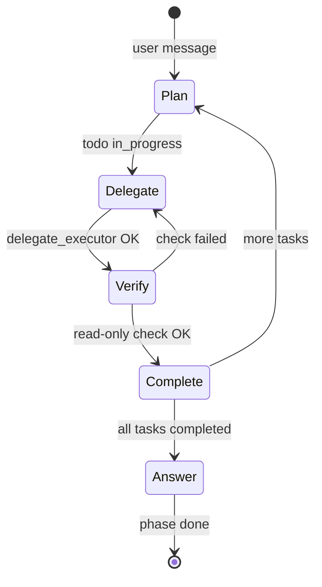

# Architect state machine (Drox 1.2.0)

Frozen contract for **Architect ↔ Executor** orchestration. Default language for prompts and tool copy: **English**.

## Principles

| Principle | Architect | Executor |
|-----------|-----------|----------|
| Plan | `todo_write` — free breakdown (`t1`, `t2`, …) | Optional mini-plan only inside task |
| Mutations / bash / heavy scan | **Never** — `delegate_executor` | **Yes** |
| Deep analysis | Delegate; verify with **one** read pass (scope paths + `.drox/agent-output/<id>/*.md`) | Execute + write deliverable `.md` |
| User-facing text | Short summary at end | On-disk report (stream template optional) |
| UI | Plan + executor cards + tools (transparent) | Nested under executor card |

## States (architect run)



1. **Plan** — `todo_write` (no item cap), visible in UI.
2. **Delegate** — single `delegate_executor` per attempt (`task_id` = todo `id`).
3. **Verify** — `file_read` / `grep` / `lsp` (targeted); workspace wins over report.
4. **Complete** — mark todo `completed`; no re-delegate if deliverable already met.
5. **Answer** — one user summary → `[phase: done]`.

## Executor closure — Contract A (on-disk deliverable)

1. Executor writes a **`.md` ≥ 64 bytes** under `.drox/agent-output/<task_id>/` (prefer `report.md`).
2. Engine **auto-stops** the sub-run after successful `file_write` / `file_edit` to that folder — no reliance on `[phase: done]`.
3. `finalize_delegate_result` marks **`completed`** if the file exists, even when the stream looped.
4. Optional stream template below (for UI / architect skim) — **not** the source of truth.

## Executor report template (optional stream)

```markdown
## Executor report · {task_id}

**Status:** completed | partial | blocked

**Deliverable check:** met | not met — one line

**What I did:** bullets

**Evidence:** paths, commands, grep hits

**Deep notes:** optional — stack, risks
```

Engine may append engine-warning footers; architect still verifies once.

## Gates (engine)

| Gate | When | Action |
|------|------|--------|
| Allowlist | always | Architect: no `bash` / `file_edit` / `task` / … |
| Monolith reads | ≥4 read tools without `delegate_executor` since last delegate | Block with delegate hint |
| Re-delegate cap | same `task_id` delegated ≥2 times | Block — verify first |
| Delegate before `completed` | `todo_write` marks any task `completed` | Block until `delegate_executor` was called for that `task_id` (fixes chat2 shortcut — 2026-05-26) |
| Verify before `completed` | `todo_write` marks delegated task done | Block until task is in `verified_task_ids` (`file_read` / `grep` / `lsp` on `scope`, or `.drox/agent-output/<id>/` artifact) |
| Deliverable met (Contract A) | Executor after `.md` written under `.drox/agent-output/<id>/` | Block further tools; engine auto-stops sub-run |
| Todo cap | None (no `max_todo_items` gate) |
| Session end | model calls `session_end` | Block |

## UI ordering (IDE)

1. Events from delegate hook → **FIFO channel** (no per-event `spawn` races).
2. While executor card is **running**, relayed `tool` / `phase` / `delta` mount **inside** the card.
3. `todo_write` updates during executor run are **queued** until `subagentDone`.
4. `delegate_executor` stays hidden; `subagentStart` / `subagentDone` frame the block.

## Implementation phases

| Phase | Scope | Files |
|-------|--------|-------|
| **P1** | Prompts + Contract A deliverable | `orchestration/prompts.rs`, `orchestration/executor_deliverable.rs` |
| **P2** | Architect gates + loop counters | `agent/gates.rs`, `agent/loop.rs` |
| **P3** | Ordered delegate notifications | `drox-cli/.../agent_run.rs` |
| **P4** | Webview sequencing | `droxChat/00-context.js`, `07-log.js`, `09-host.js`, `02-chrome.js`, `droxChatMvp.css` |

## Smoke test (chat1-like)

1. Open workspace `site-kdds` (or similar).
2. Ask: analyse structure + change one subtitle line.
3. Expect: plan → one executor card with tools inside → architect verify tools → single final summary.
4. Export transcript — no duplicate « done » blocks, no `glob` unknown on architect registry.

## References

- [ORCHESTRATION-ROLES-TOOLS.md](../07-roles-tools/ORCHESTRATION-ROLES-TOOLS.md)
- [VISION-ORCHESTRATION-MULTI-ROLES.md](../01-vision/VISION-ORCHESTRATION-MULTI-ROLES.md)
- Field notes: [retour_discussion/chat1](../../retour_discussion/chat1)
