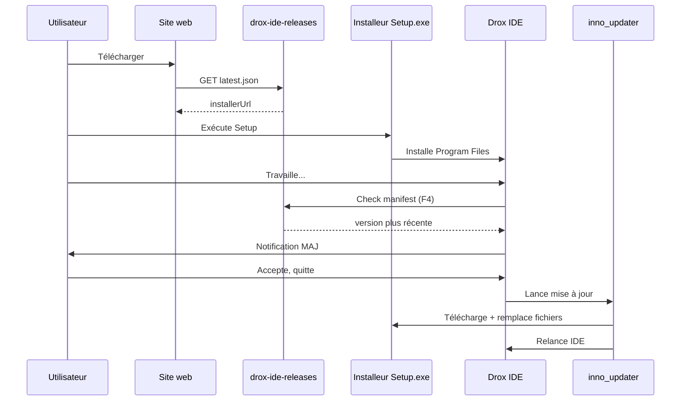

# Plan d’implémentation — Distribution Drox IDE (build, installeur, launcher)

**Statut** : plan actif  
**Date** : 2026-05-28  
**Public** : build / release / produit  
**Complète** : [FINALISATION-DISTRIBUTION.md](./FINALISATION-DISTRIBUTION.md) (cadrage) · [CRITERES-TEST-REEL.md](./CRITERES-TEST-REEL.md) (prérequis terrain)

---

## 1. Rappel de l’approche (validée)

Quatre couches distinctes — **ne pas les confondre** :

```text
┌─────────────────────────────────────────────────────────────────┐
│  Couche 4 — Canal public (sans sources)                          │
│  drox-ide-releases / GitHub Releases → latest.json + Setup.exe   │
└───────────────────────────────┬─────────────────────────────────┘
                                │
┌───────────────────────────────▼─────────────────────────────────┐
│  Couche 3 — MAJ hybride                                          │
│  • Notification dans Drox IDE (workbench)                        │
│  • Updater externe (inno_updater ou launcher) remplace fichiers   │
└───────────────────────────────┬─────────────────────────────────┘
                                │
┌───────────────────────────────▼─────────────────────────────────┐
│  Couche 2 — Installeur Windows                                   │
│  Drox-IDE-Setup-x.y.z.exe (Inno Setup, hérité Code OSS)           │
└───────────────────────────────┬─────────────────────────────────┘
                                │
┌───────────────────────────────▼─────────────────────────────────┐
│  Couche 1 — Application packagée                                   │
│  Dossier VSCode-win32-x64/ + Drox IDE.exe + resources/drox/      │
└─────────────────────────────────────────────────────────────────┘
```

| Couche | Livrable utilisateur | Rôle |
|--------|----------------------|------|
| **1** | `Drox IDE.exe` + dossier d’install | L’éditeur (Electron + workbench + moteur embarqué) |
| **2** | `Drox-IDE-Setup-1.3.0.exe` | Première installation, raccourcis, désinstalleur |
| **3** | Notification + updater | Mises à jour sans exposer le monorepo |
| **4** | URL de téléchargement | Binaires publics, pas le repo dev |

**Décision produit figée** : marque **Drox IDE**, moteur **Drox** (`product.json` — voir phase P0).

---

## 2. État actuel du dépôt (point de départ)

| Élément | Statut | Fichiers / commandes |
|---------|--------|----------------------|
| Branding `product.json` | ✅ Fait (2026-05-28) | `nameShort` = Drox IDE, `dataFolderName` = `.drox-ide`, `applicationName` = `drox-ide` |
| Settings IDE | ✅ `drox.*` + migration `nexus.drox.*` | `droxConfiguration.ts`, `droxSettingMigration.ts` |
| Embarquement moteur | ✅ Script prêt | `npm run package-drox` → `resources/drox/win32-x64/drox.exe` |
| Build dev | ✅ Documenté | `npm run watch` + `.\scripts\code.bat` |
| Pipeline gulp win32 | ⚠️ Hérité upstream, **non validé** sur ce fork | `build/gulpfile.vscode.win32.ts`, `build/win32/code.iss` |
| `inno_updater.exe` | ⚠️ Présent upstream | `build/win32/inno_updater.exe`, tâche `vscode-win32-x64-inno-updater` |
| Module update IDE | ⚠️ Pointe serveurs **Microsoft** par défaut | `src/vs/workbench/contrib/update/` |
| Installeur Drox custom | ❌ | Adapter `code.iss` / noms Setup |
| Canal releases + `latest.json` | ❌ | Repo `drox-ide-releases` à créer |
| Notification MAJ Drox | ❌ | Nouveau module ou fork `contrib/update` |

---

## 3. Phases d’exécution

Ordre recommandé : **P0 → F1 → F2 → F3 → F4 → F5 → F6 → F7**.  
**F0** (test terrain) peut chevaucher P0/F1 mais **F2+** seulement si F0 minimal OK.

### P0 — Branding & assets (clôture rebrand)

**Objectif** : aucune référence utilisateur « Nexus » / `kdds-nexus` dans le package installé.

| # | Tâche | Fichiers | Critère |
|---|--------|----------|---------|
| P0.1 | Vérifier `product.json` (exe, mutex, protocole, AppId) | `product.json` | Titre fenêtre = **Drox IDE** |
| P0.2 | Icônes Windows / manifeste | `resources/win32/code.ico`, `VisualElementsManifest.xml` | Raccourci et barre des tâches cohérents |
| P0.3 | Rebuild Electron après rename | `npm run electron` | `.build/electron/Drox IDE.exe` (ou équivalent) |
| P0.4 | Audit chaînes UI restantes | grep `Nexus`, `kdds-nexus`, `nexus.drox` dans `src/vs/workbench/contrib/drox` | Zéro chaîne utilisateur obsolète |
| P0.5 | NOTICE / attribution Code OSS | `ThirdPartyNotices.txt`, `LICENSE.txt` dans package | Conformité MIT |

**Note** : le **nom du repo Git** (`Drox---IDE`, privé) est distinct du **produit installé** (`Drox IDE`) — seul ce dernier compte pour la distribution publique.

---

### F1 — Build application packagée (couche 1)

**Objectif** : produire localement un dossier **`../VSCode-win32-x64`** (parent du repo) installable sans sources.

#### Prérequis machine (Windows x64)

- Node 22+ (aligné `package.json` engines)
- Rust toolchain (pour `package-drox`)
- Inno Setup (via `npm install` → `innosetup` déjà en devDependency)
- Espace disque ~15–25 Go (build + artefact)
- **Windows SDK** (optionnel) : `signtool.exe` pour `patchWin32Dependencies` — le fork ignore son absence en build local OSS ; la CI Azure ajoute le SDK au `PATH`

#### Séquence manuelle (première fois)

```powershell
# Racine du fork
cd C:\Users\coren\Desktop\GitHub\Drox---IDE

npm install
npm run electron                    # binaire Electron + nom produit

# Moteur Drox release embarqué
npm run package-drox                # → resources/drox/win32-x64/drox.exe

# Extension Copilot built-in (obligatoire avant min-ci en build local)
npm run gulp compile-copilot-extension-build

# Compilation complète (long — suivre doc upstream / CI)
npm run gulp vscode-win32-x64-min-ci
npm run gulp vscode-win32-x64-inno-updater
```

> **À valider** : le nom exact de la tâche gulp `*-min-ci` sur ce fork (référence CI : `build/azure-pipelines/win32/steps/product-build-win32-compile.yml`). Si la tâche échoue, documenter l’écart dans `retour_discussion/` et ajuster le plan (souvent `minify-vscode` + tâche platform win32).

#### Artefacts attendus

| Chemin | Contenu |
|--------|---------|
| `..\VSCode-win32-x64\Drox IDE.exe` | Exécutable principal (nom depuis `product.nameShort`) |
| `..\VSCode-win32-x64\resources\app\` | JS minifié, extensions built-in, `product.json` |
| `..\VSCode-win32-x64\resources\app\resources\drox\win32-x64\drox.exe` | Moteur (après `package-drox` **avant** gulp si le script copie dans `resources/`) |
| `..\VSCode-win32-x64\tools\inno_updater.exe` | Binaire MAJ (après tâche inno-updater) |

#### Tâches planifiées (repo)

| ID | Tâche | Livrable |
|----|--------|----------|
| F1.1 | Script documenté `scripts/build-release-win32.ps1` (enchaîne package-drox + gulp) | ✅ `npm run build-release-win32` · [DROX.md](../../../../DROX.md) |
| F1.2 | Smoke : lancer `Drox IDE.exe` depuis le dossier packagé (sans `code.bat`) | Checklist dans ce doc §8 |
| F1.3 | Vérifier résolution `drox.executablePath` → `resources/drox/...` (à côté de `resources/app/` en package) | Chat Drox démarre un run |
| F1.3b | Assets webview copiés (`build/next/index.ts` → `contrib/drox/browser/media/**`) | Pas de rectangles blancs / chat mort |
| F1.4 | Exclure sources du dossier (audit taille + pas de `src/`, pas de `drox-engine/crates/`) | Liste fichiers interdits |

**Dépendances** : P0.3 (exe nommé).

---

### F2 — Installeur Windows (couche 2)

**Objectif** : `Drox-IDE-Setup-<version>-win32-x64.exe` installant dans `Program Files\Drox IDE\`.

#### Approche retenue

Réutiliser le flux **Inno Setup** Code OSS (`build/win32/code.iss`, `build/gulpfile.vscode.win32.ts`) — **pas** electron-builder.

#### Tâches

| ID | Tâche | Fichiers | Notes |
|----|--------|----------|-------|
| F2.1 | Adapter libellés Setup (titre, nom court) | `build/win32/code.iss`, définitions gulp | Remplacer chaînes « Code » si hardcodées |
| F2.2 | Tâches gulp setup user + system | `npm run gulp vscode-win32-x64-user-setup` (et system) | Sortie sous `.build/win32-x64/*-setup/` |
| F2.3 | Test install VM / machine propre | — | Désinstalleur OK, raccourci Menu Démarrer |
| F2.4 | Option zip portable | Copie `VSCode-win32-x64` → zip | Pour power-users (D-F3) |
| F2.5 | WebView2 / VC++ runtime | Hérité `vcruntime140.dll` + doc utilisateur | Comme VS Code |

**Dépendances** : F1 réussi.

---

### F3 — Canal de production sans sources (couche 4)

**Objectif** : dépôt public **binaires uniquement** + manifest de version.

#### Structure cible `drox-ide-releases`

```text
drox-ide-releases/
  README.md
  stable/
    latest.json
    1.3.0/
      Drox-IDE-Setup-1.3.0-win32-x64.exe
      Drox-IDE-1.3.0-win32-x64.zip          # optionnel
      SHA256SUMS
      RELEASE_NOTES.md
```

#### Exemple `stable/latest.json`

```json
{
  "version": "1.3.0",
  "released": "2026-06-01",
  "productVersion": "1.3.0",
  "platforms": {
    "win32-x64": {
      "installerUrl": "https://github.com/<org>/drox-ide-releases/releases/download/v1.3.0/Drox-IDE-Setup-1.3.0-win32-x64.exe",
      "sha256": "<hex>",
      "sizeBytes": 0
    }
  },
  "mandatory": false,
  "notesUrl": "https://github.com/<org>/drox-ide-releases/blob/main/stable/1.3.0/RELEASE_NOTES.md"
}
```

#### Tâches

| ID | Tâche | Livrable |
|----|--------|----------|
| F3.1 | Créer repo `drox-ide-releases` (public) | README + licence notices |
| F3.2 | Script `scripts/release-publish.mjs` (SHA256 + tag) | CI ou manuel |
| F3.3 | Hébergement : **GitHub Releases** (MVP) | D-F4 tranché |
| F3.4 | Publier première release `v1.3.0` | Artefacts F2 |

**Dépendances** : F2.

---

### F4 — Notification de mise à jour dans l’IDE (couche 3 — partie UX)

**Objectif** : au démarrage (et menu **Aide → Rechercher les mises à jour**), comparer version installée vs `latest.json`.

#### Stratégie technique

| Option | Description | Recommandation |
|--------|-------------|----------------|
| A | Réutiliser `contrib/update` en changeant l’URL de feed | Rapide si l’API interne le permet |
| B | Nouveau module `contrib/drox/update` | Contrôle total, pas de télémétrie Microsoft |

**Recommandation plan** : **B** pour le MVP — module léger Drox qui :

1. Lit `drox.update.manifestUrl` (setting, défaut URL `stable/latest.json`).
2. Parse JSON (schéma § F3).
3. Affiche notification workbench (même patterns que `updateTitleBarEntry`).
4. Bouton **Télécharger** → ouvre l’URL installeur ou lance l’updater (F5).

#### Tâches

| ID | Tâche | Fichiers indicatifs |
|----|--------|---------------------|
| F4.1 | Setting `drox.update.manifestUrl`, `drox.update.channel` | `droxConfiguration.ts` |
| F4.2 | Service `IDroxUpdateService` | `common/droxUpdate.ts`, `electron-browser/` |
| F4.3 | UI notification + commande palette | `browser/droxUpdateContribution.ts` |
| F4.4 | Désactiver / no-op le update Microsoft si encore actif | `product.json` (`updateUrl` / flags upstream) |
| F4.5 | Tests parse manifest + semver compare | `test/common/droxUpdate.test.ts` |

**Dépendances** : F3 (URL réelle, même fake en dev).

---

### F5 — Updater externe (couche 3 — partie technique)

**Objectif** : appliquer une MAJ **sans** « fichier verrouillé » quand `Drox IDE.exe` tourne.

#### Approche hybride (retenue)

1. L’IDE notifie et propose la MAJ (F4).
2. L’utilisateur accepte → l’IDE se ferme (ou demande fermeture).
3. **`inno_updater.exe`** (déjà dans l’écosystème VS Code) ou petit **`DroxUpdater.exe`** :
   - télécharge le Setup ou patch ;
   - vérifie SHA256 ;
   - remplace fichiers sous `Program Files\Drox IDE\` ;
   - relance `Drox IDE.exe`.

Références code :

- `build/win32/inno_updater.exe`
- `src/vs/platform/update/electron-main/updateService.win32.ts`
- Tâche `vscode-win32-x64-inno-updater`

#### Tâches

| ID | Tâche | Notes |
|----|--------|-------|
| F5.1 | POC : déclencher `inno_updater` avec chemins Drox IDE | Ligne de commande documentée |
| F5.2 | Intégrer lancement depuis `IDroxUpdateService` | Process spawn + logs |
| F5.3 | Gestion échec (rollback / message) | ADR si incomplet |
| F5.4 | Signature Authenticode (optionnel beta) | D-F5 — hors MVP si budget |

**Dépendances** : F4, F2 (même layout d’install).

**Hors scope MVP** : delta updates, Squirrel, plusieurs canaux beta.

---

### F6 — Site vitrine & téléchargement

| ID | Tâche |
|----|--------|
| F6.1 | Page « Télécharger Drox IDE » → URL `latest.json` ou release directe |
| F6.2 | Mention prérequis (Windows 10+, WebView2, Ollama séparé si applicable) |
| F6.3 | Lien notes de version `RELEASE_NOTES.md` |

**Dépendances** : F3.

---

### F7 — Documentation & ADR

| ID | Tâche | Livrable |
|----|--------|----------|
| F7.1 | ADR décisions D-F2, D-F4, D-F5, D-F6 | `finalisation/ADR-DISTRIBUTION-*.md` |
| F7.2 | Guide release mainteneur | Section dans `DROX.md` ou `finalisation/GUIDE-RELEASE.md` |
| F7.3 | Mettre à jour `FINALISATION-DISTRIBUTION.md` (noms Drox IDE) | Cohérence |

---

## 4. Pipeline CI (cible)

```text
workflow release-win32 (manuel ou tag v*)
  job build:
    - checkout (submodules si besoin)
    - rust: cargo build --release -p drox-cli
    - npm ci
    - npm run package-drox
    - npm run gulp vscode-win32-x64-min-ci
    - npm run gulp vscode-win32-x64-inno-updater
    - npm run gulp vscode-win32-x64-user-setup
    - smoke: Drox IDE.exe --version (ou startup headless)
    - sha256 des artefacts
  job publish:
    - upload vers drox-ide-releases (GitHub Release)
    - mettre à jour stable/latest.json
```

**Non bloquant 1.3.0 cœur** : la CI peut suivre F1 local validé.

---

## 5. Schéma flux utilisateur final



---

## 6. Décisions ouvertes (à trancher avant F3/F4)

| ID | Question | Recommandation plan |
|----|----------|---------------------|
| D-F2 | MAJ obligatoire ou opt-in ? | **Opt-in** (bouton) pour MVP |
| D-F3 | Installeur seul vs zip portable | **Les deux** : Setup primaire, zip secondaire |
| D-F4 | Hébergement | **GitHub Releases** MVP |
| D-F5 | Signature Windows | **Beta non signée** d’abord ; certificat avant promo publique |
| D-F6 | Moteur embarqué | **Oui** — `resources/drox/` (déjà en place) |
| D-F7 | Télémétrie | **Non** au téléchargement ; crash reports = phase ultérieure |

---

## 7. Ce qui n’est pas le launcher

| Composant | Rôle |
|-----------|------|
| `Drox IDE.exe` | Application — éditeur |
| `drox.exe` | Moteur agent (sidecar) |
| `Setup.exe` | Installation **initiale** |
| `inno_updater.exe` / futur `DroxUpdater.exe` | **MAJ uniquement** (pas le cœur métier) |
| `code.bat` / F5 dev | Développement — **pas** distribué |

Pas de « launcher » séparé obligatoire au premier lancement : le raccourci peut pointer directement vers `Drox IDE.exe`. Le **launcher/updater** intervient surtout pour les **mises à jour**.

---

## 8. Checklist smoke (F1 + F2)

Après install depuis Setup :

- [ ] Fenêtre titre **Drox IDE**
- [ ] Profil créé sous `%APPDATA%\.drox-ide`
- [ ] Palette → **Open Drox Chat** — run minimal
- [ ] `drox --version` implicite via run (pas d’erreur binaire introuvable)
- [ ] Aucun dossier `src/` ni `drox-engine/crates/` sous `Program Files`
- [ ] Désinstallation propre (Programmes Windows)

---

## 9. Liens & références

| Ressource | Chemin |
|-----------|--------|
| Produit | `product.json` |
| Embarquement moteur | `scripts/package-drox.ps1`, `resources/drox/README.md` |
| Inno / gulp win32 | `build/gulpfile.vscode.win32.ts`, `build/win32/code.iss` |
| Update upstream (référence) | `src/vs/workbench/contrib/update/`, `updateService.win32.ts` |
| Test terrain | [CRITERES-TEST-REEL.md](./CRITERES-TEST-REEL.md) |
| Idées / brainstorm | [feature-brainstorm/](../../../feature-brainstorm/README.md) |

---

## 10. Suivi d’avancement (à cocher)

> Clôture **1.3.0** (moteur + F1/F3) : [CLOSURE-1.3.0.md](./CLOSURE-1.3.0.md)  
> Clôture **1.3.1** (installeur, F4, F5) : [CLOSURE-1.3.1.md](../../1.3.1/finalisation/CLOSURE-1.3.1.md)

| Phase | Statut | Version |
|-------|--------|---------|
| P0 Branding | 🟡 | 1.3.0 |
| F1 Build packagé | ✅ | 1.3.0 |
| F3 Canal releases | ✅ `v1.3.0` | 1.3.0 |
| F2 Installeur polish | 🟡 | **1.3.1** |
| F4 Notification IDE | ⬜ | **1.3.1** |
| F5 Updater | ⬜ | **1.3.1** |
| F6 Site | ⬜ | post-1.3.1 |
| F7 ADR / guide | 🟡 RULES.md | 1.3.1 |
