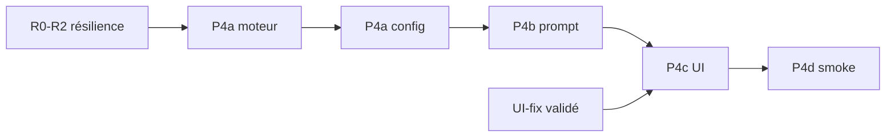

# Plan d'implémentation — Drox 1.3.0

**Date** : 2026-05-27  
**Statut** : **validé** — exécution P4a en cours.  
**Design** : [`../03-parallelisme/PARALLELISME-DESIGN.md`](../03-parallelisme/PARALLELISME-DESIGN.md)  
**Vision** : [`../01-vision/VISION-CONSOLIDEE-1.3.0.md`](../01-vision/VISION-CONSOLIDEE-1.3.0.md)

---

## Prérequis (avant parallélisme)

| Phase | Statut | Doc |
|-------|--------|-----|
| R0–R2 résilience (truth check, FailurePacket, clôture) | Livré | [FAILURE-ABSORPTION.md](../04-resilience/FAILURE-ABSORPTION.md) |
| UI-fix multi-tours (réponse scellée, plan sticky) | À valider rebuild | § UI-fix ci-dessous |
| Cycle anchor + `architect_help` | Livré moteur | — |

---

## Modèle retenu (rappel)

L'architecte **ne peut pas** émettre plusieurs `delegate_executor` dans des tours séparés et attendre : il est déchargé après le premier appel synchrone.

**Parallélisme = un seul appel outil** avec `parallel_with` :

```json
{
  "task_id": "t1",
  "description": "...",
  "instructions": "...",
  "scope": ["src/components/"],
  "parallel_with": [
    { "task_id": "t2", "description": "...", "instructions": "...", "scope": ["src/styles/"] }
  ]
}
```

Sans `parallel_with` → comportement **1.2.0** (1 exécuteur, séquentiel).

---

## Ordre d'exécution

```
P4a-moteur → P4a-config → P4b-prompt → P4c-UI → P4d-smoke
```

---

## Phase P4a — Moteur

### P4a.1 Schéma & outil

| Tâche | Fichier | Done |
|-------|---------|------|
| Type `ParallelTaskSpec` (même champs que tâche principale sauf `parallel_with`) | `drox-tools/.../delegate_executor.rs` | ☐ |
| Champ `parallel_with: Option<Vec<ParallelTaskSpec>>` | idem | ☐ |
| Description / JSON Schema outil | idem | ☐ |
| Réponse batch `{ "batch": true, "results": [ ... ] }` | idem + delegate | ☐ |

### P4a.2 Orchestration parallèle

| Tâche | Fichier | Done |
|-------|---------|------|
| `run_parallel_executor_tasks(specs, max_parallel, timeout, parent_ctx)` | `drox-engine/.../orchestration_delegate.rs` | ☐ |
| `ParallelSlot` + `buffer_unordered(max_parallel)` ou `join_all` | idem | ☐ |
| Réutiliser `run_executor_task` par slot (hook UI par `task_id`) | idem | ☐ |
| `post_delegate_truth_check` **par slot** | idem | ☐ |
| Timeout par slot → `failed`, autres slots continuent | idem | ☐ |

### P4a.3 Gates

| Tâche | Fichier | Done |
|-------|---------|------|
| `1 + len(parallel_with) ≤ max_parallel_executors` | `architect_gates.rs` ou delegate | ☐ |
| Scopes **disjoints** dans le batch (pas de sous-chemin commun) | `orchestration/parallel_batch.rs` (nouveau) ou gates | ☐ |
| Chaque `task_id` présent dans le plan `todo_write` | gates existantes | ☐ |
| `architect_state.record_delegate_result` pour **chaque** résultat du batch | `loop.rs` + tool result handler | ☐ |

### P4a.4 Tests Rust

| Test | Done |
|------|------|
| 2 slots parallèles → 2 rapports dans `results` | ☐ |
| Batch refusé si scopes qui se chevauchent | ☐ |
| Batch refusé si `len > max_parallel` | ☐ |
| 1 slot timeout → `failed`, l'autre `completed` | ☐ |
| Sans `parallel_with` → chemin séquentiel inchangé | ☐ |

### Contrat Rust (cible)

```rust
pub async fn run_parallel_executor_tasks(
    specs: Vec<DelegateTaskSpec>,
    max_parallel: usize,
    timeout_per_slot: Duration,
    delegate: &EngineOrchestrationDelegate,
    parent_ctx: &ToolContext,
) -> Vec<OrchestrationDelegateResult>
```

---

## Phase P4a-config — Paramètre utilisateur

| Tâche | Fichier | Done |
|-------|---------|------|
| `nexus.drox.orchestration.maxParallelExecutors` (défaut `1`, max `4`) | `droxConfiguration.ts` | ☐ |
| `IDroxRunSettings` + lecture workspace | `droxRunSettings.ts`, `droxRunSettingsService.ts` | ☐ |
| RPC `agent.run` → `orchestrationMaxParallelExecutors` | `drox-cli/jsonrpc/protocol.rs`, `agent_run.rs` | ☐ |
| `OrchestrationConfig.max_parallel_executors` | `orchestration/config.rs` | ☐ |
| Passer au delegate + gates | `orchestration_run.rs`, `ToolContext` | ☐ |
| UI : contrôle dans panneau modèle exécuteur | `droxChatWebview.ts`, `01c-role-models.js` | ☐ |

**Ne pas** réutiliser `nexus.drox.subagents.maxConcurrent` pour l'orchestration — sémantique `task` (explore) différente.

---

## Phase P4b — Prompt architecte

| Tâche | Fichier | Done |
|-------|---------|------|
| Bloc système « Capacité de délégation » (`Slots : N`) | `orchestration/prompts.rs` + injection run | ☐ |
| Règles `parallel_with` (scopes disjoints, 1 appel) | `ARCHITECT_SYSTEM_PROMPT` | ☐ |
| `architect_help` topic `parallel` | `architect_help.rs` | ☐ |
| Cycle anchor : rappel slots si pertinent | `architect_state.rs` | ☐ |

**Hors scope P4b** (reporté P4d) : `wait_for`, deps dans `todo_write`.

---

## Phase P4c — IDE

| Tâche | Fichier | Done |
|-------|---------|------|
| `executorCapture` → `Map<jobId, capture>` | `07-log.js` | ☐ |
| `.drox-executor-grid` dans `work` | `07b-runTimeline.js`, `droxChatMvp.css` | ☐ |
| N × `subagentStart` / `subagentDone` (déjà par `task_id` côté hook) | `agent_run.rs` | ☐ |
| Jauge `ctx` : exclure **tous** sous-runs actifs | `event.rs`, `droxChatAgentEvents.ts` | ☐ |
| Badge plan `2 / 5 ✓` (optionnel P1) | `07b-runTimeline.js` | ☐ |

---

## Phase P4d — Smoke & optionnel

| Scénario | Critère |
|----------|---------|
| 2 tâches scopes disjoints, `maxParallelExecutors=2` | 2 cartes Running simultanées, 2 dossiers `agent-output`, synthèse après les deux |
| Setting `=1` | Aucun `parallel_with` utile côté modèle ; séquentiel comme 1.2.0 |

**Optionnel (post-MVP)** : `wait_for: [task_id]` pour DAG sans tout relancer en batch.

---

## Phase UI-fix (validation 1.2.0)

| Tâche | Critère |
|-------|---------|
| UI-1 | Réponse cycle N reste dans cycle N après cycle N+1 |
| UI-2 | Plan sticky scellé avec le cycle |
| UI-3 | Base stable pour Map captures (1 carte) avant N cartes |

---

## Dépendances



---

## Critères d'acceptation globaux 1.3.0

1. Utilisateur règle « Parallélisme max » = 2 → architecte voit « Slots : 2 » et peut batch 2 tâches.
2. Un batch lance 2 exécuteurs, 2 cartes UI, 2 rapports dans un seul tool result.
3. Verify + `todo_write` inchangés **par tâche** après le batch.
4. Défaut `1` → aucune régression 1.2.0.
