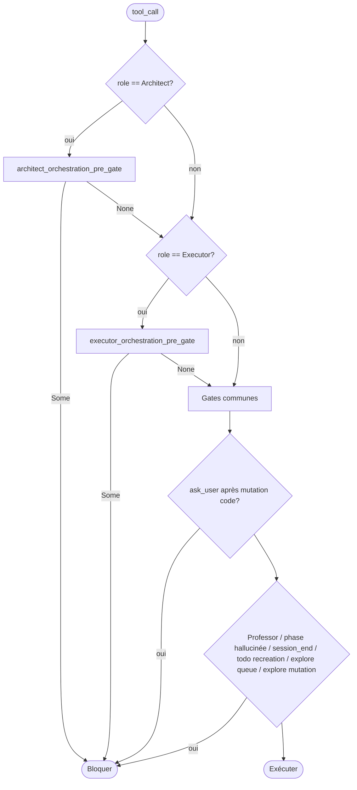
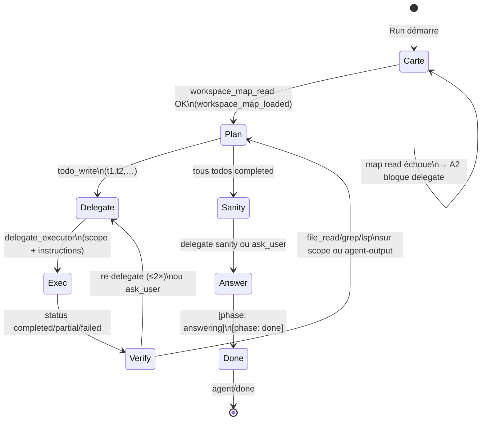
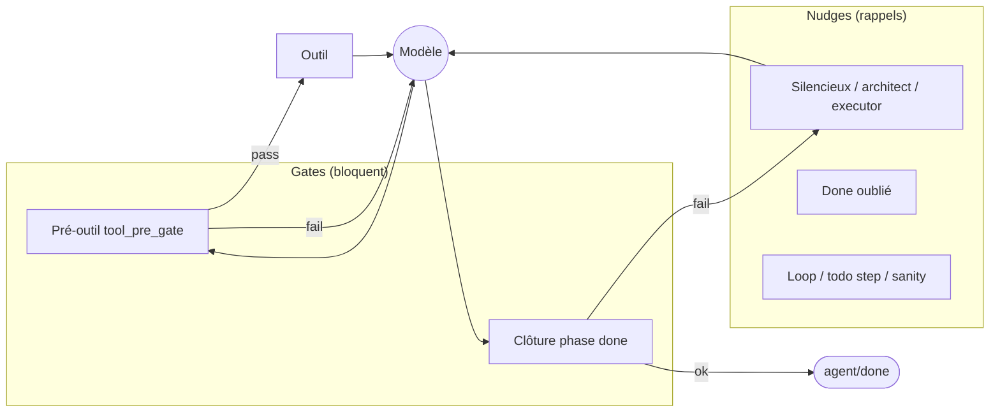

# Circuit moteur 1.3.2 — flux, gates et nudges

> **OBSOLÈTE** — Analyse **pré-simplification** (gate chain, intent, paliers). Référence actuelle : [CONDUCTEUR-CODE.md](CONDUCTEUR-CODE.md). Index : [gates/ARCHIVE.md](gates/ARCHIVE.md).

**Version** : analyse pour la branche **1.3.2**  
**Mode cible** : orchestration **`role_split`** (Architecte + `delegate_executor` → Exécuteur éphémère ; alias RPC déprécié `v1_2`)  
**Sources** : code Rust `drox-engine` (état au 2026-06-02)

**Documents liés** : [PATCHNOTES-1.3.2.md](PATCHNOTES-1.3.2.md) · [FLOW-DECISIONS-MOTEUR.md](../../1.2/cartographie/FLOW-DECISIONS-MOTEUR.md) · [ARCHITECT-STATE-MACHINE.md](../../1.2/steps/08-architect-state/ARCHITECT-STATE-MACHINE.md) · [ORCHESTRATION-ROLES-TOOLS.md](../../1.2/steps/07-roles-tools/ORCHESTRATION-ROLES-TOOLS.md)

---

## 1. Définitions

| Terme | Comportement | Effet sur le modèle |
|--------|----------------|---------------------|
| **Gate (bloquante)** | Condition vérifiée **avant** exécution d’un outil ou **avant** acceptation de `[phase: done]` | L’action est **refusée** : `tool_result` en erreur avec message fixe, ou tour relancé avec message `system` |
| **Nudge (non bloquant)** | Message `system` **injecté** au tour suivant (ou en tête de tour) | Le modèle **peut** continuer ; rappel de protocole, pas d’échec outil |
| **Allowlist** | `RunSpec::tool_visible` | Outil absent du schéma LLM / refus permissions |
| **État architecte** | `ArchitectRunState` | Compteurs persistants pendant le run parent (`workspace_map_loaded`, `delegate_counts`, `verified_task_ids`, …) |

**Fichiers centraux**

| Zone | Fichiers |
|------|----------|
| Boucle | `drox-engine/src/agent/loop.rs` |
| Gates communes + clôture | `drox-engine/src/agent/gates.rs` |
| Gates architecte | `drox-engine/src/agent/architect_gates.rs`, `architect_todo_gate.rs`, `architect_plan_quality.rs` |
| Gates exécuteur | `drox-engine/src/agent/executor_gates.rs` |
| Nudges | `drox-engine/src/agent/nudges/` |
| Contrat rôle | `drox-engine/src/run_spec/mod.rs` |
| Entrée RPC | `drox-cli/.../agent_run.rs`, `orchestration_run.rs` |
| Délégation | `drox-engine/src/orchestration_delegate.rs` |

---

## 2. Flux global `role_split` (un run utilisateur)

```mermaid
flowchart TB
    subgraph IDE["IDE (Drox Chat)"]
        SEND[agent.run prompt]
        EVT[agent/event stream]
        DONE[agent/done]
    end

    subgraph CLI["drox-cli JSON-RPC"]
        AR[agent_run handler]
        V12[drive_role_split_run]
        ROLE[drive_role_run Architect]
    end

    subgraph LOOP["Boucle Agent loop.rs"]
        TURN[Tour LLM]
        PRE[tool_pre_gate_block]
        EXEC[Exécuter outil]
        DEL{delegate_executor?}
        SUB[RunSpec::Executor<br/>sous-run éphémère]
        PHASE{[phase: done]?}
        DNUDGE[Gates / nudges clôture]
    end

    SEND --> AR --> V12 --> ROLE --> TURN
    TURN --> EVT
    TURN --> PRE
    PRE -->|block| TURN
    PRE -->|ok| EXEC
    EXEC --> DEL
    DEL -->|oui| SUB
    SUB --> TURN
    DEL -->|non| TURN
    TURN --> PHASE
    PHASE -->|prématuré| DNUDGE
    DNUDGE --> TURN
    PHASE -->|ok| DONE
```

**Propriétés importantes**

- **Gate architecte** : par défaut un tour intent LLM (`[gate: architect_edit|discuss]`). Override RPC / réglage IDE `architectInteractionMode` : `discussion` → `architect_discuss` sans intent ; `action` → `architect_edit` sans intent ; `auto` → tour intent.
- Un seul **`run_id`** parent ; l’exécuteur n’est **pas** un second `agent.run` enregistré.
- `delegate_executor` lance un `RunSpec::Executor` **inline** (même processus, client Ollama partagé si même modèle + même `num_ctx`).
- La clôture UI (`busy: false`) arrive sur **`agent/done`** du run parent (fin du stream architecte), pas à la fin de chaque sous-run exécuteur.

---

## 3. Un tour LLM (cascade simplifiée)

```mermaid
flowchart TD
    START([Début tour]) --> INJ[Injections system optionnelles<br/>explore jobs / cycle anchor / objectif]
    INJ --> LLM[Appel LLM + stream]
    LLM --> PARSE[Texte assistant + tool_calls]
    PARSE --> LOOPCHK{LoopDetector<br/>répétition identique?}
    LOOPCHK -->|Warn| LNUDGE[Nudge LOOP_DETECTED]
    LOOPCHK -->|Abort| ABORT[Run error LoopDetected]
    LOOPCHK -->|ok| DONECHK{[phase: done]<br/>dans le texte?}
    DONECHK -->|oui| DGATES[Gates clôture done<br/>voir §6]
    DONECHK -->|non| EMPTY{tool_calls vides?}
    DGATES -->|block| SYSINJ[Message system → tour suivant]
    DGATES -->|ok| STOP([Stop → agent/done])
    EMPTY -->|oui| SNUDGE[Nudge silencieux<br/>nudge_prompt / architect / executor]
    EMPTY -->|non| BATCH[partition_tool_calls]
    SNUDGE --> SYSINJ2[continue]
    BATCH --> EACH[Pour chaque outil]
    EACH --> PRE[tool_pre_gate_block §4]
    PRE -->|Some| ERR[is_error + texte gate]
    PRE -->|None| PERM[Permissions IDE]
    PERM --> RUN[Exécution outil]
    RUN --> REC[Mise à jour état<br/>architect_state / deliverable]
    ERR --> EACH
    REC --> EACH
    EACH --> MORE{max_iterations?}
    MORE -->|oui| START
    MORE -->|non| MAX[Stop MaxIterations]
```

---

## 4. Pipeline `tool_pre_gate_block` (ordre fixe)

Le **premier** message bloquant gagne ; pas de cumul.



---

## 5. Rôles et outils (allowlist exhaustive `role_split`)

Défini dans `run_spec/mod.rs` (`ARCHITECT_TOOL_ALLOWLIST`, `EXECUTOR_TOOL_ALLOWLIST`).

### Architecte

| Outil | Rôle |
|-------|------|
| `architect_help` | Aide contextuelle (sanity, closure, …) |
| `ask_user_question` | Question structurée à l’utilisateur |
| `delegate_executor` | Lance l’exécuteur éphémère (1+ tâches) |
| `file_read` | Lecture fichier |
| `glob` | Recherche chemins |
| `grep` | Recherche contenu |
| `lsp` | Diagnostics / symboles |
| `memory_list` | Liste mémoire longue |
| `memory_read` | Lecture mémoire |
| `todo_write` | Plan / statuts tâches |
| `workspace_map_read` | Carte workspace (prérequis délégation) |

**Interdit** : `bash`, `file_edit`, `file_write`, `delete_path`, `task`, `delegate_executor` depuis l’exécuteur, MCP (hors `Standard`), etc.

**Limites run** : `max_tools_per_turn: 6`

**Marqueurs voie édition** (choix modèle, pas heuristique user) :

| Marqueur | Effet |
|----------|--------|
| `[gate: architect_edit]` / `[gate: architect_discuss]` | Tour intent ou override RPC — voie édition vs discussion |
| `[mode: discovery]` / `[mode: task]` | Sous-mode édition ; ancré dans le **cycle anchor** après 1ère déclaration assistant (`architect_mode.rs`) |
| `[task: meta]` / id `summary` | Todo synthèse sans délégation (`protocol_markers.rs`) |
| `task_id: sanity` | Smoke test fin de cycle |
| `[cycle: user_check]` | Délégation vérification manuelle à l'utilisateur (`ask_user_question`) |

### Exécuteur (sous-run `delegate_executor`)

| Outil | Rôle |
|-------|------|
| `bash` | Commandes shell |
| `file_edit` | Patch fichier |
| `file_write` | Écriture fichier |
| `file_read` | Lecture |
| `glob` | Recherche (sauf patterns lourds) |
| `grep` | Recherche |
| `lsp` | LSP |

**Interdit** : `todo_write`, `ask_user_question`, `delegate_executor`, `workspace_map_read`, mémoire, web, MCP.

**Limites run** : `max_tools_per_turn: 2` · livrable Contract A : `.md` sous `.drox/agent-output/<task_id>/`

### Agent `Standard` (legacy, hors `role_split` prod)

Registre outils **complet** (mutations + explore `task` + MCP si activé). Non décrit ici — voir mode `legacy`.

### Pilier 1.3.2 « discussion » (codé)

Entrée : tour **intent** (`RoleId::ArchitectIntent`) → marqueur `[gate: architect_discuss]` → run `ArchitectDiscussion` (lecture repo autorisée, pas de plan / delegate).

| Outil | Discussion | Architecture (edit) |
|-------|--------------|---------------------|
| Lecture repo | Non (texte seul) | Oui |
| `todo_write` / plan forcé | Non | Oui |
| `delegate_executor` | Non | Oui |

---

## 6. Gates architecte (pré-exécution)

Constantes dans `architect_gates.rs` / `architect_todo_gate.rs`.

| ID | Outil / moment | Condition | Message (résumé) | Risque boucle |
|----|----------------|-----------|-------------------|---------------|
| A1 | `delegate_executor` | Aucun `todo_write` réussi dans le run | « Publish plan with todo_write first » | Faible |
| A2 | `delegate_executor` | `!workspace_map_loaded` | **« Blocked: call workspace_map_read once before delegate_executor »** | **Élevé** si `workspace_map_read` a échoué ou sortie vide sans `ingest` |
| A3 | `delegate_executor` | `scope` hors carte / racine | Chemin invalide vs `workspace_paths` | Moyen |
| A4 | `delegate_executor` | Scope > 50 fichiers | Split todo + re-déléguer | Faible |
| A5 | `delegate_executor` | `instructions` < 80 car. | Brief trop court | Faible |
| A6 | `delegate_executor` | `scope` > 6 chemins | `architect_delegation_scope_gate` (structurel) | Faible |
| A7 | `delegate_executor` | ≥ 2 délégations même `task_id` | Re-delegate cap | Moyen |
| A8 | `todo_write` | Payload invalide / vide | Shape guard | Faible |
| ~~A9~~ | ~~`todo_write`~~ | ~~Qualité plan (mots-clés)~~ | **Retiré 1.3.2** — discipline prompt + marqueurs `[task: meta]` | — |
| A10 | `todo_write` | `completed` sans delegate | `complete_gate_for_task` | **Élevé** (modèle marque done avant delegate) |
| A11 | `todo_write` | `completed` sans verify scope | Verify hint | **Élevé** |
| A12 | Lecture seule | ≥ 4 reads depuis dernier delegate | « Stop chaining read-only tools » | **Élevé** (gemma4 rapide) |
| A13 | Après `partial`/`failed`/`blocked` | Lecture hors verify / mutation | Compensation block | Moyen |
| A14 | Après `partial`/`failed`/`blocked` | Verify ciblée sur scope | **Autorisé** | — |

**État `workspace_map_loaded`** : passé à `true` uniquement si `ingest_workspace_map_output` reçoit une sortie avec `nodes[]` (succès outil dans `loop.rs` ou `architect_record_read_only_tool_success`). Un appel **en erreur** ou JSON sans `nodes` → flag reste `false` → **A2** bloque toute délégation (symptôme observé en dogfooding).

---

## 7. Gates exécuteur (pré-exécution)

| ID | Outil | Condition | Message (résumé) |
|----|-------|-----------|------------------|
| E1 | Tout | Livrable `.md` déjà écrit | « deliverable met — engine closing » |
| E2 | `ask_user_question` | Toujours | Interdit exécuteur |
| E3 | `todo_write` | Toujours | Interdit exécuteur |
| E4 | `glob` | Pattern `node_modules`, `.next`, `dist`, `target` | Glob lourd bloqué |

---

## 8. Gates communes (tous rôles sauf exceptions)

| ID | Moment | Condition |
|----|--------|-----------|
| C1 | `ask_user_question` | Après mutation code dans le run |
| C2 | `task` background | File explore pleine (`EXPLORE_TASK_QUEUE_FULL`) |
| C3 | Mutation | Explore async encore en cours |
| C4 | Nom outil | `phase` / `done` simulés en tool_call |
| C5 | `session_end` | Réservé slash utilisateur |
| C6 | `todo_write` | Recreation plan from scratch (tous completed → nouveaux ids) |
| C7 | `todo_write` | `max_todo_items` (profil Low) |

---

## 9. Gates clôture — `[phase: done]`

Évaluées dans `loop.rs` quand le modèle émet `[phase: done]` dans le texte (pas via outil).

| ID | Rôle | Condition | Type | Constante / fonction |
|----|------|-----------|------|---------------------|
| D1 | Tous (gate on) | Jamais `[phase: answering]` | Nudge | `MISSING_ANSWERING_PROMPT` |
| D2 | Tous | Texte long déjà dans phase interne | Assouplissement | `PROMOTABLE_ANSWER_MIN_CHARS` (120) |
| D3 | Professor | Pas de `course_plan_write` | Nudge | `PROFESSOR_DONE_WITHOUT_PLAN` |
| D4 | Standard / Architect | Todos pending/in_progress | Nudge | `unfinished_todos_prompt` |
| D5 | Standard | Mutation code sans `[phase: testing]` | Nudge | `CODE_MUTATION_TESTING_NUDGE` |
| D6 | Architect | Plan terminé, sanity non faite | Nudge | `ARCHITECT_CYCLE_SANITY_*` |
| D7 | Architect | Closable mais pas `[phase: done]` | Nudge | `ARCHITECT_RUN_CLOSABLE_NUDGE_PROMPT` |

Si une gate D* bloque : le run **continue** (pas `agent/done`) — message `system` injecté, compteur `max_iterations` consommé.

---

## 10. Nudges (injection `system`)

| ID | Déclencheur | Bloquant? | Texte / rôle |
|----|-------------|-----------|--------------|
| N1 | Tour sans tools ni `[phase: done]` | Non | `nudge_prompt` (Standard) / `ARCHITECT_NUDGE_PROMPT` / `EXECUTOR_NUDGE_PROMPT` |
| N2 | `[phase: answering]` sans `[phase: done]` | Non | `done_only_nudge_prompt` (minimal « [phase: done] ») |
| N3 | Répétition sortie identique (1er strike) | Non | `LOOP_DETECTED_NUDGE_PROMPT` |
| N4 | Répétition (2e strike) | **Oui** | `EngineError::LoopDetected` → run error |
| N5 | Mutation avant 1er `todo_write` | Non | `MUTATING_TOOL_BEFORE_TODO_WRITE_NUDGE` |
| N6 | ≥2 mutations sans `todo_write` intermédiaire | Non | `step_by_step_todo_nudge` (dynamique) |
| N7 | Explore async en cours | Non (header tour) | `explore_jobs_pending_nudge` |
| N8 | 2e `task` background | Non (Medium) | `EXPLORE_SECOND_TASK_NUDGE` |
| N9 | Architecte, ≥2 outils exploration sans `[phase: analyzing]` | Non (1×) | `ANALYZING_PHASE_NUDGE` (protocolaire, sans scan du prompt user) |
| N10 | `nativeThinking` activé | Non (prompt assemble) | `NATIVE_THINKING_UI_SUPPLEMENT` |
| N11 | 3× `ask_user_question` échouées | Non | `ask_user_question_loop_nudge` |
| N12 | Architect, plan done, avant sanity | Non | `ARCHITECT_CYCLE_SANITY_NUDGE_PROMPT` |
| N13 | Architect, `[phase: done]` trop tôt | Non | `ARCHITECT_CYCLE_SANITY_BLOCK_DONE_PROMPT` |
| N14 | Architect, run fully closable | Non | `ARCHITECT_RUN_CLOSABLE_NUDGE_PROMPT` |

**Différence clé gate vs nudge** : une gate sur outil renvoie `is_error: true` au modèle **dans le même tour** ; un nudge ajoute un tour `system` **sans** consommer l’outil demandé.

---

## 11. Machine à états architecte (orchestration cible)



---

## 12. UI « Exploring » vs circuit moteur (découplage)

| Couche | Comportement actuel | Cible 1.3.2 |
|--------|---------------------|-------------|
| **Moteur** | Événements `agent/event` : `phase`, `tool`, `text_delta`, `RoleEnter`, `subagentStart`… | Inchangé |
| **IDE webview** | `07-log.js` regroupe encore phases lecture/analyse dans un bandeau **« Exploring »** | **B-02** : fil linéaire `07b-runTimeline.js` seul (`plan` / `work` / `thinking` / `answer`) |

Le moteur n’émet pas « Exploring » — c’est un **choix UI legacy**. Le bruit perçu (screenshot dogfooding) vient de cette couche, pas d’un rôle moteur `Explore` en `role_split`.

---

## 13. Problèmes connus → pistes 1.3.2

| Symptôme | Cause probable | Piste |
|----------|----------------|-------|
| « Blocked: workspace_map_read first » en boucle | `workspace_map_loaded` reste false (échec outil, sortie sans `nodes`, ou état reset) | Gate A2 assouplie si appel récent ; idempotence ; meilleur ack succès |
| 4+ `file_read` / `grep` sans delegate | Gate A12 | Compteur `reads_since_delegate` ; modèles rapides (gemma4) |
| `todo_write completed` refusé | Gates A10–A11 | Messages plus courts ; chemin « verify ack » visible dans UI |
| Section Exploring | UI `07-log.js` | Pilier B-02 |
| Notifs fin de cycle | Focus / toast OS | Voir `droxCycleDoneNotification.ts` |

---

## 14. Paramètres de strictesse (cible produit)

À relier aux settings `drox.engine.*` (voir PATCHNOTES).

| Niveau | Gates assouplies | Gates renforcées |
|--------|------------------|------------------|
| **relaxed** | A12 (↑ seuil reads), A2 optionnelle, D4/D5 souples | — |
| **normal** | Comportement actuel | — |
| **strict** | — | A2 obligatoire, A10–A11, D5, N6 plus tôt |

---

## 15. Schéma gates ↔ nudges (vue matricielle)



---

## 12. Agent `Standard` (hors chat prod)

| Chemin | Rôle |
|--------|------|
| IDE `agent.run` | **Jamais** — toujours `role_split` (Architect / Executor / intent / discuss). |
| CLI `drox` one-shot | `RunSpec::for_standard_agent` + `CORE_SYSTEM_PROMPT` (`drox-cli` / `core_standard.rs`, EN). |
| Professor | Supplément `PROFESSOR_MODE_SUPPLEMENT` sur branche Standard (hors orchestration). |

Décision 1.3.2 : **D1** — conserver Standard pour CLI/professor ; pas de convergence CLI → orchestration avant 1.3.3.

---

## 13. Extension future — `engine.strictness` (non implémenté)

Sans réglages produit pour l’instant. Cible : struct `EngineStrictness` (ou champs sur `RunSpec` / `AgentConfig`) influençant :

- allowlist effective par rôle ;
- caps lecture avant `delegate_executor` ;
- `scope` max paths ;
- activation optionnelle de gates A* / E*.

**Règle** : nouvelles contraintes = **marqueurs protocolaires** ou **gates structurelles** — pas de listes de mots-clés sur le message utilisateur.

---

## Liens mise à jour doc

- Ajouter une entrée **4.1 / 4.2** dans [CLOSURE-1.3.2.md](finalisation/CLOSURE-1.3.2.md) quand ce document est validé en revue équipe.
- Référencer depuis [PATCHNOTES-1.3.2.md](PATCHNOTES-1.3.2.md) section B-03.
