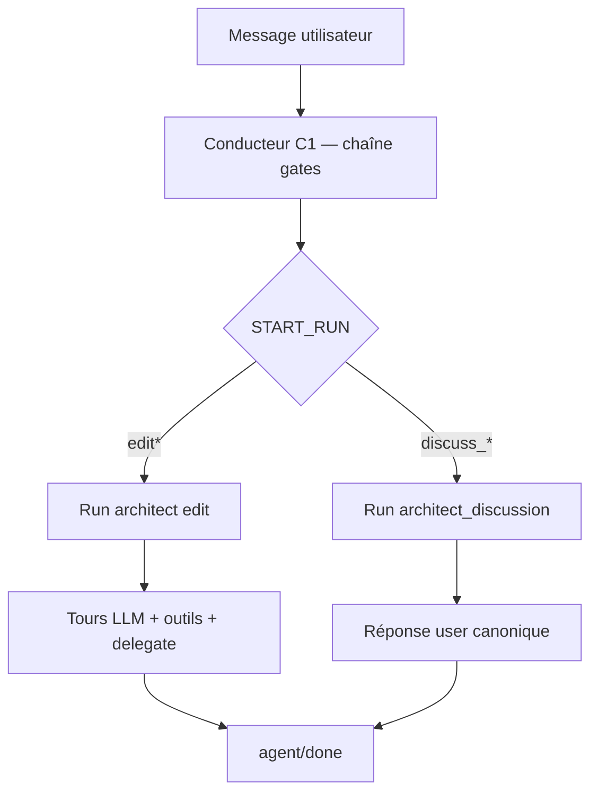

# File conducteur — chemins du modèle pendant un cycle (1.3.2)

> **OBSOLÈTE** — Design gate chain / paliers **annulé** en 1.3.2. Référence actuelle : [CONDUCTEUR-CODE.md](CONDUCTEUR-CODE.md). Index : [gates/ARCHIVE.md](gates/ARCHIVE.md).

**Statut** : document historique (design avant simplification).  
**Public** : dev moteur / orchestration — lecture **centrée conducteur**, pas inventaire de fichiers Rust.  
**Objectif** : voir d’un coup d’œil **où** le modèle peut aller, **avec quels outils**, **sous quelles conditions**, puis déduire les gates manquantes et supprimer les couches redondantes.

**Documents liés** : [gate-graph.json](../../drox/crates/drox-engine/assets/gates/gate-graph.json) · [GATE-ROUTES.md](gates/GATE-ROUTES.md) · [CIRCUIT-MOTEUR-GATES-NUDGES.md](CIRCUIT-MOTEUR-GATES-NUDGES.md) · [EDIT-GATES-MAP.md](gates/EDIT-GATES-MAP.md) · export dogfood [chat.txt](chat.txt)

---

## 1. Ce qu’on entend par « file conducteur »

Le **file conducteur** est la **description exécutable du parcours** : à chaque étape, le moteur dit au modèle :

1. **Où il est** (id de gate / phase du cycle).
2. **Ce qu’il doit faire ici** (question, objectif du palier, protocole de sortie).
3. **Quels outils sont disponibles** (liste + conditions d’usage).
4. **Quelles portes de sortie existent** (autres gates ou fins de run) — **accès optionnel**, pas obligation de « prendre » une porte ; chaque porte affiche **quand** elle est franchissable.

Historiquement, ce rôle était rempli par de la **logique dispersée** (`architect_gates.rs`, `EditTier`, nudges, marqueurs `[phase: …]`, prompts `e_*.md`) — des « fausses gates » codées en dur qui autorisaient ou bloquaient des comportements.

**Direction 1.3.2+** : **les gates TOML + graphe** deviennent le conducteur principal ; le code Rust ne fait plus que **appliquer** le graphe (outils, transitions, journal), pas recoder des chemins parallèles.

---

## 2. État actuel — trois conducteurs en parallèle (source de confusion)

Aujourd’hui, un même message utilisateur traverse **plusieurs systèmes** qui ne partagent pas toujours la même « carte » :

| # | Conducteur | Fichier / module « chef » | Quand il s’applique |
|---|------------|---------------------------|---------------------|
| **C1** | Chaîne gates **pré-run** | `gate-graph.json` + `probe_architect_gate_chain` (`orchestration_run.rs`) | Avant tout `agent.run` architecte |
| **C2** | Paliers **EditTier** (`e_*`) | `edit_tier.rs` + suppléments `e_*.md` + `tools_for_tier` | Chaque tour du run **edit** |
| **C3** | **Tool gates** bloquantes | `architect_gates.rs`, `gates.rs`, nudges `loop.rs` | Avant chaque `tool_call` |

```text
Message user
    → C1 (gates JSON) → START_RUN.*
         → run discussion OU run edit
              → C2 (EditTier) décide prompts + outils affichés
              → C3 (tool gates) peut bloquer malgré C1/C2
```

**Conséquence observée** ([chat.txt](chat.txt)) : C1 dit `edit.has_concrete_goal = true` → `START_RUN.edit`, mais C2 reste en `e_none` et C3 bloque `todo_write` / `file_read` — le modèle ne peut pas entrer dans le chemin « plan → lecture → édition ».

**Cible refonte** : **un seul graphe de gates** (pré-run + in-run) = conducteur ; C2 et C3 deviennent des **effets dérivés** du nœud courant, pas des cartes séparées.

---

## 3. Un cycle utilisateur — vue d’ensemble

Un **cycle** = un `agent.run` déclenché par l’IDE (un message user, un `run_id`).



| Phase | Rôle LLM typique | Outils métier | Réponse user visible |
|-------|------------------|---------------|----------------------|
| C1 | `architect_intent` (tours courts) | **Aucun** | Non (journal gate UI) |
| Discuss | `architect_discussion` | Selon `discuss_*` | Oui (`user_facing_reply`) |
| Edit | `architect` | Allowlist large, **filtrée** par C2+C3 | Stream + phases |

---

## 4. Conducteur C1 — chaîne gates pré-run (MVP actuel)

**Driver** : `probe_architect_gate_chain`  
**Source de vérité arborescence** : `assets/gates/gate-graph.json`  
**Prompts par nœud** : `assets/gates/*.gate.toml`  
**Rôle** : `RunSpec::for_architect_intent()` — JSON uniquement, pas d’outils.

### 4.1 Nœuds et portes de sortie

| Gate (nœud) | Type | Question (résumé) | Portes de sortie (`via` → cible) | Condition / effet |
|-------------|------|-------------------|----------------------------------|-------------------|
| `entry` | exclusive | Discuss ou edit ? | `architect_discuss` → `discuss.needs_repo_facts` | Pas de mutation repo attendue |
| | | | `architect_edit` → `edit.has_concrete_goal` | Travail dépôt / livrable |
| `discuss.needs_repo_facts` | boolean | Lire le repo pour répondre ? | `true` / `false` → **`discuss.open_user_reply`** | Les deux convergent ; valeur = hint pour la gate suivante |
| `discuss.open_user_reply` | exclusive | Mode d’ouverture discussion | `reply_only` → `START_RUN.discuss_reply_only` | Fin chaîne — run sans lectures |
| | | | `with_reads` → `START_RUN.discuss_with_reads` | Fin chaîne — lectures repo autorisées |
| | | | `recheck_repo` → **`discuss.needs_repo_facts`** | **Boucle** (seule du graphe MVP) |
| `edit.has_concrete_goal` | boolean | Objectif actionnable ? | `true` → `START_RUN.edit` | Chemin edit « concret » |
| | | | `false` → `START_RUN.edit_e_none` | Chemin edit « clarification » |

### 4.2 Chemins terminaux (4 parcours complets C1)

Chaque ligne = **une décision utilisateur possible** après la chaîne gates.

| Id chemin | Séquence gates | Décisions `via` | `START_RUN` | Run démarré |
|-----------|----------------|-----------------|-------------|-------------|
| **P-D1** | entry → discuss.needs_repo_facts → discuss.open_user_reply | discuss → (true\|false) → **reply_only** | `discuss_reply_only` | Discussion, **sans** outils repo |
| **P-D2** | idem | discuss → (true\|false) → **with_reads** | `discuss_with_reads` | Discussion, **avec** lectures repo |
| **P-D3** | entry → edit.has_concrete_goal | edit → **true** | `edit` | Architecte edit (plan / delegate) |
| **P-D4** | entry → edit.has_concrete_goal | edit → **false** | `edit_e_none` | Architecte edit palier « pas d’objectif verrouillé » |

**Boucle optionnelle** : sur P-D1/P-D2, le modèle peut repasser par `discuss.needs_repo_facts` via `recheck_repo` sur `discuss.open_user_reply`.

### 4.3 Ce que le modèle voit pendant C1

| Élément | Contenu |
|---------|---------|
| Bulles | Définies par gate (`last_user_message`, `last_gate`, …) — voir [CONTEXT-BUBBLES.md](gates/CONTEXT-BUBBLES.md) |
| Outils | **Aucun** (`tools_during_probes: false`) |
| Sortie attendue | Un JSON par gate (`exclusive_open` ou `boolean`) |
| Échec parse | Retry (`max_attempts` / `default_via` dans TOML) |

### 4.4 Override hors graphe (non gate, mais même conducteur)

| Entrée | Effet |
|--------|--------|
| RPC `architectInteractionMode = discussion` | Saute C1 → équivalent `architect_discuss` + start discuss par défaut |
| RPC `architectInteractionMode = action` | Saute C1 → équivalent `architect_edit` + start edit par défaut |

---

## 5. Conducteur après C1 — run **discussion** (P-D1, P-D2)

**Entrée code** : `drive_role_split_discuss(start_run)` — le `StartRunKind` **est** pris en compte (allowlist + prompt).

| `START_RUN` | Outils allowlist (discussion) | Protocole sortie | Portes de sortie (conceptuelles) |
|-------------|------------------------------|------------------|-----------------------------------|
| `discuss_reply_only` | Aucun outil repo | `[discussion: reply]` → texte → `[discussion: done]` | Fin run → `UserFacingReply` |
| `discuss_with_reads` | Lectures seules (`file_read`, … selon spec) | Idem + lectures **avant** reply | `recheck_repo` n’existe **plus** ici (déjà passé en C1) |

**Ce que le modèle doit faire ici** : une réponse courte alignée sur la demande ; pas de `todo_write`, pas de `delegate_executor`.

**Dette connue** : tours `architect_intent` peuvent encore streamer du texte « discussion » avant le JSON gate (pollution UI / transcript) — à traiter via conducteur « JSON seul » sur C1.

---

## 6. Conducteur après C1 — run **edit** (P-D3, P-D4)

**Entrée code** : `drive_role_split_edit` — **sans** paramètre `start_run` aujourd’hui.

| Fait actuel | Impact conducteur |
|-------------|-------------------|
| ~~`START_RUN.edit` ignoré par `drive_role_split_edit`~~ | **Corrigé 2026-06** : `start_run` passé + `run_objective` verrouillé → palier `e_plan` |
| `START_RUN.edit_e_none` | Run edit clarification — reste `e_none` jusqu’à `[run_objective: …]` ou gate future |
| Gates in-run (plan → delegate → verify) | **À venir** — voir §6.3 |

### 6.1 Carte C2 — paliers EditTier (conducteur implicite actuel)

À **chaque tour** du run edit, le moteur calcule un palier `e_*` et injecte supplément + blocs outils `T-*`.

| Palier | Id wire | Le modèle est censé… | Outils présentés (`tools_for_tier`) | Conditions d’entrée (état) |
|--------|---------|----------------------|-------------------------------------|----------------------------|
| None | `e_none` | Clarifier ou saluer ; pas de plan | **Aucun** bloc `T-*` | Pas de `run_objective_anchor`, pas de `todo_write` OK, todos vides, pas de map |
| Plan | `e_plan` | Carte + premier plan | `workspace_map_read`, `todo_write`, `architect_help` | Objectif verrouillé **ou** todo OK ; map pas chargée ou pas de todo |
| Discovery | `e_discovery` | Playbook discovery | idem Plan | Mode discovery + todos pending |
| Delegate | `e_delegate` | Déléguer exécuteur | `delegate_executor`, `todo_write`, `file_read` | Todo in_progress ou reads saturés |
| Verify | `e_verify` | Vérifier livrable | `file_read`, `grep`, `lsp`, `todo_write` | Delegate terminé non vérifié |
| Sanity | `e_sanity` | Smoke / user check | `delegate_executor`, `ask_user_question` | Run presque closable, sanity pending |
| Close | `e_close` | Réponse finale + done | Aucun | Run fully closable |

**Portes de sortie implicites (non gates TOML)** : marqueurs `[run_objective: …]`, `[mode: task|discovery]`, `[phase: planning|reading|…|done]`, succès outils → transitions C2.

### 6.2 Carte C3 — tool gates (bloquants) sur le chemin edit

Même si un outil est **affiché** au modèle, C3 peut renvoyer `ERROR` avant exécution. Exemples structurants pour le chemin « plan → lire → éditer » :

| Moment | Outil | Gate C3 (résumé) | Condition |
|--------|-------|------------------|-----------|
| Palier None | `file_read`, `todo_write`, `workspace_map_read`, `delegate_executor` | **e_none block** | `EditTier::None` |
| Avant delegate | `delegate_executor` | Plan requis | Pas de `todo_write` réussi |
| Avant delegate | `delegate_executor` | Carte requise | `!workspace_map_loaded` |
| Lecture seule | reads multiples | Anti-boucle | Trop de reads sans delegate |
| Clôture | `[phase: done]` | Gates done | Todos / verify / sanity |

Voir tableau complet : [CIRCUIT-MOTEUR-GATES-NUDGES.md §6](CIRCUIT-MOTEUR-GATES-NUDGES.md).

### 6.3 Chemin edit **nominal** (ce qu’on veut pour une demande type P-D3)

Ordre **cible** pour « corriger un fichier / bug TS » — aujourd’hui **morcelé** entre C2, C3 et marqueurs :

```text
[P-D3] START_RUN.edit
  → (cible) gate edit.enter_work  — verrouiller objectif depuis last_user_message
  → e_plan / gate edit.plan
       outils: workspace_map_read, todo_write
       sorties: rester plan | passer discovery | passer delegate (conditions affichées)
  → e_discovery (optionnel)
  → e_delegate
       outils: delegate_executor (+ file_read ciblé)
       sortie: sub-run executor → livrable .md
  → e_verify
       outils: file_read, grep, lsp
       sorties: OK → close | KO → replan (boucle vers plan/delegate)
  → e_sanity (optionnel)
  → e_close → agent/done
```

**Boucle replan** (vision produit) : depuis `e_verify`, si livrable insuffisant → retour gate « plan » ou « delegate » **sans** repasser par C1 (cycle **in-run** récursif sur la gate edit parente).

### 6.4 Chemin edit **P-D4** (`edit_e_none`)

| Aujourd’hui | Cible conducteur |
|-------------|------------------|
| Même run que P-D3 | Run ou sous-graphe dédié « clarification » |
| `e_none` + message bloquant outils | Gate unique : outils = `ask_user_question` (?) ; porte vers `edit.enter_work` quand objectif clair |
| Confusion avec discussion | Porte explicite « repasser en discuss » (gate) vs « verrouiller edit » |

---

## 7. Conducteur **exécuteur** (sous-cycle, hors gate C1)

Déclenché **depuis** le run edit par `delegate_executor` — pas un parcours gates LLM aujourd’hui.

| Étape | Rôle | Outils | Fin |
|-------|------|--------|-----|
| Brief architecte | — | — | `task_id`, `scope`, `instructions` |
| Sous-run | `executor` | `bash`, `file_edit`, `file_write`, `file_read`, `glob`, `grep`, `lsp` | Livrable `.md` Contract A |
| Retour architecte | `architect` | Reprise C2/C3 en `e_verify` | — |

**À terme** : la gate `edit.delegate` du graphe parent définit **quand** lancer ce sous-cycle et quels outils architecte restent visibles pendant l’attente.

---

## 8. Matrice synthèse — qui décide quoi ?

| Besoin produit | Aujourd’hui | Cible (file conducteur unique) |
|----------------|-------------|--------------------------------|
| Discuss vs edit | C1 `entry` | Gate `entry` |
| Besoin lecture repo (discuss) | C1 `discuss.*` | Même |
| Objectif concret | C1 `edit.has_concrete_goal` | Gate + **effet** : ancrer objectif + entrer nœud `edit.work` |
| Outils visibles | C2 `tools_for_tier` | Liste sur le **nœud gate courant** |
| Outils autorisés | C3 hardcodé | Règles dérivées du nœud (+ exceptions explicites dans TOML gate) |
| Porte « replan » | C2 `needs_replan_after_blocked` | Transition gate `edit.verify` → `edit.plan` |
| Réponse user discuss | Run + extract | Gate finale discuss (déjà) |
| Fin cycle edit | `[phase: done]` + gates | Gate `edit.close` |

---

## 9. Méthode de refonte (ordre de travail doc → code)

Ce document sert de **checklist** avant d’écrire du Rust.

### Étape A — Figurer le graphe cible (ce fichier → v2)

1. Lister **tous** les chemins terminaux (discuss + edit + boucles).
2. Pour **chaque nœud** : remplir le template §10.
3. Fusionner C2/C3 dans le graphe ; marquer ce qui reste « code pur » (permissions IDE, limites `max_tools_per_turn`).

### Étape B — Déduire les gates TOML nécessaires

| Gate existante | Action |
|----------------|--------|
| `entry`, `discuss.*`, `edit.has_concrete_goal` | Conserver ; ajuster **effets** moteur |
| `edit.user_intent_clear`, `edit.requires_visible_plan`, … | Ajouter au `gate-graph.json` (voir [EDIT-GATES-MAP.md](gates/EDIT-GATES-MAP.md)) |
| — | Nouvelle : `edit.enter_work` (effet : quitter `e_none` après `has_concrete_goal=true`) |

### Étape C — Outils et enchaînements par gate

Pour chaque gate in-run : tableau **outil → condition → message si refus**.

### Étape D — Simplifier le code

| Supprimer / réduire | Remplacer par |
|---------------------|---------------|
| Résolution `EditTier` parallèle non alignée | Palier = nœud courant du graphe |
| `e_none` tool block déconnecté de C1 | Règles sur le nœud |
| Double conducteur discuss (intent stream pollution) | C1 strict JSON |

### Étape E — Valider sur scénarios

| Scénario | Chemin attendu |
|----------|----------------|
| « Salut » | P-D1 ou P-D4 → réponse courte, pas d’outils |
| Erreur TS + fix | P-D3 → plan → read → delegate → verify → close |
| Demande floue « améliore le site » | P-D3 ou P-D4 → clarification gate → plan |
| Boucle outils | Gate in-run ou nudge **lié au nœud** (pas message générique) |

---

## 10. Template — fiche d’un nœud gate (à dupliquer)

```markdown
### Gate: `<id>`

**Où je suis** : …
**Ce que je fais ici** : …

**Outils disponibles**
| Outil | Condition d’usage | Si refusé |
|-------|-------------------|-----------|
| … | … | … |

**Portes de sortie** (le modèle peut les emprunter si besoin)
| Porte | Vers | Condition |
|-------|------|-----------|
| … | `gate_id` ou `START_RUN.*` | … |

**Effets moteur** (sans tour LLM) : ancrer objectif, charger map, …
```

---

## 11. Annexes — fichiers « chef » du conducteur actuel

| Rôle | Chemin |
|------|--------|
| Graphe MVP | `drox-engine/drox/crates/drox-engine/assets/gates/gate-graph.json` |
| TOML gates | `drox-engine/drox/crates/drox-engine/assets/gates/*.gate.toml` |
| Driver C1 | `drox-cli/.../orchestration_run.rs` → `probe_architect_gate_chain` |
| Boucle edit | `drox-engine/src/agent/loop.rs` |
| Paliers C2 | `orchestration/prompts/edit_tier.rs`, `prompts/system/supplements/edit/` |
| Outils affichés | `orchestration/prompts/system/blocks/tools/mod.rs` |
| Bloquants C3 | `agent/architect_gates.rs` |
| Discussion | `orchestration/prompts/system/gates/discuss.rs` |

---

## 12. Résumé exécutif

- Le **file conducteur** doit être **le graphe de gates** (pré-run + in-run), pas trois couches qui divergent.
- Aujourd’hui, **quatre chemins** sortent de C1 ; seuls les chemins **discuss** appliquent correctement le `START_RUN`.
- Le chemin **edit concret** (P-D3) **casse** car C2 reste en `e_none` et C3 bloque plan/lecture — pas parce que le modèle « refuse ».
- La refonte documentée ici : **nœud = lieu + mission + outils + portes conditionnelles** ; puis dérivation des TOML et réduction de `EditTier` / tool gates redondants.

**Prochaine action recommandée** : étendre `gate-graph.json` avec le sous-arbre **edit in-run** (§6.3) et remplir une fiche §10 par nœud — **avant** tout nouveau code dans `architect_gates.rs`.
