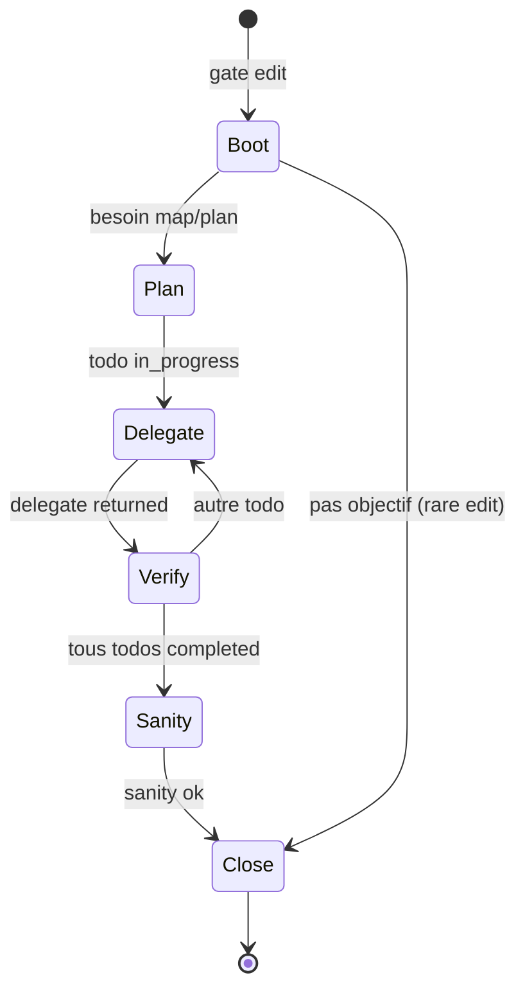

# Prompts additifs par gate et par étape — design 1.3.2

> **OBSOLÈTE** — Design gate-driven **annulé**. Référence : [CONDUCTEUR-CODE.md](CONDUCTEUR-CODE.md) · [gates/ARCHIVE.md](gates/ARCHIVE.md).

**Date** : 2026-06-03  
**Statut** : design de référence — **plan d’exécution** : [PLAN-PROMPTS-ADDITIFS-1.3.2.md](PLAN-PROMPTS-ADDITIFS-1.3.2.md)  
**Liens** : [PROMPTS-REINJECTE-1.3.2.md](PROMPTS-REINJECTE-1.3.2.md) · [CIRCUIT-MOTEUR-GATES-NUDGES.md](CIRCUIT-MOTEUR-GATES-NUDGES.md) · [10-parametrage-prompts-strictesse.md](../../feature-brainstorm/10-parametrage-prompts-strictesse.md) · [PLAN-ALIGNEMENT-PROMPTS-ORCHESTRATION.md](PLAN-ALIGNEMENT-PROMPTS-ORCHESTRATION.md)

---

## 1. Problème

Aujourd’hui, le chemin **edit** charge **`ARCHITECT_SYSTEM_PROMPT` en entier** (~8k car.) au tour 0 via `system_override` (`orchestration_run.rs` → `agent_run.rs`). Les petits modèles :

- perdent du budget contexte avant le premier outil ;
- reçoivent des consignes **hors étape** (discovery, sanity, clôture) alors qu’ils sont en plein milieu d’un todo ;
- se comportent de façon imprécise (plans inventés, re-lecture discovery).

**Objectif 1.3.2** : **partitionner** les textes, **ordonner** l’injection, **additionner** uniquement les blocs utiles à l’étape courante — sans listes heuristiques sur le message user (cf. `RULES.md` §6).

---

## 2. Vocabulaire

| Terme | Définition |
|-------|------------|
| **Gate (run)** | Sous-run / `RunSpec` : `intent` · `discuss` · `edit` · `executor` |
| **Palier (edit)** | État dérivé de `ArchitectRunState` + phase LLM — voir §4 |
| **Bloc** | Morceau de texte à ID stable (`G3-core`, `E-plan`, …) |
| **Noyau** | Bloc `system` posé **une fois** au début du sous-run (court) |
| **Supplément protocole** | Texte **statique** par palier (`E-plan`, `E-delegate`, …) — *comment* agir |
| **Contexte run** | Texte **dynamique** reconstruit chaque tour depuis `ArchitectRunState` — *où* en est le run |

**Règle d’or** : le moteur choisit le palier **et** assemble le contexte run ; le modèle ne reconstruit pas le plan depuis l’historique chat seul.

### 2.1 Deux couches additifs (à ne pas confondre)

| Couche | Source | Exemples | Rafraîchi |
|--------|--------|----------|-----------|
| **Protocole** | Constantes Rust `E-*`, `G3-core` | « Appelle `delegate_executor` maintenant » | Quand le **palier** change |
| **État run** | `ArchitectRunState` + transcript utile | Prompt user, todo-list, tâche courante, dernier delegate | **Chaque tour** (ou après chaque outil structurant) |

Sans la couche **état run**, un petit modèle au milieu d’un plan « oublie » la demande initiale ou réinvente des todos — même avec le bon supplément protocole.

---

## 3. Inventaire des blocs (liste + ordre global)

Ordre **dans le message `system` du tour** (après compaction, avant historique user/assistant) :

| Ordre | ID | Type | Gate(s) | Fichier cible (après refacto) |
|-------|-----|------|---------|-------------------------------|
| 1 | `G0-lang` | merge | toutes | `drox-cli/language.rs` |
| 2 | `G0-native` | supplément | si flag | `prompts.rs` |
| 3 | `G0-disabled-tools` | supplément | si IDE | `assemble.rs` |
| 4 | **noyau gate** | noyau | voir §3.1 | `prompts/architect_*.rs` |
| 5 | **supplément palier** | protocole | edit surtout | `prompts/supplements/*.rs` |
| 6 | **`CTX-run-snapshot`** | **état run** | edit (discuss partiel) | `architect_state.rs` — **voir §3.4** |
| 7 | `CTX-checkpoint` | état run | edit | après `delegate_executor` (existant, à fusionner dans §3.4) |
| 8 | **nudge tour** | protocole | toutes | `nudges/*` (réduire doublons avec §5) |

**Ancien morcellement** (`CTX-anchor` + `CTX-run-objective` séparés) → **unifier** dans `CTX-run-snapshot` pour éviter 3 blocs `system` qui répètent la même todo-list.

Les messages **user** tour 0 : `H-intent-user`, `H-discuss-user`, `H-edit-user` — **sans** répéter le playbook (cf. [PROMPTS-REINJECTE](PROMPTS-REINJECTE-1.3.2.md) §4).

### 3.1 Noyaux par gate (run)

| ID | Gate | Rôle | Taille cible | Contenu minimal |
|----|------|------|--------------|-----------------|
| `G1` | intent | Choisir `[gate: …]` | ≤ 400 car. | 2 chemins, pas d’outils, pas de version produit |
| `G2` | discuss | Réponse directe | ≤ 600 car. | Pas plan/delegate ; outils lecture si besoin |
| `G3-core` | edit | Architecte | ≤ 1 200 car. | Rôle, scope discipline, outils allowlist, marqueurs `[phase]` / `[mode]` |
| `G5-core` | executor | Sous-run | ≤ 800 car. | Identité sub-agent, livrable `.md`, brièveté |

**Hors noyau edit** (devient supplément ou `architect_help`) : discovery playbook, cycle par tâche détaillé, sanity, templates délégation longs.

### 3.2 Suppléments edit par palier (ordre d’activation)

Un seul **supplément palier** actif par tour (le plus spécifique qui matche) :

| Priorité | ID palier | Condition moteur (`ArchitectRunState` + phase) | Comportement visé |
|----------|-----------|--------------------------------------------------|-------------------|
| P0 | `E-none` | Pas d’objectif concret capturé, pas de plan | Ne pas planifier ; `[phase: answering]` ou clarifier |
| P1 | `E-plan` | `!workspace_map_loaded` OU pas de `todo_write` réussi | `workspace_map_read` → `todo_write` (ids `t1`…) |
| P2 | `E-discovery` | `work_mode == Discovery` | Playbook 10–20 lignes **uniquement** ici |
| P3 | `E-delegate` | Todo `in_progress` sans delegate récent / gate lecture saturée | `delegate_executor` + brief ≥80 car. |
| P4 | `E-verify` | Dernier delegate terminé, `!verified_task_ids` contient tâche courante | `file_read`/`grep`/`lsp` puis `completed` |
| P5 | `E-sanity` | Tous todos work `completed`, `cycle_sanity == Pending` | Smoke ou `[cycle: user_check]` |
| P6 | `E-close` | `run_closable()` ou `run_fully_closable()` | `[phase: answering]` → `[phase: done]` |

**Note** : P2 et P1 peuvent se succéder (discovery : plan large après map). En **task** mode, P2 est **absent**.

### 3.4 Contexte run (`CTX-run-snapshot`) — obligatoire en edit

Bloc `system` **régénéré** à chaque tour (budget borné). Contenu **factuel**, pas de playbook.

| Section snapshot | Source état | Inclus quand | Taille / règle |
|------------------|-------------|--------------|----------------|
| **User request** | `user_request_anchor` | toujours edit | ≤ 900 car. (existant `ANCHOR_USER_REQUEST_MAX_CHARS`) |
| **Run objective** | `run_objective_anchor` ou live | si présent | 1 ligne |
| **Work mode** | `work_mode_anchor` | si déclaré | `discovery` \| `task` |
| **Plan / todos** | `todo_statuses` + `task_labels` | dès 1er `todo_write` OK | ≤ 24 lignes ; marquer `in_progress` · `completed` |
| **Focus tâche** | dérivé palier | `E-delegate` / `E-verify` | id + libellé de la todo **courante** uniquement |
| **Last delegate** | `last_delegate_*`, `task_delegate_status` | après delegate | `task_id`, `status`, `scope` court |
| **Verified** | `verified_task_ids` | si non vide | liste ids |
| **Plan output dir** | `orchestration_plan_id` | si plan actif | `.drox/agent-output/<plan_id>/` |
| **Cycle sanity** | `cycle_sanity` | paliers P5–P6 | `pending` \| `passed` \| … |
| **Chemins lus** (option 1.3.2+) | `workspace_paths` ou journal outils | palier verify / delegate | top N chemins, pas tout le map JSON |

**Principe palier × snapshot** : le snapshot est **toujours** présent en edit ; seules les **sections** varient (ex. pas « last delegate » avant le premier `delegate_executor` ; en `E-plan`, mettre en avant todos vides + user request, pas le checkpoint long).

**Discuss** : snapshot minimal — user request + 1 ligne « discussion, no plan » (pas de todo-list).

**Intent** : **pas** de snapshot (tour trop court ; user message seul dans `H-intent-user`).

**Executor** : pas le snapshot architecte — garder `CTX-delegate-block` (brief tâche + scope + instructions) ; éventuellement extrait **context** fourni par l’architecte.

**API cible** :

```text
fn architect_run_context_block(state: &ArchitectRunState, tier: EditTier) -> String
```

Remplace progressivement `cycle_anchor_block()` monolithique : le supplément protocole dit *quoi faire* ; le snapshot dit *sur quoi*.

**Code déjà lu** : ne pas re-injecter les gros `tool_result` dans le snapshot — l’historique compacté + checkpoint post-delegate suffisent ; le snapshot ne liste que **références** (chemins, ids tâche, statuts).

### 3.5 Executor (sous-run)

| Ordre | ID | Quand |
|-------|-----|-------|
| 1 | `G5-core` | Début sous-run |
| 2 | `G5-role-supplement` | Toujours (court) |
| 3 | `CTX-delegate-block` | Message user = brief tâche (existant) |
| 4 | `G5-thinking` | Si native thinking |

---

## 4. Machine à paliers (edit)



**Fonction cible** (Rust) :

```text
fn architect_edit_tier(state: &ArchitectRunState, phase: PhaseHint) -> EditTier
```

- Entrées : champs existants (`workspace_map_loaded`, `todo_statuses`, `last_delegate_*`, `verified_task_ids`, `cycle_sanity`, `work_mode_anchor`, `run_closable`, …).
- Sortie : `EditTier` → choix du supplément `E-*`.
- **Pas** de scan du texte user.

---

## 5. Relation nudges / gates / `architect_help`

| Mécanisme | Rôle après refacto |
|-----------|-------------------|
| **Supplément palier** | Proactif — « ce que tu dois faire **maintenant** » (court) |
| **Gate bloquante** | Réactif — erreur outil + **une** ligne « next action » (garder messages courts) |
| **Nudge** | Anti-boucle uniquement ; **ne pas** recopier le supplément palier |
| **`architect_help`** | Playbook long **à la demande** (`topic: plan|delegate|closure|…`) |

Critère de succès : supprimer les paragraphes dupliqués entre `G3` monolithe, `ARCHITECT_NUDGE_*` et `architect_help`.

---

## 6. Arborescence code (livré — phase 1)

```text
drox-engine/.../orchestration/prompts/
  vars.rs              # PromptVars, StrictnessPreset, render `{key}`
  registry.rs          # PromptBlockId
  system/
    blocks/
      gates/           # intent.md, discuss_core.md
      discuss/         # read_budget.md  → {read_budget_percent}
      edit/            # 01_core.md … 18_rules.md, parallel_slots.md
    gates/             # assemblage G1, G2, G3
    supplements/       # paliers E-* (phase 2)
    context/           # CTX-run-snapshot (phase 2)
```

Discussion assemble désormais **noyau + read_budget** via `architect_discussion_system_prompt(&PromptVars)`.

---

## 7. Plan de travail

**Source de vérité pour l’ordre d’implémentation, le statut livré / manquant et les checkboxes** : [PLAN-PROMPTS-ADDITIFS-1.3.2.md](PLAN-PROMPTS-ADDITIFS-1.3.2.md).

Résumé des phases (détail et critères dans le plan) :

| Phase | Contenu |
|-------|---------|
| **0** | Fondations — ✅ partiel (arborescence, vars, discuss) |
| **1** | Suppléments palier `E-*` + injection `loop.rs` |
| **2** | Snapshot contexte run |
| **3** | `drox.engine.strictness` IDE → moteur |
| **4** | Finitions, dogfooding, clôture |

---

## 8. Ancien découpage phases (archivé — voir plan)

### Phase 0 — Verrouiller ce document (½ j)

- [ ] Valider la table §3.2 (paliers + priorités).
- [ ] Valider tailles cibles noyaux (petit modèle ~7B : noyau edit ≤ 300 tokens).
- [ ] Lier les IDs aux entrées registre [10-parametrage](../../feature-brainstorm/10-parametrage-prompts-strictesse.md) (G1–G5, presets `relaxed|normal|strict`).

### Phase 1 — Découpe code sans changer le runtime (1 j)

- [ ] Créer `drox-engine/.../prompts/supplements/` + `edit_core.rs`, `edit_tiers.rs` (textes seulement).
- [ ] Extraire le contenu actuel de `architect_edit.rs` vers les blocs ID.
- [ ] `architect_system_prompt_for_run()` assemble encore **tout** (comportement inchangé) — tests existants verts.

### Phase 2 — Résolveur de palier (1 j)

- [ ] `EditTier` + `architect_edit_tier()` dans `architect_state.rs` ou `prompts/edit_tiers.rs`.
- [ ] Tests unitaires : état synthétique → palier attendu (matrice 10–15 cas).

### Phase 3 — Injection dynamique protocole + snapshot (2 j)

- [ ] Remplacer `system_override` statique par noyau `G3-core` seul au setup.
- [ ] Avant **chaque** tour edit : `messages.push(system(architect_run_context_block(state, tier)))` — snapshot **toujours** à jour.
- [ ] Si `tier` ≠ `last_tier` → ajouter `messages.push(system(supplement_for_tier(tier)))`.
- [ ] Tour 0 : noyau + snapshot (user request) + supplément P0/P1 si besoin.

### Phase 4 — Fusion ancre / allègement (1 j)

- [ ] Remplacer `inject_architect_cycle_anchor` + `run_objective` épars par le snapshot unifié (après compaction : **un** bloc, pas trois).
- [ ] Dédupliquer : snapshot ne recopie pas le texte du supplément protocole.
- [ ] Intent : pas de snapshot. Discuss : snapshot minimal.
- [ ] Audit [PROMPTS-REINJECTE](PROMPTS-REINJECTE-1.3.2.md) : cocher les redondances supprimées.

### Phase 5 — Dogfooding & clôture 1.3.2 (1 j)

- [ ] Scénarios : « Salut » (discuss) · fix ciblé (task) · audit explicite (discovery) · milieu de plan (delegate/verify).
- [ ] Export chat : label supplément vs nudge vs ancre.
- [ ] PATCHNOTES + JOURNAL + CLOSURE.

**Estimation** : ~5–6 j concentrés ; peut être livré par incréments (phase 1–2 sans changement UX).

---

## 8. Fichiers touchés (prévision)

| Fichier | Changement |
|---------|------------|
| `orchestration/prompts/architect_edit.rs` | Noyau + API `supplement_for_tier` |
| `orchestration/prompts/supplements/*.rs` | Nouveaux textes |
| `agent/architect_state.rs` | `EditTier`, résolveur |
| `agent/loop.rs` | Injection supplément par tour |
| `jsonrpc/handlers/orchestration_run.rs` | Noyau seul au setup |
| `agent/nudges/architect.rs` | Raccourcir, dédupliquer |
| `drox-tools/.../architect_help.rs` | Référencer les IDs, pas recoller G3 |
| Docs 1.3.2 | Ce fichier, PATCHNOTES, CIRCUIT §13 |

---

## 9. Critères d’acceptation 1.3.2

1. **Intent / discuss** : system total ≤ seuil documenté ; aucun extrait du playbook edit.
2. **Edit tour 0** : pas de bloc discovery/sanity/closure dans le system initial.
3. **Edit milieu de plan** : supplément `E-delegate` ou `E-verify` + **snapshot** avec user request + todo-list + tâche courante (export lisible).
4. **Petit modèle** : scénario « Salut » → discuss, 1 réponse, stop (régression [07-reponses-legere](../../feature-brainstorm/07-reponses-legere-sans-plan.md)).
5. **Aucune** nouvelle heuristique mots-clés sur `params.prompt`.
6. **Snapshot** : régénéré après `todo_write` / `delegate_executor` ; le modèle n’a pas besoin de relire tout le transcript pour connaître le plan.

---

*Ne plus utiliser les checkboxes ci-dessous — suivre [PLAN-PROMPTS-ADDITIFS-1.3.2.md](PLAN-PROMPTS-ADDITIFS-1.3.2.md).*
