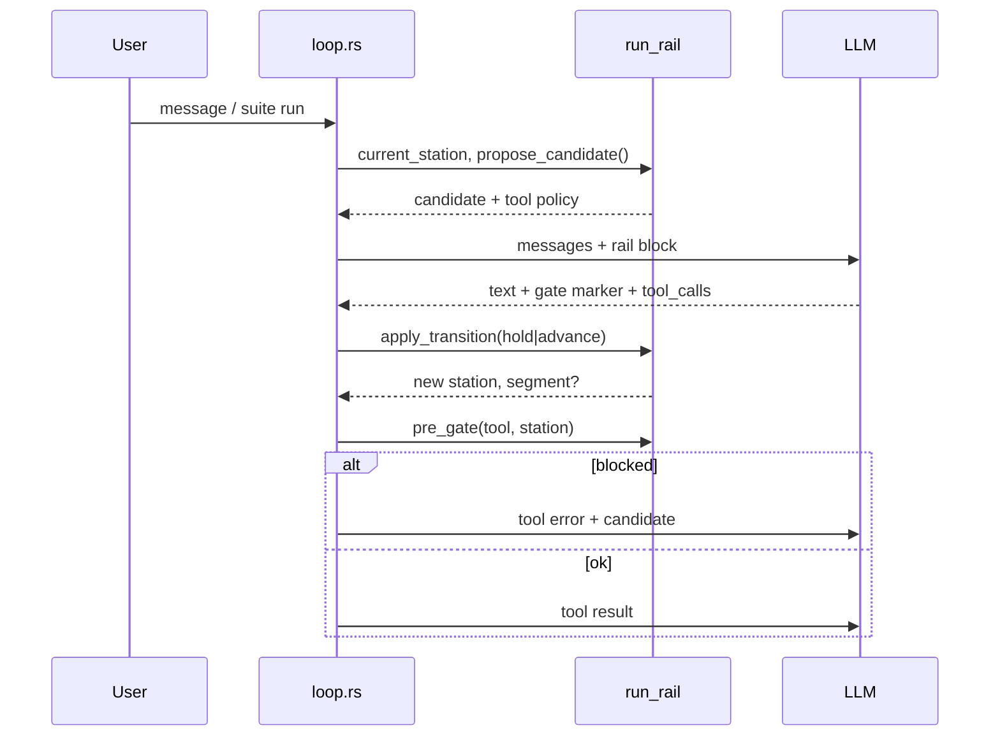

# 02 — Protocole rail (hold / advance, mode A)

**Parent** : [README](README.md) · **Prérequis** : [01-VISION.md](01-VISION.md) · **Suite** : [03-STATIONS.md](03-STATIONS.md)

---

## Séquence linéaire

```text
INTENT ──► READ ──► PROPOSE ──► PLAN ──► ACT ──► VERIFY ──► ANSWER
```

| Station | Rôle une phrase |
|---------|-----------------|
| `INTENT` | Comprendre la demande ; décider hold ou advance |
| `READ` | Collecter des faits repo (lecture seule) |
| `PROPOSE` | Proposition / design user-facing (pas de mutation) |
| `PLAN` | `todo_write` — engagement moteur |
| `ACT` | Mutations (segment possible) |
| `VERIFY` | Preuve (bash, lsp, relecture ciblée) |
| `ANSWER` | `[phase: answering]` + `[phase: done]` |

Ordre **canonique** stocké dans `station.rs` (`next_station`, `prev_station`).

---

## Protocole de transition (consultatif)

### Marqueurs assistant

```text
[gate: hold]      — je m’arrête à la profondeur actuelle ; le moteur pousse vers ANSWER
[gate: advance]   — j’emprunte la station candidate proposée par le moteur
```

**Règles** :

1. Un seul marqueur `gate:` par tour (ligne seule, comme `[phase: …]`).
2. Si absent : le moteur **nudge** une fois avec la candidate affichée ; pas de blocage infini.
3. `hold` depuis n’importe quelle station → transition vers `ANSWER` (outils mutation coupés).
4. `advance` → entrée dans la **candidate** ; outils filtrés selon [03-STATIONS.md](03-STATIONS.md).

### Message moteur (snapshot / nudge)

À chaque frontière, le moteur injecte un bloc court :

```text
## Run rail (engine)
Station: READ
Next candidate (mode A): PROPOSE
Declare [gate: hold] to answer now, or [gate: advance] to enter PROPOSE.
```

Source : `run_rail/transition.rs` + `run_snapshot.rs` (bloc dédié, pas le snapshot architecte entier).

---

## Mode A (figé)

**Le moteur propose toujours une seule candidate** = successeur linéaire.

```text
Station courante: READ  →  candidate: PROPOSE
Station courante: PROPOSE  →  candidate: PLAN
…
Station courante: ANSWER  →  (pas de candidate — clôture)
```

### Interdictions (gates dures)

| Action | Bloquée si |
|--------|------------|
| Outil mutation (`file_*`, `bash`, …) | Station ∉ {`ACT`, `VERIFY`*} |
| `todo_write` | Station ∉ {`PLAN`} ou depth `short` sans justification |
| `advance` implicite via tool interdit | Tool appelé hors station → erreur structurée + candidate rappelée |

\* `VERIFY` : bash/lsp autorisés ; `file_write` interdit sauf correction minimale (policy à affiner en Phase 2).

### Boot du run (première station)

1. RPC `architectInteractionMode` inchangé (discuss / analyze / edit).
2. **Nouveau** : tout run `edit` démarre en `INTENT` avec candidate `READ` (pas directement en liberté totale).
3. Run `discuss` / `analyze` : rail raccourci — équivalent `INTENT` → `hold` implicite vers réponse, outils lecture seule. Voir [08-MIGRATION.md](08-MIGRATION.md).

---

## Mode B (reporté)

**Idée** : le modèle demande `advance` vers une station non-successive avec une ligne de justification.

```text
[gate: advance plan]
Already know the files; skipping READ.
```

| | Mode A | Mode B |
|---|--------|--------|
| Candidate | Toujours successeur | Modèle propose, moteur valide |
| Complexité code | Faible | Moyenne |
| Risque contournement | Faible | Sauts dangereux si mal validé |

**Statut** : documenté pour mémoire ; **aucune implémentation** avant dogfood mode A réussi.

---

## Relation avec `[phase: …]`

| Protocole | Rôle |
|-----------|------|
| `[gate: hold\|advance]` | **Profondeur** du run (rail) |
| `[phase: reading\|acting\|…]` | **Style** du tour courant (UI trace, existant) |

Les deux coexistent. Le rail **contraind** les outils ; les phases **décrivent** le tour.

Mapping indicatif :

| Station | Phase typique |
|---------|---------------|
| READ | `reading` |
| PROPOSE | `answering` (proposition) |
| PLAN | `planning` |
| ACT | `acting` |
| VERIFY | `testing` / `verifying` |
| ANSWER | `answering` → `done` |

---

## Flux moteur (un tour)



---

## Anti-patterns à éviter

- Dupliquer la logique rail dans `architect_gates.rs` **et** `gates.rs` **et** `loop.rs`.
- Ajouter une gate par symptôme du transcript (fichier `anti_bash.rs`, etc.).
- Remplacer `hold`/`advance` par une heuristique « salut » opaque.
- Mélanger rail et routage discuss/edit dans le même enum sans couche claire.
