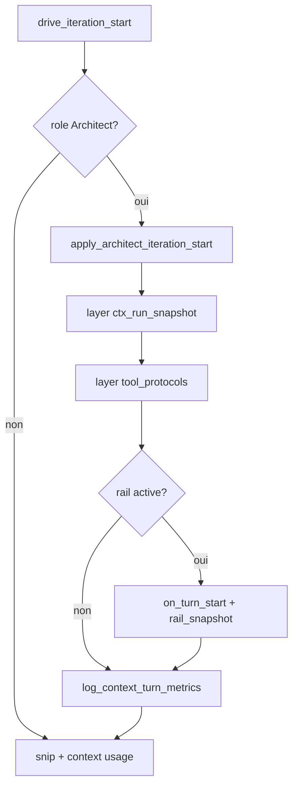

# Architecture Context Frame — règles de découpage

**Chantier** : 1.4.1.3 · juin 2026

---

## Séparation moteur / IDE

```text
┌─────────────────────────────────────┐     ┌──────────────────────────────┐
│  drox-engine (Rust)                 │     │  Drox IDE (TypeScript)       │
│  ─────────────────                  │     │  ─────────────────────       │
│  context_frame/                     │     │  droxChatSendRun.ts          │
│  prompts/system/blocks/             │     │  droxUserPromptEngine.ts   │
│  agent/loop/drive/                  │     │  droxClientTools.ts          │
│  rail/, state/snapshot.rs           │     │  UI replay / busy / surface  │
└─────────────────────────────────────┘     └──────────────────────────────┘
         │                                              │
         │  AgentEvent stream                           │  tool wire exec
         └────────────────── WebSocket / RPC ────────────┘
```

| Règle | Détail |
|-------|--------|
| **G-CTX-01** | Troncature user côté TS uniquement — le moteur ne duplique pas cette logique |
| **Frames** | Déclarées et appliquées en Rust ; l'IDE ne compose pas de system prompts moteur |
| **Outils** | Specs + protocoles = moteur ; handlers = IDE + `drox-tools` |
| **Plan interne** | État + injection = moteur ; masquage export replay = IDE (Phase 4) |

---

## Arborescence moteur cible

```text
orchestration/
  context_frame/           # NEW — orchestration injection (Phase 2+)
    mod.rs
    types.rs               # FrameId, LayerId, InjectMode
    manifest.rs            # v0 frames (miroir frames-v0.yaml)
    apply/
      mod.rs
      iteration.rs         # architect.*.iteration_start
      # post_checkpoint.rs  # Phase 2.3
      # gate_nudge.rs       # Phase 2.3
  prompts/
    system/blocks/         # textes statiques .md
    registry.rs            # PromptBlockId

agent/
  loop/drive/
    iteration_start.rs     # délègue → context_frame (mince)
    boot.rs
    outcome.rs             # nudges → gate_nudge (Phase 2.3)
    tools.rs               # split prévu G-DEBT-01 (< 500 L)
  state/
    snapshot.rs            # primitives replace/insert (appelées par layers)
  rail/
    snapshot_block.rs
```

**Limite fichier** : ~500 lignes max. Si un module grossit → sous-dossier (`apply/`, `layers/`).

---

## Module `context_frame` — responsabilités

| Fichier | Rôle | Max ~L |
|---------|------|--------|
| `types.rs` | Types spec, pas de logique agent | 120 |
| `manifest.rs` | Liste ordonnée des layers par frame | 150 |
| `apply/iteration.rs` | Applique `architect.*.iteration_start` | 200 |
| `apply/mod.rs` | Réexport apply_* | 30 |

**Ne pas mettre dans context_frame** : exécution outils, streaming LLM, compaction complète — restent dans `agent/loop/`.

---

## Flux iteration_start (Phase 2)



---

## Évolution par phase

| Phase | Code | Comportement |
|-------|------|--------------|
| **1** | Docs seulement | Matrice + YAML |
| **2** | `context_frame` + délégation | **Parité** — même texte injecté |
| **3** | Tool folders | ACT : surface `edit_file` |
| **4** | `internal_plan_write` | Plan L2 modèle, non UI |
| **5** | Optimisation | Bytes, skip layers conditionnels |

---

## Tests de non-régression

- `cargo test -p drox-engine context_frame`
- Golden : ordre + contenu blocs marqués pour READ / ACT
- Smoke dogfood : tokens in ±5 % vs `ses_4b2c1d08`
