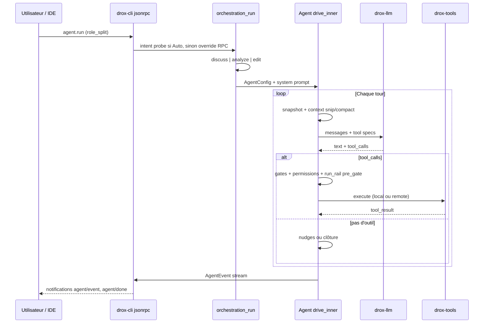

# Carte globale — un run de bout en bout

Vue synthétique pour situer les 11 dossiers fonctionnels.

---

## Séquence : utilisateur → réponse



---

## Où vit quoi (crates)

```text
drox-cli/          → 01 entree-wire
drox-engine/
  agent/loop/      → 02 boucle-agent
  orchestration/   → 03 orchestration-prompts
  permissions.rs   → 05 permissions-hooks
  compaction.rs    → 06 contexte-memoire
  subagent.rs      → 07 sous-agents
  agent/gates/       → 08 gates-nudges-etat
  agent/rail/        → 09 run-rail
  orchestration/tool_folders/ → dossiers outils × stations (1.4.1.3)
  event.rs         → 10 evenements-phases
drox-tools/        → 04 tools
drox-llm/          → 11 crates-workspace
drox-session/      → 06 contexte-memoire
drox-context/      → 06 contexte-memoire
drox-permissions/  → 05 permissions-hooks
drox-types/        → 11 crates-workspace (contrats)
```

---

## Rôles (`RunSpec`)

| `RoleId` | Usage 1.4.1 chat | Allowlist |
|----------|------------------|-----------|
| `Architect` | Edit + run rail (solo) | Complète (mutations, reads, …) |
| `ArchitectDiscussion` | Discuss / analyze | Lecture seule + outils discuss |
| `Executor` | Legacy CLI / code mort role_split | Non exposé IDE chat 1.4.x |
| `Standard` | CLI one-shot | Registry filtré |

Détail : [03-orchestration-prompts](03-orchestration-prompts/README.md), `run_spec/mod.rs`.

---

## Deux « conducteurs » à ne pas confondre

| Couche | Rôle | Dossier |
|--------|------|---------|
| **Boucle 1.3** | Gates réactives, nudges, phases, todos, anti-boucle | 02 + 08 |
| **Run rail 1.4.x** | 7 stations linéaires, pre_gate, tool folders, plan interne L2 | 09 |

Les deux coexistent aujourd’hui quand `runRailEnabled` est actif sur un run architect **edit**. C’est une source de complexité documentée dans l’audit smoke ([chat_qwen27b](../../1.3/chat_qwen27b.txt)).

---

## Point d’entrée code unique

Tout run agent passe par :

```text
drox-engine/src/agent/core/agent.rs   Agent::run()
    → agent/loop/drive.rs             drive_inner()   [boucle principale]
```

Si tu ne lis qu’un fichier après cette carte : **`agent/loop/drive/mod.rs`** et **`agent/rail/policy.rs`**.
