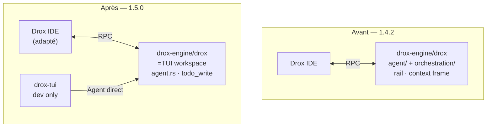

# Impact du remplacement moteur 1.4 → TUI (1.5.0)

**Statut** : Phase **1–4 ✅** · dogfood **5.1 ✅** · clôture doc **5.5–5.7 ✅** — merge upstream **5.8–5.9** à suivre.

**Question** : si on reprend **tout** du TUI dans `drox-engine/drox`, qu’est-ce qui disparaît, qu’est-ce qui reste, qu’est-ce qui doit bouger hors Rust ?

---

## Périmètre « on remplace tout »

| Zone | Action |
|------|--------|
| **`drox-engine/drox/**`** | ✅ **100 % remplacé** par copie workspace TUI |
| **Moteur dans le binaire livré** | ✅ Uniquement le TUI (`drox-cli` → `drox.exe`) |
| **`docs/from_TUI/`** | Miroir dogfood : **copié puis supprimé** — vérité = `drox-engine/drox/` |
| **`src/vs/workbench/contrib/drox/`** | ❌ **Figé** pour 1.5.0 — le **moteur** s’adapte via shim RPC (`drox-cli`) |
| **`docs/1.4/`** | ❌ **Archivé** (historique) — ne décrit plus le code livré |
| **`drox-engine/extension-vscode/`** | ❌ Client alternatif — hors chemin Drox IDE principal ; audit séparé |
| **VS Code / Code OSS** | Rattrapage upstream en **fin de Phase 5** (après dogfood moteur) — pas pendant le shim RPC |

**Verdict** : « Tout du TUI » = **tout le workspace Rust moteur**. Pas « tout le dépôt GitHub ».

---

## Ce qui meurt dans `drox-engine/drox` (moteur 1.4.x) — **effectif depuis Phase 1**

Chiffres **avant** swap (référence historique `v1.4.2`) :

| Métrique | Moteur 1.4 actuel |
|----------|-------------------|
| Fichiers `.rs` workspace | ~273 |
| Module `agent/` (rail, gates, loop, nudges…) | **~79 fichiers** |
| Module `orchestration/` | **~33 fichiers** |
| `run_spec/` (role_split, Architect, Executor…) | présent |
| Tests `drox-engine` | **~272** |

### Arborescence supprimée (conceptuellement)

```text
drox-engine/src/
├── agent/                    ← TOUT (rail, gates, nudges, phases prescriptifs…)
│   ├── rail/                 ← intent, infer, transition, policy, read_stall…
│   ├── loop/drive/           ← boot orchestration 1.4, outcome rail…
│   ├── gates/                ← done mutation, tool_pre rail…
│   └── orchestration/        ← NON — orchestration est sibling :
├── orchestration/            ← TOUT
│   ├── context_frame/        ← 4 couches 1.4.1.3
│   ├── intent_probe/         ← (déjà retiré en 1.4.2)
│   ├── tool_folders/         ← (déjà retiré)
│   ├── routing.rs            ← discuss/analyze/edit statique 1.4.2
│   ├── prompts/system/       ← 01_core_rail_solo, blocks par station…
│   └── start_run.rs / …      ← DiscussWithReads, architect gates
├── run_spec/                 ← role_split, Architect vs Discussion
└── assets/gates/             ← gate-graph (si plus de consommateur)
```

### Comportements produit qui **n’existent plus** dans le binaire

- Run rail (stations INTENT→READ→…→ANSWER)
- Orchestration `role_split` / `architectInteractionMode` côté moteur
- Context Frame 4 couches + injection par station
- `internal_plan_write` (remplacé par **`todo_write`** côté TUI)
- Intent probe / routage 1.4.2
- Tool folders / ACL par station
- Events `RailStation*`, `RunRouting`, `LlmTurnPrepared`, `RoleEnter`, segments executor
- Preset `EngineTuning` / rail observateur 1.4.2

→ **C’est voulu** si tu reprends tout le TUI.

---

## Ce qui arrive avec le moteur TUI (remplace tout) — **en place**

| Métrique | Moteur TUI |
|----------|------------|
| `drox-engine/src/` | Fichiers **plats** + `agent.rs` **monolithe** (~5,5k lignes) |
| Crate **`drox-tui`** | Client terminal (dogfood — **pas** dans l’installeur) |
| Tests `drox-engine` | **~107** (autre suite — à faire repasser) |
| Protocole phases | `analyzing`, `clarifying`, `acting`, `answering`, `done`… |
| Plan utilisateur | **`todo_write`** (+ panneau TUI) |
| Modes | `professor`, sous-agents `task`, `course_plan_write` |
| JSON-RPC | `drox --serve` **déjà présent** dans `drox-cli` TUI |

### Crates workspace (quasi identiques + 1)

| Crate | 1.4 | TUI |
|-------|-----|-----|
| drox-types, llm, tools, session, context, permissions, mcp, bash, hooks | ✅ | ✅ (contenu **différent**) |
| drox-cli | ✅ | ✅ |
| drox-engine | ✅ modular | ✅ monolithe agent |
| **drox-tui** | ❌ | ✅ |

Les crates « partagées » ont le **même nom** mais le **code a divergé** — en pratique tu ne merges pas : tu **écrases** avec la version TUI.

---

## Hors moteur : ce qui est **impacté** (shim moteur → IDE, pas refonte IDE)

### 1. IDE — `contrib/drox` (moteur s’adapte ; vignettes ciblées)

| Zone IDE | Verdict 1.5.0 | Travail |
|----------|---------------|---------|
| Vignette **Configuration** | ✅ Conserver | Moteur : `server`, API, itérations, flags → `agent.run` / env |
| Vignette **Architecte** (modèle + `num_ctx` + sampling) | ✅ Conserver | Moteur : champs RPC → `LlmConfig` (gap `numCtx` en params aujourd’hui) |
| Vignettes permission (Analyze / Trust / Not crazy) | ✅ Conserver | Moteur : map → `PermissionMode` TUI |
| `droxChatAgentEvents.ts` (rail, phases) | Pas de refonte | Shim émet events compatibles |
| `architectInteractionMode`, `orchestrationMode` | ❌ Sémantique morte | Moteur ignore ; retirer contrôles UI dédiés si restants |
| Vignettes rôle Executor / discuss 1.4 | ❌ Supprimer si présentes | — |
| Tests `droxCommon.test.ts` | Pas réécrits en 1.5.0 | — |

### 2. Scripts & CI

| Fichier | Impact |
|---------|--------|
| `package-drox.ps1` | Chemin inchangé ; binaire différent |
| `smoke-orchestration-preflight.ps1` | **Obsolète** (tests orchestration 1.2) — supprimer ou remplacer |
| `validate-gate-graph.mjs`, `sync-gate-routes-from-graph.mjs` | **Obsolètes** si plus de gate-graph |
| `.github/workflows/drox-rust.yml` | Même `working-directory` ; nouvelle suite de tests |
| `verify-drox-engine.ps1` | Inchangé (chemins exe) |

### 3. Documentation

| Zone | Impact |
|------|--------|
| `docs/1.4/**` | **Archive** — ne plus décrire le moteur livré |
| `docs/1.5/1.5.0/` | Vérité migration |
| `docs/moteur/` (cartographie 1.4) | **Obsolète** — réécrire post-swap ou archiver |
| `README.md` racine | Déjà « moteur obsolète » → pointer **1.5.0 TUI** |

### 4. Non impacté (ou presque)

- **Build VS Code** / Electron / extensions marketplace
- **Pipeline release** (`drox:ship`) — même flux
- **Client tools IDE** (`file_edit`, `lsp`, `bash` via `tool/exec`) — **même contrat** RPC
- **`user/ask`** — même pattern
- **Sessions JSONL** — même famille d’API (`session.list`, `session.read`)
- **`.drox/`** sur disque — compatible (sessions, permissions, hooks)

### 5. `extension-vscode/` (hors Drox IDE fork)

Extension standalone dans le repo — **pas** le chat workbench intégré. Si tu ne l’utilises pas pour le fork, traiter en **audit optionnel** (peut rester en retard).

---

## Reprendre TOUT le TUI — checklist de conscience

| Question | Réponse si « tout TUI » |
|----------|-------------------------|
| On garde du rail 1.4 ? | **Non** |
| On garde `internal_plan_write` ? | **Non** — retour `todo_write` |
| On garde context frame 4 couches ? | **Non** — compaction/phases TUI |
| On garde les 272 tests 1.4 ? | **Non** — suite TUI (~107) + nouveaux tests IDE |
| On garde `drox-tui` dans le repo ? | **Oui** — référence UX / dogfood |
| L’IDE doit changer ? | **Oui** — adaptateur events + retrait rail UI |
| La doc 1.4 reste valide ? | **Non** pour le code — oui comme historique |

---

## Schéma avant / après



---

## Prochaine étape réflexion

Avant Phase 1 (copie), valider :

1. **OK** pour perdre définitivement rail + orchestration 1.4 dans le binaire ?
2. **OK** pour réintroduire `todo_write` + UI todos dans le chat ?
3. **OK** pour simplifier / retirer vignettes Auto·Discuss·Action tant que le moteur TUI n’a pas d’équivalent RPC ?

Si oui aux trois → **reprendre 100 % du TUI** dans `drox-engine/drox` est cohérent ; le travail restant est surtout **IDE + doc + scripts morts**.
