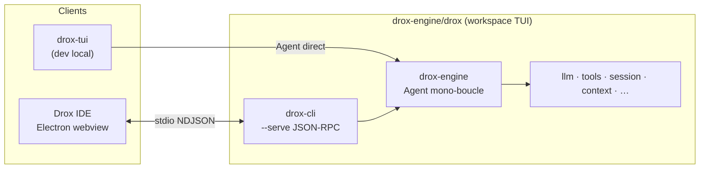

# Plan 1.5.0 — Remplacement complet du moteur (TUI → VS Code)

**Version** : juin 2026  
**Statut** : **clôturé (moteur)** — branche `1.5.0` · merge upstream **documenté** ([AUDIT-UPSTREAM-1.5.0.md](AUDIT-UPSTREAM-1.5.0.md))  
**Décision produit** : le moteur **1.4.x est abandonné** dans le dépôt sources. Le workspace `drox-engine/drox` est **entièrement remplacé** par le moteur TUI (copie depuis le miroir dogfood `docs/from_TUI`, puis supprimé). Pas de conservation du rail, de l’orchestration `role_split`, ni des modules 1.4 « à recycler ».

### Avancement (journal)

| Date | Étape | Détail |
|------|--------|--------|
| juin 2026 | Doc ligne 1.5 | `main` · commit `c8c3618` — plans 1.5.0–1.5.3, hub 1.5 |
| juin 2026 | **Phase 1** | Branche `1.5.0` · commit `6b1a97b` — swap moteur, `cargo test --workspace` vert, `drox.exe` release |
| juin 2026 | Miroir dogfood | `docs/from_TUI/` supprimé après copie — vérité = `drox-engine/drox/` |
| juin 2026 | Décision intégration | **R-ENGINE-FOLLOW-IDE** + **R-VIGNETTES** (Config + Architecte conservées) |
| juin 2026 | **Phases 2–4** | Shim RPC, `ide_event_shim`, tests `RemoteTool`, `orchestrationPipeline: tui_mono` |
| juin 2026 | **Dogfood 5.1** | 3 scénarios `site-kdds` — [chat_qwen27b.txt](../../chat_qwen27b.txt) |
| juin 2026 | **Clôture** | `droxVersion` 1.5.0 · [CLOSURE-1.5.0.md](CLOSURE-1.5.0.md) |

**Prochaine étape** : merge upstream sur branche `integrate/vscode-…` (5.8–5.9) · puis `drox:ship` + tag `v1.5.0`.

---

## Décision architecture — où vit le moteur ?

### Tranché : **remplacer in-place** (`drox-engine/drox`), pas déplacer à la racine

| Option | Verdict |
|--------|---------|
| **A — Déplacer `from_TUI` à la racine** (ex. `/drox/`) et rebrancher tout | ❌ **Non** |
| **B — Remplacer le contenu de `drox-engine/drox`** par le workspace TUI | ✅ **Oui** |

**Pourquoi B et pas A**

- Le fork est déjà structuré **Code OSS + moteur embarqué** : `package-drox.ps1`, `resources/drox/`, F5, garde-fous release pointent tous vers `drox-engine/drox`.
- Déplacer à la racine = retoucher dizaines de chemins (scripts, CI, docs, extension paths) **sans gain** — le moteur n’est pas un second produit, c’est la DLL du fork.
- Miroir dogfood `docs/from_TUI` (gitignored) : **utilisé pour la copie Phase 1, puis supprimé** ; la **vérité versionnée** = `drox-engine/drox`.
- Le binaire livré reste **`drox.exe`** (crate `drox-cli`), pas `drox-tui.exe`.

**Opération concrète (Phase 1)** : vider `drox-engine/drox/` → copier le workspace `from_TUI/` (hors `target/`, logs, `.drox/`) → commit. Historique 1.4 = git / tag `v1.4.2` uniquement.

**`drox-tui`** : conservé comme **member** du workspace sous `drox-engine/drox/crates/drox-tui` pour dogfood terminal ; **exclu** de `package-drox` (installeur = `drox-cli` seul).

---

## Décision intégration — moteur → VS Code, vignettes composer conservées

**Tranché (juin 2026)** : l’alignement principal est **moteur → IDE** (`drox-cli` / shim RPC). On ne refond pas le chat, le rail timeline ni les handlers events pour coller au TUI.

**Exception UI (vignettes)** : conserver les **vignettes Configuration** et **Architecte** du composer — elles restent le panneau de contrôle LLM (serveur, modèle, `num_ctx`, sampling). Le moteur doit **honorer** ce qu’elles envoient via `agent.run` / settings / env spawn.

Le cœur agent reste le mono-boucle TUI (`agent.rs`). On ne réintroduit pas l’orchestration 1.4 — seulement un **adaptateur** RPC au-dessus.

### Trois couches

```text
┌─────────────────────────────────────────────────────────┐
│  Drox IDE — webview composer                            │
│  Vignettes : Configuration ✅ · Architecte ✅            │
│  Vignettes permission : Analyze / Trust / Not crazy *   │
│  Handlers events · timeline rail (alimentés par shim)    │
├─────────────────────────────────────────────────────────┤
│  Adaptateur moteur → IDE (CHANTIER 1.5.0)               │
│  drox-cli/jsonrpc : protocol.rs · handlers.rs · shim     │
│  Params vignettes → LlmConfig + PermissionMode          │
│  Events TUI → format IDE (rail synthétique si besoin)    │
├─────────────────────────────────────────────────────────┤
│  Cœur agent TUI (logique inchangée)                     │
│  drox-engine/agent.rs · PermissionMode · phases           │
└─────────────────────────────────────────────────────────┘
```

\* Voir § Vignettes — les modes permission **existent** dans le moteur TUI sous d’autres noms ; on **mappe**, on ne supprime pas sauf rôle 1.4 pur.

**Hors scope UI** : refonte conducteur rail, timeline orchestration, retirer `droxChatAgentEvents` pour le TUI.

### Vignettes composer — conservation ciblée (décision produit)

| Vignette / zone (`droxChatWebview`) | Verdict 1.5.0 | Moteur (shim) |
|-------------------------------------|---------------|---------------|
| **Configuration** (`general-settings-vignette`) | ✅ **Conserver** | `server`, `apiKey`, `maxIterations`, `nativeThinking`, `mcpToolsEnabled`, `keepAlive`, `maxTokens`, `numPredict`… via `agent.run` + env spawn |
| **Architecte** (`architect-model-vignette` + panneau) | ✅ **Conserver** | `model`, `numCtx` (presets 16k–1M), `temperature`, `topP`, `topK`, `repeatPenalty`, `minP`, `seed` — champs RPC + `LlmConfig` (aujourd’hui souvent **env seulement** → à compléter Phase 3) |
| **Permission** (`agent-vignettes` : Analyze / Trust edit / I'm not crazy) | ✅ **Conserver** si mapping moteur | IDE envoie `analyze` \| `trustEdit` \| `imNotCrazy` → mapper vers `PermissionMode` TUI : `plan` \| `acceptEdits` \| `default` |
| **Orchestration 1.4** (`orchestrationMode`, `role_split`, exécuteur…) | ❌ Pas de sémantique moteur | Tolérer / ignorer en RPC ; **ne pas** réimplémenter |
| **`architectInteractionMode`** (auto / discussion / action) | ❌ Pas dans mono-boucle TUI | Ignorer côté moteur ; retirer **uniquement** les contrôles UI dédiés s’il en reste (pas les vignettes Architecte modèle) |
| Rôles / vignettes modèle **Executor**, Discuss, etc. | ❌ Supprimer si présents | N/A |

**Règle** : pas de refonte webview — **retrait minimal** des vignettes/contrôles dont le rôle n’a **aucun** équivalent moteur TUI. Les deux vignettes prioritaires (Configuration + Architecte) ne bougent pas.

**Écart connu (Phase 3)** : `build_llm_config` lit `numCtx` / sampling depuis **variables d’env** (`DROX_NUM_CTX`, …) mais pas encore tous les champs **`AgentRunParams`** envoyés par les vignettes — à brancher dans `handlers.rs`.

### Carte shim moteur → contrat IDE (cible 1.5.0)

| Attendu IDE (réf. `contrib/drox`) | Travail moteur (`drox-cli`) | Notes |
|-----------------------------------|-----------------------------|--------|
| Vignette **Configuration** → `server`, clés API, itérations | `AgentRunParams` + env spawn | P0 |
| Vignette **Architecte** → `model`, `numCtx`, sampling | Champs RPC → `LlmConfig::with_*` | P0 — gap actuel |
| `mode` permission (`analyze` / `trustEdit` / `imNotCrazy`) | Map → `plan` / `acceptEdits` / `default` | P0 |
| `orchestrationMode`, `architectInteractionMode` | `#[serde(default)]` + **ignorés** | Pas de rail 1.4 |
| Events `rail_station_*` | Synthèse depuis phases TUI | Phase 4 |
| `phase_*`, `text_delta`, `tool_*`, `stop` | Relais / mapping 1:1 | P0 |
| `executableTools` + `tool/exec` | Délégation client | P0 |
| `user/ask` | Inchangé | P0 |
| `sessionId`, images, `todo_write` | Compat transcript / multimodal / outils | Phase 3 |

**Livrable doc Phase 4** : fiche `SHIM-MOTEUR-IDE.md` (table params + events, mapping TUI → IDE) — à créer quand Phase 3 smoke est verte.

### TUI (hors chemin IDE)

| TUI | IDE | Décision |
|-----|-----|----------|
| `drox-tui` / `engine/bootstrap.rs` | Non concerné par le shim | Dogfood moteur nu |
| Widgets `ratatui`, vim, slash | Webview figée | Pas de port TUI → IDE en 1.5.0 |

---

**Cible finale** : un seul moteur Rust → binaire `drox.exe` → `drox --serve` → **Drox IDE** (chat webview). Le binaire `drox-tui` reste **outil dev local** (dogfood terminal), **hors** installeur release.

---

## Principe directeur

| Règle | Détail |
|-------|--------|
| **R-REPLACE** | Table rase de `drox-engine/drox` ; contenu = copie du workspace TUI (hors artefacts locaux). |
| **R-NO-MERGE** | Pas de « on garde rail/policy.rs » — si le fichier n’existe pas dans le TUI, il **disparaît**. |
| **R-RPC-IDE** | Le client production est **VS Code** via JSON-RPC existant (`initialize`, `agent.run`, `agent/event`, `tool/exec`, `user/ask`). |
| **R-ENGINE-FOLLOW-IDE** | Le **moteur** (shim RPC) **s’adapte** au contrat IDE — params vignettes, events, `PermissionMode`. |
| **R-VIGNETTES** | Conserver vignettes **Configuration** + **Architecte** ; vignettes permission si mappables ; **supprimer** uniquement les rôles 1.4 sans équivalent TUI. |
| **R-NO-14-CORE** | Pas de `orchestration/`, rail 1.4, `intent_probe` dans le cœur — adaptateur RPC seulement. |
| **R-TUI-DEV** | `drox-tui` = dogfood direct ; `drox --serve` = cœur + shim IDE. |
| **R-NO-CHAT-REFONTE** | Pas de refonte timeline / handlers events / settings catalogue — sauf retrait ciblé UI morte (§ Vignettes). |

---

## Architecture cible



**Référence fonctionnelle** : dogfood TUI = comportement agent nu ; dogfood IDE = même cœur + shim RPC. L’IDE ne bouge pas — c’est le shim qui doit rendre le premier chat vert.

---

## Phases et étapes

### Phase 0 — Préparation (½ journée) ✅

| # | Tâche | Livrable | Statut |
|---|--------|----------|--------|
| 0.1 | Vérifier `from_TUI` buildable : `cargo test` + `cargo build -p drox-cli -p drox-tui` | Log vert local | ✅ |
| 0.2 | Lister exclusions de copie : `target/`, `*.log`, `.drox/`, binaires | Liste dans ce plan (§ Exclusions) | ✅ |
| 0.3 | Point de restauration : tag git `v1.4.2` = dernier moteur 1.4 (déjà sur `main`) | — | ✅ |

**Exclusions copie `from_TUI` → `drox-engine/drox`** (appliquées) :

- `target/`
- `build*.log`, `clippy*.log`, `test*.log`
- `.drox/` (env local)
- Le dossier `docs/from_TUI` lui-même n’a pas été déplacé — miroir supprimé après copie réussie

---

### Phase 1 — Remplacement workspace (1 jour) ✅

| # | Tâche | Livrable | Statut |
|---|--------|----------|--------|
| 1.1 | **Supprimer** le contenu actuel de `drox-engine/drox/` (garder l’historique git uniquement) | Dossier vide | ✅ |
| 1.2 | **Copier** l’intégralité du workspace `from_TUI/` → `drox-engine/drox/` (respect § exclusions) | Nouveau workspace | ✅ |
| 1.3 | `drox-tui` member workspace — **pas** embarqué dans `package-drox` (build `-p drox-cli` seul) | `drox-tui` buildable en dev | ✅ |
| 1.4 | `cargo test --workspace` depuis `drox-engine/drox` | Tous tests verts | ✅ (~90 s) |
| 1.5 | `cargo build --release -p drox-cli` | `drox.exe` release | ✅ |

**Commit** : `6b1a97b` — *Remplacer le moteur 1.4 par le workspace TUI (1.5.0 Phase 1).*

---

### Phase 2 — Pipeline build & package IDE ✅

| # | Tâche | Livrable | Statut |
|---|--------|----------|--------|
| 2.1 | `npm run drox:build` ou `package-drox.ps1` — confirmer copie vers `resources/drox/win32-x64/drox.exe` | Binaire dans le package | ✅ |
| 2.2 | Vérifier garde-fous `drox-bundle-stamp` / alignement `droxVersion` | Build release OK | ✅ `droxVersion` 1.5.0 · stamp au `drox:ship` |
| 2.3 | F5 / watch : IDE lance le **nouveau** `drox.exe` | Process `drox --serve` actif | ✅ dogfood modèle OK |

Aucun changement de chemin attendu : `package-drox.ps1` pointe déjà sur `drox-engine/drox`.

---

### Phase 3 — Pont JSON-RPC : moteur → contrat IDE ✅

`drox --serve` existe ; objectif : **premier run chat IDE (F5)** sans toucher `contrib/drox`.

| # | Tâche | Côté | Détail |
|---|--------|------|--------|
| 3.1 | Smoke RPC depuis l’IDE | dev | F5 → `initialize` → `agent.run` « salut » → `text_delta` / `stop` |
| 3.2 | Params **vignettes** → moteur | **moteur** | `server`, `model`, `numCtx`, sampling (`topP`, `topK`, …) lus depuis `AgentRunParams` (pas seulement env) |
| 3.3 | Modes permission vignettes | **moteur** | `analyze`→`plan`, `trustEdit`→`acceptEdits`, `imNotCrazy`→`default` ; ignorer `orchestrationMode` / `architectInteractionMode` |
| 3.4 | `executableTools` + `tool/exec` | **moteur** | Délégation `file_write`, `file_edit`, `lsp`, `bash` |
| 3.5 | `user/ask` | **moteur** | `ask_user_question` → RPC `user/ask` |
| 3.6 | Sessions + multimodal | **moteur** | `sessionId`, images / pastes dans `agent.run` |
| 3.7 | UI — retrait rôles morts | **IDE minimal** | Supprimer vignettes/contrôles **Executor** / orchestration 1.4 **si** encore visibles ; **ne pas** toucher Config + Architecte |

---

### Phase 4 — Shim événements moteur → IDE ✅

L’IDE consomme encore des events rail 1.4. Le shim **émet** ce que l’UI attend, projeté depuis le flux `AgentEvent` TUI.

| # | Zone moteur (`drox-cli`) | Action |
|---|--------------------------|--------|
| 4.1 | `jsonrpc/protocol.rs` | `AgentRunParams` / résultats = **superset** du contrat IDE actuel (champs optionnels, `#[serde(default)]`) |
| 4.2 | Shim `agent/event` | Relais `phase_*`, `text_delta`, `tool_*`, `stop` ; **synthèse** `rail_station_*`, `run_routing`, `llm_turn_prepared` si handlers IDE les requièrent |
| 4.3 | Mapping phases TUI → stations IDE | Table documentée (`analyzing` → READ, `acting` → ACT, etc.) dans `SHIM-MOTEUR-IDE.md` |
| 4.4 | `todo_write` / compaction / permissions | Events outils au format déjà géré par `droxChatAgentEvents.ts` |
| 4.5 | Tests Rust shim | Tests unitaires mapping params + events (pas de refonte tests TS) |
| 4.6 | `cargo test` + smoke F5 | 3 scénarios Phase 5.1 **sans** commit `contrib/drox` |

**Hors scope Phase 4** : refonte conducteur rail — chantiers ultérieurs (hors retrait UI mort § 3.7).

---

### Phase 5 — Dogfood, clôture & rattrapage VS Code (3–5 jours)

| # | Tâche | Critère |
|---|--------|---------|
| 5.1 | Workspace `site-kdds` — 3 scénarios | (1) salut / Q&A (2) analyse lecture (3) petite mutation `file_edit` |
| 5.2 | Comparer avec TUI même modèle / même prompt | Comportement **équivalent** (écarts UI acceptables, pas logique agent) |
| 5.3 | Session replay + export transcript | Pas de crash ; busy state OK |
| 5.4 | `cargo test` workspace + smoke IDE | Vert |
| 5.5 | Doc | README racine · hub 1.5 · **CLOSURE-1.5.0.md** |
| 5.6 | Version | `droxVersion` → **1.5.0** au ship (hors scope si dogfood seulement sur branche) |
| 5.7 | **Audit écart upstream** Code OSS | `git fetch upstream` · `merge-base` · liste commits / tag cible (ex. 1.12x) · écart documenté dans clôture |
| 5.8 | **Merge / rebase upstream** | Branche dédiée (`integrate/vscode-…`) · conflits résolus : **ours** sur `contrib/drox`, `drox-engine`, `resources/drox` · rejouer `list-nexus-patches.ps1` |
| 5.9 | Validation post-merge | `npm run compile` · F5 · smoke Drox Chat · `cargo test` moteur · bump `version` racine si saut upstream majeur ([RULES.md](../../../../RULES.md)) |

**Ordre** : **5.1–5.6 d’abord** (dogfood + doc sur moteur TUI stable), **puis 5.7–5.9** (rattrapage VS Code). Ne pas mélanger merge upstream avec le chantier shim RPC (Phases 2–4) — trop de bruit de conflits.

**Références merge** : [ARCHITECTURE-DECOUPLAGE-UPSTREAM](../../1.2/steps/03-upstream/ARCHITECTURE-DECOUPLAGE-UPSTREAM.md) · [PATCHES-UPSTREAM-BUILD](../../1.3/1.3.0/finalisation/PATCHES-UPSTREAM-BUILD.md) · modèle [PLAN-UPSTREAM-1.122](../../1.2/steps/03-upstream/PLAN-UPSTREAM-1.122.md).

---

## Checklist d’avancement

### Phase 0 — Préparation
- [x] 0.1 Build/tests `from_TUI` verts
- [x] 0.2 Liste exclusions validée
- [x] 0.3 Tag `v1.4.2` point de restauration

### Phase 1 — Remplacement workspace
- [x] 1.1 Ancien `drox-engine/drox` supprimé
- [x] 1.2 Copie TUI complète
- [x] 1.3 `drox-tui` hors package release
- [x] 1.4 `cargo test --workspace` vert
- [x] 1.5 `drox.exe` release buildé (`target/release/`)

### Phase 2 — Package
- [x] 2.1 `package-drox` OK
- [x] 2.2 Garde-fous version OK (`droxVersion` 1.5.0 ; stamp au ship)
- [x] 2.3 F5 lance nouveau moteur (contact modèle validé)

### Phase 3 — RPC (moteur → IDE)
- [x] 3.1 Smoke F5 `initialize` + `agent.run`
- [x] 3.2 Params vignettes → `LlmConfig` (numCtx + sampling RPC/env)
- [x] 3.3 Mapping modes permission + ignore orchestration 1.4
- [x] 3.4 `tool/exec` — dogfood `file_write` + tests `RemoteTool`
- [x] 3.5 `user/ask` — `RpcUserAsker` + tests serde wire
- [x] 3.6 Sessions + multimodal — dogfood session 3 tours
- [x] 3.7 Retrait UI rôles 1.4 morts (Executor absent ; CSS legacy toléré)

### Phase 4 — Shim moteur (events → IDE)
- [x] 4.1 `protocol.rs` superset contrat IDE
- [x] 4.2 Shim `agent/event` (phases + rail synthétique) — `ide_event_shim.rs`
- [x] 4.3 Table mapping phases → stations — [SHIM-MOTEUR-IDE.md](SHIM-MOTEUR-IDE.md)
- [x] 4.4 Events outils / todos / compaction (relai direct TUI)
- [x] 4.5 Tests Rust shim
- [x] 4.6 Smoke F5 scénarios complets (export [chat_qwen27b.txt](../../chat_qwen27b.txt))

### Phase 5 — Clôture
- [x] 5.1 Dogfood 3 scénarios
- [ ] 5.2 Parité TUI vs IDE (optionnel — non bloquant ship moteur)
- [x] 5.3 Replay / export (export transcript OK ; rechargement onglet à valider au besoin)
- [x] 5.4 CI locale verte (`cargo test -p drox-cli` 50 tests)
- [x] 5.5 Doc clôture — [CLOSURE-1.5.0.md](CLOSURE-1.5.0.md)
- [x] 5.6 `droxVersion` 1.5.0 dans `package.json`
- [x] 5.7 Audit écart upstream VS Code — [AUDIT-UPSTREAM-1.5.0.md](AUDIT-UPSTREAM-1.5.0.md)
- [ ] 5.8 Merge / rebase upstream (préserver `contrib/drox`) — branche dédiée
- [ ] 5.9 Validation compile + F5 + smoke post-merge

---

## Critères d’acceptation (gate 1.5.1)

La **1.5.0** est livrée quand **toutes** les conditions suivantes sont vraies :

1. ✅ **`drox-engine/drox` ne contient plus** de code rail 1.4 / `orchestration/` legacy / `intent_probe` (Phase 1).
2. **Installeur ou F5** lance un `drox.exe` issu du workspace TUI (Phase 2).
3. **Drox Chat** : vignettes Config + Architecte fonctionnelles (serveur, modèle, contexte) ; envoi message → fin run sans crash RPC.
4. **Mutations** : `file_edit` / permissions / revert run fonctionnent via client IDE.
5. **Dogfood** : les 3 scénarios Phase 5.1 passent sur Qwen (ou modèle de référence).
6. **TUI** : `cargo run -p drox-tui` toujours buildable pour dogfood parallèle.
7. **Socle VS Code** : fork **rattrapé** sur upstream cible (Phase 5.7–5.9) — audit ✅ · merge ⏳ ([AUDIT-UPSTREAM-1.5.0.md](AUDIT-UPSTREAM-1.5.0.md))

---

## Risques & mitigations

| Risque | Mitigation |
|--------|------------|
| IDE cassée par events rail manquants | Shim moteur émet `rail_station_*` synthétiques (Phase 4) — **pas** de no-op côté IDE |
| `agent.rs` monolithe difficile à faire évoluer | Accepté pour 1.5.0 ; découpage = chantier ultérieur |
| Miroir dogfood perdu | **Vérité = `drox-engine/drox`** versionné ; tag `v1.4.2` pour l’ancien moteur |
| Régression permissions Windows | Rejouer smokes bash / file_rules |
| Merge upstream casse `contrib/drox` | Phase 5 **après** dogfood ; résolution **ours** sur couche Drox ; smoke obligatoire |
| Dette upstream accumulée pendant 1.5.0 | 5.7–5.9 en **fin de chantier** — ne pas reporter au-delà de la clôture 1.5.0 |

---

## Ce qui est explicitement hors scope 1.5.0

- Signature Authenticode Windows → [1.5.1](../1.5.1/README.md)
- Index / graphe → [1.5.2](../1.5.2/README.md)
- Profils sampling YAML → [1.5.3](../1.5.3/README.md)
- Porter des features **uniquement** présentes en 1.4.2 (rail observateur, `internal_plan_write`, etc.)

---

## Estimation globale

| Phase | Durée indicative | Statut |
|-------|------------------|--------|
| 0 + 1 | **1 jour** | ✅ fait |
| 2 | **½ jour** | ✅ fait |
| 3 + 4 (shim moteur, IDE figé) | **1–2 semaines** | ✅ fait |
| 5 (dogfood + doc) | **3–5 jours** | ✅ fait (sauf 5.8–5.9 upstream) |
| **Restant release** | **merge upstream + ship** | 5.8–5.9 · `drox:ship` |

---

## Liens

- [CLOSURE-1.5.0.md](CLOSURE-1.5.0.md)
- [AUDIT-UPSTREAM-1.5.0.md](AUDIT-UPSTREAM-1.5.0.md)
- [README 1.5.0](README.md)
- [Hub 1.5](../README.md)
- [SHIM-MOTEUR-IDE.md](SHIM-MOTEUR-IDE.md)
- [Moteur TUI — README client](../../../drox/crates/drox-tui/README.md)
- [IDE — droxEngineService](../../../../src/vs/workbench/contrib/drox/common/droxEngineService.ts)
- [Découplage upstream VS Code](../../1.2/steps/03-upstream/ARCHITECTURE-DECOUPLAGE-UPSTREAM.md)
- [Patches fork / merge upstream](../../1.3/1.3.0/finalisation/PATCHES-UPSTREAM-BUILD.md)
