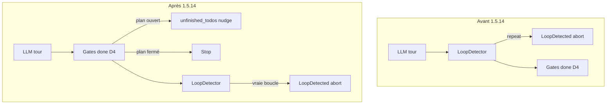

# Implémentation L1 — LoopDetector × clôture plan

**Version** : 1.5.14 · **Date** : juillet 2026  
**Fichier modifié** : `drox-engine/drox/crates/drox-engine/src/agent.rs`  
**Test ajouté** : `loop_does_not_abort_when_done_blocked_by_open_todo_repeated`

---

## Problème

En prod **1.5.13**, un run avec plan **Todos (1/2)** se terminait par :

```text
loop detected: model repeated the same both for 3 consecutive turns
```

alors que le modèle tentait de **clôturer** sans avoir coché le dernier item `todo_write`.

---

## État AVANT modification

### Ordre d’évaluation par tour LLM

```text
1. consume_stream(outcome)
2. loop_detector.observe(outcome)     ← anti-boucle EN PREMIER
3. if [phase: done]:
       gate D4 unfinished_todos → nudge + loop_detector.reset() + continue
4. if tool_calls empty → nudge + reset + continue
5. exécution des outils…
```

### Comportement observé (plan 1/2, modèle insiste sur `[phase: done]`)

| Tour | Empreinte | Ce qui se passait |
|------|-----------|-------------------|
| 1 | answering + done (nouveau) | Gate **D4** → `unfinished_todos_prompt` + **reset** LD |
| 2 | **identique** | **LD strike 1** → `LOOP_DETECTED_NUDGE` (pas de reset) — D4 **jamais atteinte** |
| 3 | **identique** | **LD abort** → `EngineError::LoopDetected { kind: "both", turns: 3 }` |

Le commentaire historique (~L997) disait d’évaluer LD **avant** les gates done pour « ne pas masquer la boucle » — en pratique, cela **court-circuitait** le nudge structurel D4 dès le 2e tour identique.

### Extrait code (avant)

```rust
// … après consume_stream …

match loop_detector.observe(&outcome) {
    LoopDecision::Warn { .. } => {
        messages.push(Message::system(LOOP_DETECTED_NUDGE_PROMPT));
        continue;
    }
    LoopDecision::Abort { .. } => { /* LoopDetected */ }
}

if outcome.final_phase == Some(Phase::Done) {
    // …
    } else if last_todo_pending > 0 || last_todo_in_progress > 0 {
        messages.push(Message::system(unfinished_todos_prompt(...)));
        loop_detector.reset();
        continue;
    }
}
```

### Ce qui restait inchangé

- Détection des **vraies** boucles (même `file_read` ×3, même texte sans `[phase: done]`) : toujours active **après** les gates done.
- Gates D1–D7, prompts, widget todos IDE : **aucune** modification.
- `droxChatAgentEvents.ts` : affichage erreur inchangé (consomme toujours `LoopDetected` si abort).

---

## État APRÈS modification

### Ordre d’évaluation par tour LLM

```text
1. consume_stream(outcome)
2. if [phase: done]:
       gates D1–D7 (dont D4 unfinished_todos) → nudge + reset + continue
       → clôture propre si plan fermé → return Stop
3. loop_detector.observe(outcome)     ← anti-boucle APRÈS les gates done
4. if tool_calls empty → nudge + reset + continue
5. exécution des outils…
```

### Comportement attendu (même scénario plan 1/2)

| Tour | Empreinte | Ce qui se passe |
|------|-----------|-------------------|
| 1–3 | answering + done identiques | Gate **D4** à **chaque** tour → `unfinished_todos_prompt` + **reset** LD |
| 4 | `todo_write` (2/2 completed) + … | Compteurs todos à 0 |
| 5 | answering + done | Clôture **Stop** normale |

Le modèle peut répéter sa tentative de clôture tant que le plan est ouvert ; la borne reste **`max_iterations`**.

### Extrait code (après)

```rust
if outcome.final_phase == Some(Phase::Done) {
    // gates D1–D7 …
    } else if last_todo_pending > 0 || last_todo_in_progress > 0 {
        messages.push(Message::system(unfinished_todos_prompt(...)));
        loop_detector.reset();
        continue;
    }
    // … Stop si tout OK …
    return;
}

// Évalué après les gates [phase: done] (cf. 1.5.14 L1)
match loop_detector.observe(&outcome) {
    // Warn / Abort inchangés
}
```

### Test de non-régression

`loop_does_not_abort_when_done_blocked_by_open_todo_repeated` :

- Plan 2 items (1 `completed`, 1 `in_progress`)
- **3×** le même tour `[phase: answering]` + `[phase: done]`
- Puis `todo_write` tout `completed` + `[phase: done]`
- **Attendu** : `Stop`, **pas** `LoopDetected`

Les tests existants `repeated_assistant_text_triggers_loop_detected_after_nudge` et `done_blocked_when_todos_still_open` restent **verts** (vraies boucles toujours détectées ; clôture différée toujours OK).

---

## Schéma comparatif



---

## Rebuild & validation

```powershell
cd drox-engine/drox
cargo test -p drox-engine loop_does_not_abort_when_done_blocked_by_open_todo_repeated
cargo test -p drox-engine repeated_assistant_text_triggers_loop_detected_after_nudge

cd ../..
.\scripts\package-drox.ps1   # copie drox.exe → resources/drox/
npm run watch                # respawn moteur auto en dev
```

Smoke manuel : [PLAN-1.5.14.md](PLAN-1.5.14.md) § L2 T1.

---

## Liens

- [PLAN 1.5.14](PLAN-1.5.14.md)
- [README 1.5.14](README.md)
- [Circuit gates / nudges](../../1.3/1.3.2/CIRCUIT-MOTEUR-GATES-NUDGES.md)
