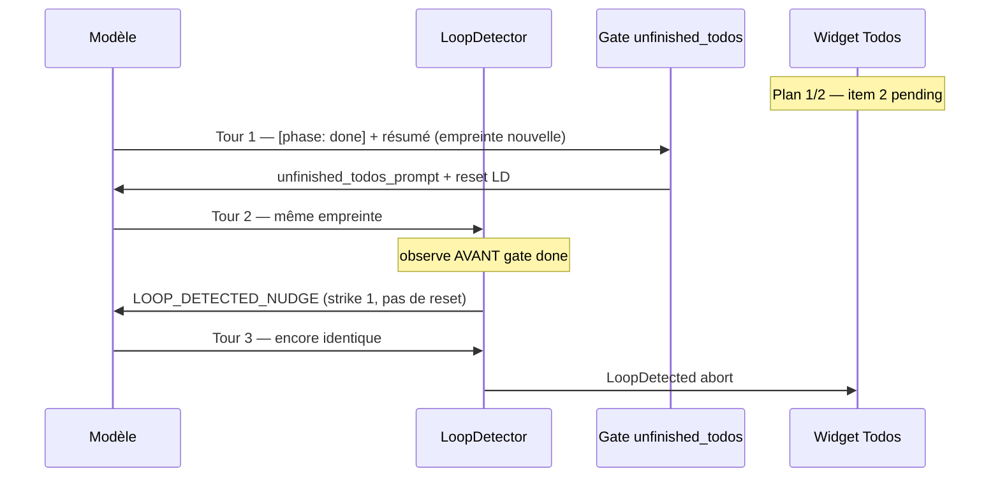

# Plan 1.5.14 — Clôture plan sans boucle

**Version** : juillet 2026  
**Base** : [1.5.13](../1.5.13/PLAN-1.5.13.md) livrée · OR `v1.5.13`  
**Branche** : `1.5.14` · tag cible **`v1.5.14`**

---

## En une phrase

Le moteur **abort** trop tôt quand le modèle **répète la même tentative de clôture** (dernier todo ouvert + `[phase: done]`) : corriger l’interaction **`LoopDetector` × `unfinished_todos_prompt`** sans affaiblir la détection des vraies boucles. En parallèle : **flux de chargement unifié** (grille Drox, skeletons) sur fenêtre **Agents** et chat **IDE natif**, et **restauration du layout workspace par session** (vanilla Copilot).

---

## Symptôme (prod 1.5.13)

| Champ | Valeur |
|-------|--------|
| Modèle observé | `qwen3.6:27b-mtp-q4_K_M` (Ollama) |
| UI | Widget **Todos (1/2)** — 1er item `completed`, 2e encore `pending` |
| Message erreur | `loop detected: model repeated the same both for 3 consecutive turns` |
| Contexte | Après `file_edit` réussi + résumé assistant ; le modèle semble vouloir **terminer le run** |

Capture : retour terrain juillet 2026 (hydration Next.js / docs).

---

## Analyse — où ça casse

### Composants impliqués

| Composant | Fichier | Rôle |
|-----------|---------|------|
| **`LoopDetector`** | `drox-engine/drox/crates/drox-engine/src/agent.rs` (~L2257) | Empreinte `(texte assistant trimé, signature tool_calls)` ; 1er tour identique → **Warn** ; 2e → **`EngineError::LoopDetected`** |
| **Gate D4** | idem (~L1090) | `[phase: done]` refusé si `last_todo_pending > 0` ou `last_todo_in_progress > 0` → injecte `unfinished_todos_prompt` |
| **Nudge N3/N4** | idem (~L1002, ~L2387) | `LOOP_DETECTED_NUDGE_PROMPT` au 1er strike ; **abort** au 2e |
| **Affichage erreur IDE** | `src/vs/workbench/contrib/drox/browser/droxChatAgentEvents.ts` (~L462) | Hint utilisateur + message système |

### Ordre d'évaluation dans la boucle (point clé)

À chaque tour, le moteur exécute **dans cet ordre** :

1. **`loop_detector.observe(outcome)`** (~L1002) — avant toute gate clôture
2. Gates **`[phase: done]`** dont **D4** `unfinished_todos` (~L1090)

Conséquence : dès le **2e tour identique** (même résumé + même absence de `todo_write` correct), le modèle reçoit **`LOOP_DETECTED_NUDGE`** (N3) **avant** un éventuel rappel « flippez vos todos ». Au **3e tour identique** → abort — **sans** que la gate D4 ait pu réinjecter son nudge une 2e fois.

### Chaîne causale (scénario le plus probable)



**Mécanisme** :

1. Le modèle **livre le travail** (`file_edit`) mais **ne met pas à jour** `todo_write` (dernier item reste `pending` / `in_progress`).
2. Il tente `[phase: done]` → gate **D4** bloque → nudge « flippez les items en `completed` » + **`loop_detector.reset()`**.
3. Tour suivant : **même texte** (résumé sans marqueurs phase dans l’empreinte) + **mêmes tool_calls** (souvent vide ou même `todo_write` stale) → **strike 1** (`LOOP_DETECTED_NUDGE`) **sans reset**.
4. Troisième tour identique → **abort** (`both` = texte + tools identiques).

### Scénarios alternatifs (à couvrir en smoke)

| # | Scénario | Empreinte répétée | Déclencheur |
|---|----------|-------------------|-------------|
| **S-A** | `[phase: done]` ×3 sans `todo_write` intermédiaire | Texte answering identique, tools vides | Gate D4 + LD |
| **S-B** | Même `todo_write` (1 completed, 1 in_progress) + même résumé ×3 | `todo_write` args identiques | LD seul (plan jamais clôturé côté moteur) |
| **S-C** | JSON `{"todos":[…]}` **dans le texte** au lieu d’un tool_call natif | Texte identique, pas d’exécution tool | Gates todo jamais satisfaites → converge vers S-A |
| **S-D** | Clôture correcte mais modèle **ré-émet le même résumé** après `DONE_ONLY_NUDGE` | Texte identique après nudge « done seul » | LD × N2 — moins fréquent si todos déjà à 0 |

### Asymétrie documentée vs code

D’après [CIRCUIT-MOTEUR-GATES-NUDGES.md](../../1.3/1.3.2/CIRCUIT-MOTEUR-GATES-NUDGES.md) §10 :

- Les nudges **structurels** (`unfinished_todos`, `DONE_ONLY`, `step_by_step_todo`, …) appellent **`loop_detector.reset()`**.
- Le nudge **N3** (`LOOP_DETECTED_NUDGE`) **ne reset pas** → une seule répétition après Warn suffit à abort.

Conséquence : une **convergence légitime butée** (le modèle insiste sur `[phase: done]` alors que le plan UI n’est pas à jour) est traitée comme une **boucle malveillante** en **3 tours**.

### Ce n’est (probablement) pas

- Un bug UI du widget todos seul — l’état vient du dernier `tool_finish` `todo_write` réussi côté moteur.
- Un rejet `TODO_RECREATION_BLOCKED` — message différent (« Blocked: you tried to **replace**… »).
- `max_iterations` — message explicite `loop detected`.

---

## Périmètre correctif

| **Dans 1.5.14** | **Hors scope** |
|-----------------|----------------|
| L1–L3 ci-dessous | Refonte complète du protocole phases |
| **UL1–UL3** — loading kit + session + panneaux composer | Refonte complète du shell Sessions (layout Microsoft) |
| **WS** — layout workspace par session (vanilla) | Layout global par repo / snapshot terminaux exhaustif |
| Tests Rust + smoke manuel | Heuristiques sur le texte utilisateur (interdit RULES §6) |
| Ship OR après validation | Bump upstream VS Code |
| | **Moteur Rust** pour le loading UI (voir § UL — effets de bord) |

Reports [1.5.13](../1.5.13/PLAN-1.5.13.md) (MCP, perf, purge) → **P2+** si L1–L2 clos avant deadline.

---

## Étapes

| Étape | Intitulé | Priorité | Effort | Statut |
|-------|----------|----------|--------|--------|
| **L1-a** | Repro automatisé Rust (scénarios S-A, S-B) | P0 | moyen | ✅ |
| **L1-b** | Correctif `LoopDetector` / gates clôture | P0 | moyen | ✅ |
| **L1-c** | `cargo test` + `npm run test-drox` verts | P0 | faible | ⬜ |
| **L2-a** | Smoke manuel 2-items plan → clôture OK | P0 | faible | ⬜ |
| **L2-b** | Smoke non-régression : vraie boucle (3× même lecture) abort toujours | P0 | faible | ⬜ |
| **L3-a** | Renforcer nudge clôture plan (dernier item) si L1 insuffisant | P1 | faible | ⬜ |
| **L3-b** | Vérifier affichage hint IDE (`drox.loop.abort.hint`) | P1 | faible | ⬜ |
| **UL1** | Drox Loading Kit (primitives + CSS thème) | P1 | moyen | ✅ |
| **UL2** | Chargement session (Agents + IDE natif) | P1 | moyen | ✅ |
| **UL3** | Bootstrap panneaux composer (chips Model / Settings) | P1 | moyen | ✅ |
| **UL4** | Warmup run natif (grille + phrases) | P2 | moyen | ✅ |
| **UL5** | Lazy history webview + skeleton liste sessions | P2 | faible | ⬜ |
| **WS1** | Restauration layout vanilla par session (retrait stable Drox) | P1 | moyen | ✅ |

---

## UL — Flux de chargement Drox (Agents + IDE)

**Objectif** : remplacer les indicateurs génériques VS Code / absences de feedback par un **kit visuel unique** (grille 3×3, skeletons rétro vert/brun), **performant** (anti-flash ~450 ms, pas de re-layout global) et **cohérent** entre fenêtre Agents et chat IDE natif.

**Référence UX existante** : webview Drox Chat (`activity.js`, `droxChatMvp.css`) · primitive TS `droxActivityGrid.ts`.

### Moteur Rust — touché ou pas ?

| Zone | Touchée en UL ? | Détail |
|------|-----------------|--------|
| `drox-engine/` (Rust) | **Non** | Aucun changement JSON-RPC, boucle agent, tools, nudges |
| Binaire `drox.exe` / `package-drox.ps1` | **Non** (UL seul) | Rebuild moteur **non requis** pour livrer UL1–UL5 |
| Workbench TS/CSS (`src/vs/workbench/contrib/drox/`, `src/vs/sessions/`) | **Oui** | Cœur du chantier |
| Webview chat legacy (`droxChat/…` JS) | **Optionnel** (UL5) | Lazy history uniquement |
| `droxThinkingPhrases.ts` | **Lecture seule** (UL4) | Réutiliser les phrases ; pas de nouveau contenu Rust |

Le loading UI observe des **promesses déjà existantes** (`acquireOrLoadSession`, `_ensureReady`, stream sink) — il ne modifie pas le contrat moteur ↔ IDE.

### Effets de bord à anticiper

| Risque | Gravité | Mitigation |
|--------|---------|------------|
| **Flash / double indicateur** (barre VS Code + overlay Drox) | Moyen | Délai unique `droxLoadingController` ; remplacer ou désactiver `showProgressWhile` sur le leaf concerné |
| **Z-index / pointer-events** (panneaux composer flottants) | Moyen | Overlays locaux au leaf ; ne pas monter sur `document.body` sauf bootstrap panel |
| **Layout shift** à la disparition du skeleton | Faible | Réserver hauteur min (3 lignes skeleton) ; fade-out 150 ms |
| **`prefers-reduced-motion`** | Faible | Grille statique (opacité fixe) — pattern déjà dans `droxAgentsRetroTheme.css` |
| **Accessibilité** | Moyen | `aria-busy`, `role="status"`, label localisé ; grille `aria-hidden` |
| **Tests automation** | Faible | `data-boundChatResource` sur `ChatView` — ne pas le casser ; ajouter `data-drox-loading` si besoin Playwright |
| **Perf liste sessions** | Faible | Pas de spinner par ligne ; skeleton global ou refresh ponctuel |
| **Régression switch session / run background** | Moyen | Smokes UL-S1–S3 (voir ci-dessous) ; ne pas bloquer le fil pendant un run live |
| **Webview vs natif** | Faible | UL2/UL3 ciblent le **natif Agents** en priorité ; webview reste référence pour UL4/UL5 |

### Checklist — Phase A · UL1 · Drox Loading Kit

- [x] **UL1-a** — `droxLoadingController.ts` : show/hide avec délai anti-flash (~450 ms), cancel si promise résolue avant, dispose au unmount
- [x] **UL1-b** — Étendre `droxActivityGrid.ts` : variantes `inline` | `centered` | `mini` (toolbar chip)
- [x] **UL1-c** — `droxLoadingOverlay.ts` : overlay leaf (grille + label optionnel)
- [x] **UL1-d** — `droxLoadingSkeleton.ts` : 3–5 lignes / bulles skeleton (tokens `--drox-thread-green-dim`)
- [x] **UL1-e** — CSS utilitaires dans `droxLoadingKit.css` (Agents + IDE natif)
- [x] **UL1-f** — Tests unitaires controller (delay, cancel, reduced-motion hook)
- [x] **UL1-g** — Doc courte `IMPLEMENTATION-UL-LOADING-KIT.md` (API + conventions)

### Checklist — Phase B · UL2 · Chargement session

- [x] **UL2-a** — `ChatView.setChat()` (Agents) : overlay Drox pendant `acquireOrLoadSession` / `provideChatSessionContent`
- [x] **UL2-b** — Remplacer ou compléter `showProgressWhile(..., 800)` par le kit UL1 (un seul indicateur visible)
- [x] **UL2-c** — `DroxNativeChatViewPane._openDroxSession` (IDE) : même overlay (parité IDE)
- [x] **UL2-d** — Skeleton fil (optionnel P1) : 3 bulles pendant lecture disque (`droxAgentsSessionHandler`)
- [ ] **UL2-e** — Smoke **UL-S1** : switch session Agents < 500 ms (pas de flash) et > 2 s (overlay visible)

### Checklist — Phase C · UL3 · Panneaux composer

- [x] **UL3-a** — `DroxAgentsComposerDroxChatHost` : observable `onPanelBootstrapState` (`idle` \| `loading` \| `ready` \| `error`)
- [x] **UL3-b** — Pendant `_loadScripts()` : chips Model / Server / Settings en `.drox-panel-loading` + mini-grille
- [ ] **UL3-c** — 1er clic avant bootstrap : panneau avec skeleton interne (header + 2 lignes), pas panneau vide
- [x] **UL3-d** — Brancher `droxAgentsComposerToolbar.ts` + `newChatInput.ts` (`aria-busy` sur slot concerné)
- [ ] **UL3-e** — Smoke **UL-S2** : 1er clic chip Model après cold start — feedback < 100 ms visuel, panneau utilisable après bootstrap

### Checklist — Phase D · UL4 · Warmup run natif (P2)

- [x] **UL4-a** — Progress part custom dans `droxAgentsChatSink` entre run start et 1er token/tool
- [x] **UL4-b** — Grille + phrase depuis `droxThinkingPhrases.ts` (même pool que webview)
- [x] **UL4-c** — Retrait automatique au 1er contenu réel (thinking, tool, texte)
- [ ] **UL4-d** — Smoke : run agent natif — pas de « trou » visuel avant 1ère phase

### Checklist — Phase E · UL5 · Finitions (P2, 1.5.14 ou 1.5.15)

- [ ] **UL5-a** — `lazy-history.js` : mini-grille en tête de `#log` si `sessionHistoryLoading`
- [ ] **UL5-b** — Skeleton liste sessions au refresh (sidebar)
- [ ] **UL5-c** — Picker modèles natif : spinner inline (parité select webview « Chargement… »)
- [ ] **UL5-d** — Unifier tokens `#progress.busy` webview avec classes kit UL1

### Smokes UL

| ID | Scénario | Attendu |
|----|----------|---------|
| **UL-S1** | Switch session Agents (cache froid / chaud) | Overlay Drox si > ~450 ms ; pas de double barre ; fil intact après load |
| **UL-S2** | 1er clic panneau composer (cold) | Chip loading immédiat ; panneau fonctionnel après scripts |
| **UL-S3** | Run en cours + switch session | Run background **non** interrompu ; pas d’overlay bloquant global |
| **UL-S4** | IDE natif — ouverture onglet Drox | Même UX chargement que Agents (UL2-c) |
| **UL-S5** | `prefers-reduced-motion: reduce` | Grille sans animation ; contenu lisible |

### Fichiers cibles (carte)

| Fichier | Rôle UL |
|---------|---------|
| `src/vs/workbench/contrib/drox/browser/droxActivityGrid.ts` | Primitive grille (existe) |
| `src/vs/workbench/contrib/drox/browser/droxLoading*.ts` | **Nouveau** kit |
| `src/vs/workbench/contrib/drox/browser/media/droxAgentsRetroTheme.css` | Animations + skeletons Agents |
| `src/vs/workbench/contrib/drox/browser/chat/media/droxIdeNativeChat.css` | Variante IDE |
| `src/vs/sessions/contrib/chat/browser/chatView.ts` | Gate session Agents |
| `src/vs/workbench/contrib/drox/browser/chat/droxNativeChatViewPane.ts` | Gate session IDE |
| `src/vs/workbench/contrib/drox/browser/agents/droxAgentsComposerDroxChatHost.ts` | Gate panneaux |
| `src/vs/workbench/contrib/drox/browser/agents/droxAgentsChatSink.ts` | Gate warmup run (UL4) |
| `src/vs/sessions/contrib/chat/browser/newChatInput.ts` | Spinner envoi (unifier délai) |
| `src/vs/workbench/contrib/drox/browser/chat/chatDroxWarmupContentPart.ts` | Rendu warmup natif (UL4) |
| `src/vs/workbench/contrib/drox/common/droxWarmupPhrase.ts` | Pool phrases warmup (UL4) |

---

## WS — Layout workspace par session (restauration vanilla)

**Objectif** : chaque session sidebar retrouve son **contexte de travail** au switch (panneaux, auxiliary bar, éditeurs grille, terminaux) — aligné sur le design upstream Copilot Agents (`LayoutController`, règles B1–B5 / D1–D6).

**Référence** : `src/vs/sessions/LAYOUT_CONTROLLER.md` · `src/vs/sessions/LAYOUT.md` §10.

### Contexte — pourquoi ça ne marchait pas

Un mode Drox **`isDroxAgentsStableWindowLayout`** (introduit pour éviter les sauts de layout au switch de discussion) **court-circuitait** tout le mécanisme per-session :

| Composant | Comportement Drox « stable » (retiré) |
|-----------|--------------------------------------|
| `BaseLayoutController` | Pas de `sessions.layoutState` ; un seul working set partagé (`sessions.droxStableEditorWorkingSet`) |
| `LayoutController` (desktop) | Pas de sync auxiliary bar (Files / Changes) par session |
| `SessionsTerminalContribution` | `return` immédiat au switch — pas de terminal par session |

Résultat : le chat/transcript changeait, mais **éditeurs, panneaux et terminaux restaient ceux de la dernière session utilisée**.

### Décision 1.5.14

**Rétablir le vanilla** : supprimer le mode stable et laisser le `LayoutController` upstream gérer la mémoire par `session.resource`.

### Livré (WS1)

- [x] **WS1-a** — Suppression `isDroxAgentsStableWindowLayout()` (`droxAgentsConfiguration.ts`)
- [x] **WS1-b** — Suppression `_registerDroxStableWindowLayout()` et clé `sessions.droxStableEditorWorkingSet` (`baseSessionLayoutController.ts`)
- [x] **WS1-c** — Migration : purge de `sessions.droxStableEditorWorkingSet` au `_loadState()`
- [x] **WS1-d** — Réactivation sync auxiliary bar per-session (`desktopSessionLayoutController.ts`)
- [x] **WS1-e** — Réactivation terminaux au switch (`sessionsTerminalContribution.ts`)
- [x] **WS1-g** — Fix `workbench.editor.useModal` : défaut Agents `'some'` (pas `'all'`) + migration profils existants (`droxProductDefaultsConfiguration.ts`, `droxSessionsLayoutContribution.ts`) — sans ça les working sets [B2] sont ignorés et seul le terminal réapparaît au retour
- [ ] **WS1-f** — Smokes manuels WS-S1 à WS-S3 (voir ci-dessous)

### Retiré (nettoyage)

| Élément | Fichier |
|---------|---------|
| `isDroxAgentsStableWindowLayout()` | `droxAgentsConfiguration.ts` |
| `_registerDroxStableWindowLayout()` + ancres `DROX_STABLE_*` | `baseSessionLayoutController.ts` |
| Early return Drox dans `_registerViewStateManagement` | `desktopSessionLayoutController.ts` |
| Early return Drox dans `_onActiveSessionChanged` | `sessionsTerminalContribution.ts` |
| Storage `sessions.droxStableEditorWorkingSet` | migré / supprimé au boot |

### Limites connues (vanilla upstream — hors WS1)

| Domaine | Comportement |
|---------|--------------|
| **Tailles parts** (sidebar, editor, panel) | Global fenêtre Agents (`__agents_window__`), pas par session |
| **Éditeurs modal** (`workbench.editor.useModal: 'all'`) | Overlays éphémères — pas de working set à restaurer — **Drox** : défaut Agents forcé à `'some'` (WS1-g) |
| **Multi-sessions visibles** (pin côte à côte) | Sync per-session suspendue (règle B5) |
| **Chat / transcript Drox** | Inchangé — déjà per-session via moteur `ses_*` |

### Smokes WS

| ID | Scénario | Attendu |
|----|----------|---------|
| **WS-S1** | Session A : fichiers + panel + aux bar → switch B → layout différent → retour A | État A restauré (panel, aux bar, onglets grille) |
| **WS-S2** | Session A : terminal ouvert → switch B → retour A | Terminal A visible (cwd session) |
| **WS-S3** | 2 sessions même repo, layouts différents | Pas de mélange d’onglets entre discussions |

### Fichiers WS

| Fichier | Rôle |
|---------|------|
| `src/vs/sessions/contrib/layout/browser/baseSessionLayoutController.ts` | Panel + working sets + persistance `sessions.layoutState` |
| `src/vs/sessions/contrib/layout/browser/desktopSessionLayoutController.ts` | Auxiliary bar per-session |
| `src/vs/sessions/contrib/terminal/browser/sessionsTerminalContribution.ts` | Terminaux per-session au switch |
| `src/vs/workbench/contrib/drox/common/droxAgentsConfiguration.ts` | Retrait flag stable layout |

---

## L1-b — Correctif appliqué

**Option retenue** : variante **A** du plan — réordonner l’évaluation : `loop_detector.observe` **après** le bloc gates `[phase: done]` (D1–D7).

Détail avant/après : **[IMPLEMENTATION-L1-LOOP-DETECTOR.md](IMPLEMENTATION-L1-LOOP-DETECTOR.md)**

### Pistes non retenues (archive)


**Variante A** (livré) : `observe` après gates done — voir doc implémentation.

### Option 1 — ~~Réordonner~~ (livré)

Au strike 1, après injection N3, appeler `loop_detector.reset()` pour laisser **≥ 2 tentatives** post-nudge avant abort.

Risque : vraies boucles infinies consomment plus de tokens (borne `max_iterations` reste).

### Option 3 — Empreinte « clôture plan » assouplie

Si `last_todo_pending + last_todo_in_progress > 0` et tool_calls contient **uniquement** `todo_write` dont les args **avancent** le plan (counts pending/in_progress **diminuent**), ne pas compter comme répétition même si le texte assistant est similaire.

Effet : couvre S-B ; plus complexe à implémenter et tester.

### Option 4 — Auto-nudge ciblé « dernier item »

Si exactement **1** item actif reste après mutation réussie dans le run, injecter **avant** toute gate done un rappel court :

> « Il reste 1 item ouvert — `todo_write` avec cet item en `completed` avant `[phase: done]`. »

Complément prompt-only ; ne remplace pas L1-b.

---

## L1-a — Tests Rust attendus

Fichier cible : `drox-engine/drox/crates/drox-engine/src/agent.rs` (module tests existant ~L4670).

| Test | Entrée | Attendu |
|------|--------|---------|
| `loop_does_not_abort_when_done_blocked_by_open_todo` | 3 tours identiques : answering + `[phase: done]`, plan 1 pending | Pas `LoopDetected` avant ≥ N tours ou convergence via `todo_write` |
| `loop_still_aborts_on_true_stall` | 3 tours identiques : `[phase: reading]` + `file_read` même path | `LoopDetected` conservé |
| `todo_write_all_completed_then_done_succeeds` | todo_write 2/2 completed → answering → done | `Stop` propre |

---

## L2 — Smokes manuels

### Smoke T1 — Repro bug (2 items)

1. Demander une tâche en **2 étapes** explicites (ex. « 1) redirect /docs 2) bouton retour accueil »).
2. Laisser le modèle exécuter jusqu’au widget **Todos (1/2)**.
3. Vérifier qu’après le 2e `file_edit` le run **se termine sans** `loop detected`.
4. Widget final : **2/2 completed** (ou cancelled).

### Smoke T2 — Non-régression anti-boucle

1. Prompt ambigu qui pousse le modèle à relire le même fichier sans progresser.
2. Vérifier qu’au bout de quelques tours le run **abort** toujours (pas de hang infini).

### Smoke T3 — Modèle faible sur tool_calls

1. Modèle local connu pour JSON inline (qwen / glm).
2. Si `todo_write` simulé en texte → run doit **nudger** ou **bloquer** proprement, pas loop opaque.

---

## Critères d’acceptation release

- [ ] **L1-a** : tests Rust verts (3 cas minimum)
- [ ] **L2-a** : T1 OK sur build 1.5.14 (Windows + fenêtre Agents)
- [ ] **L2-b** : T2 OK — vraies boucles toujours stoppées
- [ ] **UL1** : kit loading documenté + tests controller verts
- [ ] **UL2** + **UL3** : smokes UL-S1, UL-S2, UL-S3 OK
- [ ] **UL4** : smoke UL4-d OK
- [ ] **WS1** : smokes WS-S1, WS-S2, WS-S3 OK
- [ ] Aucune régression E2E 1.5.13 (fil, switch session, stream arrière-plan)
- [ ] Ship OR `v1.5.14`

---

## Références code

```1090:1108:drox-engine/drox/crates/drox-engine/src/agent.rs
} else if last_todo_pending > 0 || last_todo_in_progress > 0 {
    // ... unfinished_todos_prompt ...
    loop_detector.reset();
    continue;
}
```

```1002:1029:drox-engine/drox/crates/drox-engine/src/agent.rs
match loop_detector.observe(&outcome) {
    LoopDecision::Warn { kind } => {
        messages.push(Message::system(LOOP_DETECTED_NUDGE_PROMPT));
        continue; // pas de loop_detector.reset()
    }
    LoopDecision::Abort { kind, turns } => { /* LoopDetected */ }
}
```

```573:589:drox-engine/drox/crates/drox-engine/src/agent.rs
fn unfinished_todos_prompt(pending: u64, in_progress: u64) -> String {
    // ... call todo_write again with SAME items, flip to completed ...
}
```

---

## Liens

- [IMPLEMENTATION L1 — avant/après](IMPLEMENTATION-L1-LOOP-DETECTOR.md)
- [README 1.5.14](README.md)
- [GUIDE moteur — LoopDetector](../../0.0/guides/GUIDE-MOTEUR-DROX.md)
- [Prompts — règle 7 clôture plan](../../0.0/… via `drox-cli/src/prompts.rs`)
- [Reports 1.5.13](../1.5.13/PLAN-1.5.13.md) § S5–S16
