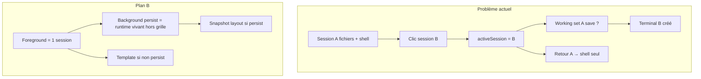
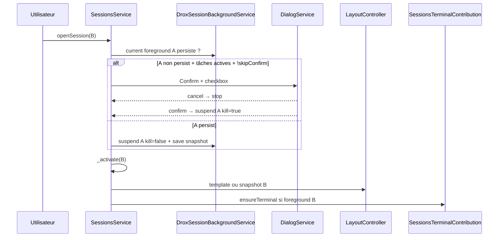

# Plan B — Sessions background persistantes & tableau de bord

**Version** : juillet 2026  
**Base** : [PLAN-1.5.14](PLAN-1.5.14.md) (WS1 insuffisant seul) · branche `1.5.14`  
**Statut** : **en cours** — P0/P1 implémentés (code), smokes ⬜

---

## En une phrase

Introduire un **mode background persistant** par session (toggle manuel sur la carte), avec **confirmation au switch**, **arrêt ou continuation** des shells et du modèle selon ce mode, **template workspace par défaut** pour les sessions non persistées, et un **tableau de bord** (icônes orange + charge optionnelle) sur chaque carte de l’historique.

---

## 1. Exigences utilisateur — reformulation technique

### 1.1 États d’une session

| État | Définition | Durée de vie |
|------|------------|--------------|
| **Liste seule** | Visible dans la sidebar, **pas** dans la grille centrale | Tant que la session existe côté provider |
| **Foreground** | **Une seule** session montée dans `visibleSessions` (grille + workspace) | Tant qu’elle est la session active à l’écran |
| **Background persistant** | Session **hors grille** mais **runtime vivant** (shells, run agent, git watch…) | **Session fenêtre app uniquement** — reset à la fermeture de Drox |

Par défaut : **aucune** session n’est background persistante.

### 1.2 Toggle persistance (bouton carte)

- Petit bouton sur la **carte de discussion** (`SessionItemRenderer`) dans l’historique.
- **Activer** → la session entre en background persistant (peut quitter la grille sans tuer les tâches).
- **Désactiver** → retour au comportement standard (switch = arrêt des tâches si confirmé).
- Choix persisté **uniquement tant que l’app tourne** (mémoire process / service singleton — **pas** de `StorageScope` disque pour ce flag).

### 1.3 Confirmation au changement de discussion

Déclencheur : l’utilisateur clique une **autre** session alors que la session foreground actuelle **n’est pas** background persistante **et** a des tâches actives (voir §1.6) ou un workspace ouvert.

| Réponse utilisateur | Effet |
|---------------------|-------|
| **Annuler** | Reste sur la session actuelle |
| **Confirmer** | Switch : **tuer** shells + **annuler** run modèle + appliquer template sur la session quittée |
| **« Ne plus demander »** coché | Stocker préférence **persistante** (survit fermeture app) → plus de dialog, comportement = confirmer implicitement |

Clé storage proposée : `drox.sessions.skipBackgroundSwitchConfirm` · `StorageScope.PROFILE`.

Modèle existant à réutiliser : `sessions.confirmArchive` + `IDialogService.confirm({ checkbox })` dans `sessionsViewActions.ts`.

### 1.4 Shells & exécutions console

| Persistance | Switch de session | Shell / tâche console |
|-------------|-------------------|------------------------|
| **Off** | Quitte foreground | **Kill** pty session (`safeDisposeTerminal`) |
| **On** | Quitte foreground | **Continue** — pty reste attaché à `sessionId`, modèle peut continuer |

Réutiliser le tracking existant : `_sessionTerminals` dans `SessionsTerminalContribution` (~L90).

Aujourd’hui `_closeTerminalsForSession` ne s’exécute que sur **removal** archive/delete — il faudra un chemin explicite **suspendSession** vs **killSession**.

### 1.5 Run modèle (agent Drox)

| Persistance | Switch | Agent |
|-------------|--------|-------|
| **Off** | Quitte foreground | **`cancelDroxAgentRun(runId)`** via `droxAgentRunBridge.ts` |
| **On** | Quitte foreground | Run **continue** — `trackModel` + `droxAgentsChatSessionCache` déjà prévus pour ça |

Mapping run ↔ session : `droxAgentsActiveRuns.ts` + `runId` dans `DroxAgentsSessionHandler`.

### 1.6 Template workspace par défaut

Quand l’utilisateur **foreground** une session :

| Condition | Layout appliqué |
|-----------|-----------------|
| Session **jamais** ouverte cette session app, ou quittée **sans** persistance | **Template par défaut Drox** |
| Session **background persistante** avec snapshot | **Snapshot** sauvé au moment du passage background |
| Première ouverture ever (cold) | Template + lazy load provider |

**Template par défaut** (v1 proposée — à valider en smoke) :

| Zone | État |
|------|------|
| Editor part | Visible, **aucun** onglet fichier |
| Panel | Masqué |
| Auxiliary bar | Visible, onglet **Changes** actif |
| Terminal | **Aucun** onglet editor-terminal (création lazy au premier besoin agent / utilisateur) |

Implémentation : objet `IDroxSessionWorkspaceTemplate` appliqué via `LayoutController` + `applyWorkingSet('empty')` + defaults `desktopSessionLayoutController`.

**Snapshot** (sessions persistées) : réutiliser `sessions.layoutState` **en mémoire** keyed by `sessionId` (pas le storage disque upstream — évite pollution cross-restart).

### 1.7 Tableau de bord — icônes orange (carte)

Indicateurs **allumés** tant qu’une tâche est en cours ; **éteints** à la fin.

| Signal | Source code existante | Icône (proposition) |
|--------|----------------------|---------------------|
| **Shell actif** | Terminal tracked + commande en cours (`instance.hasChildProcesses` / `onData`) | `terminal` orange |
| **Modèle en réponse** | `SessionStatus.InProgress` · `model.requestInProgress` (`DroxSession.trackModel`) | `sparkle` / spinner orange |
| **Git commit/push** | `gitRepository.hasGitOperationInProgress` (`changesViewModel.ts` L200) | `git-commit` / `cloud-upload` orange |
| **Needs input** (optionnel) | `SessionStatus.NeedsInput` | `question` orange |

Rendu : rangée compacte dans `SessionItemRenderer` (à côté du titre ou sous la ligne statut), classes CSS `.drox-dashboard-lamp.on`.

### 1.8 Indicateurs de charge (optionnel P2)

Objectif : RAM / CPU / disque **par session persistée**, sans ajouter de latence perceptible.

| Métrique | Approche |
|----------|----------|
| **RAM cache workspace** | Estimation : taille dossier `.drox/cache/<sessionId>` + modèle chat en mémoire (approx.) |
| **CPU run agent** | Agrégat moteur si `runId` actif (`droxEngineService` metrics — à exposer) |
| **Disque** | Taille changes non commitées + cache session |

Contraintes :

- Poll **≥ 5 s**, uniquement pour sessions **background persistantes**.
- Pas de walk filesystem synchrone sur le thread UI.
- Affichage : 1–3 barres discrètes ou pourcentage texte — **désactivable** via setting.

---

## 2. Pourquoi WS1 ne suffit pas

Le plan WS1 (working sets vanilla + `useModal: 'some'`) part du principe qu’**un switch de session = save/restore layout**. En pratique :

1. **Race terminal** : `SessionsTerminalContribution.ensureTerminal` rouvre un shell **avant/après** le working set.
2. **Grille partagée** : `visibleSessions` peut contenir plusieurs slots → règle **B5** désactive panel/aux-bar per-session.
3. **Modèle produit** : l’utilisateur veut parfois **laisser tourner** A en travaillant sur B — incompatible avec « une seule zone éditeur partagée sans tier background ».



**Décision** : Plan B **remplace** WS1 comme stratégie principale layout ; WS1 reste utile **à l’intérieur** du foreground (restore snapshot).

---

## 3. Architecture cible

### 3.1 Nouveau service — `DroxSessionBackgroundService`

Fichier proposé : `src/vs/sessions/contrib/drox/browser/droxSessionBackgroundService.ts`

Responsabilités :

```typescript
interface IDroxSessionBackgroundService {
  /** Session ids marquées background persistantes (mémoire fenêtre). */
  readonly persistentSessionIds: IObservable<ReadonlySet<string>>;

  isPersistent(sessionId: string): boolean;
  setPersistent(sessionId: string, value: boolean): void;

  /** Snapshot layout in-memory pour sessions persistées. */
  saveLayoutSnapshot(sessionId: string): void;
  applyLayoutSnapshotOrTemplate(sessionId: string): Promise<void>;

  /** Appelé avant de quitter le foreground. */
  suspendForegroundSession(session: ISession, options: { kill: boolean }): Promise<void>;

  /** Signaux tableau de bord agrégés par session. */
  getDashboardSignals(sessionId: string): IObservable<IDroxSessionDashboardSignals>;
}
```

Enregistrement : `droxSessionsBootstrap.ts` · phase `BlockReady`.

### 3.2 Interception du switch — `SessionsService.openSession`

Point d’accroche : `sessionsService.ts` → `_doOpenSession` / `_activate` (~L604–618).



**Invariant Drox** : `visibleSessions.filter(Boolean).length <= 1` en usage normal.

### 3.3 Cycle de vie foreground ↔ background

| Action | visibleSessions | Runtime | Layout |
|--------|-----------------|---------|--------|
| Ouvrir session (liste) | `[session]` | Lazy activate provider | Template ou snapshot |
| Toggle **persist ON** | inchangé ou `[session]` | Marque persist | Save snapshot immédiat |
| Switch → B (A persist) | `[B]` | A continue background | B template/snapshot |
| Switch → B (A !persist, confirm) | `[B]` | A kill shells + cancel run | A oublié ; B template |
| Toggle **persist OFF** | — | Prochain switch = standard | — |
| Fermeture app | `[]` | Tout teardown | Maps cleared |

### 3.4 Persistance — tableau récap

| Donnée | Scope | Survit fermeture app |
|--------|-------|----------------------|
| `persistentSessionIds` | Mémoire (service) | **Non** |
| Layout snapshots persistés | Mémoire (service) | **Non** |
| `drox.sessions.skipBackgroundSwitchConfirm` | `StorageScope.PROFILE` | **Oui** |
| `sessions.layoutState` (upstream) | `StorageScope.WORKSPACE` | Oui — **ne plus utiliser** comme source de vérité Drox foreground (conflit Plan B) |

---

## 4. Carte discussion — UI

### 4.1 Fichiers

| Fichier | Modification |
|---------|--------------|
| `sessionsList.ts` (`SessionItemRenderer`) | Bouton persist + rangée dashboard |
| `sessionsViewActions.ts` | Action `drox.sessions.toggleBackgroundPersist` |
| `media/droxSessionDashboard.css` | Lampes orange, barres charge |
| `droxSessionsRetroTheme.css` | Couleurs dashboard |

### 4.2 Bouton persistance

- Menu : `SessionItemToolbarMenuId` (toolbar inline hover).
- Icône : `pin` / `debug-continue` / custom `drox-background-persist` (Codicon proposé : `debug-pause` off, `debug-start` on).
- Context key : `droxSessionBackgroundPersistent` par session.
- Toggle → `DroxSessionBackgroundService.setPersistent`.

### 4.3 Dialog confirmation

Texte proposé (EN dans le code, FR ici pour spec) :

- **Titre** : « Quitter cette discussion ? »
- **Corps** : « Les shells et la réponse en cours seront arrêtés. Activez la persistance background sur la carte pour les laisser tourner. »
- **Checkbox** : « Ne plus me demander »
- **Boutons** : Rester / Changer quand même

Déclencher seulement si `hasActiveTasks(foregroundSession)` :

```typescript
function hasActiveTasks(session: ISession): boolean {
  // InProgress | NeedsInput
  // OR terminal with running child process for sessionId
  // OR hasGitOperationInProgress for workspace
}
```

---

## 5. Intégrations existantes à réutiliser

| Besoin | Existant | Fichier |
|--------|----------|---------|
| Kill terminal session | `_closeTerminalsForSession` | `sessionsTerminalContribution.ts` |
| Hide sans kill (archive) | `_hideTerminalsForSession` | idem |
| Cancel agent | `cancelDroxAgentRun` | `droxAgentRunBridge.ts` |
| Run continue | `droxAgentsChatSessionCache`, `trackModel` | `droxAgentsChatSessionCache.ts`, `droxSessionsProvider.ts` |
| Lazy session load | `_ensureSessionActivated` | `droxSessionsProvider.ts` |
| Git op in progress | `hasGitOperationInProgress` | `changesViewModel.ts` |
| Dialog + checkbox | `ConfirmArchiveStorageKey` pattern | `sessionsViewActions.ts` |
| Layout apply | `_applyWorkingSet`, `_syncPanelVisibility` | `baseSessionLayoutController.ts` |
| Toolbar carte | `SessionItemToolbarMenuId` | `sessionsList.ts` |

---

## 6. Plan d’implémentation par phases

### Phase P0 — Fondations (bloquant bug shell)

| ID | Tâche | Fichiers | Effort |
|----|-------|----------|--------|
| **PB0-a** | `DroxSessionBackgroundService` (persist set in-memory, snapshot map) | nouveau + bootstrap | M |
| **PB0-b** | Intercepter `openSession` : guard + dialog + `suspendForegroundSession` | `sessionsService.ts` ou contribution wrapper Drox | M |
| **PB0-c** | Kill shells + cancel run si !persist confirmé | `droxSessionBackgroundService` + terminal + `cancelDroxAgentRun` | M |
| **PB0-d** | Template workspace par défaut | `droxSessionWorkspaceTemplate.ts` + hook layout | M |
| **PB0-e** | Invariant 1 visible : retirer session quittée de `visibleSessions` si pas sticky multi | `visibleSessions.ts` / Drox policy | S |

**Livrable P0** : switch B sans persist → A stoppée, B template propre ; retour A → template (pas shell fantôme).

### Phase P1 — UX toggle + dashboard lampes

| ID | Tâche | Fichiers | Effort |
|----|-------|----------|--------|
| **PB1-a** | Bouton toggle persist sur carte | `sessionsList.ts`, `sessionsViewActions.ts` | S |
| **PB1-b** | `IDroxSessionDashboardSignals` observable par session | `droxSessionBackgroundService.ts` | M |
| **PB1-c** | UI lampes orange (shell / model / git) | `sessionsList.ts`, CSS | M |
| **PB1-d** | Storage `drox.sessions.skipBackgroundSwitchConfirm` | dialog + settings optionnel | S |
| **PB1-e** | Snapshot restore au foreground si persist | layout hook | M |

**Livrable P1** : persist ON → switch libre, lampes allumées, retour = snapshot.

### Phase P2 — Charge ressources (optionnel)

| ID | Tâche | Fichiers | Effort |
|----|-------|----------|--------|
| **PB2-a** | Worker/poll métriques cache disque par sessionId | `droxSessionResourceMetrics.ts` | L |
| **PB2-b** | Exposer CPU run depuis moteur (si absent) | `drox-engine` + bridge | L |
| **PB2-c** | Barres charge sur carte (sessions persist only) | `sessionsList.ts` | M |
| **PB2-d** | Setting `drox.sessions.showResourceIndicators` default off | config Drox | S |

**Livrable P2** : indicateurs sans régression perf (budget mesuré).

### Phase P3 — Durcissement

| ID | Tâche |
|----|-------|
| **PB3-a** | Tests unitaires `DroxSessionBackgroundService` |
| **PB3-b** | Tests intégration switch + kill vs persist |
| **PB3-c** | Doc `IMPLEMENTATION-PB-SESSION-BACKGROUND.md` |
| **PB3-d** | Déprécier / no-op WS1-g si redundant avec template |

---

## 7. Smokes d’acceptation

| ID | Scénario | Résultat attendu |
|----|----------|------------------|
| **PB-S1** | A : ouvrir fichier + shell, **sans** persist → switch B → confirm | Shell A tué, run annulé, B template |
| **PB-S2** | A : persist ON + run agent → switch B | A continue, lampe model ON sur carte A |
| **PB-S3** | PB-S2 → retour A | Snapshot layout (fichiers + onglets) |
| **PB-S4** | Confirm + « ne plus demander » → restart app → switch | Plus de dialog |
| **PB-S5** | Persist ON → git push en cours → switch | Lampe git ON, push continue |
| **PB-S6** | Fermer app → rouvrir | Aucune session persist ; template à l’ouverture |
| **PB-S7** | Toggle persist OFF mid-run → switch | Comportement standard (confirm/kill) |

---

## 8. Risques & mitigations

| Risque | Mitigation |
|--------|------------|
| Fuite pty si persist + many sessions | Limite soft `drox.sessions.maxBackgroundPersistent` (défaut 3) |
| Run agent × N en parallèle → CPU | Indicateur charge + limite |
| Conflit `sessions.layoutState` disque | Snapshots **in-memory** Plan B ; upstream WS en lecture seule |
| `closeSession` existant tue tout | Ne pas réutiliser tel quel — nouveau `suspendForegroundSession` |
| Graduation untitled → committed | Transférer `sessionId` tracking background sur `onDidReplaceSession` |

---

## 9. Relation avec PLAN-1.5.14

| Item 1.5.14 | Statut après Plan B |
|-------------|---------------------|
| **WS1** working sets vanilla | **Sous-ensemble** — restore snapshot foreground uniquement |
| **WS1-f** smokes | Remplacés par **PB-S*** |
| **UL** loading kit | Inchangé — compatible |
| **L1** loop detector | Inchangé — orthogonal |

**Recommandation** : traiter Plan B comme **WS2 / PB** dans la branche 1.5.14 ou ouvrir **1.5.15** si scope trop large pour P0 seul.

---

## 10. Fichiers clés (cartographie)

```
src/vs/sessions/
├── services/sessions/browser/
│   ├── sessionsService.ts          ← intercept openSession
│   └── visibleSessions.ts          ← politique 1 slot foreground
├── contrib/sessions/browser/views/
│   ├── sessionsList.ts             ← carte + dashboard UI
│   └── sessionsViewActions.ts      ← toggle + dialog pattern
├── contrib/layout/browser/
│   ├── baseSessionLayoutController.ts
│   └── desktopSessionLayoutController.ts
├── contrib/terminal/browser/
│   └── sessionsTerminalContribution.ts  ← kill vs keep
└── contrib/drox/browser/
    ├── droxSessionsBootstrap.ts
    ├── droxSessionBackgroundService.ts    ← NOUVEAU
    ├── droxSessionWorkspaceTemplate.ts  ← NOUVEAU
    └── droxSessionDashboardContribution.ts ← NOUVEAU (optionnel)

src/vs/workbench/contrib/drox/
├── common/droxAgentRunBridge.ts    ← cancel run
├── browser/agents/
│   ├── droxAgentsSessionHandler.ts
│   └── droxAgentsChatSessionCache.ts
└── browser/media/droxAgentsRetroTheme.css

src/vs/sessions/contrib/providers/drox/browser/
└── droxSessionsProvider.ts       ← trackModel, lazy activate
```

---

## 12. Livré (implémentation code)

- [x] **PB0-a** — `DroxSessionBackgroundService` + snapshots in-memory
- [x] **PB0-b** — `sessionOpenGate` + hook `SessionsService._doOpenSession`
- [x] **PB0-c** — kill shells + `cancelCurrentRequestForSession` si !persist
- [x] **PB0-d** — template workspace + restore snapshot
- [x] **PB0-e** — `forgetSessionLayout` + policy terminal `suppressEnsure`
- [x] **PB1-a** — bouton « Keep Running in Background » sur carte
- [x] **PB1-b/c** — lampes dashboard orange (shell / model / git / input)
- [x] **PB1-d** — dialog + `drox.sessions.skipBackgroundSwitchConfirm`
- [ ] **PB-S1–S7** — smokes manuels
- [ ] **PB2** — indicateurs charge (optionnel)

### Fichiers ajoutés / modifiés

| Fichier | Rôle |
|---------|------|
| `droxSessionBackgroundService.ts` | Service central Plan B |
| `droxSessionWorkspaceLayout.ts` | Template + snapshot |
| `droxSessionsBackgroundActions.ts` | Toggle + bootstrap |
| `droxSessionListDashboard.ts` | Lampes sur carte |
| `sessionOpenGate.ts` | Hook switch session |
| `sessionTerminalForegroundPolicy.ts` | Suppress auto-terminal |
| `sessionsService.ts` | Appelle le gate |
| `sessionsTerminalContribution.ts` | kill/hide session terminals |
| `baseSessionLayoutController.ts` | `forgetSessionLayout` |
| `sessionsList.ts` | Dashboard UI |

---

## 11. Prochaine étape recommandée

Commencer **P0-a → P0-e** (service + intercept + template) sans dashboard ni métriques — suffisant pour valider **PB-S1** et **PB-S2** en dev.

Ensuite **P1** (bouton + lampes) une fois le cycle suspend/resume stable.
