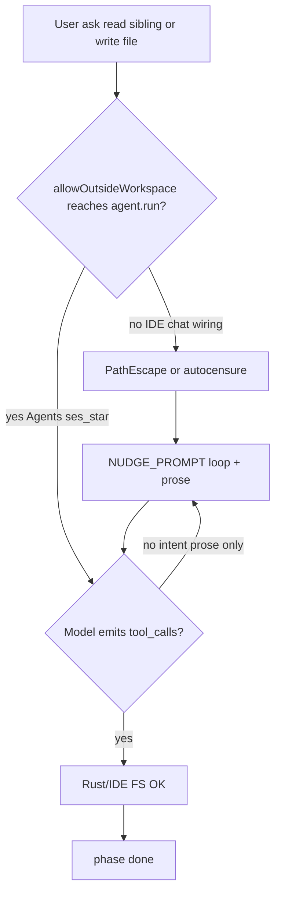

# Plan 1.5.16 — Stabilisation modèle (hors-workspace + boucle write)

**Branche** : `1.5.16`  
**Version** : `droxVersion` **1.5.16**  
**Statut** : planifié (doc) — implémentation après validation  
**Base** : `main` après clôture 1.5.15  
**README** : [README.md](README.md)

---

## En une phrase

Stabiliser le comportement du modèle après 1.5.15 : (A) faire arriver réellement le flag hors-workspace jusqu’à `agent.run`, (B) casser la boucle prose « je vais écrire » sans `file_write`.

---

## Périmètre

| Id | Sujet | Surface | Statut |
|----|--------|---------|--------|
| **FX-A** | Hors workspace inopérant (flag n’atteint pas le run / autocensure) | IDE P0 · Rust P1 | ✅ P0 câblé (chat + recovery) · P1 reste |
| **FX-B** | Boucle « je vais écrire le fichier » sans tool call | Rust P0 · IDE P1 | ⬜ planifié |

Hors scope immédiat : nouvelles features produit, refonte complète du prompt core, retry auto silencieux.

---

## Diagnostic synthétique

Deux bugs distincts, parfois enchaînés :



Si hors-workspace échoue **et** le modèle doit écrire hors WS → A alimente B.  
Si write **dans** le workspace ouvert + prose sans tool → B seul.

---

# Bug A — Hors workspace : le modèle « ne peut pas lire »

## Symptôme

Toggle session « hors workspace » activé, mais le modèle refuse de lire des chemins absolus siblings (ex. `C:\Users\…\Drox---IDE`, `Drox---TUI`) et invente des réponses (ex. « cherche sur GitHub ») au lieu d’appeler `file_read`.

## Chaîne attendue

```text
Toggle UI (Agents list)
  → setAllowOutsideWorkspace(ses_*)
  → startDroxAgentRun({ allowOutsideWorkspace })
  → buildAgentRunParams → allowOutsideWorkspace: true
  → agent.run (camelCase → allow_outside_workspace)
  → handlers: supplement prompt + ToolContext.with_allow_outside_workspace(true)
  → file_read (Rust) / file_write (RemoteTool → IDE droxPathUtils)
```

Réf. audit : [ENGINE-RUST-1.5.15.md](../1.5.15/ENGINE-RUST-1.5.15.md).

## Cause principale (evidence)

Le toggle Agents stocke le flag sous clé moteur `ses_*` et **Agents** l’envoie :

```ts
// src/vs/workbench/contrib/drox/browser/agents/droxAgentsSessionHandler.ts
allowOutsideWorkspace: this.sessionBackgroundService.isAllowOutsideWorkspace(engineSessionId)
```

Le **chat IDE webview** ne câble pas le service :

| Fichier | Problème |
|---------|----------|
| `src/vs/workbench/contrib/drox/browser/chat/droxChatSendRun.ts` | Lit `deps.sessionBackgroundService?.isAllowOutsideWorkspace(...)` |
| `src/vs/workbench/contrib/drox/browser/droxChatController.ts` | `_webviewRouterDeps()` **n’injecte pas** `sessionBackgroundService` |
| `src/vs/workbench/contrib/drox/browser/chat/droxChatWebviewRouter.ts` | Deps sans `sessionBackgroundService` |
| `src/vs/workbench/contrib/drox/common/droxRunSettings.ts` | N’ajoute `allowOutsideWorkspace` au RPC **que si truthy** |

→ Sur le chat IDE, le run part **toujours confiné** : pas de supplement `# Outside-workspace access`, `ToolContext.allow_outside_workspace = false`.

Rust côté execute est **OK** si le flag arrive :

- `drox-engine/drox/crates/drox-cli/src/jsonrpc/handlers.rs` — lecture flag + merge system
- `drox-engine/drox/crates/drox-cli/src/prompts.rs` — `ALLOW_OUTSIDE_WORKSPACE_SUPPLEMENT`

## Causes secondaires

| Facteur | Effet |
|---------|--------|
| Toggle UI Agents ≠ onglet chat IDE (`ses_*` différent) | Flag activé sur une session, run sur une autre |
| Recovery (`droxChatRunRecovery.ts`) sans flag | Relance perd le hors-workspace |
| Set mémoire non persisté (`droxSessionBackgroundService`) | Disparaît au reload |
| Descriptions tools toujours « under workspace root » | Autocensure même si flag on |
| Demande de lire un **dossier** via `file_read` | Échec IO (outil = fichier), pas PathEscape |
| Réponse « cherche sur GitHub » **sans** tool_result | Hallucination / autocensure, pas un bug `path_util` |

## Ce qui n’est PAS la cause (A)

- Mismatch camelCase / snake_case (`AgentRunParams` `rename_all = "camelCase"`)
- Previews forçant `allow_outside=false` (n’affectent pas l’execute)
- Sous-agents (héritent du flag parent)
- Bug « serde ignore le champ » sur binaire à jour

## Diagnostic runtime (A)

1. Surface : **Agents** vs **chat IDE**
2. Payload `agent.run` : `"allowOutsideWorkspace": true` présent ?
3. System merge : titre `# Outside-workspace access` ?
4. Trace tools : `file_read` appelé ? Message `path escapes workspace` ?
5. Même `ses_*` pour toggle et run

## Correctifs planifiés (A)

| Prio | Surface | Action | Statut |
|------|---------|--------|--------|
| **P0** | IDE | Injecter `IDroxSessionBackgroundService` dans deps chat + recovery ; passer le flag à chaque `agent.run` | ✅ (chat webview + recovery) |
| **P0** | IDE | Unifier / documenter clé `ses_*` uniquement | ✅ (lookup sur `tabs.currentSessionId` / `engineSessionId`) |
| **P1** | IDE | Persister le flag allow-outside | ⬜ |
| **P1** | Rust | Adapter descriptions tools (ou append) quand flag on | ⬜ |
| **P2** | Rust/IDE | Log `allow_outside=` au démarrage du run | ⬜ |

---

# Bug B — Boucle « je vais écrire le fichier » sans `file_write`

## Symptôme

Le modèle répète en texte qu’il va écrire / qu’il est « bloqué », sans émettre de `tool_calls` (`file_write` / `file_edit`). Fréquent ; déjà noté en 1.5.10 (recovery UI, pas durcissement gates).

## Cause principale (evidence)

Dans `drox-engine/drox/crates/drox-engine/src/agent.rs` :

1. Tour sans tools et sans `[phase: done]` → injection `NUDGE_PROMPT` (~L1160–1187)
2. Le nudge demande d’appeler un tool **dans la même reply**, mais le modèle peut répondre en **encore plus de prose**
3. Chaque nudge fait `loop_detector.reset()` → **pas d’abort** sur cette boucle verbale
4. Borne réelle = `max_iterations` → sensation « système bloqué »

Le protocole de phases (micro-annonce `[phase: answering]` avant acting, rule 8 dans `prompts.rs`) encourage une phrase d’intention ; les modèles faibles s’arrêtent souvent **après** l’annonce.

## Causes secondaires

| Facteur | Symptôme |
|---------|----------|
| Gate `MUTATING_TOOL_BEFORE_TODO_WRITE_BLOCKED` | Tool tenté trop tôt → message clair, puis prose « je dois planifier » |
| Permission Ask / confirm write non résolu | Vrai blocage UI (distinct de la boucle texte) |
| Cancel confirm → `{ cancelled: true }` sans `isError` | Modèle mal interprète |
| Mode `analyze` / plan | Write interdit |
| PathEscape hors WS (bug A) | Échec write → prose de contournement |

## Hypothèses — verdict

| Hypothèse | Verdict |
|-----------|---------|
| Tool result mal formaté → prose | Possible secondaire ; PathEscape / Blocked sont clairs |
| Permission ask never resolved | Possible pour « bloqué » ; ≠ boucle « je vais écrire » |
| maxIterations / empty tool calls | **Oui — mécanisme principal** avec NUDGE + reset LD |
| Anti-hallucination trop fort | Contribue (modèles qui « simulent » en texte) |
| allowOutside false → write fail → loop | Seulement write **hors** WS |
| LoopDetector messages → verbal loop | LD seulement sur empreinte identique ; prose qui varie → plutôt NUDGE générique |

## Ce qui n’est PAS la cause (B)

- Diff Rust 1.5.15 (`agent.rs` / permissions inchangés pour OW)
- LoopDetector 1.5.14 (ciblait clôture `done` + todos, pas les writes)
- Previews `allow_outside=false`
- Différence Agents vs chat sur le registry tools (même boucle moteur)

## Diagnostic runtime (B)

1. Trace : cartes `file_write` présentes ou **uniquement** texte / phases ?
2. Mode permission (`trustEdit` vs ask vs analyze)
3. Todos créés avant 1ʳᵉ mutation ?
4. Modale ask / confirm en attente ?
5. Compter tours `NUDGE_PROMPT` vs deny / Blocked
6. Repro : « crée `foo.txt` avec hello » en `trustEdit`

## Correctifs planifiés (B)

| Prio | Surface | Action |
|------|---------|--------|
| **P0** | Rust | Gate « intent-only » : intention write/edit détectée + empty tools → nudge ultra-spécifique « emit `file_write` NOW » (ou soft-abort après N) |
| **P1** | Rust | Après 2× NUDGE sans tools sur objectif mutation → injecter exemple minimal `file_write` |
| **P1** | IDE | Cancel confirm write → `isError: true` + message clair |
| **P2** | Prompt | Assouplir micro-annonce (optionnelle si tool dans le même tour) |
| **P2** | Produit | Garder Retry / Recommencer visibles pendant busy |

---

## Ordre d’implémentation

```text
1. Doc PLAN/README 1.5.16          ← cette étape (fait)
2. Fix A P0 — câblage chat IDE + recovery
3. Fix B P0 — nudge / gate intent-only (agent.rs)
4. Softening prompt + descriptions tools (A P1 / B P2)
5. Smokes + clôture + ship OR
```

---

## Critères d’acceptation

### FX-A

- [ ] Chat IDE : `agent.run` contient `allowOutsideWorkspace: true` quand le toggle session est ON
- [ ] Recovery / restart : flag conservé
- [ ] Même `ses_*` pour toggle et run (documenté + cohérent)
- [ ] Lecture sibling absolu via `file_read` OK (pas d’autocensure seule si tool appelé)

### FX-B

- [x] Gate Rust P0 : prose write/edit + empty `tool_calls` → nudge dédié (×2) puis soft-abort `LoopDetected { kind: "intent_only_write" }` (avant LoopDetector)
- [x] Tests : `mutation_intent_detector_fr_en`, `intent_only_write_prose_aborts_after_nudges`
- [ ] Repro manuel « crée foo.txt » : le modèle émet `file_write` (ou soft-abort clair) au lieu de boucler en prose
- [ ] Pas de régression clôture `[phase: done]` / LoopDetector 1.5.14
- [ ] Cancel confirm write → erreur explicite côté modèle

### Transverse

- [ ] Pas de régression 1.5.15 (OW Agents, Retry, carnet N0, persist terminal)
- [ ] Trace Rust documentée si `agent.rs` / prompts touchés

---

## Hors scope

- Retry automatique silencieux (boucle LLM)
- Remplacer le protocole de phases
- Nouveaux tools FS
- Persistance cloud du flag hors-workspace

---

## Références code

| Zone | Chemin |
|------|--------|
| Flag Agents | `droxAgentsSessionHandler.ts` |
| Flag chat (cassé) | `droxChatSendRun.ts`, `droxChatController.ts`, `droxChatWebviewRouter.ts` |
| RPC params | `droxRunSettings.ts` → `buildAgentRunParams` |
| Toggle UI | `droxSessionsBackgroundActions.ts` |
| Service flag | `droxSessionBackgroundService.ts` |
| Recovery | `droxChatRunRecovery.ts` |
| Rust merge + supplement | `handlers.rs`, `prompts.rs` |
| PathEscape | `drox-tools` `path_util.rs`, `error.rs` |
| Nudge / boucle | `agent.rs` (`NUDGE_PROMPT`, `loop_detector.reset`) |
| Gate todo avant mutation | `MUTATING_TOOL_BEFORE_TODO_WRITE_BLOCKED` |
| Audit OW 1.5.15 | [ENGINE-RUST-1.5.15.md](../1.5.15/ENGINE-RUST-1.5.15.md) |
| Clôture 1.5.15 | [CLOSURE-1.5.15.md](../1.5.15/CLOSURE-1.5.15.md) |
