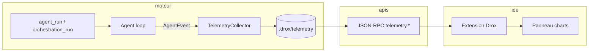

# Idée 11 — Télémétrie locale dans l’IDE (runs, charts, APIs)

**Statut** : idée brute (brainstorm)  
**Date** : 2026-06-02  
**Auteur** : produit / dogfooding

---

## Résumé

Offrir une **observabilité complète des runs Drox** directement dans l’IDE : tableaux de bord, graphiques (durée, tokens, outils, gates, erreurs), drill-down **par run** et **par cycle** — **sans aucun envoi vers un service tiers** (pas d’Aria, pas d’OTLP cloud, pas de Datadog).

La donnée reste sur la machine (workspace + profil utilisateur). Pour alimenter l’UI, les extensions et d’éventuels scripts, on expose des **APIs stables** (JSON-RPC moteur + surface workbench) qui **lisent et agrègent** ce qui est déjà (ou sera) enregistré localement.

**Complément** de [05 — Stats perf par cycle](05-stats-perf-par-cycle.md) : la fiche 05 cible les KPI **sous le fil de chat** ; celle-ci vise un **panneau / vue dédiée** type « Monitoring Drox » réutilisable par l’app.

---

## Principes non négociables

| Principe | Implication |
|----------|-------------|
| **100 % local** | Stockage fichiers ou SQLite sous `.drox/` / `userData` ; pas de endpoint distant par défaut |
| **Opt-in export** | Export JSON/CSV manuel ou chemin configurable — jamais automatique vers le cloud |
| **Vérité = moteur** | Agrégation et compteurs calculés dans `drox-cli` / `drox-engine`, pas recomptés dans la webview |
| **API d’abord** | L’UI consomme les mêmes RPC que un script Node, une commande palette, ou un futur « Drox Insights » |
| **Séparation VS Code** | Ne pas réutiliser `ITelemetryService` / OneDataSystem du fork VS Code — canal Drox distinct |

---

## Problème actuel

| Existant | Limite |
|----------|--------|
| Barre **ctx** + cumuls ↑↓ (`SessionUiStats`, `agent/event` → `usage` / `context_usage`) | Vue **session**, pas historique de runs ni breakdown par rôle |
| `agent/event` stream (RoleEnter, ToolStart/Finish, PhaseEnter, Stop…) | Riche en temps réel, **non persisté** structuré pour analytics |
| Transcript JSONL par session | Contenu conversationnel, **pas** de schéma métriques |
| `07b-runTimeline.js` | Timeline narrative, pas de charts ni comparaison inter-runs |
| Copilot OTEL (référence upstream) | Modèle utile (spans GenAI), **hors périmètre** Drox (cloud / Aspire) |
| VS Code telemetry | Télémétrie produit Microsoft — **à ne pas mélanger** avec les métriques agent Drox |

En dogfooding, on exporte parfois `chat.txt` à la main pour comprendre un mauvais routage (gate → edit). Il manque un **tableau de bord reproductible** pour comparer deux builds ou deux réglages `EngineTuning`.

---

## Vision produit

### Vue « Runs » (panneau latéral ou onglet)

```text
┌─ Drox — Observabilité ─────────────────────────────────────┐
│ Session: abc123    Période: [7 j ▼]    Filtre: [tous ▼]   │
├────────────────────────────────────────────────────────────┤
│  Tokens/session (stacked)     │  Durée/run (bar)           │
│  ████ architect  █ executor   │  ▇▇▇ 42s  ▇ 8s  ▇▇ 120s   │
├────────────────────────────────────────────────────────────┤
│ Run ID      Début        Mode      Gate    ↑tok   ↓tok  Δt │
│ run-7f2…    14:02:11     Auto→edit  edit   12k    890   4m │
│ run-7f1…    14:01:58     Auto      discuss  1.2k   180   3s │
└────────────────────────────────────────────────────────────┘
```

Clic sur une ligne → **détail run** :

- Waterfall : gate probe → architect → slots exécuteur (si orchestration)
- Liste outils (nom, durée, succès/échec, lignes touchées si dispo)
- Marqueurs protocole (`[gate:…]`, `[phase: done]`, nudges déclenchés)
- Lien « ouvrir transcript » / « ouvrir Sortie moteur »

### Graphiques cibles (MVP UI)

| Chart | Donnée |
|-------|--------|
| Tokens in/out par run | `Stop.usage`, cumuls par `run_id` |
| Durée totale / par phase | Horodatages `agent/run` → `agent/done` + `RoleEnter` |
| Appels outils (top N) | Comptage `ToolStart` par `name` |
| Contexte (ctx peak) | `ContextUsage` / `SessionUiStats.ctx` |
| Taux gate discuss vs edit | Runs avec `minimal_gate_probe` + résolution gate |

**Hors MVP UI** : heatmap latence LLM par provider, coût €, comparaison A/B de prompts (peut rester export JSONL).

---

## Modèle de données (brouillon)

Versionner dès le départ (`schemaVersion: 1`).

### `RunTelemetryRecord` (une entrée par `run_id`)

```json
{
  "schemaVersion": 1,
  "runId": "run-7f2a…",
  "sessionId": "sess-abc",
  "workspaceRoot": "file:///…",
  "startedAt": "2026-06-02T14:02:11Z",
  "endedAt": "2026-06-02T14:06:23Z",
  "status": "completed",
  "orchestration": {
    "mode": "role_split",
    "architectInteraction": "auto",
    "gateResolved": "architect_edit",
    "gateProbeMs": 820
  },
  "roles": [
    {
      "roleId": "architect",
      "wireId": "architect",
      "tokensIn": 12400,
      "tokensOut": 890,
      "toolCalls": { "delegate_executor": 1, "grep": 3 },
      "durationMs": 180000
    }
  ],
  "totals": {
    "tokensIn": 26700,
    "tokensOut": 2390,
    "toolCalls": 12,
    "linesAdded": 54,
    "linesRemoved": 18
  },
  "engineTuning": { "preset": "balanced", "gateFlags": { "l1": true } }
}
```

### Persistance proposée

| Fichier | Rôle |
|---------|------|
| `.drox/telemetry/runs/<runId>.json` | Snapshot immuable fin de run |
| `.drox/telemetry/index.jsonl` | Append-only pour listing rapide (résumé par run) |
| `<session>.ui-stats.json` | **Conserver** — barre chat (existant) |
| Option : `.drox/telemetry/runs/<runId>/events.jsonl` | Journal brut événements (debug, replay) |

Rotation / rétention : réglage IDE `drox.telemetry.retentionDays` (défaut 30), purge au démarrage moteur.

---

## Couche APIs (cœur du brainstorm)

Objectif : **brancher l’app** (webview chat, panneau dédié, CLI, tests) sur la même source.

### A. JSON-RPC moteur (`drox-cli`) — lecture + abonnement

Méthodes **request/response** (camelCase, aligné `session.read`) :

| Méthode | Description |
|---------|-------------|
| `telemetry.run.list` | Liste paginée : `sessionId?`, `since?`, `limit`, `cursor` → résumés |
| `telemetry.run.get` | Détail `RunTelemetryRecord` + option `includeEvents: boolean` |
| `telemetry.session.summary` | Agrégats session : totaux tokens, nb runs, durée médiane |
| `telemetry.workspace.summary` | Idem workspace (toutes sessions récentes) |

Notifications **push** (réutiliser le bus existant ou canal dédié) :

| Notification | Quand |
|--------------|-------|
| `telemetry/run.updated` | Fin de run ou mise à jour incrémentale (tokens, tool finish) |
| `telemetry/run.started` | `agent/run` accepté — pour UI live |

**Alternative** : étendre `agent/event` avec `kind: "telemetry_snapshot"` — plus simple à câbler court terme, moins propre pour consumers non-chat.

### B. Extension VS Code / workbench

| Surface | Usage |
|---------|-------|
| `IDroxTelemetryService` (browser) | Cache en mémoire + appels RPC ; expose `onDidUpdateRun` |
| Commandes `drox.telemetry.showPanel`, `drox.telemetry.exportRun` | Palette |
| Proposed API / commande interne | Scripts workspace `.vscode/drox-insights.js` (futur) |

L’extension **ne calcule pas** : elle appelle `telemetry.*` et rend les charts.

### C. HTTP local optionnel (phase 2)

Pour outils externes **sur la même machine** (Grafana local, script Python) :

- Serveur loopback `127.0.0.1:<port>` **désactivé par défaut**
- Endpoints REST miroir des RPC : `GET /v1/runs`, `GET /v1/runs/{id}`
- Auth : token fichier dans `.drox/telemetry/local-api.token` ou socket nommé

**Non objectif** : exposer sur le LAN sans garde-fou explicite.

### D. Contrat TypeScript

Dupliquer les types dans `extension-vscode/src/droxTelemetryTypes.ts` (générés ou maintenus à la main) — même schéma que Rust `serde` pour éviter la dérive.

---

## Pipeline d’ingestion (qui écrit quoi)



| Étape | Responsable |
|-------|-------------|
| Horodatage run start/end | `drox-cli` handlers (`agent_run`, `orchestration_run`) |
| Compteurs tokens / outils | `merge_ui_stats` étendu ou collector parallèle (ne pas casser `SessionUiStats`) |
| Lignes +/- | Hook `file_edit` / diff (cf. fiche 05) |
| Gate auto | `ArchitectGate` + durée probe (`minimal_gate_probe`) |
| Flush disque | Fin `agent/done` ou erreur |

---

## UI — pistes techniques

| Option | Pour | Contre |
|--------|------|--------|
| Webview dédiée + **Chart.js** / uPlot | Cohérent avec chat webview, léger | Deuxième bundle JS |
| Vue workbench native (`IWorkbenchContribution` + DOM) | Intégration thème VS Code | Plus de code TS |
| Réutiliser `07b-runTimeline` + section stats | Livraison rapide | Panneau chat chargé |

Recommandation brainstorm : **panneau latéral « Drox Insights »** (webview) alimenté par `IDroxTelemetryService`, charts simples (bar/line/donut), table triable des runs.

---

## Relation avec les autres fiches

| Fiche | Lien |
|-------|------|
| [05 — Stats perf par cycle](05-stats-perf-par-cycle.md) | KPI **inline** sous le cycle ; peut alimenter `roles[]` dans `RunTelemetryRecord` |
| [08 — Performance rapide](08-performance-traitement-rapide.md) | Les charts servent à **valider** les gains |
| [10 — Prompts & strictesse](10-parametrage-prompts-strictesse.md) | Corréler `engineTuning` ↔ comportement gate/outils |
| [CIRCUIT-MOTEUR-GATES-NUDGES](../1.3/1.3.2/CIRCUIT-MOTEUR-GATES-NUDGES.md) | Dimensions analytics : gate, nudge, phase |

---

## Phasage suggéré

### Phase 0 — Inventaire (1–2 j)

- Lister tous les `AgentEvent` utiles et ce qui est déjà persisté (`ui-stats`, transcript).
- Décider : snapshot seul vs snapshot + `events.jsonl`.

### Phase 1 — Collector + RPC lecture (MVP)

- `RunTelemetryRecord` + écriture `index.jsonl` + `telemetry.run.list/get`.
- Notification `telemetry/run.updated` à la fin de chaque run.
- Pas encore de panneau charts : commande « Dump run JSON » + log canal Sortie.

### Phase 2 — Panneau IDE + charts de base

- Webview Insights : liste runs + 3 graphiques (tokens, durée, outils).
- Drill-down run.

### Phase 3 — APIs étendues

- `telemetry.session.summary`, export CSV, HTTP local opt-in.
- Corrélation multi-run (comparer build N vs N+1).

---

## Questions ouvertes

1. **Granularité** : un `run_id` = un `agent.run` RPC, ou inclure sous-runs exécuteur / jobs async comme enfants ?
2. **Privacy workspace** : masquer le prompt user dans `events.jsonl` par défaut (hash + longueur seulement) ?
3. **Taille disque** : cap par workspace (Mo) vs rétention jours ?
4. **Multi-fenêtre** : même store pour plusieurs fenêtres VS Code sur le même workspace ?
5. **Tests** : fixtures JSON golden + test RPC `telemetry.run.get` sans LLM réel ?
6. Faut-il un mode « **recording** » explicite ou collecte **toujours on** (local) ?

---

## Critères de promotion (idée → chantier)

- [ ] Schéma `RunTelemetryRecord` v1 + test roundtrip disque.
- [ ] `telemetry.run.list` / `get` documentés dans le protocole JSON-RPC.
- [ ] Au moins un run orchestration 1.3.x produit un JSON exploitable (gate + architect + 1 executor).
- [ ] Panneau IDE ou export manuel utilisable en dogfooding pour comparer deux sessions « Salut » Auto.
- [ ] ADR court : « pas de télémétrie externe » signé dans la doc release.

---

## Liens code & doc existants

| Élément | Chemin |
|---------|--------|
| Events agent | `drox-engine/.../agent_run.rs` (`agent/event`, `merge_ui_stats`) |
| Stats session | `drox-session/src/ui_stats.rs`, `session.read` |
| Bridge UI | `src/vs/workbench/contrib/drox/browser/droxChatAgentEvents.ts` |
| Timeline | `media/droxChat/07b-runTimeline.js` |
| Client RPC | `drox-engine/extension-vscode/src/droxRpcClient.ts` |
| OTEL Copilot (référence only) | `extensions/copilot/docs/monitoring/agent_monitoring.md` |

---

## Anti-patterns à éviter

- Brancher les charts sur le **transcript** brut (parsing fragile, coûteux).
- Ré-envoyer les métriques via **telemetry VS Code** « pour avoir un dashboard ».
- Dupliquer la logique de comptage dans `09-host.js` et dans le moteur.
- Ouvrir un serveur HTTP sur `0.0.0.0` sans authentification.
