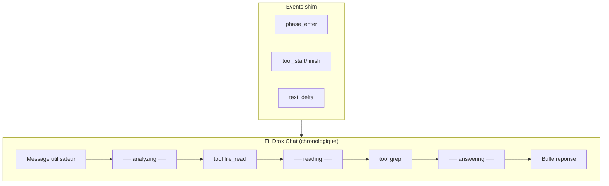

# Plan 1.5.1 — Parité fil discussion TUI → Drox Chat

**Version** : juin 2026  
**Base** : `main` / `1.5.0` · moteur `tui_mono` · VS Code **1.126**  
**Branche** : `1.5.1`

### État d'avancement (dernière MAJ : juin 2026)

| Pilier | Avancement | Bloquant release |
|--------|------------|------------------|
| **P0** Fil chronologique | **fait** | — |
| **P1** Session & chrome | **fait** | — |
| **P1-C** Connexion moteur (wizard) | **fait** | — |
| **P2** Polish trays | 0 % | reporté **1.5.2** |
| **Release** | code **fait** · clôture : ship Windows + merge `main` + branche **1.5.2** | oui (OR) |

**Clôture** : [Reste avant clôture](#reste-avant-clôture-151) ci-dessous · suite UX/moteur → [1.5.2](../1.5.2/PLAN-1.5.2.md) · Linux ship → [1.5.3](../1.5.3/PLAN-1.5.3.md).

---

## Suivi — checklist

Cocher au fur et à mesure. Une case « fait » = code mergé sur `1.5.1` **et** vérifié manuellement ou par test ciblé.

### Fondations & principe

- [x] Principe directeur documenté — moteur inchangé, IDE consomme les `AgentEvent` natifs
- [x] Inventaire events TUI → IDE dans ce plan
- [x] Shim `rail_station_*` ignoré côté webview (events toujours émis pour replay/export)
- [x] `droxVersion` **1.5.1** dans `package.json` (L3)

### P0 — Fil chronologique

- [x] **F1** — Module `chronology.js` : buffer texte + `flush_stream` (parité `apply_agent_event`)
- [x] **F1** — `phase_enter` / `phase_close` → marqueurs `── [phase] ──` + flush buffer
- [x] **F1** — `text_delta` → append chronologique (`appendStreamBufferDelta` / `simple.js`)
- [x] **F2** — Outils inline dans la chronologie (`overrides.js` + `logTools.js`, plus de action-rails)
- [x] **F3** — Strip simplifié : `details` « Travail » + section `answer`
- [x] **F3** — Réponse stream uniquement sous phase `answering` (bulle / `drox-chat-stream`)
- [x] **F3** — Phases repliables **réouvrables** (`phase-block` dans chronologie)
- [x] **UX** — Scroll manuel pendant run (pas de suivi auto)
- [ ] **F3** — Nettoyage reliquats 1.4 : `discussion/state.js` (stubs no-op conservés), CSS rails optionnel
- [x] **F4** — Short English phase labels (`chronology.js` · `formatPhaseMarkerLabel`)
- [x] **F6** — `context_snip` → ligne fil + footer ctx
- [x] **F6** — `context_compacted` → libellé aligné TUI
- [x] **F6** — `tool_progress` → màj live du bloc outil
- [x] **F5** — Smoke manuel : [SMOKE-1.5.1-FIL-TUI.md](SMOKE-1.5.1-FIL-TUI.md) (3 scénarios L1)

### P0 — Nettoyage héritage 1.4

- [x] Suppression `run-rail-stations.js` + retrait du chargement webview
- [x] Suppression handlers `railStationEnter/Hold/Done` dans `host-message.js`
- [x] Suppression action-rails (`plan-action-rail`, `architect-action-rail`, `createLinearArchitectToolLine`)
- [x] Strip sans sticky head plan/banner (nouveaux runs)
- [ ] CSS mort : `.msg-rail-station`, rails 1.4 (optionnel — replay legacy)
- [ ] Dogfood validé sans régression visible

### P1 — Session & chrome

- [x] **S1** — Replay aligné fil chronologique P0 (`droxSessionReplay.ts` + `host-message.js`)
- [x] **S2** — `busy` / activité composer : clear stale après `Stop` (`activity.js`, `host-message.js`)
- [x] **S3** — `ask_user` : markdown rendu, hauteur bornée (`06-userAsk.js`, CSS)

### P1-C — Connexion moteur (« Connecter son IA »)

Remplace dans **General settings** les champs bruts *LLM provider* / *Server URL* / *API key* par un bouton **Connecter son IA** ouvrant un assistant en **3 étapes** (navigation arrière possible).

| # | Étape | Contenu |
|---|--------|---------|
| C1 | **Hébergement** | Choix : **Cloud** (prestataire) vs **Personnel** (serveur auto-hébergé) |
| C2 | **Provider** | Liste selon hébergement — ex. vLLM, API OpenAI-compatible, Ollama, Hugging Face, … |
| C3a | **Cloud** | Formulaire spécifique au prestataire (clés, endpoints, modèles) |
| C3b | **Personnel** | URL serveur + **headers personnalisés** (paires nom/valeur : `x-api-key`, `Authorization`, etc.) |

**Contraintes produit**

- Pas Anthropic, pas OpenAI (société), pas de « géants US » dans le catalogue cloud initial.
- Cloud : prestataires pertinents (Ollama cloud si applicable, Hugging Face, autres à valider).
- Personnel : headers multiples, noms libres — le moteur les consomme (cf. `drox-cli` `collect_headers` / `LlmConfig`).
- État connecté visible dans General settings (résumé + bouton « Modifier la connexion »).
- Persistance : `droxConfiguration` / `droxRunSettings` + params `agent.run` (`server`, `model`, `apiKey`, headers).

| # | Tâche | Fichiers probables |
|---|--------|-------------------|
| C-W1 | UI wizard modal 3 étapes + Retour / Annuler / Valider | `connection-wizard.js`, `droxChatMvp.css` |
| C-W2 | Remplacer champs connection du panneau par bouton + résumé | `panel.js`, `helpers.js` |
| C-W3 | Wire host : sauvegarde profil connexion, test connexion | `droxChatGeneralSettings.ts`, `droxChatWebviewRouter.ts` |
| C-W4 | Headers personnalisés → `agent.run` | `droxLlmHeaders.ts`, `droxRunSettings.ts` |
| C-W5 | Catalogue providers (cloud vs perso) + formulaires C3 | `connection-catalog.js`, `droxLlmCatalog.ts` |

**Statut** : **fait** (juin 2026) — inclut animation languette Settings, blocage vignette Architecte sans connexion, test HTTP avant persistance.

**Critère** : un run agent réussi après configuration uniquement via le wizard, sans éditer JSON à la main.

### P2 — Polish trays

- [ ] **P2-1** (B-UI-01) — Fichiers édités repliés dans le tray
- [ ] **P2-2** (B-UI-02) — Lignes « Ran » / layout
- [ ] **P2-3** (B-UI-04) — Questionnaire `ask_user`

### Events natifs — couverture IDE

| Event | Fil | Footer / chrome | Statut |
|-------|-----|-----------------|--------|
| `phase_enter` / `phase_close` | marqueur + flush | — | fait (F1) |
| `text_delta` | chronologie / answer | — | fait (F1) |
| `tool_start` / `tool_finish` | bloc inline | — | fait (F2) |
| `tool_progress` | màj summary outil | — | fait (F6) |
| `stop` + `usage` | — | tokens ↑↓ | fait |
| `context_snip` | ligne système | ctx | fait (F6) |
| `context_compacted` | ligne système | ctx | fait (F6) |
| `context_usage` | — | ctx | fait |
| `memory_persisted` | chip | titre onglet | fait |
| `run_objective` | sticky objectif | titre onglet | fait |
| `loop_intervention` | bandeau | — | à vérifier smoke |
| `hook_progress` | — | — | non branché (optionnel) |
| `rail_station_*` | ignoré | — | volontaire |
| Durée run | — | `#cycle-elapsed` | fait |

### Livrables release

- [x] **L1** — Fil P0 validé sur 3 scénarios dogfood ([SMOKE-1.5.1-FIL-TUI.md](SMOKE-1.5.1-FIL-TUI.md))
- [x] **L2** — Replay session (S1)
- [x] **L3** — `droxVersion` 1.5.1 au ship
- [x] **L4** — Doc smoke `SMOKE-1.5.1-FIL-TUI.md`

### Reste avant clôture 1.5.1

- [ ] **R1** — `npm run drox:ship` Windows · installeur sur `Drox---IDE---OR` *(en cours)*
- [ ] **R2** — `gh release create` / upload `v1.5.1` avec `.exe` win32-x64
- [ ] **R3** — Finaliser [CLOSURE-1.5.1.md](CLOSURE-1.5.1.md)
- [x] **R4** — Publication squash sur `main` + tag `v1.5.1`
- [x] **R5** — Ouvrir branche **`1.5.2`** depuis `main`

**Reporté** :
- [1.5.2](../1.5.2/PLAN-1.5.2.md) — diffs fil, UX messages, composer, paramètres moteur
- [1.5.3](../1.5.3/PLAN-1.5.3.md) — release Linux `.deb`

### Critères d'acceptation release 1.5.1

- [ ] Fil chat = ordre TUI : salut, exploration repo, mutation fichier (smoke F5)
- [x] Réponse visible **uniquement** sous phase `answering`
- [x] Replay session à la réouverture (S1)
- [x] Connexion IA configurée via wizard (P1-C)
- [x] Plus de dépendance UX au conducteur rail 1.4
- [x] `droxVersion` 1.5.1 · OR `latest.json`

---

## Vision

Le TUI (`drox-tui`) est la **référence UX** pour un run agent : un **fil append-only chronologique**. Drox Chat doit **refléter le même ordre** et la même sémantique — pas réinventer le rail 1.4 ni des stations inférées.

### Principe directeur (non négociable en 1.5.1)

```text
Moteur TUI  ──AgentEvent JSON──►  shim RPC  ──►  IDE (webview)
     ▲                                              │
     │                                              │
     └── on n’adapte PAS le moteur à l’IDE ◄────────┘
```

- **Source de vérité** : ce que le TUI affiche déjà (`LogEntry`, status line, `apply_agent_event`).
- **IDE** : consommer les events **natifs** et les monter dans le fil / le footer (tokens, durée, snip, compaction, progression outil…).
- **Interdit 1.5.1** : nouveaux champs RPC, logique moteur spécifique IDE, réintroduction du conducteur 1.4.

```text
Utilisateur
    → agent.run (shim RPC)
        → boucle TUI (phases + outils)
            → events JSON
                → TUI : LogEntry chronologique     ← vérité
                → IDE : droxChat stream            ← cible 1.5.1
```

**Hors scope 1.5.1** : refonte chrome workbench VS Code, panneaux latéraux, thème global — sujet ultérieur.

---

## Inventaire events TUI → IDE

| `AgentEvent` | TUI | IDE aujourd’hui | Cible 1.5.1 |
|--------------|-----|-----------------|-------------|
| `PhaseEnter` / `PhaseClose` | `── [phase] ──` | chronologie + flush | fait (F1) |
| `TextDelta` | `PhaseLine` / `Assistant` | chronologie / answer | fait (F1) |
| `ToolStart` / `ToolFinish` | bloc outil inline | chronologie | fait (F2) |
| `ToolProgress` | bash live (elapsed) | màj bloc outil | fait (F6) |
| `Stop` + `usage` | fin run + compteurs | footer ↑↓ | fait |
| `ContextSnip` | `· contexte snip` | ligne fil + ctx | fait (F6) |
| `ContextCompacted` | compaction live | ligne fil + ctx | fait (F6) |
| `MemoryPersisted` | chip session | `memory` chip | fait |
| `RunObjective` | sticky / titre | `runObjective` | fait |
| Durée run | status `durée` | `#cycle-elapsed` | fait |
| Tokens session | status `↑↓ ctx` | footer stats | fait |

Référence wire : [SHIM-MOTEUR-IDE](../1.5.0/SHIM-MOTEUR-IDE.md).

---

## Ce que le TUI affiche (contrat UX)

Source : `apply_agent_event` + `LogEntry::display_lines`.

| Ordre | Event / entrée | Rendu TUI |
|-------|----------------|-----------|
| 1 | Message user | `▸ …` |
| 2 | `PhaseEnter` | `── [reading] ──` (marqueur phase) |
| 3 | `TextDelta` (hors `answering`) | lignes indentées sous la phase (`PhaseLine`) |
| 4 | `ToolStart` / `ToolFinish` | bloc outil **à l’endroit de l’appel** |
| 5 | `internal_reasoning` (Ollama thinking) | phase dédiée, repliée |
| 6 | `PhaseEnter { answering }` | fin du « travail interne » |
| 7 | `TextDelta` sous `answering` | `◂` réponse utilisateur |
| 8 | `PhaseEnter { done }` / `Stop` | fin de run |
| * | `ContextSnip`, compaction, erreurs | lignes système ponctuelles |

**Règle** : tout ce qui n’est pas sous `answering` = travail interne (repliable) ; seul `answering` = bulle de réponse chat.

Phases possibles (optionnelles, **dans l’ordre d’arrivée**) :  
`analyzing` → `reading` → `clarifying` → `planning` → `acting` → `testing` / `verifying` → `answering` → `done`.

---

## Écart actuel IDE (héritage 1.4)

| Aujourd’hui (IDE) | TUI | Action 1.5.1 |
|-------------------|-----|--------------|
| Cartes `rail_station_*` (shim synthétique) | Pas de « stations » | **Ignorées** — `run-rail-stations.js` supprimé |
| ~~`run-rail-stations.js`~~ | N/A | **Supprimé** |
| `phases.js` + `chronology.js` | Ordre events TUI | **En place** — valider F5 |
| `discussion/state.js` — no-op | N/A | À supprimer (reliquat) |
| Replay journal UI | `transcript_replay.rs` → `LogEntry` | **S1** — partiel (voir § Replay) |

Le shim émet encore `rail_station_*` pour compat — l’UI **1.5.1** peut les ignorer ou les afficher comme **badges** sans réorganiser le fil.

---

## Piliers (ordre de travail)

### P0 — Fil chronologique (parité TUI)

**Objectif** : pour un même `agent.run`, le fil IDE liste les mêmes blocs **dans le même ordre** que le TUI.

| # | Tâche | Statut | Fichiers |
|---|--------|--------|----------|
| F1 | Router `phase_enter` / `phase_close` / `text_delta` en append chronologique | fait | `chronology.js`, `phases.js`, `display/simple.js` |
| F2 | Monter `tool_start` / `tool_finish` **inline** au moment de l’event | fait | `overrides.js`, `logTools.js` |
| F3 | Séparer strict `answering` (bulle) vs reste (section repliable « Travail ») | en cours | `strip.js`, `stream/answer/*` |
| F4 | Phase markers = short English labels (TUI `── [phase] ──` style) | fait | `chronology.js` |
| F5 | Test manuel : même prompt en TUI et IDE → même séquence visible | à faire | smoke doc |
| F6 | Brancher `context_snip`, `tool_progress`, `context_compacted` | fait | `droxChatAgentEvents.ts`, `tool-events.js` |

**Critère** : dogfood côte à côte `drox-tui` vs F5 — ordre phases + outils identique (tolérance CSS).

### P1 — Session & chrome chat

| # | Tâche | Statut |
|---|--------|--------|
| S1 | Replay session aligné fil chronologique P0 | fait |
| S2 | `busy` / activité composer alignés sur `Stop` | fait |
| S3 | `ask_user` : markdown + hauteur bornée | fait |

### P1-C — Connexion moteur

| # | Tâche | Statut |
|---|--------|--------|
| C1 | Wizard 3 étapes (cloud/perso → provider → formulaire) | fait |
| C2 | Remplacer provider/URL/API key par « Connecter son IA » | fait |
| C3 | Headers personnalisés (serveur perso) → moteur | fait |
| C4 | Catalogue providers (hors géants US / Anthropic) | fait |
| C5 | Persistance + `agent.run` | fait |

---

### P2 — Polish trays (après P0)

| # | Ancien ID | Sujet |
|---|-----------|--------|
| P2-1 | B-UI-01 | Fichiers édités repliés dans le tray |
| P2-2 | B-UI-02 | Lignes « Ran » / layout |
| P2-3 | B-UI-04 | Questionnaire `ask_user` |

### Reporté

| Sujet | Version |
|-------|---------|
| Diffs fichier dans le fil + undo/redo | **1.5.2** D1 |
| UX messages utilisateur (copie, style) | **1.5.2** U1 |
| Composer textarea auto-grow | **1.5.2** U2 |
| Paramètres moteur (`max_iterations` 50, sampling…) | **1.5.2** M1 |
| Polish trays P2 (B-UI-*) | **1.5.2** P2 |
| Release Linux `.deb` (ship OR) | **1.5.3** |
| Signature Authenticode Windows | ultérieur |
| Routage Auto / boucle analyse 1.4 | **Abandonné** |
| Refonte interface VS Code | post-1.5.x |

→ [PLAN-1.5.2.md](../1.5.2/PLAN-1.5.2.md) · [PLAN-1.5.3.md](../1.5.3/PLAN-1.5.3.md)

---

## Process (inchangé — 1.5.0)

| Étape | Commande / doc |
|-------|----------------|
| Dev | Branche `1.5.1`, `npm run watch`, F5 |
| Moteur | `cargo test -p drox-cli` si touché shim |
| Release Windows | `npm run drox:ship` · [GUIDE-PUBLICATION-WIN32](../../operations/GUIDE-PUBLICATION-WIN32.md) |
| Release Linux | reportée **1.5.3** · scripts prêts [1.5.1b](../1.5.1b/PLAN-1.5.1b.md) |
| Git publish | [RULES.md § Intégration upstream](../../../../RULES.md) — squash sur `main` |

Pas de changement moteur requis pour P0 — **webview + mapping events** seulement. P1-C peut nécessiter d’exposer **headers HTTP** côté shim si absent.

---

## Replay session — état confirmé (S1)

**Ce qui existe déjà** (`droxSessionReplay.ts`, `droxChatTabsManager.ts`) :

| Mécanisme | Comportement |
|-----------|--------------|
| **Journal UI** (`.ui-replay.jsonl`) | Rejeu des messages host→webview enregistrés pendant le run live — **meilleure fidélité** si la session a tourné sur la version UI courante |
| **Transcript fallback** | Si pas de journal UI : reconstruction depuis le transcript JSONL (`replayTranscriptMessageRich`) — parse `[phase:]` + blocs outils |
| **Mode tail** (défaut) | Dernier échange seulement ; scroll-up charge l’historique (`loadSessionOlder`) |
| **Mode full** | Tout le journal UI ou tout le transcript |

**Ce qui manque pour valider S1 en 1.5.1** :

- [x] Rejeu **compatible fil P0** : strips `Travail` / `answer`, blocs `phase-block` repliables
- [ ] Sessions enregistrées **avant** refonte chronologie → rendu incohérent possible
- [ ] Parité TUI `LogEntry` / `messages_to_log_entries` non branchée (reconstruction heuristique, pas le même pipeline que `drox-tui`)
- [ ] Test manuel : fermer IDE → rouvrir session → fil lisible = fin de run (smoke TUI-5)

**Verdict** : le replay transcript utilise désormais `phase` + `delta` / `mountStreamPhaseLine` ; le journal UI reste la meilleure fidélité.

---

## Schéma cible — fil IDE



Les cartes rail (`read`, `act`, …) restent **optionnelles** en marge — pas le squelette du fil.

---

## Livrables

| # | Livrable | Critère |
|---|----------|---------|
| L1 | Fil P0 implémenté | Parité ordre TUI sur 3 scénarios dogfood |
| L2 | Replay session (S1) | Réouverture app = même fil qu’en fin de run |
| L3 | `droxVersion` **1.5.1** au ship | `package.json` |
| L4 | Smoke 1.5.1 | `SMOKE-1.5.1-*.md` (template [SMOKE-M-memory-TEMPLATE](../../1.4/1.4.2/SMOKE-M-memory-TEMPLATE.md)) |
| L5 | Suite | [1.5.2](../1.5.2/PLAN-1.5.2.md) UX/moteur · [1.5.3](../1.5.3/PLAN-1.5.3.md) Linux |

---

## Journal

| Date | Événement |
|------|-----------|
| 2026-06 | Réécriture plan — abandon périmètre 1.4, cible parité TUI |
| 2026-06 | Branche `1.5.1` ouverte depuis `main` (1.5.0) |
| 2026-06 | P0 : `chronology.js`, strip Travail/answer, outils inline, suppression rail 1.4 |
| 2026-06 | F6 : `context_snip`, `tool_progress`, libellé `context_compacted` |
| 2026-06 | Phases repliables réouvrables ; scroll manuel pendant run |
| 2026-06 | Plan : § Replay confirmé ; P1-C wizard « Connecter son IA » |
| 2026-06 | P1-C livré : wizard connexion, headers, test HTTP, UX attention Settings |
| 2026-06 | S1–S3, F4, L3–L4 : replay chronologie, busy stale, ask_user markdown, libellés FR, smoke doc |

---

## Liens

- [README 1.5.1](README.md)
- [SHIM-MOTEUR-IDE](../1.5.0/SHIM-MOTEUR-IDE.md)
- [CLOSURE 1.5.0](../1.5.0/CLOSURE-1.5.0.md)
- [Hub 1.5](../README.md)
