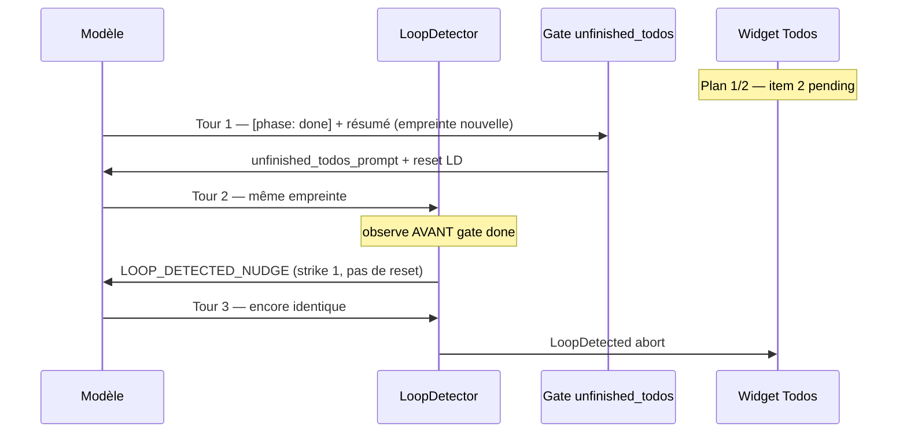

# Plan 1.5.14 — Clôture plan sans boucle

**Version** : juillet 2026  
**Base** : [1.5.13](../1.5.13/PLAN-1.5.13.md) livrée · OR `v1.5.13`  
**Branche** : `1.5.14` · tag cible **`v1.5.14`**

---

## En une phrase

Le moteur **abort** trop tôt quand le modèle **répète la même tentative de clôture** (dernier todo ouvert + `[phase: done]`) : corriger l’interaction **`LoopDetector` × `unfinished_todos_prompt`** sans affaiblir la détection des vraies boucles.

---

## Symptôme (prod 1.5.13)

| Champ | Valeur |
|-------|--------|
| Modèle observé | `qwen3.6:27b-mtp-q4_K_M` (Ollama) |
| UI | Widget **Todos (1/2)** — 1er item `completed`, 2e encore `pending` |
| Message erreur | `loop detected: model repeated the same both for 3 consecutive turns` |
| Contexte | Après `file_edit` réussi + résumé assistant ; le modèle semble vouloir **terminer le run** |

Capture : retour terrain juillet 2026 (hydration Next.js / docs).

---

## Analyse — où ça casse

### Composants impliqués

| Composant | Fichier | Rôle |
|-----------|---------|------|
| **`LoopDetector`** | `drox-engine/drox/crates/drox-engine/src/agent.rs` (~L2257) | Empreinte `(texte assistant trimé, signature tool_calls)` ; 1er tour identique → **Warn** ; 2e → **`EngineError::LoopDetected`** |
| **Gate D4** | idem (~L1090) | `[phase: done]` refusé si `last_todo_pending > 0` ou `last_todo_in_progress > 0` → injecte `unfinished_todos_prompt` |
| **Nudge N3/N4** | idem (~L1002, ~L2387) | `LOOP_DETECTED_NUDGE_PROMPT` au 1er strike ; **abort** au 2e |
| **Affichage erreur IDE** | `src/vs/workbench/contrib/drox/browser/droxChatAgentEvents.ts` (~L462) | Hint utilisateur + message système |

### Ordre d'évaluation dans la boucle (point clé)

À chaque tour, le moteur exécute **dans cet ordre** :

1. **`loop_detector.observe(outcome)`** (~L1002) — avant toute gate clôture
2. Gates **`[phase: done]`** dont **D4** `unfinished_todos` (~L1090)

Conséquence : dès le **2e tour identique** (même résumé + même absence de `todo_write` correct), le modèle reçoit **`LOOP_DETECTED_NUDGE`** (N3) **avant** un éventuel rappel « flippez vos todos ». Au **3e tour identique** → abort — **sans** que la gate D4 ait pu réinjecter son nudge une 2e fois.

### Chaîne causale (scénario le plus probable)



**Mécanisme** :

1. Le modèle **livre le travail** (`file_edit`) mais **ne met pas à jour** `todo_write` (dernier item reste `pending` / `in_progress`).
2. Il tente `[phase: done]` → gate **D4** bloque → nudge « flippez les items en `completed` » + **`loop_detector.reset()`**.
3. Tour suivant : **même texte** (résumé sans marqueurs phase dans l’empreinte) + **mêmes tool_calls** (souvent vide ou même `todo_write` stale) → **strike 1** (`LOOP_DETECTED_NUDGE`) **sans reset**.
4. Troisième tour identique → **abort** (`both` = texte + tools identiques).

### Scénarios alternatifs (à couvrir en smoke)

| # | Scénario | Empreinte répétée | Déclencheur |
|---|----------|-------------------|-------------|
| **S-A** | `[phase: done]` ×3 sans `todo_write` intermédiaire | Texte answering identique, tools vides | Gate D4 + LD |
| **S-B** | Même `todo_write` (1 completed, 1 in_progress) + même résumé ×3 | `todo_write` args identiques | LD seul (plan jamais clôturé côté moteur) |
| **S-C** | JSON `{"todos":[…]}` **dans le texte** au lieu d’un tool_call natif | Texte identique, pas d’exécution tool | Gates todo jamais satisfaites → converge vers S-A |
| **S-D** | Clôture correcte mais modèle **ré-émet le même résumé** après `DONE_ONLY_NUDGE` | Texte identique après nudge « done seul » | LD × N2 — moins fréquent si todos déjà à 0 |

### Asymétrie documentée vs code

D’après [CIRCUIT-MOTEUR-GATES-NUDGES.md](../../1.3/1.3.2/CIRCUIT-MOTEUR-GATES-NUDGES.md) §10 :

- Les nudges **structurels** (`unfinished_todos`, `DONE_ONLY`, `step_by_step_todo`, …) appellent **`loop_detector.reset()`**.
- Le nudge **N3** (`LOOP_DETECTED_NUDGE`) **ne reset pas** → une seule répétition après Warn suffit à abort.

Conséquence : une **convergence légitime butée** (le modèle insiste sur `[phase: done]` alors que le plan UI n’est pas à jour) est traitée comme une **boucle malveillante** en **3 tours**.

### Ce n’est (probablement) pas

- Un bug UI du widget todos seul — l’état vient du dernier `tool_finish` `todo_write` réussi côté moteur.
- Un rejet `TODO_RECREATION_BLOCKED` — message différent (« Blocked: you tried to **replace**… »).
- `max_iterations` — message explicite `loop detected`.

---

## Périmètre correctif

| **Dans 1.5.14** | **Hors scope** |
|-----------------|----------------|
| L1–L3 ci-dessous | Refonte complète du protocole phases |
| Tests Rust + smoke manuel | Heuristiques sur le texte utilisateur (interdit RULES §6) |
| Ship OR après validation | Bump upstream VS Code |

Reports [1.5.13](../1.5.13/PLAN-1.5.13.md) (MCP, perf, purge) → **P2+** si L1–L2 clos avant deadline.

---

## Étapes

| Étape | Intitulé | Priorité | Effort | Statut |
|-------|----------|----------|--------|--------|
| **L1-a** | Repro automatisé Rust (scénarios S-A, S-B) | P0 | moyen | ✅ |
| **L1-b** | Correctif `LoopDetector` / gates clôture | P0 | moyen | ✅ |
| **L1-c** | `cargo test` + `npm run test-drox` verts | P0 | faible | ⬜ |
| **L2-a** | Smoke manuel 2-items plan → clôture OK | P0 | faible | ⬜ |
| **L2-b** | Smoke non-régression : vraie boucle (3× même lecture) abort toujours | P0 | faible | ⬜ |
| **L3-a** | Renforcer nudge clôture plan (dernier item) si L1 insuffisant | P1 | faible | ⬜ |
| **L3-b** | Vérifier affichage hint IDE (`drox.loop.abort.hint`) | P1 | faible | ⬜ |

---

## L1-b — Correctif appliqué

**Option retenue** : variante **A** du plan — réordonner l’évaluation : `loop_detector.observe` **après** le bloc gates `[phase: done]` (D1–D7).

Détail avant/après : **[IMPLEMENTATION-L1-LOOP-DETECTOR.md](IMPLEMENTATION-L1-LOOP-DETECTOR.md)**

### Pistes non retenues (archive)


**Variante A** (livré) : `observe` après gates done — voir doc implémentation.

### Option 1 — ~~Réordonner~~ (livré)

Au strike 1, après injection N3, appeler `loop_detector.reset()` pour laisser **≥ 2 tentatives** post-nudge avant abort.

Risque : vraies boucles infinies consomment plus de tokens (borne `max_iterations` reste).

### Option 3 — Empreinte « clôture plan » assouplie

Si `last_todo_pending + last_todo_in_progress > 0` et tool_calls contient **uniquement** `todo_write` dont les args **avancent** le plan (counts pending/in_progress **diminuent**), ne pas compter comme répétition même si le texte assistant est similaire.

Effet : couvre S-B ; plus complexe à implémenter et tester.

### Option 4 — Auto-nudge ciblé « dernier item »

Si exactement **1** item actif reste après mutation réussie dans le run, injecter **avant** toute gate done un rappel court :

> « Il reste 1 item ouvert — `todo_write` avec cet item en `completed` avant `[phase: done]`. »

Complément prompt-only ; ne remplace pas L1-b.

---

## L1-a — Tests Rust attendus

Fichier cible : `drox-engine/drox/crates/drox-engine/src/agent.rs` (module tests existant ~L4670).

| Test | Entrée | Attendu |
|------|--------|---------|
| `loop_does_not_abort_when_done_blocked_by_open_todo` | 3 tours identiques : answering + `[phase: done]`, plan 1 pending | Pas `LoopDetected` avant ≥ N tours ou convergence via `todo_write` |
| `loop_still_aborts_on_true_stall` | 3 tours identiques : `[phase: reading]` + `file_read` même path | `LoopDetected` conservé |
| `todo_write_all_completed_then_done_succeeds` | todo_write 2/2 completed → answering → done | `Stop` propre |

---

## L2 — Smokes manuels

### Smoke T1 — Repro bug (2 items)

1. Demander une tâche en **2 étapes** explicites (ex. « 1) redirect /docs 2) bouton retour accueil »).
2. Laisser le modèle exécuter jusqu’au widget **Todos (1/2)**.
3. Vérifier qu’après le 2e `file_edit` le run **se termine sans** `loop detected`.
4. Widget final : **2/2 completed** (ou cancelled).

### Smoke T2 — Non-régression anti-boucle

1. Prompt ambigu qui pousse le modèle à relire le même fichier sans progresser.
2. Vérifier qu’au bout de quelques tours le run **abort** toujours (pas de hang infini).

### Smoke T3 — Modèle faible sur tool_calls

1. Modèle local connu pour JSON inline (qwen / glm).
2. Si `todo_write` simulé en texte → run doit **nudger** ou **bloquer** proprement, pas loop opaque.

---

## Critères d’acceptation release

- [ ] **L1-a** : tests Rust verts (3 cas minimum)
- [ ] **L2-a** : T1 OK sur build 1.5.14 (Windows + fenêtre Agents)
- [ ] **L2-b** : T2 OK — vraies boucles toujours stoppées
- [ ] Aucune régression E2E 1.5.13 (fil, switch session, stream arrière-plan)
- [ ] Ship OR `v1.5.14`

---

## Références code

```1090:1108:drox-engine/drox/crates/drox-engine/src/agent.rs
} else if last_todo_pending > 0 || last_todo_in_progress > 0 {
    // ... unfinished_todos_prompt ...
    loop_detector.reset();
    continue;
}
```

```1002:1029:drox-engine/drox/crates/drox-engine/src/agent.rs
match loop_detector.observe(&outcome) {
    LoopDecision::Warn { kind } => {
        messages.push(Message::system(LOOP_DETECTED_NUDGE_PROMPT));
        continue; // pas de loop_detector.reset()
    }
    LoopDecision::Abort { kind, turns } => { /* LoopDetected */ }
}
```

```573:589:drox-engine/drox/crates/drox-engine/src/agent.rs
fn unfinished_todos_prompt(pending: u64, in_progress: u64) -> String {
    // ... call todo_write again with SAME items, flip to completed ...
}
```

---

## Liens

- [IMPLEMENTATION L1 — avant/après](IMPLEMENTATION-L1-LOOP-DETECTOR.md)
- [README 1.5.14](README.md)
- [GUIDE moteur — LoopDetector](../../0.0/guides/GUIDE-MOTEUR-DROX.md)
- [Prompts — règle 7 clôture plan](../../0.0/… via `drox-cli/src/prompts.rs`)
- [Reports 1.5.13](../1.5.13/PLAN-1.5.13.md) § S5–S16
