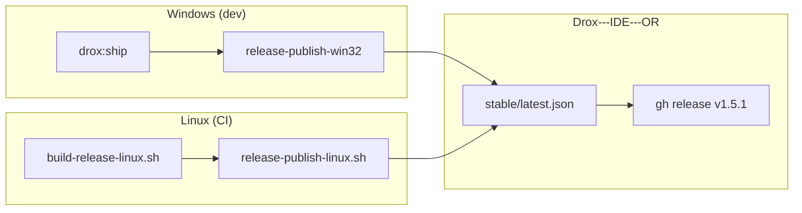

# Plan 1.5.1b — Release Linux (repo OR)

**Version** : juin 2026  
**Base** : [1.5.1](../1.5.1/PLAN-1.5.1.md) · pipeline Windows existant  
**Branche** : `1.5.1` (scripts + doc) · tag release partagé **`v1.5.1`**

### État d'avancement

| Pilier | Avancement | Bloquant ship Linux |
|--------|------------|---------------------|
| **L0** Scripts build Linux | **~90 %** — `build-release-linux.sh` prêt CI | oui (validation Ubuntu) |
| **L1** Publish manifest multi-plateforme | **~95 %** — merge `latest.json` win32 + linux | non |
| **L2** CI GitHub Actions | **~80 %** — workflow manuel + artefacts | oui (premier run) |
| **L3** Smoke Linux | **0 %** | oui |
| **L4** Doc + RULES | **fait** | non |

**Prochaine étape** : ship effectif → [1.5.3](../1.5.3/PLAN-1.5.3.md).

---

## Objectif

| In | Hors scope 1.5.1b |
|----|-------------------|
| `.deb` **linux-x64** (amd64) | macOS (darwin) |
| Entrée `linux-x64` dans `stable/latest.json` | Snap, Flatpak, AppImage (plus tard) |
| Même `droxVersion` que Windows (ex. **1.5.1**) | Signature Authenticode / GPG repo |
| `resources/drox/linux-x64/drox` embarqué | ARM64 Linux (1.5.1c si demandé) |

---

## Checklist

### Fondations (fait / en cours)

- [x] Layout moteur multi-plateforme documenté (`resources/drox/README.md`)
- [x] `package-drox.sh` Linux · `droxExecutable.ts` → `linux-x64`
- [x] `product.json` : `linuxIconName`, desktop files upstream
- [x] `build-release-linux.sh` (F1 app + .deb)
- [x] `release-publish-linux.sh` + merge manifeste Node
- [x] `release-publish-win32.ps1` préserve les plateformes existantes dans `latest.json`
- [x] Workflow `.github/workflows/drox-release-linux.yml` (manuel)
- [ ] `verify-packaged-linux.sh` validé sur artefact réel

### Build F1 Linux

- [ ] `npm install` + deps système (voir guide Linux)
- [ ] `DROX_PRODUCT_SURFACE=release` + `package-drox.sh release`
- [ ] `gulp core-ci-desktop` si bundle obsolète
- [ ] `gulp vscode-linux-x64-min-ci` → `../VSCode-linux-x64/`
- [ ] `gulp vscode-linux-x64-prepare-deb` + `build-deb`
- [ ] Vérif : `drox-ide` binaire + `resources/drox/linux-x64/drox`

### Publish F3 (repo `Drox---IDE---OR`)

- [ ] Copie `.deb` → `_upload/Drox-IDE-<ver>-linux-x64.deb`
- [ ] `release-publish-linux.sh` → merge `platforms.linux-x64` dans `stable/latest.json`
- [ ] `gh release upload` sur tag **`v1.5.1`** (même release que Windows)

### Smoke L3

- [ ] Install `.deb` sur Ubuntu 22.04/24.04 frais
- [ ] Lancement `drox-ide` · Chat · wizard connexion · run agent
- [ ] MAJ : `latest.json` résolu par `droxUpdateService` (`linux-x64`)

### Critères d'acceptation 1.5.1b

- [ ] `latest.json` contient **win32-x64** et **linux-x64** pour la même `version`
- [ ] `.deb` installable sans Rust/Ollama préinstallés (Ollama reste option utilisateur)
- [ ] Moteur embarqué TUI 1.5+ (`tui_mono`)

---

## Schéma pipeline

---

## Journal

| Date | Événement |
|------|-----------|
| 2026-06 | Ouverture 1.5.1b — scripts build/publish Linux + merge manifeste |

---

## Liens

- [README 1.5.1b](README.md)
- [GUIDE-PUBLICATION-LINUX.md](../../operations/GUIDE-PUBLICATION-LINUX.md)
- [PLAN 1.5.3](../1.5.3/PLAN-1.5.3.md) — ship Linux
