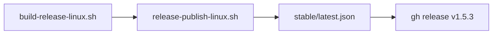

# Plan 1.5.3 — Release Linux (repo OR)

**Version** : juin 2026  
**Base** : [1.5.2](../1.5.2/PLAN-1.5.2.md) · pipeline préparé [1.5.1b](../1.5.1b/PLAN-1.5.1b.md)  
**Branche** : `1.5.3` · tag **`v1.5.3`** sur `Drox---IDE---OR`

### État d'avancement

| Pilier | Avancement | Bloquant |
|--------|------------|----------|
| **L0** Scripts build Linux | **~90 %** — hérité 1.5.1b | validation Ubuntu |
| **L1** Publish manifest multi-plateforme | **~95 %** — merge `latest.json` | non |
| **L2** CI GitHub Actions | **~80 %** — workflow manuel | premier run |
| **L3** Smoke Linux | 0 % | oui |

**Prochaine étape** : build `.deb` (WSL / Ubuntu / Actions) · ship OR.

---

## Objectif

| In | Hors scope |
|----|------------|
| `.deb` **linux-x64** (amd64) sur `Drox---IDE---OR` | macOS |
| `platforms.linux-x64` dans `stable/latest.json` | Snap, Flatpak, AppImage |
| `resources/drox/linux-x64/drox` embarqué | ARM64 Linux |
| Tag **`v1.5.3`** (+ `.deb` sur release GitHub) | Signature GPG repo |

---

## Checklist

### Fondations (fait — 1.5.1b)

- [x] `build-release-linux.sh`, `release-publish-linux.sh`, `verify-packaged-linux.sh`
- [x] `drox-release-manifest.mjs` (merge win32 + linux)
- [x] `wsl-linux-build.ps1` / `.sh`
- [x] Workflow `.github/workflows/drox-release-linux.yml`
- [x] [GUIDE-PUBLICATION-LINUX.md](../../operations/GUIDE-PUBLICATION-LINUX.md)

### Ship 1.5.3

- [ ] `droxVersion` **1.5.3** dans `package.json`
- [ ] Build `.deb` (Ubuntu / WSL / CI)
- [ ] `release-publish-linux.sh` → merge `linux-x64`
- [ ] Commit manifeste `Drox---IDE---OR` · `git push`
- [ ] `gh release create v1.5.3` + upload `.deb` (win32 si ship couplé)
- [ ] Smoke Ubuntu : install · `drox-ide` · run agent · MAJ auto

### Critères d'acceptation

- [ ] `latest.json` : **win32-x64** + **linux-x64** même `version`
- [ ] `.deb` installable sans Rust préinstallé
- [ ] Moteur embarqué TUI 1.5+ (`tui_mono`)

---

## Pipeline



---

## Commandes

```bash
export DROX_PRODUCT_SURFACE=release
./scripts/build-release-linux.sh
./scripts/release-publish-linux.sh
gh release upload v1.5.3 ../Drox---IDE---OR/_upload/Drox-IDE-1.5.3-linux-x64.deb --repo DroxKiwi/Drox---IDE---OR
```

Depuis Windows (WSL) : `.\scripts\wsl-linux-build.ps1`

CI : **Actions → Drox Linux release build → Run workflow**

---

## Liens

- [README 1.5.3](README.md)
- [PLAN 1.5.1b](../1.5.1b/PLAN-1.5.1b.md) — préparation scripts
- [GUIDE publication Linux](../../operations/GUIDE-PUBLICATION-LINUX.md)
