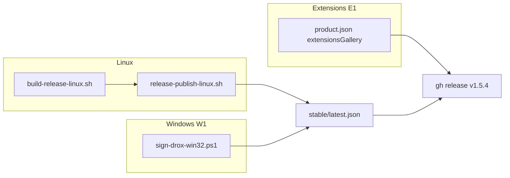

# Plan 1.5.4 — Release Linux + confiance Windows (installeur)

**Version** : juin 2026  
**Base** : [1.5.3](../1.5.3/PLAN-1.5.3.md) · pipeline préparé [1.5.1b](../1.5.1b/PLAN-1.5.1b.md)  
**Branche** : `1.5.4` · tag **`v1.5.4`** sur `Drox---IDE---OR`

### État d'avancement

| Pilier | Avancement | Bloquant |
|--------|------------|----------|
| **L0** Release Linux | **~90 %** — scripts hérités 1.5.1b | validation Ubuntu |
| **L1** Publish manifest multi-plateforme | **~95 %** | non |
| **L2** CI GitHub Actions | **~80 %** | premier run |
| **L3** Smoke Linux | 0 % | oui |
| **W1** Confiance Windows (Authenticode) | 0 % | UX install Windows |
| **E1** Marketplace extensions (Open VSX) | 0 % | adoption IDE |

**Prochaine étape** : build `.deb` · ship OR · traiter SmartScreen « Éditeur inconnu ».

---

## Objectif

| In | Hors scope |
|----|------------|
| `.deb` **linux-x64** (amd64) sur `Drox---IDE---OR` | macOS |
| `platforms.linux-x64` dans `stable/latest.json` | Snap, Flatpak, AppImage |
| `resources/drox/linux-x64/drox` embarqué | ARM64 Linux |
| **Installeur Windows signé** (Authenticode) — fin alerte « Éditeur inconnu » / SmartScreen | Signature GPG repo Linux |
| **Marketplace extensions** — installer ESLint, Git Graph, thèmes, etc. depuis la vue Extensions | Marketplace Microsoft officiel (ToS) · Copilot / extensions 1P Microsoft |
| Tag **`v1.5.4`** (`.deb` + setup `.exe` signé si W1 livré) | Notarization macOS |

---

## Checklist

### Fondations (fait — 1.5.1b)

- [x] `build-release-linux.sh`, `release-publish-linux.sh`, `verify-packaged-linux.sh`
- [x] `drox-release-manifest.mjs` (merge win32 + linux)
- [x] `wsl-linux-build.ps1` / `.sh`
- [x] Workflow `.github/workflows/drox-release-linux.yml`
- [x] [GUIDE-PUBLICATION-LINUX.md](../../operations/GUIDE-PUBLICATION-LINUX.md)

### Ship 1.5.4

- [ ] `droxVersion` **1.5.4** dans `package.json`
- [ ] Build `.deb` (Ubuntu / WSL / CI)
- [ ] `release-publish-linux.sh` → merge `linux-x64`
- [ ] Commit manifeste `Drox---IDE---OR` · `git push`
- [ ] `gh release create v1.5.4` + upload `.deb` (win32 si ship couplé)
- [ ] Smoke Ubuntu : install · `drox-ide` · run agent · MAJ auto

### W1 — Confiance Windows (SmartScreen / « Éditeur inconnu »)

Aujourd’hui l’installeur Inno (`Drox-IDE-Setup-*-win32-x64.exe`) est **non signé** : Windows Defender SmartScreen affiche **« Éditeur inconnu »** au premier lancement — friction majeure pour les utilisateurs.

| # | Tâche | Détail |
|---|--------|--------|
| W1-1 | Choisir certificat **Code Signing** | EV recommandé (réputation SmartScreen plus rapide) · stockage HSM ou fichier `.pfx` sécurisé |
| W1-2 | Script `sign-drox-win32.ps1` (ou intégration `build-release-win32.ps1`) | `signtool` (Windows SDK) · signer **setup.exe** + binaires embarqués si requis (`drox.exe`, `Drox.exe`) |
| W1-3 | Timestamp RFC 3161 | Horodatage pour validité après expiration certificat |
| W1-4 | CI / secrets | Certificat en secret GitHub ou signature manuelle locale documentée |
| W1-5 | Doc utilisateur + OR README | Retirer ou nuancer l’avertissement SmartScreen · [GUIDE-PUBLICATION-WIN32.md](../../operations/GUIDE-PUBLICATION-WIN32.md) |
| W1-6 | Smoke install Windows frais | Machine / VM sans exception préalable · vérifier absence bannière « Éditeur inconnu » (ou réputation acquise) |

**Références** : `build-release-win32.ps1` (`Add-WindowsSdkSignToolToPath`) · [RULES.md § Installeur](../../../../RULES.md) · [GUIDE WIN32 § Authenticode](../../operations/GUIDE-PUBLICATION-WIN32.md).

**Critère** : installeur `v1.5.4` publié sur OR avec signature Authenticode valide ; install testée sans contournement manuel SmartScreen.

### E1 — Marketplace extensions (vue Extensions / Open VSX)

Aujourd’hui le fork **n’expose pas** de galerie dans `product.json` (`extensionsGallery` absent — choix dé-branding 1.3.x). Les utilisateurs ne peuvent pas parcourir ni installer d’extensions tierces (linters, Git Graph, formatters, thèmes…) depuis l’UI, alors que c’est un attendu standard d’un IDE basé Code OSS.

**Cible produit** : reconnecter Drox IDE à un **registre d’extensions compatible VS Code**, accessible depuis la vue **Extensions** (recherche, install, update, désinstall).

| Option | Usage fork | Note |
|--------|------------|------|
| **[Open VSX](https://open-vsx.org)** (recommandé) | Galerie publique Eclipse — modèle VSCodium / Gitpod | Pas de ToS Microsoft Marketplace · couverture large (ESLint, Prettier, Git Graph…) |
| Marketplace Microsoft (`marketplace.visualstudio.com`) | **Hors scope** sauf accord explicite | Conditions d’usage réservées aux produits Microsoft · non adapté à un fork distribué |

#### État actuel

| Couche | Fichiers | État |
|--------|----------|------|
| `product.json` | pas de `extensionsGallery` | galerie désactivée |
| Extensions embarquées build | `builtInExtensions` (js-debug…) | ✅ via build |
| Gardes fork marketplace cloud | dé-branding / `officialMarketplaceStartupCheck` | à auditer si blocage résiduel |
| UI Extensions | workbench VS Code natif | prête si `extensionsGallery` renseigné |

#### Checklist

- [ ] **E1-1** — Ajouter `extensionsGallery` dans `product.json` (URLs Open VSX — aligner sur [VSCodium `product.json`](https://github.com/VSCodium/vscodium/blob/master/product.json) ou doc Eclipse)
- [ ] **E1-2** — `extensionAllowedBadgeProviders` / `linkProtectionTrustedDomains` si requis par la version VS Code de base
- [ ] **E1-3** — Audit : retirer ou assouplir les gardes qui court-circuitent l’install marketplace au démarrage (si encore actives sur la lignée Drox)
- [ ] **E1-4** — Smoke : vue Extensions → recherche `Git Graph` · install · reload → extension active
- [ ] **E1-5** — Smoke : `ESLint` (ou équivalent) sur workspace TypeScript — diagnostics visibles
- [ ] **E1-6** — Doc utilisateur : extensions supportées via Open VSX ; limites (extensions Microsoft-only / Copilot non garanties) · [README 1.5.4](README.md) + notice OR

**Exemple `extensionsGallery` (indicatif — valider URLs à jour au ship)** :

```json
"extensionsGallery": {
  "serviceUrl": "https://open-vsx.org/vscode/gallery",
  "itemUrl": "https://open-vsx.org/vscode/item",
  "extensionUrlTemplate": "https://open-vsx.org/vscode/gallery/{publisher}/{name}/latest",
  "controlUrl": "",
  "resourceUrlTemplate": "https://open-vsx.org/vscode/unpkg/{publisher}/{name}/{version}/{path}"
}
```

**Critère** : utilisateur frais installe **au moins deux** extensions populaires (ex. linter + Git Graph) sans VSIX manuel · MAJ auto ou réinstall documentée.

**Hors scope E1** : publier des extensions Drox sur Open VSX · marketplace Copilot · synchronisation compte Microsoft.

### Critères d'acceptation

- [ ] `latest.json` : **win32-x64** + **linux-x64** même `version`
- [ ] `.deb` installable sans Rust préinstallé
- [ ] Moteur embarqué TUI 1.5+ (`tui_mono`)
- [ ] Installeur Windows **signé** (W1) ou décision documentée si reporté
- [ ] Vue **Extensions** fonctionnelle · install depuis Open VSX (E1)

---

## Pipeline



---

## Commandes

```bash
export DROX_PRODUCT_SURFACE=release
./scripts/build-release-linux.sh
./scripts/release-publish-linux.sh
gh release upload v1.5.4 ../Drox---IDE---OR/_upload/Drox-IDE-1.5.4-linux-x64.deb --repo DroxKiwi/Drox---IDE---OR
```

Depuis Windows (WSL) : `.\scripts\wsl-linux-build.ps1`

CI : **Actions → Drox Linux release build → Run workflow**

---

## Liens

- [README 1.5.4](README.md)
- [PLAN 1.5.3](../1.5.3/PLAN-1.5.3.md)
- [PLAN 1.5.1b](../1.5.1b/PLAN-1.5.1b.md) — préparation scripts
- [GUIDE publication Linux](../../operations/GUIDE-PUBLICATION-LINUX.md)
