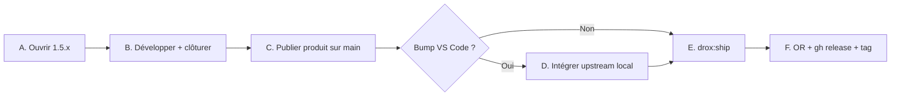

# Guide release Drox + mise à jour VS Code

**Date** : juin 2026  
**Public** : équipe Drox IDE  
**Objectif** : une seule procédure, reproductible, de la branche `1.5.x` jusqu’à l’installeur publié — sans réinventer le git à chaque fois.

**Docs liées** : [RULES.md](../../RULES.md) · [GUIDE-PUBLICATION-WIN32.md](operations/GUIDE-PUBLICATION-WIN32.md) · [ARCHITECTURE-DECOUPLAGE-UPSTREAM.md](1.2/steps/03-upstream/ARCHITECTURE-DECOUPLAGE-UPSTREAM.md) · [PATCHES-UPSTREAM-BUILD.md](1.3/1.3.0/finalisation/PATCHES-UPSTREAM-BUILD.md)

---

## Réponse courte (la question qu’on se pose à chaque fois)

| Question | Réponse |
|----------|---------|
| **Faut-il merger VS Code avant d’ouvrir la branche `1.5.x` ?** | **Non.** On ouvre la branche produit depuis `main`, on code la release Drox. |
| **Faut-il merger VS Code avant de merger la release sur `main` ?** | **Non obligatoire.** Le produit Drox peut aller sur `main` sans bump VS Code. |
| **Quand intégrer VS Code ?** | **Quand on veut livrer une nouvelle base** (`package.json` → champ `version`, ex. `1.126.0` → `1.127.0`), en général **juste avant le build release final** (ou entre deux releases produit). |
| **Comment merger VS Code sur `main` ?** | **Jamais** `git merge upstream/main` sur `main` GitHub. Toujours **local** sur `integrate/vscode-*`, puis **publication squash** (`read-tree`). |
| **Ordre canonique pour une release complète** | Branche `1.5.x` → code → merge produit sur `main` → (optionnel) intégration VS Code → `drox:ship` → repo OR + GitHub Release → tag `v1.5.x`. |

---

## Modèle mental : deux histoires git, un produit

```text
LOCAL (clone dev)                         GITHUB origin
─────────────────                         ───────────────
upstream = microsoft/vscode               main = historique PRODUIT court
  (~160k commits, ~1,3 Go)                  (~1 commit squash / release)
       │
       ▼
integrate/vscode-from-1.5.0               branches 1.5.0, 1.5.1, 1.5.2…
  base VS Code complète                     = lignes de release (à CONSERVER)
       │
       ▼
branche 1.5.x (features Drox)             PR ou read-tree → main
```

| Ref | Rôle |
|-----|------|
| **`main` (GitHub)** | Ligne produit publiée. Commits Drox + **un squash** par release ou bump VS Code majeur. |
| **`1.5.x` (GitHub)** | Branche de release **conservée** après merge (archive + reprise). |
| **`integrate/vscode-*` (local)** | Atelier upstream : historique Microsoft **uniquement en local**. |
| **`upstream`** | Remote `microsoft/vscode` — `git fetch upstream`, jamais `git push upstream`. |
| **`Drox---IDE---OR`** | Manifestes publics (`latest.json`, SHA256, notes). Exe dans GitHub Releases, pas dans git. |

**Règle d’or** : on ne pousse **pas** l’historique Microsoft sur GitHub. On pousse l’**arbre de fichiers** validé.

---

## Vue d’ensemble : les 5 phases



| Phase | But | Où |
|-------|-----|-----|
| **A** | Nouvelle release produit (`droxVersion`) | Branche `1.5.x` depuis `main` |
| **B** | Code, tests, doc CLOSURE | Branche `1.5.x` |
| **C** | Mettre le produit sur la ligne publique | `main` (PR ou squash) |
| **D** | Nouvelle base VS Code (`version`) | Local `integrate/vscode-*` → squash `main` |
| **E–F** | Installeur + canal MAJ | Build local + repo `Drox---IDE---OR` |

---

## Phase A — Ouvrir une branche de version

```powershell
cd C:\Users\coren\Desktop\GitHub\Drox---IDE
git fetch origin
git checkout main
git pull origin main

# Exemple : démarrer 1.5.4
git checkout -b 1.5.4
```

1. Éditer **`package.json`** :
   - **`droxVersion`** → `1.5.4` (release produit)
   - **`version`** → **ne pas toucher** sauf si vous préparez aussi un bump VS Code dans la même release
2. Mettre à jour le plan versionné : `drox-engine/docs/1.5/1.5.4/PLAN-1.5.4.md`
3. Commit + push :

```powershell
git add package.json drox-engine/docs/1.5/1.5.4/
git commit -m "Ouvrir la release 1.5.4."
git push -u origin 1.5.4
```

**Développement quotidien** : commits sur `1.5.x`, push sur `origin/1.5.x` (léger).

---

## Phase B — Développer et clôturer

Sur la branche `1.5.x` :

- Code : `src/vs/workbench/contrib/drox/`, `drox-engine/`, scripts release
- Dev IDE : `npm run watch` puis `.\scripts\code.bat`
- Après modif TS Drox : rebuild bundle avant ship → `npm run drox:ship -- -Force`

Checklist avant merge :

- [ ] `droxVersion` correct dans `package.json`
- [ ] Notes de version / splash si applicable (`droxReleaseNotes.ts`)
- [ ] `CLOSURE-1.5.x.md` rempli
- [ ] Smoke manuel chat (3 scénarios minimum)

---

## Phase C — Publier le produit Drox sur `main`

Deux chemins valides. **Choisir un seul** par release.

### Option 1 — Pull Request (recommandé si l’historique de la branche est propre)

```powershell
# Sur GitHub : PR 1.5.x → main
# IMPORTANT : ne pas cocher "Delete branch" après merge
gh pr create --base main --head 1.5.4 --title "Release 1.5.4" --body "..."
# Après merge : restaurer la branche si GitHub l’a supprimée
# git push origin <commit-tip>:refs/heads/1.5.4
```

### Option 2 — Publication squash (`read-tree`) depuis `main`

Quand l’historique local diverge ou pour republier un arbre exact :

```powershell
git fetch origin
git checkout -B publish/1.5.4 origin/main
git read-tree -u --reset refs/heads/1.5.4

# Retirer le cache LFS Copilot (sinon push bloqué)
git rm -r -f extensions/copilot/test/simulation/cache 2>$null

git commit -m "Release 1.5.4: <résumé produit>."
git push origin publish/1.5.4:main
# Sans --delete-branch
```

**Après publication** : aligner le clone local.

```powershell
git checkout main
git pull origin main
```

### Règles branches `1.5.x`

- **Ne jamais** supprimer `1.5.x` sur GitHub sans décision explicite (`--delete-branch` interdit par défaut).
- Ces branches sont des **lignes de release**, pas des branches jetables.

---

## Phase D — Intégrer une nouvelle version VS Code

À faire **seulement** si vous voulez changer `package.json` → **`version`** (base Code OSS / Copilot).

**Prérequis une fois** :

```powershell
git remote add upstream https://github.com/microsoft/vscode.git   # si absent
git fetch upstream
```

### D.1 — Sauvegarder l’état courant

```powershell
git checkout main
git pull origin main
git tag 1.5.4-pre-upstream main   # nom explicite avant bump VS Code
```

### D.2 — Branche d’intégration (local)

Partir de la dernière base upstream intégrée (ex. `integrate/vscode-from-1.5.0`) **ou** recréer depuis une release Drox :

```powershell
# Cas habituel : nouvelle couche Drox sur la base upstream déjà importée
git checkout -B integrate/vscode-onto-1.5.4 integrate/vscode-from-1.5.0

# Overlay couche Drox depuis main (liste fermée — ajuster si nouveaux chemins produit)
git checkout main -- `
  src/vs/workbench/contrib/drox `
  drox-engine `
  package.json product.json `
  build/lib/droxVersion.ts `
  build/lib/stylelint/vscode-known-variables.json `
  .eslint-allowed-javascript-files `
  scripts/drox-release.ps1 scripts/fix-drox-precommit.mjs `
  scripts/lib/drox-bundle-readiness.ps1 scripts/lib/drox-release-manifest.mjs `
  resources/drox resources/win32/drox.ico resources/win32/drox_256.png `
  NOTICE-DROX.txt `
  .github/workflows/drox-release-linux.yml `
  LICENSE-INSTALL.txt logo3.png `
  scripts/templates/NOTICE.md `
  src/vs/workbench/browser/media/kdds-code-icon.png `
  scripts/build-release-linux.sh scripts/release-publish-linux.sh `
  scripts/verify-packaged-linux.sh scripts/wsl-linux-build.ps1 scripts/wsl-linux-build.sh

# Fichiers présents sur integrate mais retirés du produit → les supprimer
git status --short
# Exemple : git rm -f <fichiers obsolètes listés par le pre-commit>

git commit -m "Intégrer VS Code <version> avec couche Drox 1.5.4."
```

**Première intégration** depuis une vieille base (création de `integrate/vscode-from-*`) :

```powershell
git checkout -b integrate/vscode-from-1.5.0 <ancre-drox>   # ex. tag v1.5.0
git merge upstream/main                                     # conflits : OURS sur contrib/drox, drox-engine, product.json
# Résoudre, compile, smoke
```

> `git merge main` depuis `integrate/*` **échoue** (`unrelated histories`) — c’est normal. Utiliser **`git checkout main -- <chemins>`** pour l’overlay Drox.

### D.3 — Vérifications post-intégration

```powershell
.\scripts\list-nexus-patches.ps1          # ~53 fichiers hors contrib/drox à surveiller
npm run compile                           # ou gulp core-ci-desktop pour release
.\scripts\code.bat                        # smoke F5
```

**Patches build souvent écrasés par upstream** — vérifier et réappliquer si besoin :

| Fichier | Patch Drox |
|---------|------------|
| `build/lib/electron.ts` | `validateChecksum` respecte `DROX_SKIP_ELECTRON_CHECKSUM=1` |
| `build/gulpfile.vscode.ts` | `signtool` optionnel en build local ; `patchWin32Dependencies` tolérant |
| `build/lib/electron.ts` | `winIcon` → `drox.ico` |
| Voir aussi | [PATCHES-UPSTREAM-BUILD.md](1.3/1.3.0/finalisation/PATCHES-UPSTREAM-BUILD.md) |

Mettre à jour **`package.json` → `version`** pour refléter la base VS Code intégrée (ex. `1.127.0`).

### D.4 — Publier l’intégration sur `main` (squash)

```powershell
git fetch origin
git checkout -B publish/vscode-integrate-1.5.4 origin/main
$env:GIT_LFS_SKIP_SMUDGE = "1"
git read-tree -u --reset integrate/vscode-onto-1.5.4
git rm -r -f extensions/copilot/test/simulation/cache 2>$null

git commit -m "Intégrer VS Code 1.127.0 avec Drox 1.5.4 sur main."
git push origin publish/vscode-integrate-1.5.4:main

git checkout main && git pull origin main
```

La branche `integrate/vscode-onto-*` peut rester **locale** (push optionnel ; souvent bloqué par LFS upstream incomplet — sans impact sur `main`).

---

## Phase E — Build release Windows

```powershell
cd C:\Users\coren\Desktop\GitHub\Drox---IDE
git checkout main
git pull origin main

# Vérifier versions
# package.json : droxVersion = 1.5.4, version = base VS Code

npm run drox:ship -- -Force    # après modifs contrib/drox ou post-upstream
# npm run drox:ship            # rebuild standard si bundle déjà aligné
# npm run drox:ship -- -Full   # 1er build machine / icône exe
```

| Flag | Quand |
|------|-------|
| *(aucun)* | Bundle `out-vscode-min` déjà à jour pour ce `droxVersion` |
| **`-Force`** | Modifs `contrib/drox`, post-intégration upstream, stamp bundle obsolète |
| **`-Fast`** | Re-package uniquement (aucun changement TS) |
| **`-Full`** | `npm install` + `npm run electron` (nouvelle machine) |

**Sorties** :

| Artefact | Chemin |
|----------|--------|
| Installeur test | `.build\win32-x64\user-setup\Drox-IDE-UserSetup-<ver>-win32-x64.exe` |
| Copie upload | `..\Drox---IDE---OR\_upload\Drox-IDE-Setup-<ver>-win32-x64.exe` |
| Manifeste | `..\Drox---IDE---OR\stable\latest.json` |

Contrôles automatiques du pipeline :

- `scripts/verify-legal-package.ps1` → `LICENSE-INSTALL.txt`, `NOTICE-DROX.txt`, etc.
- `drox-bundle-stamp.json` → `droxVersion` aligné
- `scripts/lib/drox-bundle-readiness.ps1` → sentinelles UI dans le bundle

---

## Phase F — Publier sur le canal public (repo OR)

```powershell
cd C:\Users\coren\Desktop\GitHub\Drox---IDE---OR

git add stable/1.5.4 stable/latest.json
git status   # aucun .exe ne doit apparaître
git commit -m "Release v1.5.4 win32-x64 (manifest)."
git push

gh release create v1.5.4 `
  ".\_upload\Drox-IDE-Setup-1.5.4-win32-x64.exe" `
  --repo DroxKiwi/Drox---IDE---OR `
  --title "Drox IDE 1.5.4" `
  --notes-file ".\stable\1.5.4\RELEASE_NOTES.md"
```

Puis **tag sources** (documentation) :

```powershell
cd C:\Users\coren\Desktop\GitHub\Drox---IDE
git tag v1.5.4
git push origin v1.5.4
```

Mettre à jour `CLOSURE-1.5.4.md` → **livré**.

---

## Aide-mémoire : une release complète (copier-coller)

Remplacer `<VER>` (ex. `1.5.4`) et `<VSCODE>` (ex. `1.127.0`).

```powershell
# ── A. Branche ──
cd C:\Users\coren\Desktop\GitHub\Drox---IDE
git fetch origin && git checkout main && git pull
git checkout -b <VER>
# éditer package.json → droxVersion = <VER>
git commit -am "Ouvrir la release <VER>." && git push -u origin <VER>

# ── B. Dev … commits sur <VER> … ──

# ── C. Produit sur main (PR GitHub, SANS delete branch) ──
# ou read-tree :
git checkout -B publish/<VER> origin/main
git read-tree -u --reset refs/heads/<VER>
git rm -r -f extensions/copilot/test/simulation/cache 2>$null
git commit -m "Release <VER>: <résumé>."
git push origin publish/<VER>:main

# ── D. (Optionnel) Bump VS Code ──
git tag <VER>-pre-upstream main
git checkout -B integrate/vscode-onto-<VER> integrate/vscode-from-1.5.0
git checkout main -- src/vs/workbench/contrib/drox drox-engine package.json product.json ...
git commit -m "Intégrer VS Code <VSCODE> avec couche Drox <VER>."
git checkout -B publish/vscode-integrate-<VER> origin/main
git read-tree -u --reset integrate/vscode-onto-<VER>
git rm -r -f extensions/copilot/test/simulation/cache 2>$null
git commit -m "Intégrer VS Code <VSCODE> avec Drox <VER> sur main."
git push origin publish/vscode-integrate-<VER>:main
git checkout main && git pull

# ── E. Build ──
npm run drox:ship -- -Force

# ── F. Publication OR ──
cd ..\Drox---IDE---OR
git add stable/<VER> stable/latest.json
git commit -m "Release v<VER> win32-x64 (manifest)." && git push
gh release create v<VER> ".\_upload\Drox-IDE-Setup-<VER>-win32-x64.exe" `
  --repo DroxKiwi/Drox---IDE---OR --title "Drox IDE <VER>" `
  --notes-file ".\stable\<VER>\RELEASE_NOTES.md"

cd ..\Drox---IDE
git tag v<VER> && git push origin v<VER>
```

---

## Erreurs fréquentes (et quoi faire)

| Symptôme | Cause | Action |
|----------|-------|--------|
| Push SSH timeout / 1,3 Go | Tentative de pousser l’historique `upstream` | Utiliser **`read-tree` squash** sur `main`, pas `git merge upstream` sur GitHub |
| `unrelated histories` | Merge `main` ↔ `integrate/*` | Overlay **`git checkout main -- <paths>`** |
| `LICENSE-INSTALL.txt` manquant au ship | Fichiers Drox absents de la branche `integrate` | Les inclure dans l’overlay **ou** restaurer depuis tag `*-pre-upstream` |
| `logo3.png` / `kdds-code-icon.png` manquants | Idem | Restaurer depuis tag ; ajouter à la liste overlay permanente |
| `NoChecksumFoundError` electron 42.3.0 | `electron.txt` pas à jour | Patch `build/lib/electron.ts` + `DROX_SKIP_ELECTRON_CHECKSUM=1` (déjà dans `drox-release.ps1`) |
| `signtool.exe ENOENT` | Pas de Windows SDK en local | Patch `gulpfile.vscode.ts` (signtool optionnel) — voir PATCHES-UPSTREAM-BUILD |
| Pre-commit : JS non autorisé | Fichier mort sur `integrate` | `git rm` les fichiers absents de `main` |
| Push LFS échoue sur `integrate/*` | Objets upstream incomplets | Normal — **`main` suffit** pour le produit |
| Branche `1.5.x` disparue après PR | `--delete-branch` | `git push origin <tip>:refs/heads/1.5.x` |

---

## Fichiers à ne pas oublier dans l’overlay Drox

En plus de `contrib/drox` et `drox-engine`, ces fichiers **ne sont pas** dans upstream Microsoft mais **sont requis** pour build / ship :

```
LICENSE-INSTALL.txt
logo3.png
scripts/templates/NOTICE.md
src/vs/workbench/browser/media/kdds-code-icon.png
scripts/build-release-linux.sh
scripts/release-publish-linux.sh
scripts/verify-packaged-linux.sh
scripts/wsl-linux-build.ps1
scripts/wsl-linux-build.sh
```

Patches build (hors overlay git — revue manuelle après upstream) :

- `build/lib/electron.ts` — checksum Electron + icône
- `build/gulpfile.vscode.ts` — signtool local, `resources/drox` embarqué

Audit complet :

```powershell
.\scripts\list-nexus-patches.ps1
```

---

## Quand faire quoi : tableau décisionnel

| Situation | VS Code | Commande clé |
|-----------|---------|--------------|
| Correctif UI Drox seul (`1.5.3` → `1.5.3.1`) | Inchangé | PR `1.5.x` → `main` → `drox:ship -Force` |
| Nouvelle release produit (`1.5.4`) | Inchangé | Branche `1.5.4` → merge `main` → ship |
| Rattraper Microsoft (sécurité, Copilot) | Bump `version` | Phase D complète puis ship |
| Nouvelle ligne majeure (`1.6.0`) | Souvent bump | A + éventuellement nouvelle `integrate/vscode-from-*` |

**Convention équipe (depuis 1.5.0)** :

1. **Produit d’abord** — la release Drox atterrit sur `main`.
2. **Upstream ensuite** (si besoin) — intégration locale, squash sur `main`.
3. **Ship en dernier** — une fois l’arbre `main` figé pour la release.

---

## Versions : quel champ modifier ?

| Champ `package.json` | Exemple | Modifier quand |
|---------------------|---------|----------------|
| **`droxVersion`** | `1.5.4` | Chaque release produit Drox |
| **`version`** | `1.126.0` | Bump base VS Code / API extensions (merge upstream) |
| **`droxSurface`** | `dev` | Ne pas committer `release` — injecté au package par le build |

Affichage utilisateur : `1.5.4 (base VS Code 1.126.0)` via `getProductDisplayVersion()`.

---

## Checklist finale release

- [ ] `main` sur GitHub = commit attendu (`droxVersion` + éventuellement `version` VS Code)
- [ ] Tag sauvegarde `*-pre-upstream` si bump VS Code
- [ ] `npm run drox:ship` OK
- [ ] Installeur testé (À propos, chat, run minimal)
- [ ] `Drox---IDE---OR` : `latest.json` + SHA256 + RELEASE_NOTES poussés
- [ ] GitHub Release `v<VER>` avec exe
- [ ] Tag sources `v<VER>` sur `Drox---IDE`
- [ ] `CLOSURE-<VER>.md` → livré
- [ ] Branche `<VER>` toujours présente sur GitHub

---

*Dernière mise à jour : juin 2026 — consolidé après release 1.5.3 (intégration VS Code 1.126.0 + overlay Drox).*
